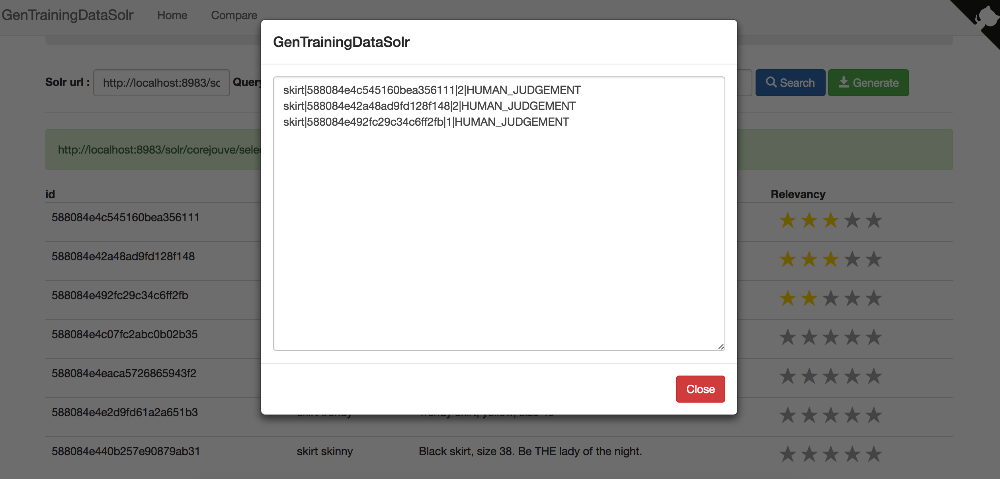
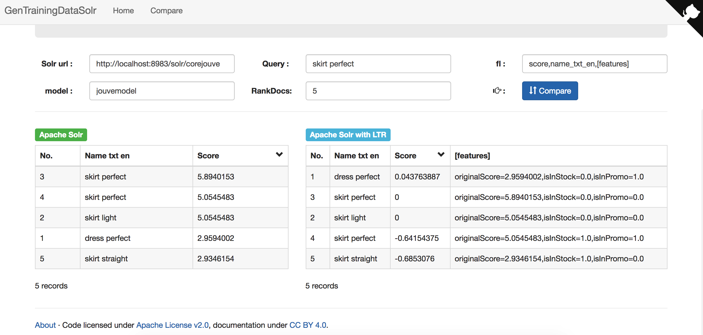

# GenTrainingDataSolr

## Quick start

```bash
cd web
npm install
npm run dev
```


Using traing Data in your `query.txt`, run `traing_data.py` then enjoy :)
For more detail [Bloomberg LTR](https://github.com/bloomberg/lucene-solr)


## Production

```bash
cd web
npm install
npm run build
cd dist
cp -r * /home/wwwroot/your.domaine
```

### Apache

```c
<IfModule mod_rewrite.c>
  RewriteEngine On
  RewriteBase /
  RewriteRule ^index\.html$ - [L]
  RewriteCond %{REQUEST_FILENAME} !-f
  RewriteCond %{REQUEST_FILENAME} !-d
  RewriteRule . /index.html [L]
</IfModule>
```
### nginx

```c
location / {
  try_files $uri $uri/ /index.html;
}
```

## Enable CORS in Apache Solr

Add this code in `server/solr-webapp/webapp/WEB-INF/web.xml`

```xml
<filter>
    <filter-name>cross-origin</filter-name>
    <filter-class>org.eclipse.jetty.servlets.CrossOriginFilter</filter-class>
    <init-param>
         <param-name>allowedOrigins</param-name>
         <param-value>*</param-value>
    </init-param>
     <init-param>
         <param-name>allowedMethods</param-name>
         <param-value>GET,POST,DELETE,PUT,HEAD,OPTIONS</param-value>
     </init-param>
     <init-param>
         <param-name>allowedHeaders</param-name>
         <param-value>origin, content-type, cache-control, accept, options, authorization, x-requested-with</param-value>
     </init-param>
    <init-param>
        <param-name>supportsCredentials</param-name>
        <param-value>true</param-value>
    </init-param>
    <init-param>
      <param-name>chainPreflight</param-name>
      <param-value>false</param-value>
    </init-param>
</filter>

<filter-mapping>
  <filter-name>cross-origin</filter-name>
  <url-pattern>/*</url-pattern>
</filter-mapping>
```

## Referances

[Bloomberg LTR](https://github.com/bloomberg/lucene-solr)