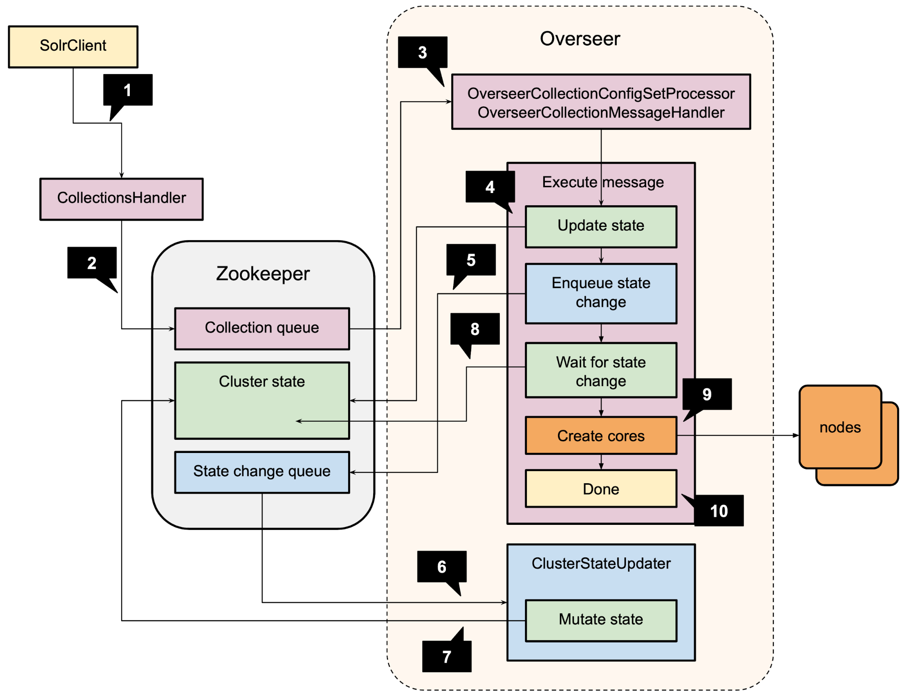
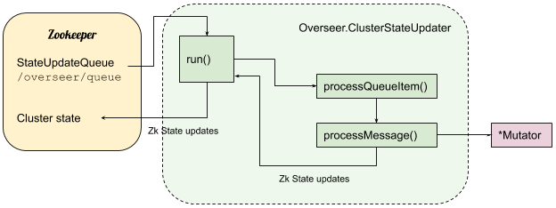
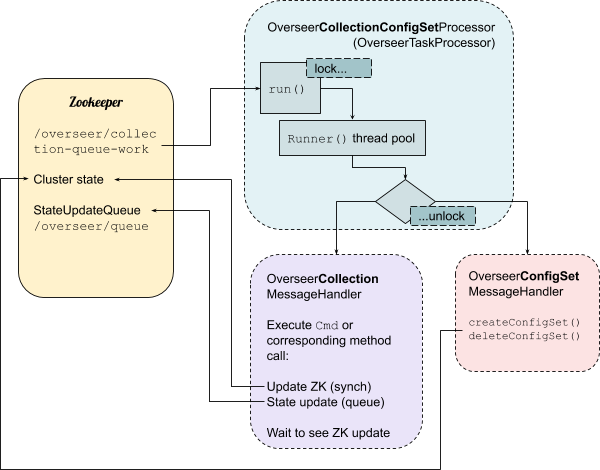
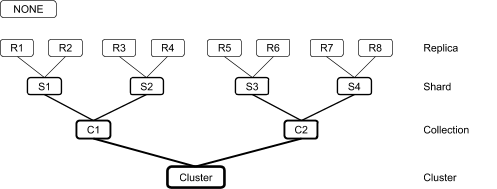
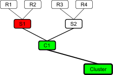
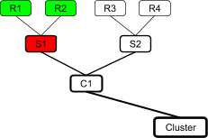
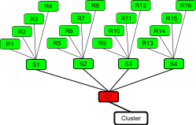

= Overseer
:toc: macro
:toclevels: 3

Doc started by Ilan Ginzburg (Salesforce) March-April 2020 to understand how Overseer is implemented and how SolrCloud works in general. (ilansolr(@)gmail.com)

|===
| Initial version released| 2020, April 21st
|===

toc::[]

== Why this doc

This doc is part of an effort to better understand SolrCloud, with a strong focus on scalability issues (and hopefully solutions). It details class by class and sometimes method by method who does what, and this doesn’t make it easy to read. It is based on Solr 8.3 (~Nov 2019).

SolrCloud hasn’t been exercised to test assumptions of this reverse engineering documentation. The doc was written based on source code reading. Testing will be done later. Things might be off and wrong! Please point out all places where I got it wrong, likely many.

The first and for now only chapter is <<Overseer: from queues to state>>. It deals with the basics of Overseer.

Other scale related dimensions of SolrCloud are planned to be addressed later and this doc will be extended then, notably around the Autoscaling framework and a description of the dynamics of a running cluster (watches firing and the amount of traffic they generate for example).

Please let me know if there’s an easier, more accessible way to structure and communicate the information contained in this doc.

== Overseer: from queues to state

The Overseer is a central (elected) node in the SolrCloud distributed system. It is in charge of coordinating state changes (for example creating a collection, splitting a shard or adding a replica of a shard) in the cluster and acts as an interface between all the nodes (servers) in the cluster and Zookeeper (the central “database” used for managing a SolrCloud cluster). Nodes also access and update Zookeeper directly but they use Overseer for updates requiring additional locking/coordination.

“The Overseer's main responsibility is to write the `clusterstate.json` file based on what individual nodes publish to ZooKeeper” (https://lucene.472066.n3.nabble.com/What-is-cluster-overseer-at-SolrCloud-tp4058390p4058395.html[Mark Miller], 2013).

Things have changed a bit since then, now the Overseer mostly updates the `state.json` Zookeeper files of individual collections (rather than a central state for the whole cluster).

The two main queues of the Overseer will be described here: the *Collection API queue* (also handling Config Set updates) and the *State Update Queue*, actually doing the writing of the `state.json` files. There is a third queue not addressed in this doc for now, related to the Autoscaling framework.

From a user Collection API request to the state change on the SolrCloud nodes and in Zookeeper, the following steps occur (taking as an example a collection creation request):

. *The client sends a request* for the Collection API to the collection handler on a node (over http for example).
. The *collection handler translates the request into a message and enqueues it* to the Collection queue in Zookeeper.
* _Description in <<How do we get to execute it>> (CreateCollectionCmd)._
. At some later time it is *dequeued by the Overseer node* and handed to the Collection message handler.
* _Processor described in <<OverseerCollectionConfigSetProcessor>> and <<OverseerTaskProcessor>>, message handler in <<OverseerCollectionMessageHandler>> (or for config sets <<OverseerConfigSetMessageHandler>>)._
. The *message handler does some direct state update in Zookeeper* (for example creating a znode for a collection).
* _Example in <<Command execution,CreateCollectionCmd Command execution>>._
. The *message handler enqueues on the state update queue* the updates to be done to `state.json`.
* _Same as above in <<Command execution,CreateCollectionCmd Command execution>>._
. At some later time, the *message is dequeued and executed by the cluster state updater*.
* _Description in <<Inner class ClusterStateUpdater,ClusterStateUpdater>>._
. The *cluster state updater applies the requested updates to Zookeeper*.
* _Uses <<ReplicaMutator>>, <<SliceMutator>>, <<CollectionMutator>>, etc., for generating the updates and <<ZkStateWriter>> for writing them._
. In the meantime, the *message handler keeps watching/polling the Zookeeper state* to know when the state mutator completed its update.
* _In <<Command execution,CreateCollectionCmd Command execution>>._
. Requests are sent to the SolrCloud nodes to create the actual cores.
* _In <<Command execution,CreateCollectionCmd Command execution>>._
. *The client request can complete*, it was successfully executed!

The rest of this doc is structured as follows:

* Summary of *candidate bugs* (<<Potential identified issues>>)
* Description of *queue actions* (<<CollectionAction>>, <<OverseerAction>>)
* *Overseer* overall and ClusterStateUpdater (<<Overseer>>, <<Inner class ClusterStateUpdater,ClusterStateUpdater>>)
* *Processing* the collection/config set queue (<<OverseerTaskQueue>>, <<OverseerTaskProcessor>>, <<OverseerCollectionConfigSetProcessor>>)
* *Message handling* the collection/config set queue (<<OverseerMessageHandler>>, <<OverseerConfigSetMessageHandler>>)
* Discussion on *Collection API locking* (<<Collection API lock usage>> and following sections)
* *End to end example* of actual Collection API command implementation (<<Implementations of OverseerCollectionMessageHandler.Cmd,OverseerCollectionMessageHandler.Cmd>>)
* *Updating Zookeeper* (<<ZkStateWriter>> writing changes built by <<ReplicaMutator>>, <<SliceMutator>>, <<CollectionMutator>>, <<NodeMutator>> and <<ClusterStateMutator>>)
* Class allowing *picking specific nodes for Overseer* (<<OverseerNodePrioritizer>>)

|===
|Javadoc _class comments are copied when available and displayed in a frame._
|===

=== Potential identified issues

A few (real or imagined?) issues were identified and are called out in the relevant sections (using a warning sign in the margin), they are summarized here.

. A former overseer might be overwriting cluster state once it is no longer Overseer. <<bug1,In ClusterStateUpdater section>>
. Efficiency of reading the Collection queue decreases as the queue grows, when things go bad they can get worse. <<bug2,In OveerseerTaskQueue section>>. Reported as a real bug, see https://lucene.472066.n3.nabble.com/Overseer-documentation-tp4457133p4457251.html[mail].
. Config set locking race condition. <<bug3,In OverseerConfigSetMessageHandler section>>.
. Lock on base config set released too early. <<bug4,In OverseerConfigSetMessageHandler section>>.
. LockTree Session management is incorrect, Sessions likely useless. <<bug5,In section Collection API lock usage>>.
. Collection message handler locking is done in an inefficient way. <<bug6,In section Proposal to fix the infra?>>
. Timing out collection API commands lead to orphaned state change messages that could lead to inconsistencies. <<bug7,In section A deeper issue with the locking strategy?>>  Reported as a real bug, see https://lucene.472066.n3.nabble.com/Overseer-documentation-tp4457133p4457251.html[mail].
. Requesting replica creation one by one with ADDREPLICA in the state update queue is inefficient. <<bug8,In CreateCollectionCmd section>>
. Replica placement on the cluster can be unbalanced under high load. <<bug9,In CreateCollectionCmd section>>. See https://issues.apache.org/jira/projects/SOLR/issues/SOLR-14462[SOLR-14462].
. Under specific conditions, dequeue from the collection queue can slow down to a message every two seconds. <<bug10,In OverseerTaskProcessor section>>
. Passing bad parameters when setting shard leader can lead to shard having no leader. <<bug11,In SliceMutator section>>
. Inefficiency in how DOWNNODE overseer action is handled. <<bug12,In NodeMutator section>>

[[CollectionAction,CollectionAction]]
=== org.apache.solr.common.params.CollectionParams.CollectionAction

This enum contains the Collection API actions that can be sent to the Overseer. It also contains the locking level required for each action when it is processed by the Collection API (i.e. the `<<OverseerCollectionMessageHandler>>`). See <<Who locks what when>>.

Some of the actions have an almost totally different role when used in the state update queue. See `<<ClusterStateUpdater>>`.

A few selected actions:

* ADDREPLICA: adds a replica to a specific slice (shard) of a specific collection
* ADDREPLICAPROP: adds a property to a replica, possibly clearing the property from all other replicas of the slice (shard).
* CREATE: creates a collection (see `<<CreateCollectionCmd>>`)
* CREATESHARD: adds a slice (shard) to a collection
* DELETENODE: deletes a specific replica from a collection
* DELETEREPLICAPROP: deletes a property from a replica (undoes `ADDREPLICAPROP`)
* MERGESHARDS: not implemented yet
* MOCK_COLL_TASK, `MOCK_SHARD_TASK` and `MOCK_REPLICA_TASK`: for testing only, not part of Collection API commands.
* MODIFYCOLLECTION: changes collection properties (for properties that allow modifications)

[[OverseerAction,OverseerAction]]
=== org.apache.solr.cloud.overseer.OverseerAction

|===
|Javadoc: _Enum of actions supported by the overseer only. There are other actions supported which are public and defined in CollectionParams.CollectionAction._
|===

OverseerAction’s are actions supported by `<<ClusterStateUpdater>>` in addition to other actions it supports that unfortunately reuse `CollectionParams.CollectionAction` enum values but are definitely not part of the Collection API.

The `OverseerAction`’s are (note not all callers use the enum values, some message construction calls are using the string representations if you search the code):

* LEADER: changes the leader of a given slice (shard)
* DELETECORE: removes a replica from a specific slice (shard) of a specific collection
* ADDROUTINGRULE: adds a routing range (possibly multiple ranges) for routing from a given slice of a given collection to another collection
* REMOVEROUTINGRULE: removes all routing rules of a specified routing key for a given slice of a given collection.
* UPDATESHARDSTATE: updates the states of replicas of a given slice (shard) of a given collection
* STATE: updates the state of a replica in a collection (can lead to updating the state of other replicas or even creating the collection!).
* QUIT: tell the current Overseer to resign
* DOWNNODE: all replicas hosted on a given node (for all slices of all collections) are set to state `Replica.State.DOWN`.

[[Overseer,Overseer]]
=== org.apache.solr.cloud.Overseer

|===
|Javadoc: _Cluster leader. Responsible for processing state updates, node assignments, creating/deleting collections, shards, replicas and setting various properties._
|===

Overseer is the central SolrCloud node that does quite a bit of cluster management and manages part of the interactions between SolrCloud and Zookeeper.

==== Queues for interacting with other nodes

All SolrCloud znodes in Zookeeper can (must?) have a prefix, it is not captured in the Zookeeper paths in this doc. Usually the prefix would be `/solr` so for example `/overseer/queue` in this doc would correspond to actual path `/solr/overseer/queue`.

Methods for other nodes to get the queues for interacting with Overseer:

* State update queue (in Zookeeper at `/overseer/queue`) used to send cluster change messages: `ZkDistributedQueue get**StateUpdate**Queue()`. Actions are processed by `<<ClusterStateUpdater>>`.
* Collection queue used to send collection API tasks: `OverseerTaskQueue get**Collection**Queue()`. The queue is in Zookeeper at `/overseer/collection-queue-work`. Actions are processed by `<<OverseerCollectionMessageHandler>>`.
* Config set queue used to send configset API tasks: `OverseerTaskQueue get**ConfigSet**Queue()`. Returns the Collection queue (in Zookeeper at `/overseer/collection-queue-work`, same queue as the collection queue), actions expected have a `"configsets:"` prefix and are processed by `<<OverseerConfigSetMessageHandler>>`.

The deprecated work queue `ZkDistributedQueue get**InternalWork**Queue()` at `"/overseer/queue-work"` is used by Overseer to store operations removed from the state update queue and currently being executed (and was used to manage Overseer failures). It is no longer used and only supported for migrations from older versions of SolrCloud (7) to version 8. Should be removed by version 9. +
Do note though that other queues are sometimes called “work queues” because work is enqueued into them.

Zookeeper backed maps used for tracking async tasks (running, successfully completed and failed): `get**RunningMap**()`, `get**CompletedMap**()`, `get**FailureMap**()`. These maps can also be obtained from `ZkController getOverseerRunningMap()`, `getOverseerCompletedMap()` and `getOverseerFailureMap()`. +
These maps are updated in `<<OverseerTaskProcessor>>` as tasks are executed and are used to wait for async requests to complete (for example `RebalanceLeader.waitAsyncRequests()`) or to get the status of a task (for example `CollectionHandler.CollectionOperation.REQUESTSTATUS_OP` enum implementation). +
Note “async id” and “request id” are used interchangeably in the code and refer to the same thing.

==== Building and starting Overseer

Overseer `start()` method creates and starts as `OverseerThread`’s:

* <<ClusterStateUpdater>>,
* <<OverseerCollectionConfigSetProcessor>> (consuming collection queue which includes the identical config set queue),
* OverseerTriggerThread (for Autoscaling, not discussed in this doc)

start() also verifies that the system collection ”.system” is in good shape (segment/Lucene versions).

[[ClusterStateUpdater,ClusterStateUpdater]]
==== Inner class ClusterStateUpdater

The slightly trivial figure below (sorry - at some point I was so confused I needed it) shows the processing methods of the single threaded cluster state updater. It gets messages from the state update queue, processes them and generates Zookeeper state updates that are then applied to Zookeeper (changing `state.json` files):

ClusterStateUpdater is an inner class of `Overseer`. Its `run()` method executes as long as the node is the Overseer.

This class is processing (on a single thread running on the Overseer node) the internal “state update queue” `"/overseer/queue"`. This queue does not directly carry client requests but is used in the implementation of commands of the collections API as well as other internal bookkeeping (node down for example). +
ClusterStateUpdater deals with the following actions:

* From `*CollectionParams.<<CollectionAction>>*`:
** CREATE, `DELETE`, `CREATESHARD`, `DELETESHARD`, `ADDREPLICA`, `ADDREPLICAPROP`, `DELETEREPLICAPROP`, `BALANCESHARDUNIQUE`, `MODIFYCOLLECTION`, `MIGRATESTATEFORMAT`.
* From `*<<OverseerAction>>*`:
** STATE, `LEADER`, `DELETECORE`, `ADDROUTINGRULE`, `REMOVEROUTINGRULE`, `UPDATESHARDSTATE`, `QUIT`, `DOWNNODE`.

Note that the `CollectionAction`‘s processed above have dual meanings: they are also part of the Collections API processed by the `<<OverseerCollectionMessageHandler>>`. It might have been clearer to use a different enum for actions in this internal queue.

The `ClusterStateUpdater` is updating Zookeeper and only that as a result of processing the commands it receives, except `OverseerAction.QUIT` that causes the Overseer to exit (i.e. stop being the Overseer, return to being a normal node).

Note that except when it starts (and in case of some errors?) the `ClusterStateUpdater` does not read from Zookeeper. It is therefore blind to updates that might take place from elsewhere and given how it’s implemented, it might even overwrite these updates. This is not expected to happen on the happy path as only `ClusterStateUpdater` does updates.

[[bug1]]
[WARNING]
But… there is a possibility that an Overseer in `ClusterStateUpdater.run()` would be updating Zookeeper after it has lost Overseer leadership and possibly after a long pause (Garbage collection “stop the world” pause for example). It might then be overwriting more recent data with older/wrong data. This likely has a very tiny probability of happening so may not be worth filing a bug for.

A detailed description of the class:

It first (one time only) builds the cluster state (view of the current state of all collections, see `org.apache.solr.common.cloud.ClusterState`) by reading everything from Zookeeper (using `ZkStateReader.forciblyRefreshAllClusterStateSlow()`), then applying state messages from the deprecated internal work queue `"/overseer/queue-work"` (where items unprocessed by a previous Overseer might have been left in Zookeeper from previous versions of Solr, nothing is enqueued there anymore, see https://issues.apache.org/jira/browse/SOLR-11443[SOLR-11443]).

Once this initial state is built (then updated in Zookeeper if needed but that no longer happens, see deprecation comment in <<Queues for interacting with other nodes>>), the `run()` method switches to consume the `get**StateUpdateQueue**()` at `"/overseer/queue"` and applies changes to Zookeeper as long as the Overseer is on the current node. Note that items from the queue are read by batches of max 1000, the changes are batched (max batching size 10000 see `Overseer.STATE_UPDATE_BATCH_SIZE` and max batching delay 2 seconds see `ZkStateReader.STATE_UPDATE_DELAY`). More than 1000 items can be batched if more items are in the queue or arrive quickly (< 100ms) after previous items were read and processed (batching items limits the number of updates then made to Zookeeper cluster state).

Updates to Zookeeper are done through `ClusterStateUpdater.processQueueItem()` and `ClusterStateUpdater.processMessage()`. Applying these state changes uses the `*Mutator` classes (see `<<ClusterStateMutator>>` and friends). The change only impacts Zookeeper cluster state, not the actual nodes. The Mutator classes end up returning to `ClusterStateUpdater.processQueueItem()` the write commands to apply to Zookeeper and those are applied. Processed messages (a.k.a. tasks) are removed from the queue once written to Zookeeper (call to `ZkStateWriter.writePendingUpdates()`) either through the callback passed to `processQueueItem()` or directly in `ClusterStateUpdater.run()` when the flushing is explicitly made at the end of each loop iteration.

Method `ClusterStateUpdater.processMessage()` handles two types of actions: those defined in `CollectionParams.CollectionAction` are reusing actions used in the public (SolrJ) API (but the state update queue is not public API), whereas those in `OverseerAction` are internal to SolrCloud.

Note that `ClusterStateUpdater` does not serve “cluster state” information to other classes. It simply modifies Zookeeper content based on received messages.

A limitation with the way collection state is stored in Zookeeper is that everything is in a single file (`_collection_/state.json`) that has to be written atomically. That file contains not only general information about the collection (target number of replicas, router, max shards per node etc) but also information about the shards or slices (range and state) as well as information about the replicas of these shards (core name, url, node name, type etc). +
Any change to that file for any reason requires protection from all other concurrent changes or risk overwrites. As all writes to `state.json` happen in `ClusterStateUpdater` and because it is mono threaded we are safe, but when we try to become more ambitious to deal faster with high volumes of state updates, we should rethink state storage strategy. +
See https://issues.apache.org/jira/browse/SOLR-13951[SOLR-13951] and https://docs.google.com/document/d/1FoPVxiVrbfoSpMqZZRGjBy_jrLI26qhWwUO_aQQ0KRQ/[Smart Solr Cluster] doc.

[[OverseerTaskQueue,OverseerTaskQueue]]
=== org.apache.solr.cloud.OverseerTaskQueue

|===
|Javadoc: _A ZkDistributedQueue augmented with helper methods specific to the overseer task queues. Methods specific to this subclass ignore superclass internal state and hit ZK directly. This is __inefficient__!  But the API on this class is kind of muddy.._
|===

This class extends `ZkDistributedQueue`, “a A ZK-based distributed queue. Optimized for single-consumer, multiple-producer”.

This Zookeeper queue located at `/overseer/collection-queue-work` (this class could use another queue but it happens that it’s only used for the collection queue) is used for sending both Collection and Config set requests to Zookeeper (the two types of messages are dispatched on the Overseer side based on using a different prefix in action names).

Sending (putting) data on the queue and waiting for a response is done through the `offer()` method. This method creates and watches (using a `LatchWatcher`) a `CreateMode.EPHEMERAL_SEQUENTIAL` response node at path `/overseer/
collection-queue-work/qnr-_<monotonically increasing id>_`. +
A `PERSISTENT` request node is then created at `/overseer/collection-queue-work/
qn-_<response id>_`. The method waits for a while or until the response gets notified, then returns the content of the response as a `QueueEvent` (whose `getBytes()` returns null if no response received in time). Even if the waiting timed out, the request stays in the queue (and the `LatchWatcher` is left on the response node, but the event it will eventually capture will not be used).

The Overseer consumes messages from the queue by calling `peekTopN()` passing in the max number of elements to peek (i.e. return without removing from the queue) as well as a predicate for filtering out tasks currently running or blocked. Method `peekTopN()`, using the superclass method `peekElements()`, does use a cache (or more precisely a point in time memory snapshot of the queue, stored in `ZkDistributedQueue.knownChildren`). When it needs to fetch the requests from the queue (the `"/qn-"` nodes), it fetches +++<u>all of them</u>+++ into memory and sorts them (see `ZkDistributedQueue.fetchZkChildren()`). Sorting is required to consume the queue in order.

That cost of fetching and sorting a large queue (using insertion into a `TreeSet`) is experienced when an Overseer node starts (since the rest of the time the cache serves that data). When that queue is read while the overseer is in “steady state” running, the queue is usually relatively small (max about 1100 elements, unless a massive insertion happened or if the Overseer fell behind in processing the queue, see 3 paragraphs down).

Reading the queue from Zookeeper is done only if there’s a reason to believe something new is there. If no new messages got enqueued, then Zookeeper will not be read again (controlled by variable `ZkDistributedQueue.isDirty`). If new messages appear, that variable is set to `true` directly in `ZkDistributedQueue.offer()` (but this method is not called for communicating with the Overseer so not relevant here) or in `ChildWatcher`. +
A `ChildWatcher`, different from and unrelated to the `LatchWatcher` (used in `OverseerTaskQueue` to wait for a response to a request) is set on the whole `/overseer/collection-queue-work/` directory in `ZkDistributedQueue.firstChild()` called from `peekElements()`. +
A counter `ZkDistributedQueue.watcherCount` makes sure there’s a single `ChildWatcher`.

When reading from Zookeeper does happen, the whole queue is read and sorted even to only fetch a single new request.

The fetch is requested from `<<OverseerTaskProcessor>>` when there are no tasks ready to run but only when the numbers of blocked and running tasks are below their respective limits (`MAX_PARALLEL_TASKS`=100 and `MAX_BLOCKED_TASKS`=1000) and a new message appears in the queue (if these limits are reached, no point in reading more tasks since there will be no space to process them). This implies the queue has less than 1100 messages before new ones appear in order to be read and retrieve the new messages (of course insertions can happen and if Overseer consumes slower than the queue is fed, the queue is going to grow…). In order to read the new messages (or the single new message), the queue will be read in its entirety. Such a situation is rather inefficient but given the contained size of the queue for this to happen (max 1100 requests), it’s likely not a catastrophe. But still inefficient :)

[[bug2]]
[WARNING]
If the queue does overflow and grows, the efficiency of Overseer decreases as the queue grows (since it has to read it completely and sort it whenever it wants to get new messages to process, or even a single new message to process), so if Overseer is falling behind, things will go downhill. This might be an issue.

If there are no new messages in the queue, Overseer will rescan its memory snapshot of blocked tasks every two seconds, but without Zookeeper access.

Tasks (or messages) in the queue are retrieved by a peek and therefore remain in the queue. They are removed when their processing is complete, using the `remove()` method. That method sets the content of the response node (that will trigger the corresponding `LatchWatcher`, and the `ChildWatcher` when one is set).

The class also has a method `containsTaskWithRequestId()` that fetches the complete queue (names of znodes) directly from Zookeeper then fetches for each one its data to find a znode matching a given request id. This is an expensive call (I hope it’s not used too much).

[[OverseerTaskProcessor,OverseerTaskProcessor]]
=== org.apache.solr.cloud.OverseerTaskProcessor

|===
|Javadoc: _A generic processor run in the Overseer, used for handling items added to a distributed work queue.  Has support for handling exclusive tasks (i.e. tasks that should not run in parallel with each other)._
|===

OverseerTaskProcessor is the superclass of `<<OverseerCollectionConfigSetProcessor>>` and has no other subclasses.

Tasks are added to the `"/overseer/collection-queue-work"` queue through `CollectionsHandler.sendToOCPQueue()`. The `OverseerTaskProcessor` consumes these tasks to execute collection or config set related operations on the cluster.

The code in `run()` getting tasks from the Zookeeper Collection queue (under Zookeeper path `"/overseer/collection-queue-work"`) has been optimized (see discussion thread in https://issues.apache.org/jira/browse/SOLR-8744[SOLR-8744]) to limit the amount of interaction with Zookeeper managing the queue. The code fetches new tasks only up to the number of tasks it can keep in memory. Tasks are kept (blocked) in memory when they can’t acquire the lock they need or if all task executors are busy (limit of `MAX_PARALLEL_TASKS=100`). +
If the number of blocked tasks reaches `MAX_BLOCKED_TASKS`=1000, processing stops and retries processing the tasks with a `sleep()` of one second between attempts (hoping that in progress tasks finish and make processing threads available or that locks get released and allow the execution of some blocked tasks).

If all blocked tasks are blocked because of locks and there are less than 1000 blocked tasks, then there’s no direct wait between processing attempts in `OverseerTaskProcessor`, and `peekTopN()` is called with a 2 seconds wait delay and a predicate filtering out blocked and  +
running tasks from the set of tasks to return. If new tasks arrive in the queue the wait is cut short (see `changed` in `org.apache.solr.cloud.ZkDistributedQueue`) but if no new tasks arrive, the wait is two seconds between processing attempts.

[[bug10]]
[WARNING]
If multiple tasks are enqueued for a given collection (or any other type of tasks that compete for the same lock) and there’s no other activity on that queue to the overseer, the maximum processing speed is one task every 2 seconds. This might be considered a bug…

Task processing is delegated to the appropriate `<<OverseerMessageHandler>>`,  namely `<<OverseerConfigSetMessageHandler>>` or `<<OverseerCollectionMessageHandler>>`. +
Actual calling of the message handler is handled by a thread pool executing `OverseerTaskProcessor.Runner.run()`. That’s where the lock acquired in `OverseerTaskProcessor.run()` is released.

There is a notion of `ASYNC` messages having an async id (a.k.a. request id in other parts of the code). Such messages are put in `runningMap` while they execute and their outcome is tracked in `failureMap` or `completedMap` (depending on failure or success). These maps are backed by Zookeeper and passed to the `OverseerTaskProcessor` upon creation. They are created in the constructor of `OverseerCollectionConfigSetProcessor`. These maps are defined in `<<Overseer>>`.

At the end of the actual processing of the task (in subclass method `OverseerTaskProcessor.Runner.run()`) there is a `notify` on `waitLock`. This `notify` does only one thing: reduce the 100ms waiting time observed between attempts to process a new task when the maximum number of parallel tasks has been reached. This `notify` will not reduce the 2 seconds delay between processing of tasks for a given lock in case the number of parallel task executions hasn’t reached its limit. +
In other words, end of task processing takes care of unblocking tasks waiting for thread executors but does not deal with unblocking tasks waiting for the just released lock.

The `OverseerTaskProcessor` class contains methods related to the overseer election, some of which despite the class name are also used for shard leader elections. Overseer election seems to sometimes have its own challenges that might be worth exploring. Election methods are using (and used by) `<<OverseerNodePrioritizer>>`.

[[OverseerCollectionConfigSetProcessor,OverseerCollectionConfigSetProcessor]]
=== org.apache.solr.cloud.OverseerCollectionConfigSetProcessor

|===
|Javadoc: _An OverseerTaskProcessor that handles: 1) collection-related Overseer messages, 2) configset-related Overseer messages_.
|===

Selects in `selectOverseerMessageHandler()` the appropriate handler for the message:

* OverseerConfigSetMessageHandler for messages with `"configsets:"` prefix,
* OverseerCollectionMessageHandler otherwise.

The real stuff is in its superclass, `<<OverseerTaskProcessor>>`.

The figure below shows the flow of execution at a (very) high level. The processor fetches work to execute from the collection queue in Zookeeper. It manages locks and a thread pool, and on a thread of that pool calls the appropriate message handler. The config set message handler directly updates to Zookeeper as needed. The collection message handler does some updates directly and for other updates it enqueues work to the state update queue:

[[OverseerMessageHandler,OverseerMessageHandler]]
=== org.apache.solr.cloud.OverseerMessageHandler

|===
|Javadoc: _Interface for processing messages received by an OverseerTaskProcessor_
|===

The message handling interface of Overseer with two implementations, `<<OverseerCollectionMessageHandler>>` and `<<OverseerConfigSetMessageHandler>>` (see `OverseerCollectionConfigSetProcessor.selectOverseerMessageHandler()`).

The main method is `SolrResponse processMessage()`. There is support for locking tasks (`OverseerTaskProcessor.TaskBatch`) through various methods (type `Lock`, methods `lockTask()` and `getTaskKey()`).

[[OverseerSolrResponse,OverseerSolrResponse]]
=== org.apache.solr.cloud.OverseerSolrResponse

This class is used for responses to some Collection and Config Set messages.

[[OverseerConfigSetMessageHandler,OverseerConfigSetMessageHandler]]
=== org.apache.solr.cloud.OverseerConfigSetMessageHandler

|===
|Javadoc: _An OverseerMessageHandler that handles ConfigSets API related overseer messages._
|===

This handler handles config set API `CREATE` and `DELETE` calls (actions defined in `org.apache.solr.common.params.ConfigSetParams.ConfigSetAction`).

These messages are received from the Collection API queue (there’s a single queue at `/overseer/collection-queue-work` shared between Collection and ConfigSet API’s). Config sets live in Zookeeper under `/configs/_<config set name>_/`.

The `createConfigSet()` call implementing `CREATE` copies all the files of an existing config set (by default the `_default` config set) into a new config set, merges the existing config set properties if any with new ones specified in the message (config set properties in the message are properties that start with `"configSetProp."`, for example `configSetProp.immutable` is a property that prevents the config set from ever being deleted) and writes the resulting properties into `/configs/<config set name>/configsetprops.json` (note: creating a config set based on an `immutable` config set makes the new one immutable as well unless it explicitly specifies that `configSetProp.immutable` is false).

Note the `_default` config set is defined in the SolrCloud distribution and copied if absent into Zookeeper when SolrCloud starts (`ZkController.bootstrapDefaultConfigSet`) then used only from Zookeeper. This config set has a directory `lang` with language specific stop words, contractions and other, and it contains files `managed-schema`, `params.json`, `protwords.txt`, `solrconfig.xml`, `stopwords.txt` and `synonyms.txt`.

deleteConfigSet() deletes the whole znode structure at `/configs/_<config set name>_` assuming the config set is not used by any collection and is not immutable (the only case where an immutable config set can be deleted is when its creation has failed midway).

Creations and deletes directly update Zookeeper without going through the cluster state update queue (as collections do in `<<OverseerCollectionMessageHandler>>`).

[[bug3]]
[WARNING]
Locking is implemented based on config set name, but the implementation seems subject to a race condition: `canExecute()` verifies in a critical section that the current config set can be executed. If so, another critical section in `markExclusive()` registers the processing of the current config set to exclude concurrent execution of the same or of conflicting config sets. It seems possible for two conflicting config set messages to make it through at the same time.

In order to be executed (check done in `canExecute()`) a config set task (in `markExclusive()`) gets a write (i.e. exclusive) lock on the config set name and a read (shared) lock on the base config set if any. Therefore that task cannot execute concurrently with other tasks on the same config set or with tasks targeting directly the base config set.

The implementation of the read lock on the base config set is broken: when the acquired Lock is released in `unmarkExclusiveConfigSet()`, it correctly releases the exclusive write lock it got on the config set name, but it also releases the read lock (represented by an entry in a Set) on the base config set.

[[bug4]]
[WARNING]
This implies that if multiple config sets with tasks in progress have the same base config set, the first to finish will release the read lock set on the base config set. Reference counting should have been used to correctly track multiple read locks.

The real risk though is a copy in progress of a base config set (to create a new config set based on it) executing while the base config set is deleted. Unclear if that can lead to the copy not failing but only copying parts of the base config set structure. Two creations of the same config set will not succeed anyway even without locking (there’s a check), and code depending on a critical selection serializing and therefore ordering creations and deletes most likely has other problems (create then delete has a different outcome than delete then create, so one would hope these calls are not issued in parallel).

[[OverseerCollectionMessageHandler,OverseerCollectionMessageHandler]]
=== org.apache.solr.cloud.api.collections.OverseerCollectionMessageHandler

|===
|Javadoc: _An OverseerMessageHandler that handles Collections API related overseer messages._
|===

This handler (in `processMessage()`) handles commands/methods related to collection (and node) management. The supported commands/methods are assigned into `commandMap` in the constructor.

A command or method is executed when the handler receives the corresponding `CollectionParams.CollectionAction` enum value. +
Commands implement functional interface `OverseerCollectionMessageHandler.Cmd` having the single method `call()`. Command classes end in `Cmd` and are in the same package `org.apach.solr.cloud.api.collections`.

Certain commands are simply methods in `OverseerCollectionMessageHandler` (and are used by virtue of being assumed to implement the `Cmd` functional interface).

The methods that can be called in such a way are: `migrateStateFormat()`, `modifyCollection()`, `processReplicaAddPropertyCommand()`, `processReplicaDeletePropertyCommand()`, `balanceProperty()`, `processRebalanceLeaders()` and `reloadCollection()` (as well as `mockOperation()` used only for tests).

This class also contain helper methods used by the various `*Cmd` classes.

See description of a few commands (or maybe just one for now) in section <<Implementations of OverseerCollectionMessageHandler.Cmd>>.

==== Collection API lock usage

Locking infra is explained in section <<Locking infra for collection tasks>>]. Section <<Who locks what when>> describes what type of protection different collection commands expect from locking.

This section describes where locks are created and how the locking infra is used..
 +
OverseerCollectionConfigSetProcessor (handling both config set and collection messages in Overseer) is created from `Overseer.start()`. +
As part of the creation, method `OverseerCollectionConfigSetProcessor.getOverseerMessageHandlerSelector()` is called and creates an instance of `OverseerCollectionMessageHandler`. +
Therefore, a single instance of `OverseerCollectionMessageHandler` is used by the Overseer. `LockTree lockTree` being a final member variable of `OverseerCollectionMessageHandler`, a single instance of it is also used during the lifetime of the Overseer. +
lockTree is used in the `lockTask()` method in which a `LockTree.Session` is created for the current `OverseerTaskProcessor.TaskBatch.getId()`. This ID is managed in `OverseerTaskProcessor.run()` method, starts at 0 and incremented for each sweep over the tasks in the work queue and blocked tasks (there’s a max number of tasks that are swept on each iteration due to limits on the numbers of parallel tasks and blocked tasks).

[[bug5]]
[WARNING]
The code in `OverseerCollectionMessageHandler.lockTask()` most likely does not implement the original intention regarding batch id management, since that positive or null ID is being compared to a `sessionId` set to -1 and +++<u>never modified</u>+++. Therefore the task batch id is always different from the `sessionId`, and as a result every time a lock is needed a new `LockTree.Session` object is created. Whatever purpose `Session` was supposed to serve is likely not served, given that grabbing a lock (or “marking node busy” in `Session` vocabulary) on a new instance will always succeed. That `Session` object is therefore apparently useless in the current implementation (if it was supposed to be useful there’s a bug, otherwise just code to remove). Locks are still managed on the `lockTree` instance.

Note there are no threading issues around the use of the `LockTree` instance since `OverseerCollectionMessageHandler.lockTask()` is only called from `OverseerTaskProcessor.run()` executed by a single thread.

==== Locking infra for collection tasks

https://issues.apache.org/jira/browse/SOLR-8744[SOLR-8744] explains that locking can be at different levels: Cluster, Collection, Shard and Replica. When an exclusive lock is needed, the task has to acquire the lock on the relevant node in the tree (say collection C1), and then acquire locks on all the children of that node (S1, S2, R1, R2, R3, R4). If not all locks can be acquired, the task has to wait and gets notified when locks are released and tries again.

The diagram above uses slightly different replica naming from the jira quoted above for clarity. It’s also presented with lower levels at the bottom (like a real physical tree).

[[LockTree,LockTree]]
===== org.apache.solr.cloud.LockTree

That’s where the locking logic lives. +
A lock tree starts with a single `Node`, the `root` of the tree at `LockLevel.CLUSTER` (for the record, the different levels are in +++<u>increasing</u>+++ order `CLUSTER`, `COLLECTION`, `SHARD`, `REPLICA`, `NONE`). +
LockTree has only one method `clear()`, recursively resetting the lock on the tree of `node`’s anchored below (or shall I say above…) `root`.

====== Session

The entry point to using `LockTree` is subclass `Session` obtained by calling `getSession()`. Note the `Session` instance has a `root` variable that’s of type `SessionNode` (in `LockTree`, `root` is of type `Node`).

A `Session` instance allows grabbing a lock for a given `CollectionParams.<<CollectionAction>>` (where a `LockLevel` is defined for each action) and a given path using the `lock()` method. Note the path list starts with the Collection name as its first element (at index 0). Then there’s shard name then replica name. No cluster name is part of the path (there’s only one cluster so no ambiguity). +
If the `LockLevel` is `NONE`, the lock is immediately granted (returned `Lock` is not `null` so it can later be unlocked like a real lock). +
Otherwise, if the `Session` is already busy (`isBusy()`) at the requested lock level for the given path (this identifies a single `SessionNode`) the lock is not granted (i.e. `null` is returned). Being busy at the requested level means that +++<u>at least one</u>+++ `SessionNode` is busy when the `Session` tree of `SessionNode`’s is walked from `root` upwards (in the diagram above) following the requested path (the path has collection name, shard name, replica name, although not all required depending on the lock level being requested, i.e. how far up the tree is climbed).

If the `Session` is not busy, an attempt is made to grab the lock on the corresponding `Node` of the `LockTree`. By calling its `root.lock()` method with appropriate params (see next section for details).

If the lock can’t be obtained on the `LockTree`, the `Session` marks the requested node as busy (and just this one, not the whole path) in `SessionNode.markBusy()`. This doesn’t necessarily make sense to me (I would have expected the node to be marked as busy when the lock was obtained? EDIT: this makes more sense now, see https://issues.apache.org/jira/browse/SOLR-14546?focusedCommentId=17128157&page=com.atlassian.jira.plugin.system.issuetabpanels%3Acomment-tabpanel#comment-17128157[comment on SOLR-14546]), but if as stated above a new session is created each time, this marking busy doesn’t matter much (doesn’t make any difference actually). +
When nodes mentioned in a locking path do not exist they are created (the lock tree representation is lazy).

Note that there is no resetting the busy flag of a `SessionNode` in a `Session`.

The `Session.lock()` method returns the `Lock` set on the `Node` of the `LockTree` using an implementation that captures the identity of the locked node (or `null` if that lock couldn’t be had). When `unlock()` is later called on that `Lock`, the `LockTree` `Node` is updated so it no longer appears locked.

In the diagram below, in order for a `Session` to mark busy `SessionNode` S1, `SessionNode`‘s Cluster and C1 need to be not busy and then the lock on `LockTree` node S1 should have failed based on current implementation, but I suspect the intention was the opposite.

====== Node

This subclass is where the action actually happens for the LockTree object. +
The `Node.lock()` method takes a lock level and a path that’s a list of strings. +
As opposed to how `Session` and `SessionNode` behave, in which a lock on a given `SessionNode` can be acquired only if no `SessionNode`’s on the path between the `Session` cluster `root` and that `SessionNode` are locked, in `Node.lock()` a `Node` can be marked as locked if it is not already locked (obviously) and if none of its +++<u>children</u>+++ (i.e. nodes up the tree as represented in the diagram above) are locked. +
Note that only the requested `Node` is marked as locked, its children are only checked.

This means that from the `Node` class perspective, you can obtain a lock on `Node` S1 using path (C1, S1) then you can obtain a lock on `Node` R2 using path (C1, S1, R2), but you wouldn’t be able to obtain these two locks in the reverse order. Such locking semantics is rather “unusual”.

In the diagram below, in order for a `Node` to lock S1, `Node`‘s R1 and R2 need to not be locked.

===== Proposal to fix the infra?

[[bug6]]
[WARNING]
====
The existing code iterates over whole subtrees in order to grab a lock. In the case of a collection with many shards and many replicas, getting a lock on the collection itself can get expensive. In the diagram below, getting a lock on C1 requires iterating over all shards and all replicas known in the `LockTree`, which in the figure below represent 20 nodes.

====

A lock on the Cluster Node would require iterating over +++<u>all known nodes</u>+++ in the `LockTree` (this doesn’t happen very often though, see <<Who locks what when>>). +
It is unclear (to me, at this stage) to what size instances of `LockTree` grow on a busy cluster with lots of collections and replicas, but if they grow large, a different strategy can be adopted to get to the same behavior as the current implementation:

* Each Node would have in addition to the lock info, a reference count tracking the number of nodes higher up in the tree (when represented with root at the bottom) that are locked (for example, when R7 above would be locked, it would increase the reference count on S2, C1 and Cluster).
* In order to lock a node, following conditions need to be met:
** The node is not already locked (like in the existing implementation),
** No node on the path from Cluster to this node are locked,
** The node to lock has a reference count of zero.

As my understanding evolves, maybe I can think of a way to combine the locking semantics of `Session` with that of `LockTree`. The rationale behind the current implementation is still a mystery to me though. Also note that in the current implementation the `Session` abstraction is likely useless, see <<Collection API lock usage>>, making understanding even harder.

==== A deeper issue with the locking strategy?

The previous sections looked at the locking infra itself, but there could be a bigger issue because of the way changes to the cluster are processed (see details in <<Implementations of OverseerCollectionMessageHandler.Cmd>>).

Multiple Collection commands can be executing in parallel, and these commands grab different levels of locks to protect their actions. Some of the Zookeeper updates are done directly in the command implementation and some updates are enqueued to the state change queue (processed by `<<ClusterStateUpdater>>`). +
The commands wait for the enqueued action to finish, and only then return success to the Collection API caller. This has the side effect of protecting the execution of the state change update using the lock obtained when the Collection API started processing the command (in addition to locks directly obtained when processing the state update command).

[[bug7]]
[WARNING]
But… commands eventually time out, and such time outs are highly probable (a.k.a. “certain to occur”) when the cluster is under heavy load. In this case, the command fails and returns an error to the caller, but the state change message remains enqueued, and will eventually get processed. By then, it is no longer running under the “protection” of a Collection API lock or “in the context” of a Collection API request. It remains to be explored if all such messages are idempotent or harmless or if inconsistencies can result from old orphaned messages executing long after their best-by date...

==== Who locks what when

Enum `CollectionParams.<<CollectionAction>>` contains the Collection API actions and each is associated to a locking level `CLUSTER`, `COLLECTION`, `SHARD`, `REPLICA` or `NONE` as described previously in <<Locking infra for collection tasks>>.

There is a single action `MIGRATESTATEFORMAT` locking at the `CLUSTER` level, and it does state migration for a given collection (moving the collection state from the shared cluster wide state to its own json). It extracts the collection specific config from the cluster wide status (`/clusterstate.json`) and writes it to the collection specific json (_`collection`_`/state.json`). Given this command updates the global status (once it gets into `ZkStateWriter.writePendingUpdates()`, although unclear to me how anything is changed there), it does need a lock. `CLUSTER` level locks are likely extremely difficult to obtain in a busy cluster since they can be starved by locks put on other nodes. Maybe `MIGRATESTATEFORMAT` is only expected to be used on a quiescent cluster?

Even though most of the Collection API calls end up having `state.json` modified, the locking level does not need to protect updates to this file given these are done mono threaded by `<<ClusterStateUpdater>>`. Locking instead protects concurrent decisions made in the various command implementations +++<u>before</u>+++ requesting state changes through the state change queue.

An extensive review of the implementation of the Collection API would be needed to verify if the locking is sufficient. Two examples described below (just because I looked at these classes).

Looking for example at MoveReplicaCmd implementing the MOVEREPLICA action, it seems the locking scheme might be defeated. The command is verifying collection property CollectionAdminParams.COLOCATED_WITH while holding a lock on the replica’s SHARD. This property is modifiable, and can be updated using action MODIFYCOLLECTION implemented in OverseerCollectionMessageHandler.modifyCollection() and itself requiring the `COLLECTION` lock. This example is likely not a big issue in practice, but might be an indication of other similar yet more impacting race conditions.

Another example, it seemed surprising that `DELETESHARD` and `SPLITSHARD` lock at `SHARD` level whereas `CREATESHARD` does lock at `COLLECTION` level. It might be justified by restrictions on which shards actually can be deleted (has to be inactive or have a null range basically). An inactive shard might become active again during `SPLITSHARD` in `SplitShardCmd` and we’d be safe given `DELETESHARD` and `SPLITSHARD` lock at the same level and will therefore not execute concurrently.

Looking at this, and unrelated really to the lock level, there might be an execution path outside of `SPLITSHARD` that can change a shard state (as a side effect of a past split?). Indeed `ReplicaMutator.checkAndCompleteShardSplit()` that can be reached through execution of `STATE` action by `<<ClusterStateUpdater>>`, itself triggered by `ZkController.publish()` can turn an inactive shard back into an active one. This means that if the `DELETESHARD` is executed and decides a shard is good to be deleted, but before this command is executed by the state updater there is a change of state of that shard, we might delete a shard we shouldn’t be deleting. I don’t know if something like this was ever observed.

=== Implementations of OverseerCollectionMessageHandler.Cmd

Commands are an important part of how the Overseer executes requests in the Collection API. Overseer delegates quite some work to the implementation of specific commands and it is essential to understand how these are implemented.

More commands will eventually be described, but for now only one that corresponds to the initial step in perf/scale indexing tests: collection creation.

[[CreateCollectionCmd,CreateCollectionCmd]]
==== org.apache.solr.cloud.api.collections.CreateCollectionCmd

===== How do we get to execute it

This part of the description is somewhat generic to multiple actions and not specific to creating collections.

CreateCollectionCmd corresponds to the API `CollectionAction.CREATE` call. A request for collection creation with the `CREATE` action is created by clients through `CollectionAdminRequest.createCollection()` (that builds a `CollectionAdminRequest.Create` instance) then sent to a SolrCloud node (through a `SolrClient`) using `SolrRequest.process()`. +

The SolrCloud node handles that request in `CollectionsHandler.handleRequestBody()` that then calls `CollectionsHandler.invokeAction()` that then calls `CollectionsHandler.sendToOCPQueue()` that does `offer()` the request to the Overseer Collection queue in Zookeeper obtained by calling `ZkController.getOverseerCollectionQueue()`.

For the record, `CollectionsHandler` is the default collection handler (class name defined in `NodeConfig.DEFAULT_COLLECTIONSHANDLERCLASS`), that can be overridden using attribute `collectionsHandler` in the `<solr>` element in `solr.xml`.

The message ends up being received by the Overseer in `<<OverseerCollectionMessageHandler>>` that then calls `CreateCollectionCmd.call()`.

===== Command  execution

After the intro above, let’s detail what happens when `CreateCollectionCmd` is actually run (i.e. `call()` method is executing).

The collection is verified not to exist in the `ClusterState` passed to the command (i.e. in Zookeeper), and the associated config set is verified to exist in Zookeeper (using `OverseerCollectionMessageHandler.validateConfigOrThrowSolrException()`). Other parameters of the message are verified (shard names, replica counts).

OverseerCollectionMessageHandler.createConfNode() synchronously creates (or updates) in Zookeeper the collection znode `/collections/<collection name>` to contain the collection’s `ConfigSet` name.

CreateCollectionCmd.createCollectionZkNode() then does more synchronous  Zookeeper updates: `/collections/<collection name>/terms` is recursively deleted, metadata of `/collections/<collection name>` is updated with more config in addition to the `ConfigSet` (gets values from system properties starting with `ZkController.COLLECTION_PARAM_PREFIX="collection."`).

The received message is then offered to state update queue `"/overseer/queue"` (`Overseer.offerStateUpdate()` using `getStateUpdateQueue()`) and will be eventually processed by `<<ClusterStateUpdater>>` (given that this command runs on the Overseer node, there might be more efficient ways to do Zookeeper state updates? Might be a possible improvement). There the `CollectionAction.CREATE` will trigger a call to `<<ClusterStateMutator>>` `createCollection()` to create the collection in Zookeeper. No replicas will exist in the created `state.json`. Note the action used to call `CreateCollectionCmd` (`CollectionAction.CREATE`) is “transparently” reused in the message posted to the state update queue.

The command execution then waits at most 30 seconds to observe the cluster state change.

Replica placement is computed (in `CreateCollectionCmd.buildReplicaPositions()`, see <<Building replica positions>>).

For each replica, the non legacyCloud behavior (give or take a few details) is:

* Generates a new core name for the replica (`Assign.buildSolrCoreName`),
* Enqueues in the state update queue a `CollectionAction.ADDREPLICA` request,
* Prepares a `ShardRequest` for `CoreAdminParams.CoreAdminAction.CREATE` and adds it to `coresToCreate`.

[[bug8]]
[WARNING]
Requesting the replica creation one by one (i.e. separate messages in the state update queue) is inefficient as it triggers more Zookeeper chatter than needed to manage the queue (`<<ClusterStateUpdater>>` will do the right thing and batch the updates). State update queue action `ADDREPLICA` should support adding multiple replicas at once. Jira https://issues.apache.org/jira/browse/SOLR-9317[SOLR-9317] implemented a similar change for the Collection API for that action.

Cluster state is checked to see all replicas were created in Zookeeper waiting at most 120 seconds (`OverseerCollectionMessageHandler.waitToSeeReplicasInState()`).

Then finally the real work is done! The (deprecated) http shard handler is used to send a `CoreAdminAction.CREATE` request to each node for the replica. This is handled by the node’s `CoreAdminHandler` (defined in `NodeConfig.DEFAULT_ADMINHANDLERCLASS`), that can be overridden using attribute `adminHandler` in the `<solr>` element in `solr.xml`.  +
It ends up executing `CoreAdminOperation.CREATE_OP` that calls `CoreContainer
.create()` for the core of the replica.

The rest of the method deals with failures with `alias`.

[[bug9]]
[WARNING]
Note that between the call to `buildReplicaPositions()` and the moment the replicas are actually created in Zookeeper and the cluster state is updated there might be a significant delay: not only the up to 120 seconds of waiting but also prior to that the time `buildReplicaPositions()` takes to execute (https://issues.apache.org/jira/browse/SOLR-14275[SOLR-14275] mentions more than 10 minutes). This means that in case of (relatively) concurrent collection creation activity, multiple creations might be based on a given state of the cluster, making similar placement decisions (targeting the same node) that once executed result in severe cluster imbalance. +
This has been observed during collection creation perf testing at Salesforce (no Jira filed).

===== Building replica positions

buildReplicaPositions() gets the list of nodes to which replicas should be assigned by calling `Assign.getLiveOrLiveAndCreateNodeSetList()` (method name is because either all live nodes are used or only those present in message parameter `CREATE_NODE_SET`). It then verifies that there are enough nodes to place the replicas on and delegates to an `Assign.AssignStrategy` the computation of the actual replica distribution.

There is a default implementation of `AssignStrategy`: `LegacyAssignStrategy`

For a new collection (having no existing replicas), `LegacyAssignStrategy` will round robin over all nodes, sorted by increasing number of cores they already host. A collection with few replicas (compared to the number nodes) will be placed on the nodes having less cores at the time the computation is made. Larger collections will basically be distributed equally over the cluster, regardless of the number of cores already present on each node (since the round robin will assign multiple replicas to each node, the iteration order doesn’t make a big difference). +
Note when `LegacyAssignStrategy` is assigning replicas for a collection that already exists in the cluster, each core (replica) of that collection on a node counts as 100 cores of other replicas, nodes are ordered by increasing count of cores (and 100x that collection cores) but nodes already having the maximum number of shards of that collection are excluded from the set of candidate nodes for new assignments. Nodes not having reached the max number of cores for that collection might get replica assignments that make them exceed that maximum and exceed the number of cores on the nodes initially excluded, that should instead have been assigned a few cores as well… +
Given “legacy” in the name, I assume that doesn’t really matter.

[[ZkStateWriter,ZkStateWriter]]
=== org.apache.solr.cloud.overseer.ZkStateWriter

|===
|Javadoc: _`ZkStateWriter` is responsible for writing updates to the cluster state stored in ZooKeeper for both stateFormat=1 collection (stored in shared `/clusterstate.json` in ZK) and stateFormat=2 collections each of which get their own individual `state.json` in ZK._
|===

This class is used to write to Zookeeper the changes returned by the various `*Mutator` classes described further down. Description below ignores the code path for older collection format (=1) in which collection state goes to `/clusterstate.json` in ZK. With stateFormat 2, the updates are written to each collection specific `state.json` file.

This class is created using an instance of `ZkStateReader` from which the `clusterState` is copied. That value only gets used in case no updates at all are made and then `writePendingUpdates()` is called. Otherwise, calls to `enqueueUpdate()` pass a `ClusterState` used to update the member variable `clusterState`. +
Also note the `clusterState` of the `ZkStateReader` from which this instance was built does not see updates done by this instance.

This class is not thread safe. Good news, it is only used on a single thread by `<<ClusterStateUpdater>>`.

writePendingUpdates() iterates over enqueued updates (keyed by collection name), each update is a `DocCollection` object that can be `null`. +
null triggers a delete of `/collections/__<collection name>__/state.json`, a comment says that the rest is deleted by the `DeleteCollectionCmd` (in general `ClusterStateUpdater` is only interested in `state.json` files, it does not deal with the rest of the Zookeeper tree structure). +
A non null `DocCollection` leads to creation (or update if it exists) of the collection’s `state.json`. The content written to `state.json` is a map with the collection name as key and the `DocCollection` contents as value.  +
Note the parent znode (the `collections/__<collection name>__` node) has to exist (it is created synchronously before work is enqueued that ends up calling the `*Mutator` classes and then `ZkStateWriter`, see `<<CreateCollectionCmd>>`) +
The `clusterState` variable (cache of cluster state taking into account local changes before they’re actually written to Zookeeper but also after) is updated with the new/modified collection

[[ReplicaMutator,ReplicaMutator]]
=== org.apache.solr.cloud.overseer.ReplicaMutator

This class is a collection of methods allowing manipulation of replica properties and updating the Zookeeper cluster (i.e. the `state.json` of the corresponding collection). This class uses (and is used by) other `*Mutator` classes as needed. Public methods in this class return Zookeeper update commands, and do not change anything on the actual nodes (they don’t actually create replicas, they just add them to Zookeeper `state.json`). It uses class `org.apache.solr.common.cloud.Replica` to store the properties of a replica (including the node of the replica, that information is provided by whoever enqueued the tasks processed by Overseer).

setProperty() adds a property to a `Replica`, and `unsetProperty()` removes it.

setLeader() sets the `ZkStateReader.LEADER_PROP` property to `true`, `unsetLeader()` removes that property.

addReplicaProperty() (implementing `CollectionAction.ADDREPLICAPROP`) adds a property to a replica that is found in the cluster state based on collection name and replica name. Method also requires the slice name (slice is an abstraction equivalent to shard but including all replicas). If the property is “unique” (`OverseerCollectionMessageHandler.SHARD_UNIQUE` is `true`), then when it is set on the replica, it is cleared from all other replicas of the slice. Method uses the `CollectionMutator` to update the slice.

deleteReplicaProperty() (implementing `CollectionAction.DELETEREPLICAPROP`) similarly deletes a property from a replica after finding the replica in the cluster state.

setState() (implementing `OverseerAction.STATE`) allows changing the state of a replica in a collection, can lead to changing the state of other replicas and even to creating the collection if it doesn’t exist (need to make sure I totally understand this method though, currently that’s not the case). It supports legacy SolrCloud mode (property `legacyCloud`, meaning “If an entry for a replica does not exist in `state.json`, that replica will not get registered” basically non legacy mode considers ZK as the source of truth, regardless of what cores a node believes it has) as well as (the default now) non legacy. For non legacy, execution goes to `updateStateNew()` that verifies that at least collection or slice is specified then to `updateState()` to do the job.

updateState() allows changing the number of shards (slices) of a collection, for existing or not yet existing collections (and likely not only that?). +
A call to `checkAndCompleteShardSplit()` - a method that I don’t fully understand - apparently completes or fails an ongoing shard split in the collection (marking the right slices `Slice.State.ACTIVE` and `Slice.State.INACTIVE` if split completed, `Slice.State.RECOVERY_FAILED` when it failed and in some cases doing no changes to the collection). +
That `updateState()`method returns the `ZkWriteCommand` required to update just the changed collection, not the whole cluster state.

[[SliceMutator,SliceMutator]]
=== org.apache.solr.cloud.overseer.SliceMutator

This class is a collection of methods allowing manipulation of slices and updating the Zookeeper cluster. A slice is a “logical shard”, i.e. all the replicas that share the same shard id and contain (or should contain) the same data. This class uses (and is used by) other `*Mutator` classes as needed. Public methods in this class return Zookeeper update commands, and do not change anything on the actual nodes. It uses `org.apache.solr.common.cloud.Slice` to store the properties of a slice.

addReplica() (implementing `CollectionAction.ADDREPLICA`) adds a replica to a specific slice (shard) of a specific collection.

removeReplica() (implementing `OverseerAction.DELETECORE`, note this is not a `CollectionAction`) removes a specific replica from a specific collection. If the collection is not found (i.e. does not exist), the returned Zookeeper update command deletes the collection.

setShardLeader() (implementing `OverseerAction.LEADER`) updates the relevant slice of the relevant collection and changes the leader replica of the slice (by calling `ReplicaMutator.setLeader()` and `unsetLeader()` on the relevant replicas).

[[bug11]]
[WARNING]
Note that if message properties `ZkStateReader.BASE_URL_PROP` (=`"base_url"`) or `ZkStateReader.CORE_NAME_PROP` (=`"core"`) are null or incorrect there’s a potential bug: constructed `leaderUrl` will be incorrect (might even use the string `"null"` as URL), then the current leader will be unset in the slice but no new leader set. Seems risky.

`updateShardState()` (implementing `OverseerAction.UPDATESHARDSTATE`) updates the relevant slice or slices of a collection to new state(s). The slice is selected by using +++<u>a key</u>+++ in the message having the slice name (as opposed to capturing slice name as the value of key `ZkStateReader.SHARD_ID_PROP`), the new state is then the +++<u>value</u>+++ associated to that key (value has to match names of enum Slice.State, i.e. ACTIVE, INACTIVE, CONSTRUCTION, RECOVERY, RECOVERY_FAILED). This approach is surprising, it might have been picked because it allows changing multiple slices in a single call? +
It is used in `ReplicaMutator.checkAndCompleteShardSplit()` when a split has finished in order to mark the parent inactive and all the subshards active in a single call.

addRoutingRule() (implementing `OverseerAction.ADDROUTINGRULE`) creates or updates the `RoutingRule`’s for a given slice of a given collection by adding a new range and expiry date (targeting routing rules of a given route key). Routing rules are used for routing docs with specific ranges into other collections.

removeRoutingRule() (implementing `OverseerAction.REMOVEROUTINGRULE`) removes all `RoutingRule`’s of a given route key for a given slice of a given collection.

updateReplica() given a collection (`DocCollection`) and a `Slice`, removes or updates a specific `Replica`.

[[CollectionMutator,CollectionMutator]]
=== org.apache.solr.cloud.overseer.CollectionMutator

This class is a collection of methods allowing manipulation of collections and updating the Zookeeper cluster. This class uses (and is used by) other `*Mutator` classes as needed. Public methods in this class return Zookeeper update commands, and do not change anything on the actual nodes. Class `org.apache.solr.common.cloud.DocCollection` represents a collection (Collection is already taken in Java).

createShard() (implementing `CollectionAction.CREATESHARD`) adds a slice (shard) to a collection, if that shard doesn’t exist there yet. The following properties are/can be passed to the new shard: `Slice.RANGE`=”range”, `ZkStateReader.STATE_PROP`=”state”, `Slice.PARENT`=”parent”, `"shard_parent_zk_session"`, `"shard_parent_node"`.

Note that properties `"parent"`, `"shard_parent_zk_session"` and `"shard_parent_node"` are only for shards (slices) that are not `Slice.State.ACTIVE`. When a shard split happens, `"parent"` is the name of the parent shard, `"shard_parent_node"` is the node of the Leader of the parent shard, `"shard_parent_zk_session"` is the session id of the ephemeral znode of the shard leader SolrCloud node. See `SplitShardCmd` regarding how all these are set and `ReplicaMutator.checkAndCompleteShardSplit()` on how they’re consumed.

deleteShard() (implementing `CollectionAction.DELETESHARD`) removes a slice (shard) from a collection.

modifyCollection() (implementing `CollectionAction.MODIFYCOLLECTION`) modifies a given collection by setting new values for (or removing) specified properties, ignoring changes to properties that are not considered modifiable (those listed in `CollectionAdminRequest.MODIFIABLE_COLLECTION_PROPERTIES` and those starting with `CollectionAdminRequest.PROPERTY_PREFIX="property."`).

updateSlice() replaces a `Slice` on an existing `DocCollection` or creates a new `DocCollection` with the provided slice.

[[NodeMutator,NodeMutator]]
=== org.apache.solr.cloud.overseer.NodeMutator

This class allows dealing with the consequences on all collections in Zookeeper of a SolrCloud node marked as being down. Marking a node down is done from `ZkController.publishNodeAsDown()` that is apparently called when a node is shutdown properly and in some other cases (that I wasn’t able to properly identify yet).

downNode() (implementing `OverseerAction.DOWNNODE`) iterates over all replicas of all slices of all collections of the cluster (yes, everything: three nested “for” loops), every replica residing on the specific node is marked having `ZkStateReader.STATE_PROP` equal to `Replica.State.DOWN`. Zookeeper write command is returned containing the update command for all affected collections.

For each DocCollection (collection) in the cluster, shallow (memory) copies are made of the set of slices. For each Slice, shallow copies are made of all replicas, then for each affected Replica a shallow copy is made of all replica properties in which the state is changed to DOWN and a new Replica is built. All Slice are then rebuilt with the modified (or not) replicas.

If any Replica of a collection was affected, a Zookeeper write is added for changing the replica using the rebuilt set of slices (otherwise the rebuilt set of slices is ignored).

[[bug12]]
[WARNING]
The overall complexity here is in O(n) where n is the total number of replicas in the cluster. Memory is also allocated to rebuild objects that do not need rebuilding (all non affected slices). There is room for improvement here with the current Zookeeper data structure by not doing unneeded allocations and rebuilds, and even greater room for improvement if the logic of how the state of a replica is tracked is redesigned, for example by always checking the state of the node a replica is on in addition to checking the state of the replica itself. +
https://issues.apache.org/jira/browse/SOLR-6481[SOLR-6481] was a step in that direction, https://issues.apache.org/jira/browse/SOLR-6923[SOLR-6923] as well. Possibly https://issues.apache.org/jira/browse/SOLR-13882[SOLR-13882] (in Solr 8.4) fixes that. Suggestion made here is to completely stop updating replica state when the node is down, and always assume the actual replica state is a logical “and” between replica state itself and node state. Likely easier said than done.

[[ClusterStateMutator,ClusterStateMutator]]
=== org.apache.solr.cloud.overseer.ClusterStateMutator

This class is a collection of methods allowing whole cluster level Zookeeper operations.

`createCollection()` (implementing `CollectionAction.CREATE`) creates a collection. The `DocRouter` name can be passed as can be the slice (shard) boundaries. This call creates the Collection and the Slices (shards) in Zookeeper (i.e. in the collection’s `state.json`) but no Replicas. See `<<ZkStateWriter>>`.

`deleteCollection()` (implementing `CollectionAction.DELETE`) deletes a collection.

`newState()` returns a (shallow) copy of the passed `ClusterState` in which a specific collection was changed or removed.

`getShardNames()` has two versions: one builds `"shard__X__"` names and adds them to a list, the other splits a provided string of comma separated shard names and adds them to a list.

`getAssignedId()` returns for a given collection the name of a slice having a replica on a given node, or `null` if no replicas are on that node (or the collection doesn’t exist).

`getAssignedCoreNodeName()` is similar but for a given collection returns the name of a replica assigned to a given node and having a given core name (replica core name is `Replica` property `ZkStateReader.CORE_NAME_PROP`, replica name is `Replica.getName()`).

`migrateStateFormat()` (implementing `CollectionAction.MIGRATESTATEFORMAT`) changes a collection from state 1 (collection state stored in Zookeeper in global znode `/clusterstate.json`) into the now default state 2 where each collection has its own state stored in Zookeeper znode `/collections/__collection name__/state.json`. See https://issues.apache.org/jira/browse/SOLR-5473[SOLR-5473].

[[OverseerNodePrioritizer,OverseerNodePrioritizer]]
=== org.apache.solr.cloud.OverseerNodePrioritizer

|===
|Javadoc: _Responsible for prioritization of Overseer nodes, for example with the ADDROLE collection command_
|===

This class was introduced in https://issues.apache.org/jira/browse/SOLR-5476[SOLR-5476]. It allows listing in Zookeeper’s `/roles.json` nodes that are preferred for becoming Overseer (for example nodes with more powerful hardware).

Method `prioritizeOverseerNodes()` can be called independently on any thread and works by its side effects. Apparently it is only called by the elected overseer as it starts (from `OverseerTaskProcessor.run()`). It checks if another node is better suited to become overseer. When `/roles.json` is not empty, a preferred (designate) node explicitly configured is strongly encouraged to take over the Overseer role if that’s not already the case. +
This is done by sending the designate node a `CoreAdminOperation.OVERSEEROP_OP` with the actual operation `"op"` param equal to `"rejoinAtHead"`. The old first in line node (in the overseer election) is asked to rejoin (by passing `"rejoin"` in `"op"` but any string different than `rejoinAtHead` would do), then the actual leader (Overseer node) is asked to submit its resignation to new elections take place.

Processing of `OVERSEEROP_OP` calls into `ZkController.rejoinOverseerElection()` that essentially delegates to `LeaderElector.retryElection()`.
