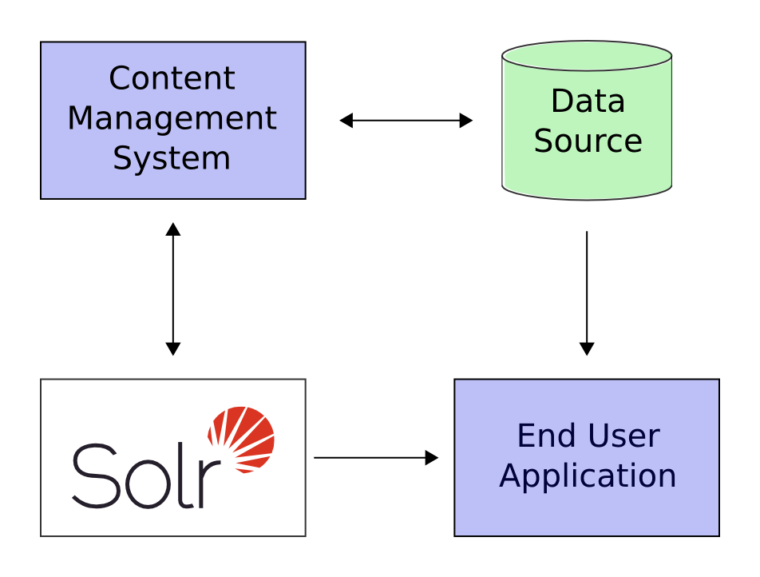

= A Quick Overview
// Licensed to the Apache Software Foundation (ASF) under one
// or more contributor license agreements.  See the NOTICE file
// distributed with this work for additional information
// regarding copyright ownership.  The ASF licenses this file
// to you under the Apache License, Version 2.0 (the
// "License"); you may not use this file except in compliance
// with the License.  You may obtain a copy of the License at
//
//   http://www.apache.org/licenses/LICENSE-2.0
//
// Unless required by applicable law or agreed to in writing,
// software distributed under the License is distributed on an
// "AS IS" BASIS, WITHOUT WARRANTIES OR CONDITIONS OF ANY
// KIND, either express or implied.  See the License for the
// specific language governing permissions and limitations
// under the License.

Solr is a search server built on top of Apache Lucene, an open source, Java-based, information retrieval library. It is designed to drive powerful document retrieval applications - wherever you need to serve data to users based on their queries, Solr can work for you.

Here is a example of how Solr could integrate with an application:

.Solr integration with applications

In the scenario above, Solr runs alongside other server applications. For example, an online store application would provide a user interface, a shopping cart, and a way to make purchases for end users; while an inventory management application would allow store employees to edit product information. The product metadata would be kept in some kind of database, as well as in Solr.

Solr makes it easy to add the capability to search through the online store through the following steps:

. Define a _schema_. The schema tells Solr about the contents of documents it will be indexing. In the online store example, the schema would define fields for the product name, description, price, manufacturer, and so on. Solr's schema is powerful and flexible and allows you to tailor Solr's behavior to your application. See <<documents-fields-and-schema-design.adoc#,Documents, Fields, and Schema Design>> for all the details.
. Feed Solr documents for which your users will search.
. Expose search functionality in your application.

Because Solr is based on open standards, it is highly extensible. Solr queries are simple HTTP request URLs and the response is a structured document: mainly JSON, but it could also be XML, CSV, or other formats. This means that a wide variety of clients will be able to use Solr, from other web applications to browser clients, rich client applications, and mobile devices. Any platform capable of HTTP can talk to Solr. See <<client-apis.adoc#,Client APIs>> for details on client APIs.

Solr offers support for the simplest keyword searching through to complex queries on multiple fields and faceted search results. <<searching.adoc#,Searching>> has more information about searching and queries.

If Solr's capabilities are not impressive enough, its ability to handle very high-volume applications should do the trick.

A relatively common scenario is that you have so much data, or so many queries, that a single Solr server is unable to handle your entire workload. In this case, you can scale up the capabilities of your application using <<solrcloud.adoc#,SolrCloud>> to better distribute the data, and the processing of requests, across many servers. Multiple options can be mixed and matched depending on the scalability you need.

For example: "Sharding" is a scaling technique in which a collection is split into multiple logical pieces called "shards" in order to scale up the number of documents in a collection beyond what could physically fit on a single server. Incoming queries are distributed to every shard in the collection, which respond with merged results. Another technique available is to increase the "Replication Factor" of your collection, which allows you to add servers with additional copies of your collection to handle higher concurrent query load by spreading the requests around to multiple machines. Sharding and replication are not mutually exclusive, and together make Solr an extremely powerful and scalable platform.

Best of all, this talk about high-volume applications is not just hypothetical: some of the famous Internet sites that use Solr today are Macy's, EBay, and Zappo's.
For more examples, take a look at https://cwiki.apache.org/confluence/display/solr/PublicServers.
