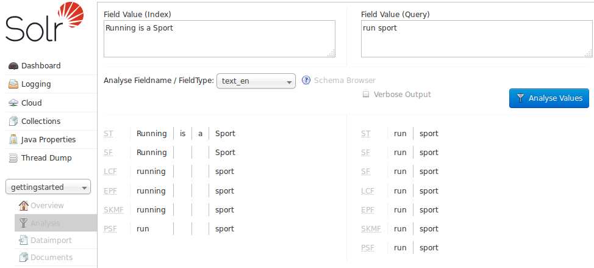
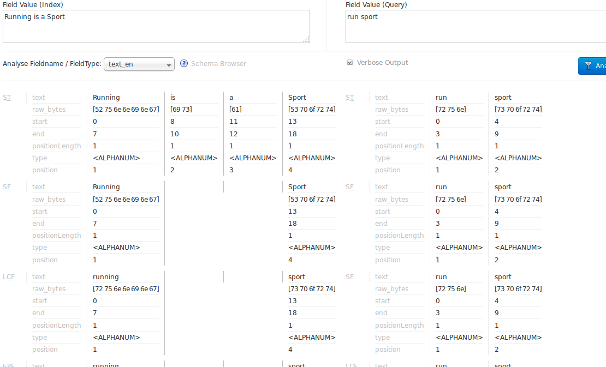

= Analysis Screen
// Licensed to the Apache Software Foundation (ASF) under one
// or more contributor license agreements.  See the NOTICE file
// distributed with this work for additional information
// regarding copyright ownership.  The ASF licenses this file
// to you under the Apache License, Version 2.0 (the
// "License"); you may not use this file except in compliance
// with the License.  You may obtain a copy of the License at
//
//   http://www.apache.org/licenses/LICENSE-2.0
//
// Unless required by applicable law or agreed to in writing,
// software distributed under the License is distributed on an
// "AS IS" BASIS, WITHOUT WARRANTIES OR CONDITIONS OF ANY
// KIND, either express or implied.  See the License for the
// specific language governing permissions and limitations
// under the License.

The Analysis screen lets you inspect how data will be handled according to the field, field type and dynamic field configurations found in your Schema. You can analyze how content would be handled during indexing or during query processing and view the results separately or at the same time. Ideally, you would want content to be handled consistently, and this screen allows you to validate the settings in the field type or field analysis chains.

Enter content in one or both boxes at the top of the screen, and then choose the field or field type definitions to use for analysis.

If you click the *Verbose Output* check box, you see more information, including more details on the transformations to the input (such as, convert to lower case, strip extra characters, etc.) including the raw bytes, type and detailed position information at each stage. The information displayed will vary depending on the settings of the field or field type. Each step of the process is displayed in a separate section, with an abbreviation for the tokenizer or filter that is applied in that step. Hover or click on the abbreviation, and you'll see the name and path of the tokenizer or filter.

In the example screenshot above, several transformations are applied to the input "Running is a sport." The words "is" and "a" have been removed and the word "running" has been changed to its basic form, "run". This is because we are using the field type `text_en` in this scenario, which is configured to remove stop words (small words that usually do not provide a great deal of context) and "stem" terms when possible to find more possible matches (this is particularly helpful with plural forms of words). If you click the question mark next to the *Analyze Fieldname/Field Type* pull-down menu, the <<schema-browser-screen.adoc#,Schema Browser window>> will open, showing you the settings for the field specified.

The section <<understanding-analyzers-tokenizers-and-filters.adoc#,Understanding Analyzers, Tokenizers, and Filters>> describes in detail what each option is and how it may transform your data and the section <<running-your-analyzer.adoc#,Running Your Analyzer>> has specific examples for using the Analysis screen.
