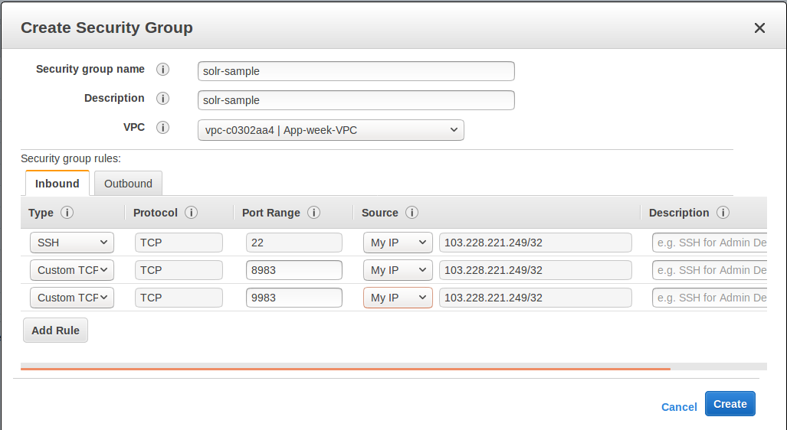
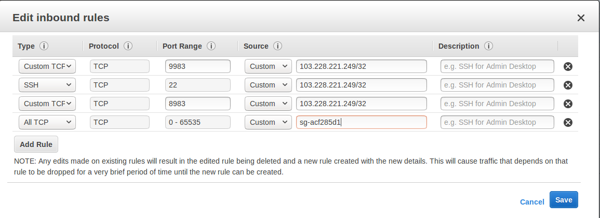
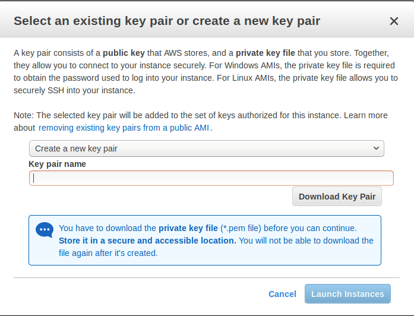

= SolrCloud on AWS EC2
:experimental:
// Licensed to the Apache Software Foundation (ASF) under one
// or more contributor license agreements.  See the NOTICE file
// distributed with this work for additional information
// regarding copyright ownership.  The ASF licenses this file
// to you under the Apache License, Version 2.0 (the
// "License"); you may not use this file except in compliance
// with the License.  You may obtain a copy of the License at
//
//   http://www.apache.org/licenses/LICENSE-2.0
//
// Unless required by applicable law or agreed to in writing,
// software distributed under the License is distributed on an
// "AS IS" BASIS, WITHOUT WARRANTIES OR CONDITIONS OF ANY
// KIND, either express or implied.  See the License for the
// specific language governing permissions and limitations
// under the License.

This guide is a tutorial on how to set up a multi-node SolrCloud cluster on https://aws.amazon.com/ec2[Amazon Web Services (AWS) EC2] instances for early development and design.

This tutorial is not meant for production systems. For one, it uses Solr's embedded ZooKeeper instance, and for production you should have at least 3 ZooKeeper nodes in an ensemble. There are additional steps you should take for a production installation; refer to <<taking-solr-to-production.adoc#,Taking Solr to Production>> for how to deploy Solr in production.

In this guide we are going to:

. Launch multiple AWS EC2 instances
* Create new _Security Group_
* Configure instances and launch
. Install, configure and start Solr on newly launched EC2 instances
* Install system prerequisites: Java 1.8 and later
* Download latest version of Solr
* Start the Solr nodes in SolrCloud mode
. Create a collection, index documents and query the system
* Create collection with multiple shards and replicas
* Index documents to the newly created collection
* Verify documents presence by querying the collection

== Before You Start
To use this guide, you must have the following:

* An https://aws.amazon.com[AWS] account.
* Familiarity with setting up a single-node SolrCloud on local machine. Refer to the <<solr-tutorial.adoc#,Solr Tutorial>> if you have never used Solr before.

== Launch EC2 instances

=== Create new Security Group

. Navigate to the https://console.aws.amazon.com/ec2/v2/home[AWS EC2 console] and to the region of your choice.
 . Configure an http://docs.aws.amazon.com/AWSEC2/latest/UserGuide/using-network-security.html[AWS security group] which will limit access to the installation and allow our launched EC2 instances to talk to each other without restrictions.
 .. From the EC2 Dashboard, click btn:[Security Groups] from the left-hand menu, under "Network & Security".
 .. Click btn:[Create Security Group] under the _Security Groups_ section. Give your security group a descriptive name.
 .. You can select one of the existing https://aws.amazon.com/vpc[VPCs] or create a new one.
 .. We need two ports open for our cloud here:
 ... Solr port. In this example we will use Solr's default port 8983.
 ... ZooKeeper Port: We'll use Solr's embedded ZooKeeper, so we'll use the default port 9983 (see the <<Deploying with External ZooKeeper>> to configure external ZooKeeper).
.. Click btn:[Inbound] to set inbound network rules, then select btn:[Add Rule]. Select "Custom TCP" as the type. Enter 8983 for the "Port Range" and choose "My IP for the Source, then enter your public IP. Create a second rule with the same type and source, but enter 9983 for the port.
+
This will limit access to your current machine. If you want wider access to the instance in order to collaborate with others, you can specify that, but make sure you only allow as much access as needed. A Solr instance should not be exposed to general Internet traffic.
.. Add another rule for SSH access. Choose "SSH" as the type, and again "My IP" for the source and again enter your public IP. You need SSH access on all instances to install and configure Solr.
.. Review the details, your group configuration should look like this:
+

.. Click btn:[Create] when finished.
.. We need to modify the rules so that instances that are part of the group can talk to all other instances that are part of the same group. We could not do this while creating the group, so we need to edit the group after creating it to add this.
... Select the newly created group in the Security Group overview table. Under the "Inbound" tab, click btn:[Edit].
... Click btn:[Add rule]. Choose `All TCP` from the pulldown list for the type, and enter `0-65535` for the port range. Specify the name of the current Security Group as the `solr-sample`.
.. Review the details, your group configuration should now look like this:
+

.. Click btn:[Save] when finished.

=== Configure Instances and Launch

Once the security group is in place, you can choose btn:[Instances] from the left-hand navigation menu.

Under Instances, click btn:[Launch Instance] button and follow the wizard steps:

. Choose your Amazon Machine Image (AMI):
Choose *Amazon Linux AMI, SSD Volume Type* as the AMI. There are both commercial AMIs and Community based AMIs available, e.g., Amazon Linux AMI (HVM), SSD Volume Type, but this is a nice AMI to use for our purposes. Click btn:[Select] next to the image you choose.
. The next screen asks you to choose the instance type, *t2.medium* is sufficient. Choose it from the list, then click btn:[Configure Instance Details].
. Configure the instance. Enter *2* in the "Number of instances" field. Make sure the setting for "Auto-assign Public IP" is "Enabled".
. When finished, click btn:[Add Storage]. The default of *8 GB* for size and *General Purpose SSD* for the volume type is sufficient for running this quick start. Optionally select "Delete on termination" if you know you won't need the data stored in Solr indexes after you terminate the instances.
. When finished, click btn:[Add Tags]. You do not have to add any tags for this quick start, but you can add them if you want.
 . Click btn:[Configure Security Group]. Choose *Select an existing security group* and select the security group you created earlier: `solr-sample`. You should see the expected inbound rules at the bottom of the page.
. Click btn:[Review].
. If everything looks correct, click btn:[Launch].
. Select an existing “private key file” or create a new one and download to your local machine so you will be able to login into the instances via SSH.
+

. On the instances list, you can watch the states change. You cannot use the instances until they become *“running”*.

== Install, Configure and Start

. Locate the Public DNS record for the instance by selecting the instance from the list of instances, and log on to each machine one by one.
+
Using SSH, if your AWS identity key file is `aws-key.pem` and the AMI uses `ec2-user` as login user, on each AWS instance, do the following:
+
[source,bash]
$ ssh-add aws-key.pem
$ ssh -A ec2-user@<instance-public-dns>
+
. While logged in to each of the AWS EC2 instances, configure Java 1.8 and download Solr:
+
[source,bash]
# verify default java version packaged with AWS instances is 1.7
$ java -version
$ sudo yum install java-1.8.0
$ sudo /usr/sbin/alternatives --config java
# select jdk-1.8
# verify default java version to java-1.8
$ java -version
+
[source,bash,subs="verbatim,attributes+"]
# download desired version of Solr
$ wget http://archive.apache.org/dist/lucene/solr/{solr-docs-version}.0/solr-{solr-docs-version}.0.tgz
# untar
$ tar -zxvf solr-{solr-docs-version}.0.tgz
# set SOLR_HOME
$ export SOLR_HOME=$PWD/solr-{solr-docs-version}.0
# put the env variable in .bashrc
# vim ~/.bashrc
export SOLR_HOME=/home/ec2-user/solr-{solr-docs-version}.0

. Resolve the Public DNS to simpler hostnames.
+
Let’s assume AWS instances public DNS with IPv4 Public IP are as follows:
+
* ec2-54-1-2-3.us-east-2.compute.amazonaws.com: 54.1.2.3
* ec2-54-4-5-6.us-east-2.compute.amazonaws.com: 54.4.5.6
+
Edit `/etc/hosts`, and add entries for the above machines:
+
[source,bash]
$ sudo vim /etc/hosts
54.1.2.3 solr-node-1
54.4.5.6 solr-node-2

. Configure Solr in running EC2 instances.
+
In this case, one of the machines will host ZooKeeper embedded along with Solr node, say, `ec2-101-1-2-3.us-east-2.compute.amazonaws.com` (aka, `solr-node-1`)
+
See <<Deploying with External ZooKeeper>> for configure external ZooKeeper.
+
Inside the `ec2-101-1-2-3.us-east-2.compute.amazonaws.com` (`solr-node-1`)
+
[source,bash]
$ cd $SOLR_HOME
# start Solr node on 8983 and ZooKeeper will start on 8983+1000 9983
$ bin/solr start -c -p 8983 -h solr-node-1

+
On the other node, `ec2-101-4-5-6.us-east-2.compute.amazonaws.com` (`solr-node-2`)
+
[source,bash]
$ cd $SOLR_HOME
# start Solr node on 8983 and connect to ZooKeeper running on first node
$ bin/solr start -c -p 8983 -h solr-node-2 -z solr-node-1:9983

. Inspect and Verify. Inspect the Solr nodes state from browser on local machine:
+
Go to:
+
[source,bash]
----
http://ec2-101-1-2-3.us-east-2.compute.amazonaws.com:8983/solr (solr-node-1:8983/solr)

http://ec2-101-4-5-6.us-east-2.compute.amazonaws.com:8983/solr (solr-node-2:8983/solr)
----
+
You should able to see Solr UI dashboard for both nodes.

== Create Collection, Index and Query

You can refer <<solr-tutorial.adoc#exercise-1,Solr Tutorial>> for an extensive walkthrough on creating collections with multiple shards and  replicas, indexing data via different methods and querying documents accordingly.

== Deploying with External ZooKeeper

If you want to configure an external ZooKeeper ensemble to avoid using the embedded single-instance ZooKeeper that runs in the same JVM as the Solr node, you need to make few tweaks in the above listed steps as follows.

* When creating the security group, instead of opening port `9983` for ZooKeeper, you'll open `2181` (or whatever port you are using for ZooKeeper: its default is 2181).
* When configuring the number of instances to launch, choose to open 3 instances instead of 2.
* When modifying the `/etc/hosts` on each machine, add a third line for the 3rd instance and give it a recognizable name:
+
[source,text,subs="verbatim"]
$ sudo vim /etc/hosts
54.1.2.3  solr-node-1
54.4.5.6  solr-node-2
54.7.8.9  zookeeper-node

* You'll need to install ZooKeeper manually, described in the next section.

=== Install ZooKeeper

These steps will help you install and configure a single instance of ZooKeeper on AWS. This is not sufficient for a production, use, however, where a ZooKeeper ensemble of at least three nodes is recommended. See the section <<setting-up-an-external-zookeeper-ensemble.adoc#,Setting Up an External ZooKeeper Ensemble>> for information about how to change this single-instance into an ensemble.

. Download a stable version of ZooKeeper. In this example we're using ZooKeeper v{ivy-zookeeper-version}. On the node you're using to host ZooKeeper (`zookeeper-node`), download the package and untar it:
+
[source,bash,subs="attributes"]
----
# download stable version of ZooKeeper, here {ivy-zookeeper-version}
$ wget https://archive.apache.org/dist/zookeeper/zookeeper-{ivy-zookeeper-version}/zookeeper-{ivy-zookeeper-version}.tar.gz
# untar
$ tar -zxvf zookeeper-{ivy-zookeeper-version}.tar.gz
----
+
Add an environment variable for ZooKeeper's home directory (`ZOO_HOME`) to the `.bashrc` for the user who will be running the process. The rest of the instructions assume you have set this variable. Correct the path to the ZooKeeper installation as appropriate if where you put it does not match the below.
+
[source,bash,subs="attributes"]
----
$ export ZOO_HOME=$PWD/zookeeper-{ivy-zookeeper-version}
# put the env variable in .bashrc
# vim ~/.bashrc
export ZOO_HOME=/home/ec2-user/zookeeper-{ivy-zookeeper-version}
----
. Change directories to `ZOO_HOME`, and create the ZooKeeper configuration by using the template provided by ZooKeeper.
+
[source,bash]
----
$ cd $ZOO_HOME
# create ZooKeeper config by using zoo_sample.cfg
$ cp conf/zoo_sample.cfg conf/zoo.cfg
----
. Create the ZooKeeper data directory in the filesystem, and edit the `zoo.cfg` file to uncomment the autopurge parameters and define the location of the data directory.
+
[source,bash]
----
# create data dir for ZooKeeper, edit zoo.cfg, uncomment autopurge parameters
$ mkdir data
$ vim conf/zoo.cfg
# -- uncomment --
autopurge.snapRetainCount=3
autopurge.purgeInterval=1
# -- edit --
dataDir=data
----
. Start ZooKeeper.
+
[source,bash]
----
$ cd $ZOO_HOME
# start ZooKeeper, default port: 2181
$ bin/zkServer.sh start
----

. On the first node being used for Solr (`solr-node-1`), start Solr and tell it where to find ZooKeeper.
+
[source,bash]
----
$ cd $SOLR_HOME
# start Solr node on 8983 and connect to ZooKeeper running on ZooKeeper node
$ bin/solr start -c -p 8983 -h solr-node-1 -z zookeeper-node:2181
----
+
. On the second Solr node (`solr-node-2`), again start Solr and tell it where to find ZooKeeper.
+
[source,bash]
----
$ cd $SOLR_HOME
# start Solr node on 8983 and connect to ZooKeeper running on ZooKeeper node
$ bin/solr start -c -p 8983 -h solr-node-1 -z zookeeper-node:2181
----

[TIP]
====
As noted earlier, a single ZooKeeper node is not sufficient for a production installation. See these additional resources for more information about deploying Solr in production, which can be used once you have the EC2 instances up and running:

* <<taking-solr-to-production.adoc#,Taking Solr to Production>>
* <<setting-up-an-external-zookeeper-ensemble.adoc#,Setting Up an External ZooKeeper Ensemble>>
====
