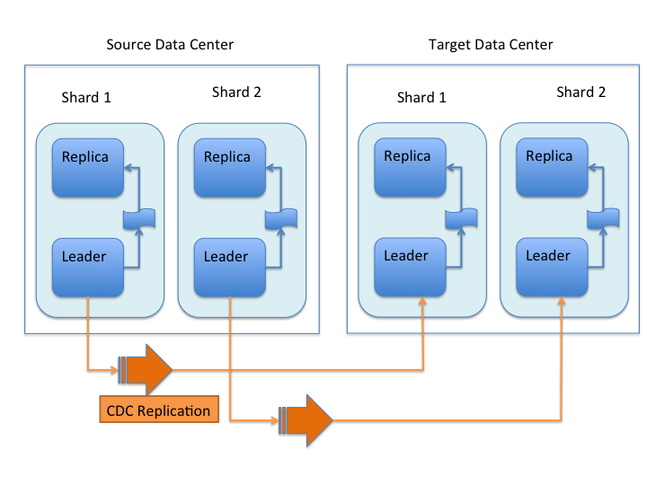
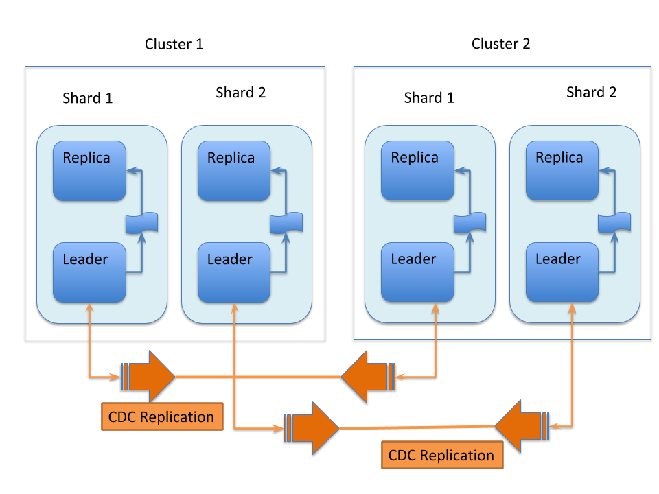

= CDCR Architecture
// Licensed to the Apache Software Foundation (ASF) under one
// or more contributor license agreements.  See the NOTICE file
// distributed with this work for additional information
// regarding copyright ownership.  The ASF licenses this file
// to you under the Apache License, Version 2.0 (the
// "License"); you may not use this file except in compliance
// with the License.  You may obtain a copy of the License at
//
//   http://www.apache.org/licenses/LICENSE-2.0
//
// Unless required by applicable law or agreed to in writing,
// software distributed under the License is distributed on an
// "AS IS" BASIS, WITHOUT WARRANTIES OR CONDITIONS OF ANY
// KIND, either express or implied.  See the License for the
// specific language governing permissions and limitations
// under the License.

== CDCR Architecture Overview

With CDCR, Source and Target data centers can each serve search queries when CDCR is operating. The Target data center will lag somewhat behind the Source cluster due to propagation delays.

[WARNING]
.CDCR is deprecated
====
This feature (in its current form) is deprecated and will be removed in 9.0.

See <<cross-data-center-replication-cdcr.adoc#,Cross Data Center Replication>> for more details.
====

Data changes on the Source data center are replicated to the Target data center only after they are persisted to disk. The data changes can be replicated in near real-time (with a small delay) or could be scheduled to be sent at longer intervals to the Target data center. CDCR can "bootstrap" the collection to the Target data center. Since this is a full copy of the entire index, network bandwidth should be considered. Of course both Source and Target collections may be empty to start.

Each shard leader in the Source data center will be responsible for replicating its updates to the corresponding leader in the Target data center. When receiving updates from the Source data center, shard leaders in the Target data center will replicate the changes to their own replicas as normal SolrCloud updates.

This replication model is designed to tolerate some degradation in connectivity, accommodate limited bandwidth, and support batch updates to optimize communication.

Replication supports both a new empty index and pre-built indexes. In the scenario where the replication is set up on a pre-built index in the Source cluster and nothing on the Target cluster, CDCR will replicate the _entire_ index from the Source to Target.

The directional nature of the implementation implies a "push" model from the Source collection to the Target collection. Therefore, the Source configuration must be able to "see" the ZooKeeper ensemble in the Target cluster. The ZooKeeper ensemble is provided configured in the Source's `solrconfig.xml` file.

CDCR is configured to replicate from collections in the Source cluster to collections in the Target cluster on a collection-by-collection basis. Since CDCR is configured in `solrconfig.xml` (on both Source and Target clusters), the settings can be tailored for the needs of each collection.

CDCR can be configured to replicate from one collection to a second collection _within the same cluster_. That is a specialized scenario not covered in this Guide.

=== Uni-Directional Architecture

When uni-directional updates are configured, updates and deletes are first written to the Source cluster, then forwarded to one or more Target data centers, as illustrated in this graphic:

.Uni-Directional Data Flow

With uni-directional updates, the Target data center(s) will not propagate updates such as adds, updates, or deletes to the Source data center and updates should not be sent to any of the Target data center(s).

The data flow sequence is:

. A shard leader receives a new update that is processed by its update processor chain.
. The data update is first applied to the local index.
. Upon successful application of the data update on the local index, the data update is added to CDCR's Update Logs queue.
. After the data update is persisted to disk, the data update is sent to the replicas within the data center.
. After Step 4 is successful, CDCR reads the data update from the Update Logs and pushes it to the corresponding collection in the Target data center. This is necessary in order to ensure consistency between the Source and Target data centers.
. The leader on the Target data center writes the data locally and forwards it to all its followers.

Steps 1, 2, 3 and 4 are performed synchronously by SolrCloud; Step 5 is performed asynchronously by a background thread. Given that CDCR replication is performed asynchronously, it becomes possible to push batch updates in order to minimize network communication overhead. Also, if CDCR is unable to push the update at a given time, for example, due to a degradation in connectivity, it can retry later without any impact on the Source data center.

One implication of the architecture is that the leaders in the Source cluster must be able to "see" the leaders in the Target cluster. Since leaders may change in both Source and Target collections, all nodes in the Source cluster must be able to "see" all Solr nodes in the Target cluster. Firewalls, ACL rules, etc., must be configured to allow this.

This design works most robustly if both the Source and Target clusters have the same number of shards. There is no requirement that the shards in the Source and Target collection have the same number of replicas.

Having different numbers of shards on the Source and Target cluster is possible, but is also an "expert" configuration as that option imposes certain constraints and is not generally recommended. Most of the scenarios where having differing numbers of shards are contemplated are better accomplished by hosting multiple shards on each Solr instance.

=== Bi-Directional Architecture

When bi-directional updates are configured, either cluster can act as a Source or a Target, and that role can shift between the clusters, as illustrated in this graphic:

.Bi-Directional Data Flow

With bi-directional updates, indexing and querying must be done on a single cluster at a time to maintain consistency. The second cluster is used when the first cluster is down. Simplifying, one cluster can act as Source and other as Target but both roles, Source and Target, cannot be assigned to any single cluster at the same time. Failover is handled smoothly without any configuration changes. Updates sent from Source data center to Target is not propagated back to Source when bi-directional updates are configured.

The data flow sequence is similar from Step 1 to 6 above, with an additional step:

[start=7]
. When bi-directional updates are configured, the updates received from Source are flagged on Target and not forwarded further.

All the behavior(s) and constraint(s) explained in uni-directional data flow are applicable to the respective Source and Target clusters in this scenario.

== Major Components of CDCR

What follows is a discussion of the key features and components in CDCR’s architecture:

=== CDCR Configuration

In order to configure CDCR, the Source data center requires the host address of the ZooKeeper cluster associated with the Target data center. The ZooKeeper host address is the only information needed by CDCR to instantiate the communication with the Target Solr cluster. The CDCR configuration section of `solrconfig.xml` file on the Source cluster will therefore contain a list of ZooKeeper hosts. The CDCR configuration section of `solrconfig.xml` might also contain secondary/optional configuration, such as the number of CDC Replicator threads, batch updates related settings, etc.

=== CDCR Initialization

CDCR supports incremental updates to either new or existing collections. CDCR may not be able to keep up with very high volume updates, especially if there are significant communications latencies due to a slow "pipe" between the data centers. Some scenarios:

* There is an initial bulk load of a corpus followed by lower volume incremental updates. In this case, one can do the initial bulk load and then enable CDCR. See the section <<cdcr-config.adoc#initial-startup,Initial Startup>> for more information.
* The index is being built up from scratch, without a significant initial bulk load. CDCR can be set up on empty collections and keep them synchronized from the start.
* The index is always being updated at a volume too high for CDCR to keep up. This is especially possible in situations where the connection between the Source and Target data centers is poor. This scenario is unsuitable for CDCR in its current form.

=== Inter-Data Center Communication

The CDCR REST API is the primary form of end-user communication for admin commands.

A SolrJ client is used internally for CDCR operations. The SolrJ client gets its configuration information from the `solrconfig.xml` file. Users of CDCR will not interact directly with the internal SolrJ implementation and will interact with CDCR exclusively through the REST API.

=== Updates Tracking & Pushing

CDCR replicates data updates from the Source to the Target data center by leveraging Update Logs. These logs will replace SolrCloud's transaction log.

A background thread regularly checks the Update Logs for new entries, and then forwards them to the Target data center. The thread therefore needs to keep a checkpoint in the form of a pointer to the last update successfully processed in the Update Logs. Upon acknowledgement from the Target data center that updates have been successfully processed, the Update Logs pointer is updated to reflect the current checkpoint.

This pointer must be synchronized across all the replicas. In the case where the leader goes down and a new leader is elected, the new leader will be able to resume replication from the last update by using this synchronized pointer. The strategy to synchronize such a pointer across replicas will be explained next.

If for some reason, the Target data center is offline or fails to process the updates, the thread will periodically try to contact the Target data center and push the updates while buffering updates on the Source cluster. One implication of this is that the Source Update Logs directory should be periodically monitored as the updates will continue to accumulate and will not be purged until the connection to the Target data center is restored.

=== Synchronization of Update Checkpoints

A reliable synchronization of the update checkpoints between the shard leader and shard replicas is critical to avoid introducing inconsistency between the Source and Target data centers. Another important requirement is that the synchronization must be performed with minimal network traffic to maximize scalability.

In order to achieve this, the strategy is to:

* Uniquely identify each update operation. This unique identifier will serve as pointer.
* Rely on two storages: an ephemeral storage on the Source shard leader, and a persistent storage on the Target cluster.

The shard leader in the Source cluster will be in charge of generating a unique identifier for each update operation, and will keep a copy of the identifier of the last processed updates in memory. The identifier will be sent to the Target cluster as part of the update request. On the Target data center side, the shard leader will receive the update request, store it along with the unique identifier in the Update Logs, and replicate it to the other shards.

SolrCloud already provides a unique identifier for each update operation, i.e., a “version” number. This version number is generated using a time-based lmport clock which is incremented for each update operation sent. This provides a “happened-before” ordering of the update operations that will be leveraged in (1) the initialization of the update checkpoint on the Source cluster, and in (2) the maintenance strategy of the Update Logs.

The persistent storage on the Target cluster is used only during the election of a new shard leader on the Source cluster. If a shard leader goes down on the Source cluster and a new leader is elected, the new leader will contact the Target cluster to retrieve the last update checkpoint and instantiate its ephemeral pointer. On such a request, the Target cluster will retrieve the latest identifier received across all the shards, and send it back to the Source cluster. To retrieve the latest identifier, every shard leader will look up the identifier of the first entry in its Update Logs and send it back to a coordinator. The coordinator will have to select the highest among them.

This strategy does not require any additional network traffic and ensures reliable pointer synchronization. Consistency is principally achieved by leveraging SolrCloud. The update workflow of SolrCloud ensures that every update is applied to the leader and also to any of the replicas. If the leader goes down, a new leader is elected. During the leader election, a synchronization is performed between the new leader and the other replicas. This ensures that the new leader has a consistent Update Logs with the previous leader. Having a consistent Update Logs means that:

* On the Source cluster, the update checkpoint can be reused by the new leader.
* On the Target cluster, the update checkpoint will be consistent between the previous and new leader. This ensures the correctness of the update checkpoint sent by a newly elected leader from the Target cluster.

=== Maintenance of Update Logs

The CDCR replication logic requires modification to the maintenance logic of Update Logs on the Source data center. Initially, the Update Logs acts as a fixed size queue, limited to 100 update entries by default. In CDCR, the Update Logs must act as a queue of variable size as they need to keep track of all the updates up through the last processed update by the Target data center. Entries in the Update Logs are removed only when all pointers (one pointer per Target data center) are after them.

If the communication with one of the Target data center is slow, the Update Logs on the Source data center can grow to a substantial size. In such a scenario, it is necessary for the Update Logs to be able to efficiently find a given update operation given its identifier. Given that its identifier is an incremental number, it is possible to implement an efficient search strategy. Each transaction log file contains as part of its filename the version number of the first element. This is used to quickly traverse all the transaction log files and find the transaction log file containing one specific version number.

=== Monitoring Operations

CDCR provides the following monitoring capabilities over the replication operations:

* Monitoring of the outgoing and incoming replications, with information such as the Source and Target nodes, their status, etc.
* Statistics about the replication, with information such as operations (add/delete) per second, number of documents in the queue, etc.

Information about the lifecycle and statistics will be provided on a per-shard basis by the CDC Replicator thread. The CDCR API can then aggregate this information an a collection level.

=== CDC Replicator

The CDC Replicator is a background thread that is responsible for replicating updates from a Source data center to one or more Target data centers. It is responsible for providing monitoring information on a per-shard basis. As there can be a large number of collections and shards in a cluster, we will use a fixed-size pool of CDC Replicator threads that will be shared across shards.

=== CDCR Limitations

The current design of CDCR has some limitations. CDCR will continue to evolve over time and many of these limitations will be addressed. Among them are:

* CDCR is unlikely to be satisfactory for bulk-load situations where the update rate is high, especially if the bandwidth between the Source and Target clusters is restricted. In this scenario, the initial bulk load should be performed, the Source and Target data centers synchronized and CDCR be utilized for incremental updates.
* CDCR works most robustly with the same number of shards in the Source and Target collection. The shards in the two collections may have different numbers of replicas.
* Running CDCR with the indexes on HDFS is not currently supported, see the https://issues.apache.org/jira/browse/SOLR-9861[Solr CDCR over HDFS] JIRA issue.
* Configuration files (`solrconfig.xml`, `managed-schema`, etc.) are not automatically synchronized between the Source and Target clusters. This means that when the Source schema or `solrconfig.xml` files are changed, those changes must be replicated manually to the Target cluster. This includes adding fields by the <<schema-api.adoc#,Schema API>> or <<managed-resources.adoc#,Managed Resources>> as well as hand editing those files.
* CDCR doesn't support <<basic-authentication-plugin.adoc#,Basic Authentication features>> across clusters.
* CDCR does not yet support TLOG or PULL replica types.
