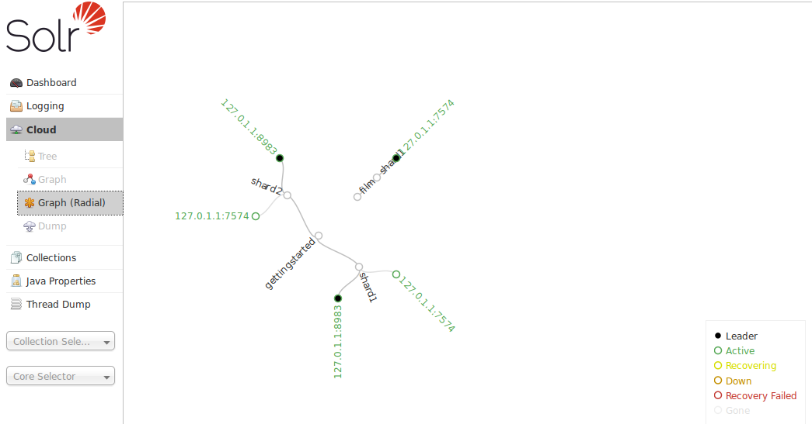

= Cloud Screens
:page-shortname: cloud-screens
:page-permalink: cloud-screens.html
// Licensed to the Apache Software Foundation (ASF) under one
// or more contributor license agreements.  See the NOTICE file
// distributed with this work for additional information
// regarding copyright ownership.  The ASF licenses this file
// to you under the Apache License, Version 2.0 (the
// "License"); you may not use this file except in compliance
// with the License.  You may obtain a copy of the License at
//
//   http://www.apache.org/licenses/LICENSE-2.0
//
// Unless required by applicable law or agreed to in writing,
// software distributed under the License is distributed on an
// "AS IS" BASIS, WITHOUT WARRANTIES OR CONDITIONS OF ANY
// KIND, either express or implied.  See the License for the
// specific language governing permissions and limitations
// under the License.

When running in <<solrcloud.adoc#solrcloud,SolrCloud>> mode, a "Cloud" option will appear in the Admin UI between <<logging.adoc#logging,Logging>> and <<collections-core-admin.adoc#collections-core-admin,Collections/Core Admin>>.

This screen provides status information about each collection & node in your cluster, as well as access to the low level data being stored in <<using-zookeeper-to-manage-configuration-files.adoc#using-zookeeper-to-manage-configuration-files,ZooKeeper>>.

.Only Visible When using SolrCloud
[NOTE]
====
The "Cloud" menu option is only available on Solr instances running in <<getting-started-with-solrcloud.adoc#getting-started-with-solrcloud,SolrCloud mode>>. Single node or master/slave replication instances of Solr will not display this option.
====

Click on the Cloud option in the left-hand navigation, and a small sub-menu appears with options called "Tree", "Graph", "Graph (Radial)" and "Dump". The default view ("Graph") shows a graph of each collection, the shards that make up those collections, and the addresses of each replica for each shard.

This example shows the very simple two-node cluster created using the `bin/solr -e cloud -noprompt` example command. In addition to the 2 shard, 2 replica "gettingstarted" collection, there is an additional "films" collection consisting of a single shard/replica:

image::images/cloud-screens/cloud-graph.png[image,width=512,height=250]

The "Graph (Radial)" option provides a different visual view of each node. Using the same example cluster, the radial graph view looks like:

The "Tree" option shows a directory structure of the data in ZooKeeper, including cluster wide information regarding the `live_nodes` and `overseer` status, as well as collection specific information such as the `state.json`, current shard leaders, and configuration files in use. In this example, we see the `state.json` file definition for the "films" collection:

image::images/cloud-screens/cloud-tree.png[image,width=487,height=250]

The final option is "Dump", which returns a JSON document containing all nodes, their contents and their children (recursively). This can be used to export a snapshot of all the data that Solr has kept inside ZooKeeper and can aid in debugging SolrCloud problems.
