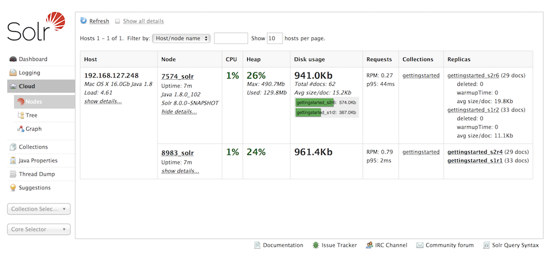
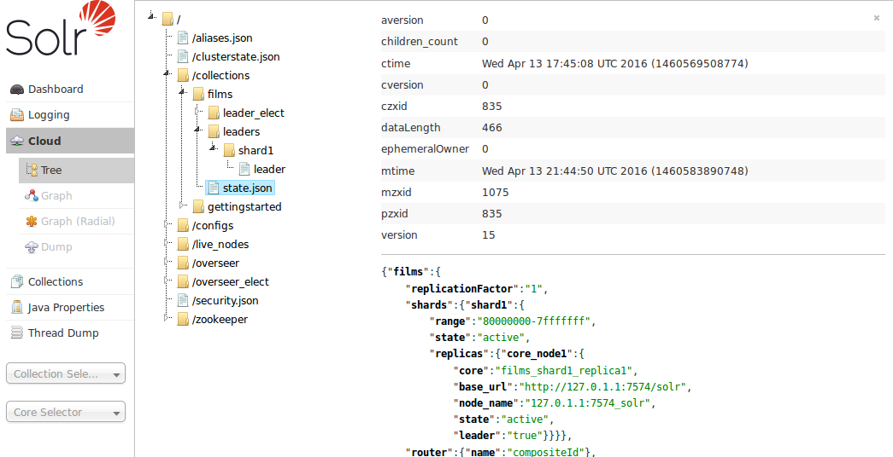
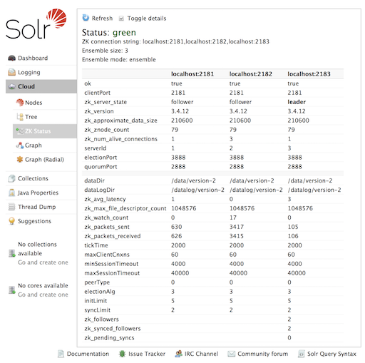
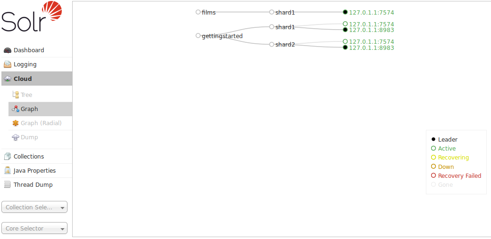
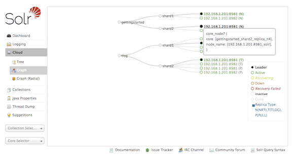

= Cloud Screens
// Licensed to the Apache Software Foundation (ASF) under one
// or more contributor license agreements.  See the NOTICE file
// distributed with this work for additional information
// regarding copyright ownership.  The ASF licenses this file
// to you under the Apache License, Version 2.0 (the
// "License"); you may not use this file except in compliance
// with the License.  You may obtain a copy of the License at
//
//   http://www.apache.org/licenses/LICENSE-2.0
//
// Unless required by applicable law or agreed to in writing,
// software distributed under the License is distributed on an
// "AS IS" BASIS, WITHOUT WARRANTIES OR CONDITIONS OF ANY
// KIND, either express or implied.  See the License for the
// specific language governing permissions and limitations
// under the License.

When running in <<solrcloud.adoc#solrcloud,SolrCloud>> mode, a "Cloud" option will appear in the Admin UI between <<logging.adoc#logging,Logging>> and <<collections-core-admin.adoc#collections-core-admin,Collections>>.

This screen provides status information about each collection & node in your cluster, as well as access to the low level data being stored in <<using-zookeeper-to-manage-configuration-files.adoc#using-zookeeper-to-manage-configuration-files,ZooKeeper>>.

.Only Visible When using SolrCloud
[NOTE]
====
The "Cloud" menu option is only available on Solr instances running in <<getting-started-with-solrcloud.adoc#getting-started-with-solrcloud,SolrCloud mode>>. Single node or master/slave replication instances of Solr will not display this option.
====

Click on the "Cloud" option in the left-hand navigation, and a small sub-menu appears with options called "Nodes", "Tree", "ZK Status" and "Graph". The sub-view selected by default is "Nodes".

== Nodes View
The "Nodes" view shows a list of the hosts and nodes in the cluster along with key information for each: "CPU", "Heap", "Disk usage", "Requests", "Collections" and "Replicas".

The example below shows the default "cloud" example with some documents added to the "gettingstarted" collection. Details are expanded for node on port 7574, showing more metadata and more metrics details. The screen provides links to navigate to nodes, collections and replicas. The table supports paging and filtering on host/node names and collection names.

== Tree View
The "Tree" view shows a directory structure of the data in ZooKeeper, including cluster wide information regarding the `live_nodes` and `overseer` status, as well as collection specific information such as the `state.json`, current shard leaders, and configuration files in use. In this example, we see part of the `state.json`  definition for the "tlog" collection:

As an aid to debugging, the data shown in the "Tree" view can be exported locally using the following command `bin/solr zk ls -r /`

== ZK Status View
The "ZK Status" view gives an overview over the ZooKeeper servers or ensemble used by Solr. It lists whether running in `standalone` or `ensemble` mode, shows how many ZooKeeper nodes are configured, and then displays a table listing detailed monitoring status for each node, including who is the leader, configuration parameters, and more.

== Graph View
The "Graph" view shows a graph of each collection, the shards that make up those collections, and the addresses and type ("NRT", "TLOG" or "PULL") of each replica for each shard.

This example shows a simple cluster. In addition to the 2 shard, 2 replica "gettingstarted" collection, there is an additional "tlog" collection consisting of mixed TLOG and PULL replica types.

Tooltips appear when hovering over each replica giving additional information.

