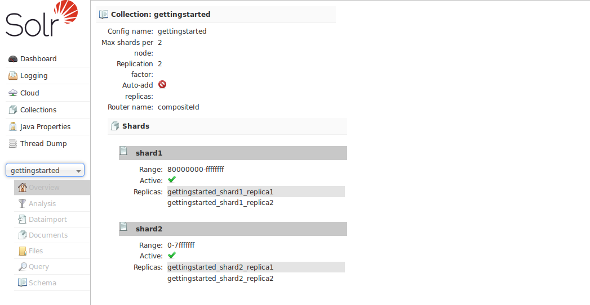

= Collection-Specific Tools
:page-children: analysis-screen, dataimport-screen, documents-screen, files-screen, query-screen, stream-screen, schema-browser-screen
// Licensed to the Apache Software Foundation (ASF) under one
// or more contributor license agreements.  See the NOTICE file
// distributed with this work for additional information
// regarding copyright ownership.  The ASF licenses this file
// to you under the Apache License, Version 2.0 (the
// "License"); you may not use this file except in compliance
// with the License.  You may obtain a copy of the License at
//
//   http://www.apache.org/licenses/LICENSE-2.0
//
// Unless required by applicable law or agreed to in writing,
// software distributed under the License is distributed on an
// "AS IS" BASIS, WITHOUT WARRANTIES OR CONDITIONS OF ANY
// KIND, either express or implied.  See the License for the
// specific language governing permissions and limitations
// under the License.

In the left-hand navigation bar, you will see a pull-down menu titled "Collection Selector" that can be used to access collection specific administration screens.

.Only Visible When Using SolrCloud
[NOTE]
====
The "Collection Selector" pull-down menu is only available on Solr instances running in <<solrcloud.adoc#,SolrCloud mode>>.

Single node or leader/follower replication instances of Solr will not display this menu, instead the Collection specific UI pages described in this section will be available in the <<core-specific-tools.adoc#,Core Selector pull-down menu>>.
====

Clicking on the Collection Selector pull-down menu will show a list of the collections in your Solr cluster, with a search box that can be used to find a specific collection by name. When you select a collection from the pull-down, the main display of the page will display some basic metadata about the collection, and a secondary menu will appear in the left nav with links to additional collection specific administration screens.

The collection-specific UI screens are listed below, with a link to the section of this guide to find out more:

// TODO: SOLR-10655 BEGIN: refactor this into a 'collection-screens-list.include.adoc' file for reuse
* <<analysis-screen.adoc#,Analysis>> - lets you analyze the data found in specific fields.
* <<dataimport-screen.adoc#,Dataimport>> - shows you information about the current status of the Data Import Handler.
* <<documents-screen.adoc#,Documents>> - provides a simple form allowing you to execute various Solr indexing commands directly from the browser.
* <<files-screen.adoc#,Files>> - shows the current core configuration files such as `solrconfig.xml`.
* <<query-screen.adoc#,Query>> - lets you submit a structured query about various elements of a core.
* <<stream-screen.adoc#,Stream>> - allows you to submit streaming expressions and see results and parsing explanations.
* <<schema-browser-screen.adoc#,Schema Browser>> - displays schema data in a browser window.
// TODO: SOLR-10655 END
