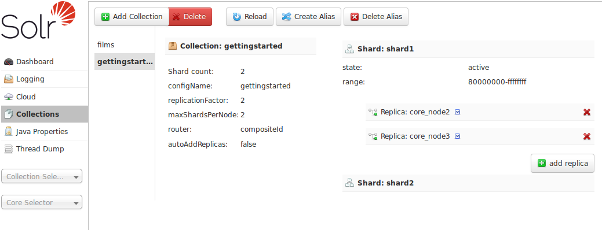

= Collections / Core Admin
// Licensed to the Apache Software Foundation (ASF) under one
// or more contributor license agreements.  See the NOTICE file
// distributed with this work for additional information
// regarding copyright ownership.  The ASF licenses this file
// to you under the Apache License, Version 2.0 (the
// "License"); you may not use this file except in compliance
// with the License.  You may obtain a copy of the License at
//
//   http://www.apache.org/licenses/LICENSE-2.0
//
// Unless required by applicable law or agreed to in writing,
// software distributed under the License is distributed on an
// "AS IS" BASIS, WITHOUT WARRANTIES OR CONDITIONS OF ANY
// KIND, either express or implied.  See the License for the
// specific language governing permissions and limitations
// under the License.

The Collections screen provides some basic functionality for managing your Collections, powered by the <<collections-api.adoc#collections-api,Collections API>>.

[NOTE]
====
If you are running a single node Solr instance, you will not see a Collections option in the left nav menu of the Admin UI.

You will instead see a "Core Admin" screen that supports some comparable Core level information & manipulation via the <<coreadmin-api.adoc#coreadmin-api,CoreAdmin API>> instead.
====

The main display of this page provides a list of collections that exist in your cluster. Clicking on a collection name provides some basic metadata about how the collection is defined, and its current shards & replicas, with options for adding and deleting individual replicas.

The buttons at the top of the screen let you make various collection level changes to your cluster, from add new collections or aliases to reloading or deleting a single collection.

Replicas can be deleted by clicking the red "X" next to the replica name.

If the shard is inactive, for example after a <<shard-management.adoc#splitshard,SPLITSHARD action>>, an option to delete the shard will appear as a red "X" next to the shard name.

image::images/collections-core-admin/DeleteShard.png[image,width=486,height=250]
