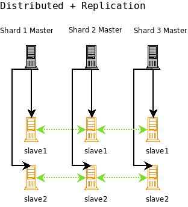

= Combining Distribution and Replication
:page-shortname: combining-distribution-and-replication
:page-permalink: combining-distribution-and-replication.html
// Licensed to the Apache Software Foundation (ASF) under one
// or more contributor license agreements.  See the NOTICE file
// distributed with this work for additional information
// regarding copyright ownership.  The ASF licenses this file
// to you under the Apache License, Version 2.0 (the
// "License"); you may not use this file except in compliance
// with the License.  You may obtain a copy of the License at
//
//   http://www.apache.org/licenses/LICENSE-2.0
//
// Unless required by applicable law or agreed to in writing,
// software distributed under the License is distributed on an
// "AS IS" BASIS, WITHOUT WARRANTIES OR CONDITIONS OF ANY
// KIND, either express or implied.  See the License for the
// specific language governing permissions and limitations
// under the License.

When your index is too large for a single machine and you have a query volume that single shards cannot keep up with, it's time to replicate each shard in your distributed search setup.

The idea is to combine distributed search with replication. As shown in the figure below, a combined distributed-replication configuration features a master server for each shard and then 1-_n_ slaves that are replicated from the master. As in a standard replicated configuration, the master server handles updates and optimizations without adversely affecting query handling performance.

Query requests should be load balanced across each of the shard slaves. This gives you both increased query handling capacity and fail-over backup if a server goes down.

.A Solr configuration combining both replication and master-slave distribution.

None of the master shards in this configuration know about each other. You index to each master, the index is replicated to each slave, and then searches are distributed across the slaves, using one slave from each master/slave shard.

For high availability you can use a load balancer to set up a virtual IP for each shard's set of slaves. If you are new to load balancing, HAProxy (http://haproxy.1wt.eu/) is a good open source software load-balancer. If a slave server goes down, a good load-balancer will detect the failure using some technique (generally a heartbeat system), and forward all requests to the remaining live slaves that served with the failed slave. A single virtual IP should then be set up so that requests can hit a single IP, and get load balanced to each of the virtual IPs for the search slaves.

With this configuration you will have a fully load balanced, search-side fault-tolerant system (Solr does not yet support fault-tolerant indexing). Incoming searches will be handed off to one of the functioning slaves, then the slave will distribute the search request across a slave for each of the shards in your configuration. The slave will issue a request to each of the virtual IPs for each shard, and the load balancer will choose one of the available slaves. Finally, the results will be combined into a single results set and returned. If any of the slaves go down, they will be taken out of rotation and the remaining slaves will be used. If a shard master goes down, searches can still be served from the slaves until you have corrected the problem and put the master back into production.
