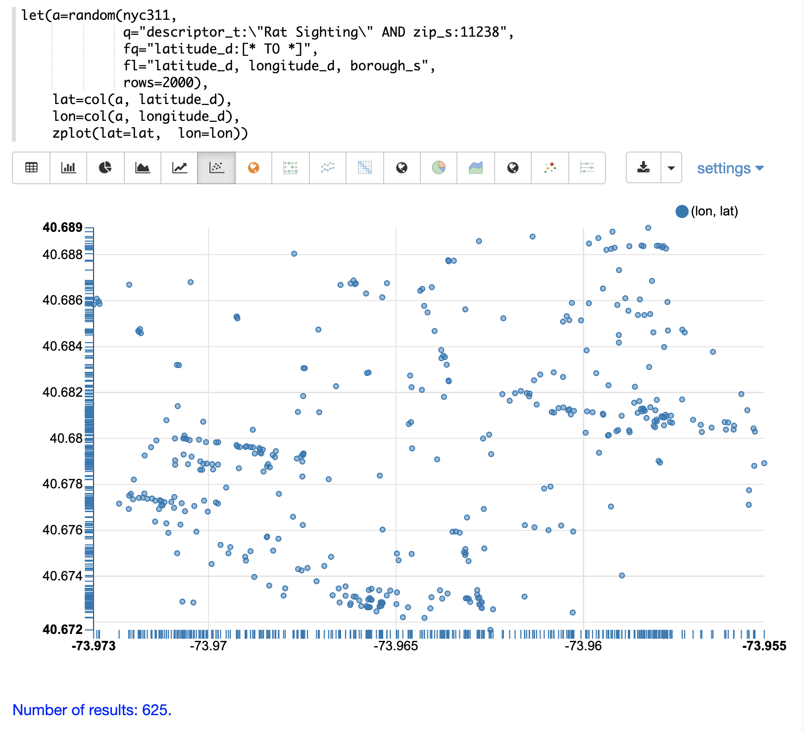
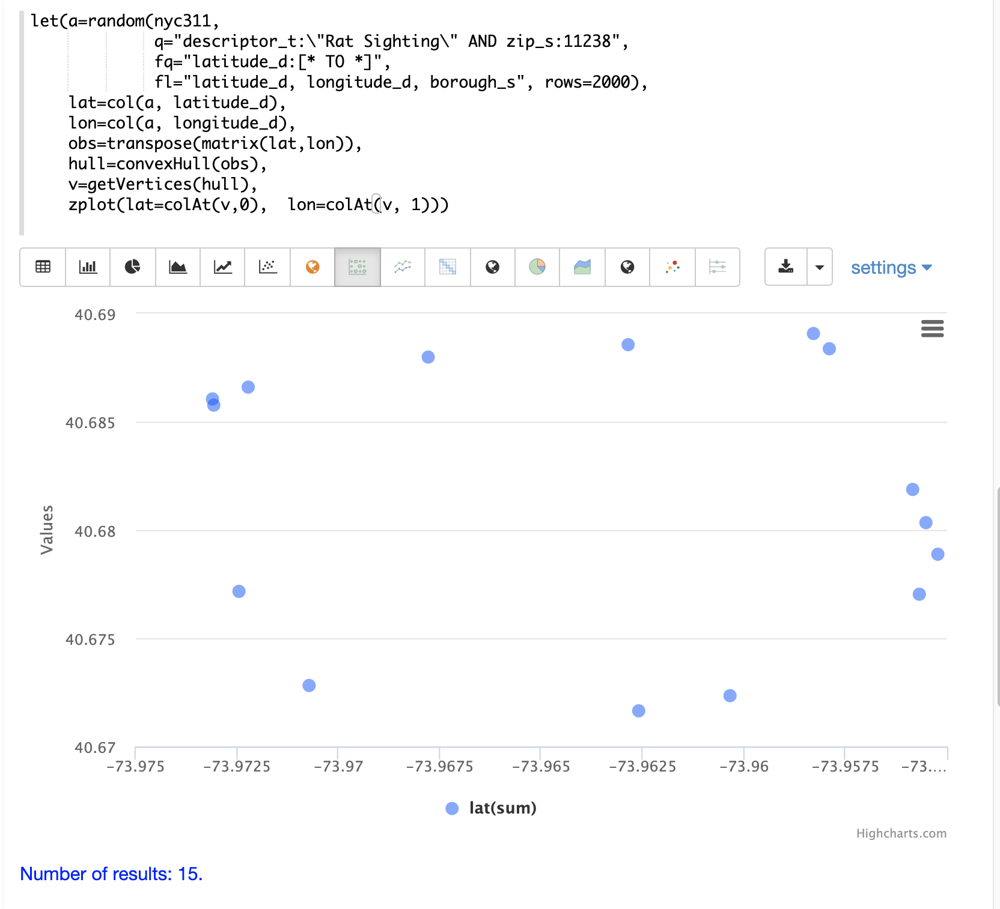
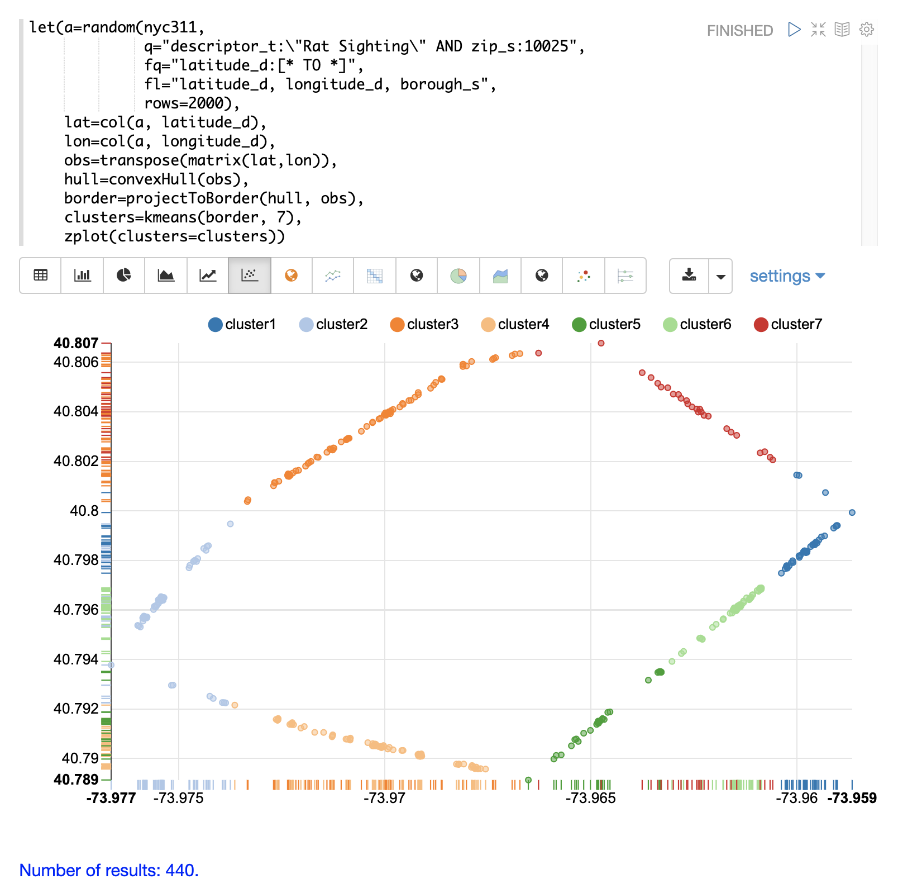

= Computational Geometry
// Licensed to the Apache Software Foundation (ASF) under one
// or more contributor license agreements.  See the NOTICE file
// distributed with this work for additional information
// regarding copyright ownership.  The ASF licenses this file
// to you under the Apache License, Version 2.0 (the
// "License"); you may not use this file except in compliance
// with the License.  You may obtain a copy of the License at
//
//   http://www.apache.org/licenses/LICENSE-2.0
//
// Unless required by applicable law or agreed to in writing,
// software distributed under the License is distributed on an
// "AS IS" BASIS, WITHOUT WARRANTIES OR CONDITIONS OF ANY
// KIND, either express or implied.  See the License for the
// specific language governing permissions and limitations
// under the License.

This section of the math expressions user guide covers computational geometry functions.

== Convex Hull

A convex hull is the smallest convex set of points that encloses a data set. Math expressions has support for computing
the convex hull of a 2D data set. Once a convex hull has been calculated, a set of math expression functions
can be applied to geometrically describe and visualize the convex hull.

=== Visualization

The `convexHull` function can be used to visualize a border around a
set of 2D points. Border visualizations can be useful for understanding where data points are
in relation to the border.

In the examples below the `convexHull` function is used
to visualize a border for a set of latitude and longitude points of rat sightings in the NYC311
complaints database. An investigation of the border around the rat sightings can be done
to better understand how rats may be entering or exiting the specific region.

==== Scatter Plot

Before visualizing the convex hull its often useful to visualize the 2D points as a scatter plot.

In this example the `random` function draws a sample of records from the NYC311 (complaints database) collection where
the complaint description matches "rat sighting" and the zip code is 11238. The latitude and longitude fields
are then vectorized and plotted as a scatter plot with longitude on x-axis and latitude on the
y-axis.

Notice from the scatter plot that many of the points appear to lie near the border of the plot.

==== Convex Hull Plot

The `convexHull` function can be used to visualize the border. The example uses the same points
drawn from the NYC311 database. But instead of plotting the points directly the latitude and
longitude points are added as rows to a matrix. The matrix is then transposed with `transpose`
function so that each row of the matrix contains a single latitude and longitude point.

The `convexHull` function is then used calculate the convex hull for the matrix of points.
The convex hull is set a variable called `hull`.

Once the convex hull has been created the `getVertices` function can be used to
retrieve the matrix of points in the scatter plot that comprise the convex border around the scatter plot.
The `colAt` function can then be used to retrieve the latitude and longitude vectors from the matrix
so they can visualized by the `zplot` function. In the example below the convex hull points are
visualized as a scatter plot.

Notice that the 15 points in the scatter plot describe that latitude and longitude points of the
convex hull.

==== Projecting and Clustering

The once a convex hull as been calculated the `projectToBorder` can then be used to project
points to the nearest point on the border. In the example below the `projectToBorder` function
is used to project the original scatter scatter plot points to the nearest border.

The `projectToBorder` function returns a matrix of lat/lon points for the border projections. In
the example the matrix of border points is then clustered into 7 clusters using kmeans clustering.
The `zplot` function is then used to plot the clustered border points.

Notice in the visualization its easy to see which spots along the border have the highest
density of points. In the case or the rat sightings this information is useful in understanding
which border points are closest for the rats to enter or exit from.

==== Plotting the Centroids

Once the border points have been clustered its very easy to extract the centroids of the clusters
and plot them on a map. The example below extracts the centroids from the clusters using the
`getCentroids` function. `getCentroids` returns the matrix of lat/lon points which represent
the centroids of border clusters. The `colAt` function can then be used to extract the lat/lon
vectors so they can be plotted on a map using `zplot`.

image::images/math-expressions/convex2.png[]

The map above shows the centroids of the border clusters. The centroids from the highest
density clusters can now be zoomed and investigated geo-spatially to determine what might be
the best places to begin an investigation of the border.

== Enclosing Disk

The `enclosingDisk` function finds the smallest enclosing circle the encloses a 2D data set.
Once an enclosing disk has been calculated, a set of math expression functions
can be applied to geometrically describe the enclosing disk.

In the example below an enclosing disk is calculated for a randomly generated set of 1000 2D observations.

Then the following functions are called on the enclosing disk:

* `getCenter`: Returns the 2D point that is the center of the disk.

* `getRadius`: Returns the radius of the disk.

* `getSupportPoints`: Returns the support points of the disk.

[source,text]
----
let(echo="center, radius, support",
    x=sample(normalDistribution(0, 20), 1000),
    y=sample(normalDistribution(0, 20), 1000),
    observations=transpose(matrix(x,y)),
    disk=enclosingDisk(observations),
    center=getCenter(disk),
    radius=getRadius(disk),
    support=getSupportPoints(disk))
----

When this expression is sent to the `/stream` handler it responds with:

[source,json]
----
{
  "result-set": {
    "docs": [
      {
        "center": [
          -6.668825009733749,
          -2.9825450908240025
        ],
        "radius": 72.66109546907208,
        "support": [
          [
            20.350992271739464,
            64.46791279377014
          ],
          [
            33.02079953093981,
            57.880978456420365
          ],
          [
            -44.7273247899923,
            -64.87911518353323
          ]
        ]
      },
      {
        "EOF": true,
        "RESPONSE_TIME": 8
      }
    ]
  }
}
----
