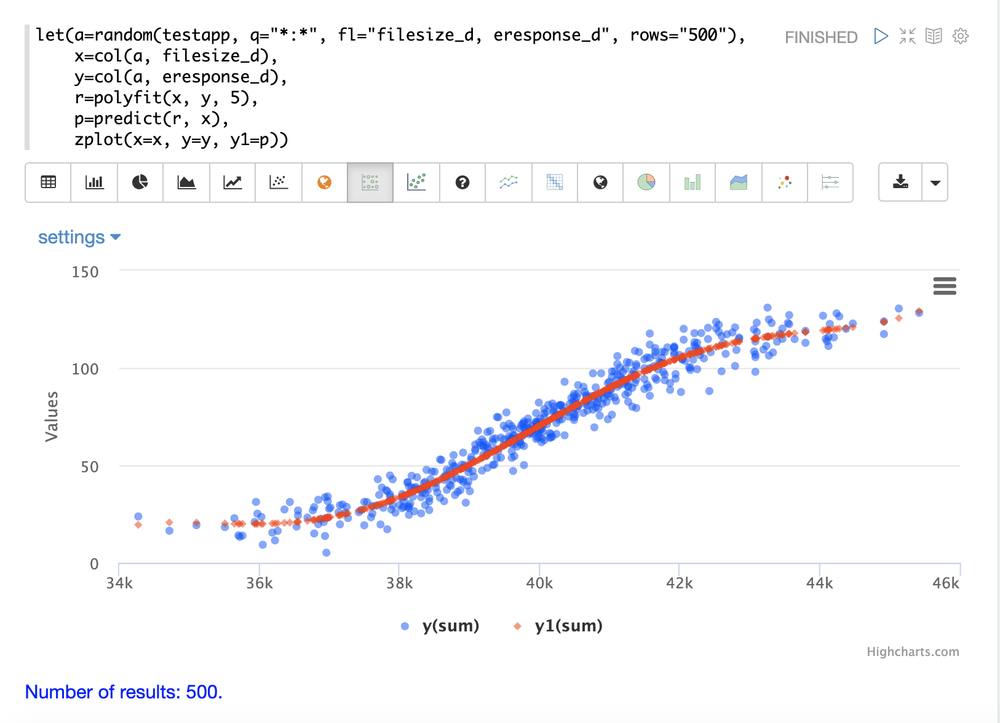
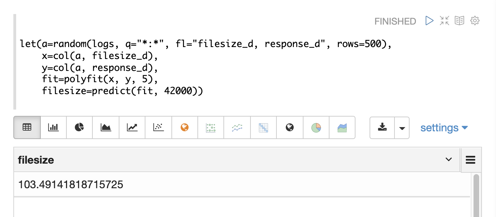
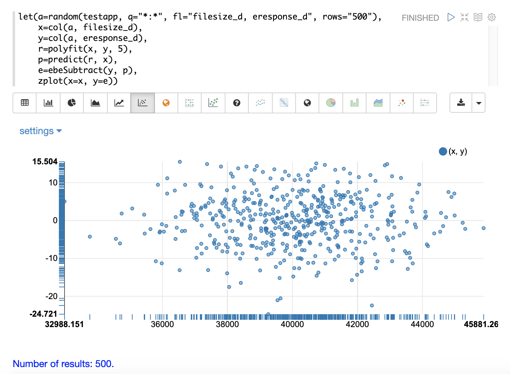
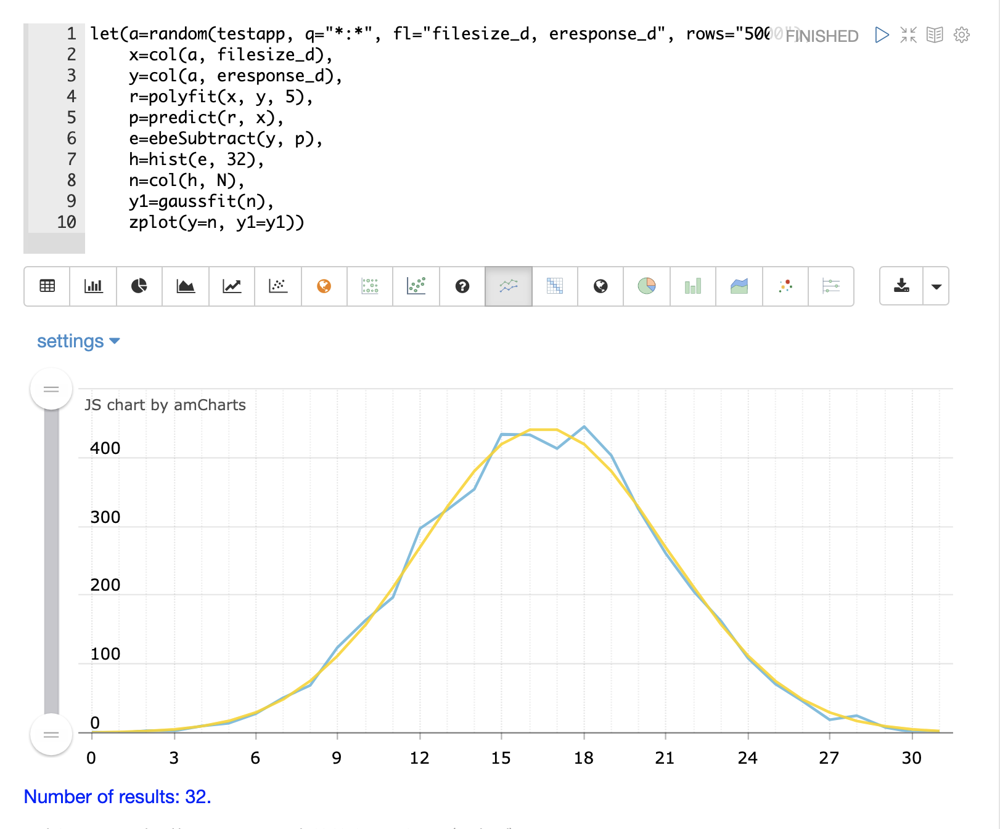
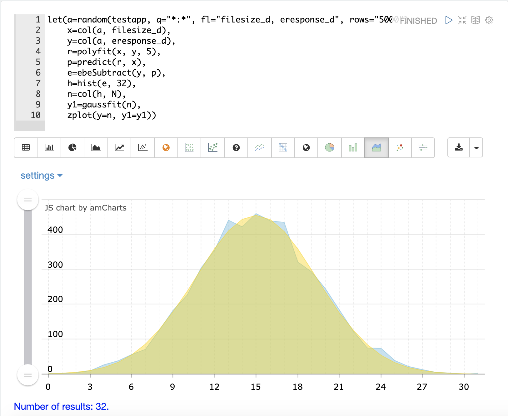
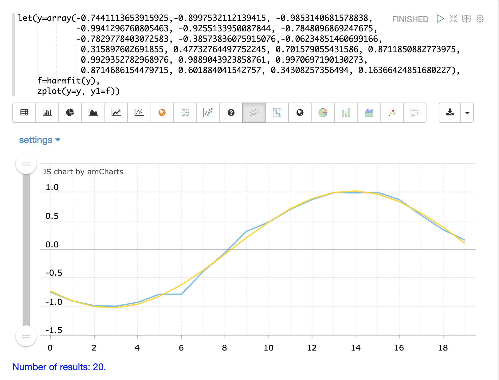
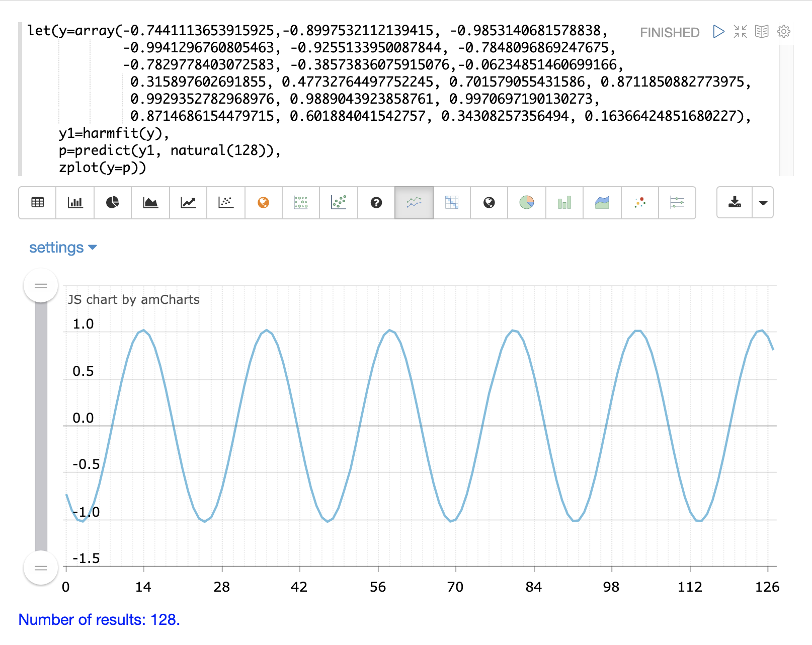

= Curve Fitting
// Licensed to the Apache Software Foundation (ASF) under one
// or more contributor license agreements.  See the NOTICE file
// distributed with this work for additional information
// regarding copyright ownership.  The ASF licenses this file
// to you under the Apache License, Version 2.0 (the
// "License"); you may not use this file except in compliance
// with the License.  You may obtain a copy of the License at
//
//   http://www.apache.org/licenses/LICENSE-2.0
//
// Unless required by applicable law or agreed to in writing,
// software distributed under the License is distributed on an
// "AS IS" BASIS, WITHOUT WARRANTIES OR CONDITIONS OF ANY
// KIND, either express or implied.  See the License for the
// specific language governing permissions and limitations
// under the License.

These functions support constructing a curve through bivariate non-linear data.

== Polynomial Curve Fitting

The `polyfit` function is a general purpose curve fitter used to model
the non-linear relationship between two random variables.

The `polyfit` function is passed x- and y-axes and fits a smooth curve to the data.
If only a single array is provided it is treated as the y-axis and a sequence is generated
for the x-axis. A third parameter can be added that specifies the degree of the polynomial. If the degree is
not provided a 3 degree polynomial is used by default. The higher
the degree the more curves that can be modeled.

The `polyfit` function can be visualized in a similar manner to linear regression with
Zeppelin-Solr.

The example below uses the `polyfit` function to fit a non-linear curve to a scatter
plot of a random sample. The blue points are the scatter plot of the original observations and the red points
are the predicted curve.

In the example above a random sample containing two fields, `filesize_d`
and `response_d`, is drawn from the `logs` collection.
The two fields are vectorized and set to the variables `x` and `y`.

Then the `polyfit` function is used to fit a non-linear model to the data using a 5 degree
polynomial. The `polyfit` function returns a model that is then directly plotted
by `zplot` along with the original observations.

The fitted model can also be used
by the `predict` function in the same manner as linear regression. The example below
uses the fitted model to predict a response time for a file size of 42000.

If an array of predictor values is provided an array of predictions will be returned.

The `polyfit` model performs both *interpolation* and *extrapolation*,
which means that it can predict results both within the bounds of the data set
and beyond the bounds.

=== Residuals

The residuals can be calculated and visualized in the same manner as linear
regression as well. In the example below the `ebeSubtract` function is used
to subtract the fitted model from the observed values, to
calculate a vector of residuals. The residuals are then plotted in a *residual plot*
with the predictions along the x-axis and the model error on the y-axis.

== Gaussian Curve Fitting

The `gaussfit` function fits a smooth curve through a Gaussian peak. The `gaussfit`
function takes an x- and y-axis and fits a smooth gaussian curve to the data. If
only one vector of numbers is passed, `gaussfit` will treat it as the y-axis
and will generate a sequence for the x-axis.

One of the interesting use cases for `gaussfit` is to visualize how well a regression
model's residuals fit a normal distribution.

One of the characteristics of a well-fit regression model is that its residuals will ideally fit a normal distribution.
We can
test this by building a histogram of the residuals and then fitting a gaussian curve to the curve of the histogram.

In the example below the residuals from a `polyfit` regression are modeled with the
`hist` function to return a histogram with 32 bins. The `hist` function returns
a list of tuples with statistics about each bin. In the example the `col` function is
used to return a vector with the `N` column for each bin, which is the count of
observations in the
bin. If the residuals are normally distributed we would expect the bin counts
to roughly follow a gaussian curve.

The bin count vector is then passed to `gaussfit` as the y-axis. `gaussfit` generates
a sequence for the x-axis and then fits the gaussian curve to data.

`zplot` is then used to plot the original bin counts and the fitted curve. In the
example below, the blue line is the bin counts, and the smooth yellow line is the
fitted curve. We can see that the binned residuals fit fairly well to a normal
distribution.

The second plot shows the two curves overlaid with an area chart:

== Harmonic Curve Fitting

The `harmonicFit` function (or `harmfit`, for short) fits a smooth line through control points of a sine wave.
The `harmfit` function is passed x- and y-axes and fits a smooth curve to the data.
If a single array is provided it is treated as the y-axis and a sequence is generated
for the x-axis.

The example below shows `harmfit` fitting a single oscillation of a sine wave. The `harmfit` function
returns the smoothed values at each control point. The return value is also a model which can be used by
the `predict`, `derivative` and `integrate` functions.

NOTE: The `harmfit` function works best when run on a single oscillation rather than a long sequence of
oscillations. This is particularly true if the sine wave has noise. After the curve has been fit it can be
extrapolated to any point in time in the past or future.

In the example below the original control points are shown in blue and the fitted curve is shown in yellow.

The output of `harmfit` is a model that can be used by the `predict` function to interpolate and extrapolate
the sine wave. In the example below the `natural` function creates an x-axis from 0 to 127
used to predict results for the model. This extrapolates the sine wave out to 128 points, when
the original model curve had only 19 control points.

