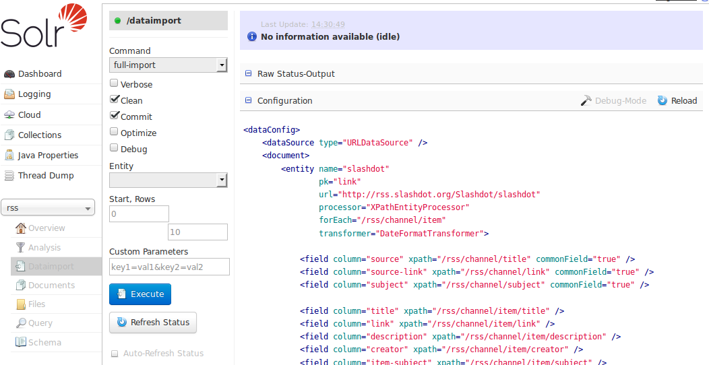

= Dataimport Screen
// Licensed to the Apache Software Foundation (ASF) under one
// or more contributor license agreements.  See the NOTICE file
// distributed with this work for additional information
// regarding copyright ownership.  The ASF licenses this file
// to you under the Apache License, Version 2.0 (the
// "License"); you may not use this file except in compliance
// with the License.  You may obtain a copy of the License at
//
//   http://www.apache.org/licenses/LICENSE-2.0
//
// Unless required by applicable law or agreed to in writing,
// software distributed under the License is distributed on an
// "AS IS" BASIS, WITHOUT WARRANTIES OR CONDITIONS OF ANY
// KIND, either express or implied.  See the License for the
// specific language governing permissions and limitations
// under the License.

WARNING: The Data Import Handler is deprecated as of v8.6 and will be removed in 9.0.

The Dataimport screen shows the configuration of the DataImportHandler (DIH) and allows you start, and monitor the status of, import commands as defined by the options selected on the screen and defined in the configuration file.

.The Dataimport Screen

This screen also lets you adjust various options to control how the data is imported to Solr, and view the data import configuration file that controls the import.

For more information about data importing with DIH, see the section on <<uploading-structured-data-store-data-with-the-data-import-handler.adoc#,Uploading Structured Data Store Data with the Data Import Handler>>.
