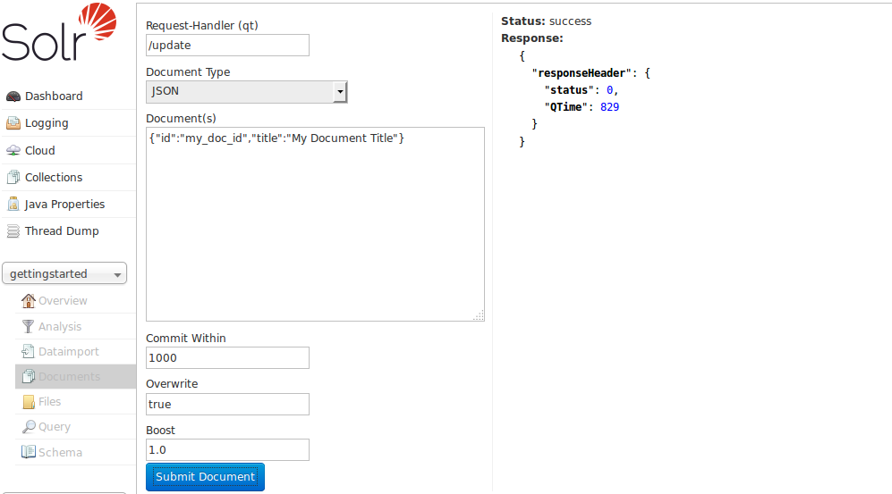

= Documents Screen
// Licensed to the Apache Software Foundation (ASF) under one
// or more contributor license agreements.  See the NOTICE file
// distributed with this work for additional information
// regarding copyright ownership.  The ASF licenses this file
// to you under the Apache License, Version 2.0 (the
// "License"); you may not use this file except in compliance
// with the License.  You may obtain a copy of the License at
//
//   http://www.apache.org/licenses/LICENSE-2.0
//
// Unless required by applicable law or agreed to in writing,
// software distributed under the License is distributed on an
// "AS IS" BASIS, WITHOUT WARRANTIES OR CONDITIONS OF ANY
// KIND, either express or implied.  See the License for the
// specific language governing permissions and limitations
// under the License.

The Documents screen provides a simple form allowing you to execute various Solr indexing commands in a variety of formats directly from the browser.

.The Documents Screen

The screen allows you to:

* Submit JSON, CSV or XML documents in Solr-specific format for indexing
* Upload documents (in JSON, CSV or XML) for indexing
* Construct documents by selecting fields and field values

[TIP]
====
There are other ways to load data, see also these sections:

* <<uploading-data-with-index-handlers.adoc#,Uploading Data with Index Handlers>>
* <<uploading-data-with-solr-cell-using-apache-tika.adoc#,Uploading Data with Solr Cell using Apache Tika>>
====

== Common Fields
* Request-Handler: The first step is to define the RequestHandler. By default `/update` will be defined. Change the request handler to `/update/extract` to use Solr Cell.
* Document Type: Select the Document Type to define the format of document to load. The remaining parameters may change depending on the document type selected.
* Document(s): Enter a properly-formatted Solr document corresponding to the `Document Type` selected. XML and JSON documents must be formatted in a Solr-specific format, a small illustrative document will be shown. CSV files should have headers corresponding to fields defined in the schema. More details can be found at: <<uploading-data-with-index-handlers.adoc#,Uploading Data with Index Handlers>>.
* Commit Within: Specify the number of milliseconds between the time the document is submitted and when it is available for searching.
* Overwrite: If `true` the new document will replace an existing document with the same value in the `id` field. If `false` multiple documents with the same id can be added.

[TIP]
====
Setting `Overwrite` to `false` is very rare in production situations, the default is `true`.
====

== CSV, JSON and XML Documents

When using these document types the functionality is similar to submitting documents via `curl` or similar. The document structure must be in a Solr-specific format appropriate for the document type. Examples are illustrated in the Document(s) text box when you select the various types.

These options will only add or overwrite documents; for other update tasks, see the <<Solr Command>> option.

== Document Builder

The Document Builder provides a wizard-like interface to enter fields of a document.

== File Upload

The File Upload option allows choosing a prepared file and uploading it. If using `/update` for the Request-Handler option, you will be limited to XML, CSV, and JSON.

Other document types (e.g., Word, PDF, etc.) can be indexed using the ExtractingRequestHandler (aka, Solr Cell). You must modify the RequestHandler to `/update/extract`, which must be defined in your `solrconfig.xml` file with your desired defaults. You should also add `&literal.id` shown in the "Extracting Request Handler Params" field so the file chosen is given a unique id.
More information can be found at:  <<uploading-data-with-solr-cell-using-apache-tika.adoc#,Uploading Data with Solr Cell using Apache Tika>>

== Solr Command

The Solr Command option allows you use the `/update` request handler with XML or JSON formatted commands to perform specific actions. A few examples are:

* Deleting documents
* Updating only certain fields of documents
* Issuing commit commands on the index
