= Digital Signal Processing
// Licensed to the Apache Software Foundation (ASF) under one
// or more contributor license agreements.  See the NOTICE file
// distributed with this work for additional information
// regarding copyright ownership.  The ASF licenses this file
// to you under the Apache License, Version 2.0 (the
// "License"); you may not use this file except in compliance
// with the License.  You may obtain a copy of the License at
//
//   http://www.apache.org/licenses/LICENSE-2.0
//
// Unless required by applicable law or agreed to in writing,
// software distributed under the License is distributed on an
// "AS IS" BASIS, WITHOUT WARRANTIES OR CONDITIONS OF ANY
// KIND, either express or implied.  See the License for the
// specific language governing permissions and limitations
// under the License.

This section of the user guide explores functions that are commonly used in the field of
Digital Signal Processing (DSP).

== Convolution

The `conv` function calculates the convolution of two vectors. The convolution is calculated by *reversing*
the second vector and sliding it across the first vector. The dot product of the two vectors
is calculated at each point as the second vector is slid across the first vector.
The dot products are collected in a third vector which is the convolution of the two vectors.

=== Moving Average Function

Before looking at an example of convolution it's useful to review the `movingAvg` function. The moving average
function computes a moving average by sliding a window across a vector and computing
the average of the window at each shift. If that sounds similar to convolution, that's because the `movingAvg`
function involves a sliding window approach similar to convolution.

Below is an example of a moving average with a window size of 5. Notice that the original vector has 13 elements
but the result of the moving average has only 9 elements. This is because the `movingAvg` function
only begins generating results when it has a full window. The `ltrim` function is used to trim the
first four elements from the original `y` array to line up with the moving average.

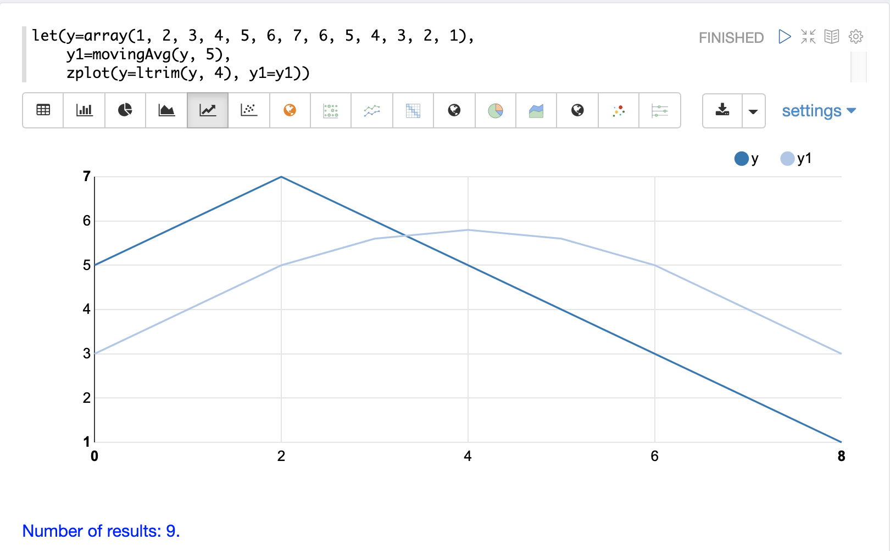

=== Convolutional Smoothing

The moving average can also be computed using convolution. In the example
below the `conv` function is used to compute the moving average of the first array
by applying the second array as a filter.

Looking at the result, we see that the convolution produced an array with 17 values instead of the 9 values created by the
moving average. That is because the `conv` function pads zeros
to the front and back of the first vector so that the window size is always full.

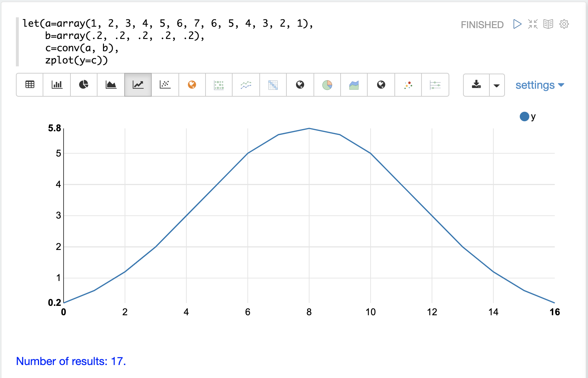

We achieve the same result as the `movingAvg` function by trimming the first and last 4 values of
the convolution result using the `ltrim` and `rtrim` functions.

The example below plots both the trimmed convolution and the moving average on the same plot. Notice that
they perfectly overlap.

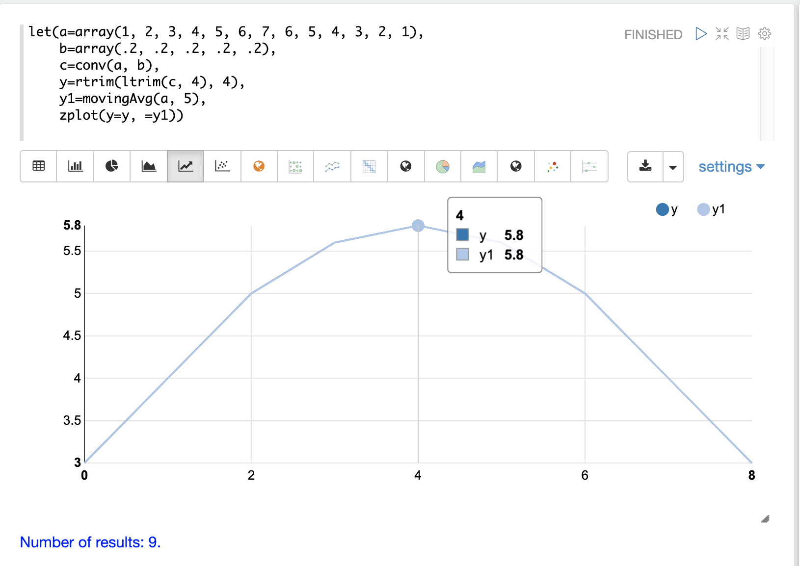

This demonstrates how convolution can be used to smooth a signal by sliding a filter across the signal and
computing the dot product at each point. The smoothing effect is caused by the design of the filter.
In the example, the filter length is 5 and each value in the filter is .2. This filter calculates a
simple moving average with a window size of 5.

The formula for computing a simple moving average using convolution is to make the filter length the window
size and make the values of the filter all the same and sum to 1. A moving average with a window size of 4
can be computed by changing the filter to a length of 4 with each value being .25.

==== Changing the Weights

The filter, which is sometimes called the *kernel*, can be viewed as a vector of weights. In the initial
example all values in the filter have the same weight (.2). The weights in the filter can be changed to
produce different smoothing effects. This is demonstrated in the example below.

In this example the filter increases in weight from .1 to .3. This places more weight towards the front
of the filter. Notice that the filter is reversed with the `rev` function before the `conv` function applies it.
This is done because convolution will reverse
the filter. In this case we reverse it ahead of time and when convolution reverses it back, it is the same
as the original filter.

The plot shows the effect of the different weights in the filter. The dark blue line is the initial array.
The light blue line is the convolution and the orange line is the moving average. Notice that the convolution
responds quicker to the movements in the underlying array. This is because more weight has been placed
at the front of the filter.

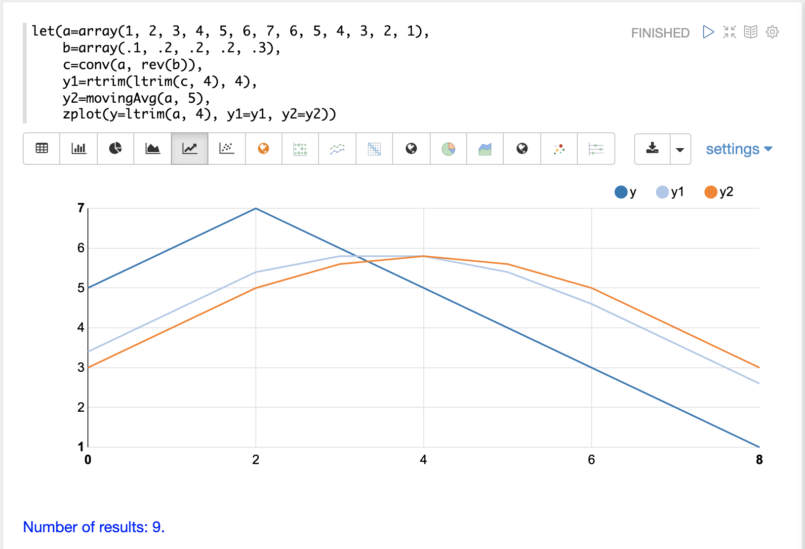

== Cross-Correlation

Cross-correlation is used to determine the delay between two signals. This is accomplished by sliding one signal across another
and calculating the dot product at each shift. The dot products are collected into a vector which represents the correlation
at each shift. The highest dot product in the cross-correlation vector is the point where the two signals are most closely correlated.

The sliding dot product used in convolution can also be used to represent cross-correlation between two vectors. The only
difference in the formula when representing correlation is that the second vector is *not reversed*.

Notice in the example below that the second vector is reversed by the `rev` function before it is operated on by the `conv` function.
The `conv` function reverses the second vector so it will be flipped back to its original order to perform the correlation calculation
rather than the convolution calculation.

Notice in the result the highest value is 217. This is the point where the two vectors have the highest correlation.

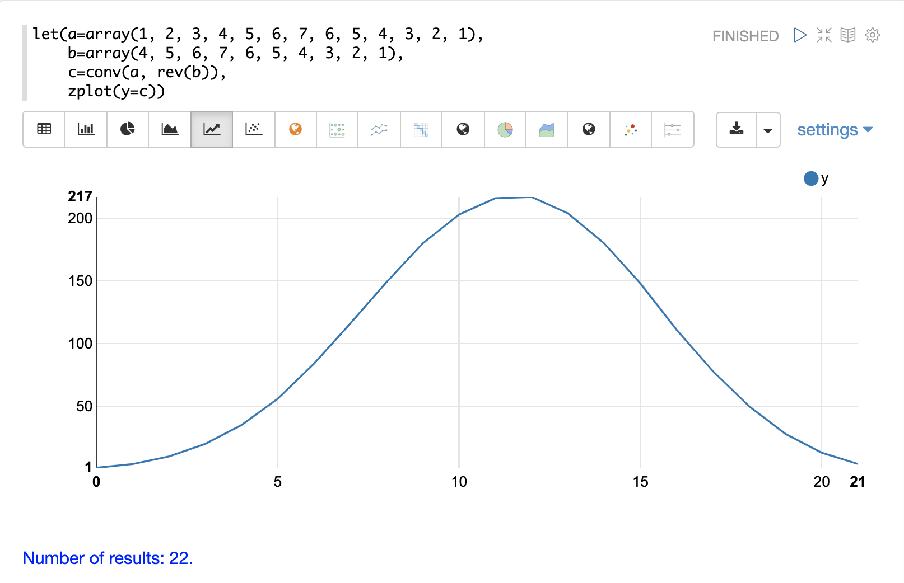

== Find Delay

It is fairly simple to compute the delay from the cross-correlation result, but a convenience function called `finddelay` can
be used to find the delay directly. Under the covers `finddelay` uses convolutional math to compute the cross-correlation vector
and then computes the delay between the two signals.

Below is an example of the `finddelay` function. Notice that the `finddelay` function reports a 3 period delay between the first
and second signal.

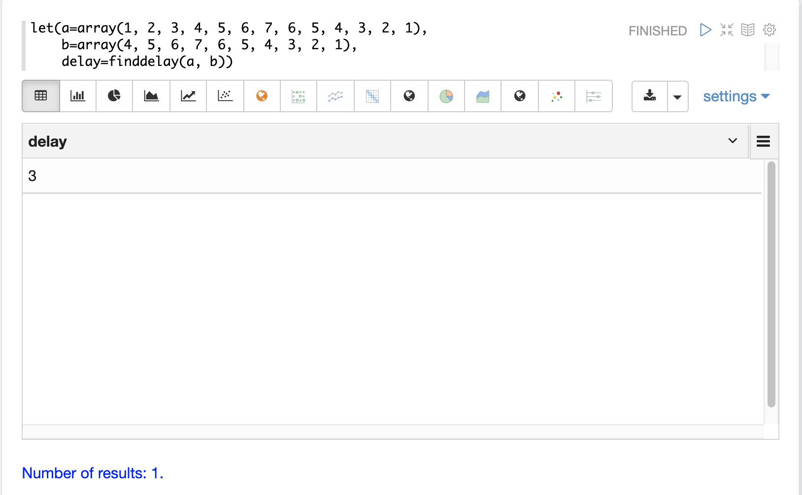

== Oscillate (Sine Wave)

The `oscillate` function generates a periodic oscillating signal which can be used to model and study sine waves.

The `oscillate` function takes three parameters: `amplitude`, `angular frequency`, and `phase` and returns a vector containing the y-axis points of a sine wave.

The y-axis points were generated from an x-axis sequence of 0-127.

Below is an example of the `oscillate` function called with an amplitude of
1, and angular frequency of .28 and phase of 1.57.

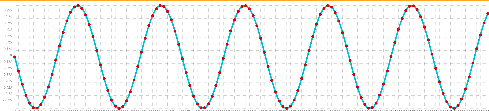

=== Sine Wave Interpolation & Extrapolation

The `oscillate` function returns a function which can be used by the `predict` function to interpolate or extrapolate a sine wave.

The example below extrapolates the sine wave to an x-axis sequence of 0-256.

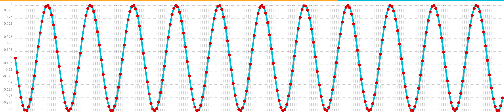

== Autocorrelation

Autocorrelation measures the degree to which a signal is correlated with itself. Autocorrelation is used to determine
if a vector contains a signal or is purely random.

A few examples, with plots, will help to understand the concepts.

The first example simply revisits the example above of an extrapolated sine wave. The result of this
is plotted in the image below. Notice that there is a structure to the plot that is clearly not random.

In the next example the `sample` function is used to draw 256 samples from a `uniformDistribution` to create a
vector of random data. The result of this is plotted in the image below. Notice that there is no clear structure to the
data and the data appears to be random.

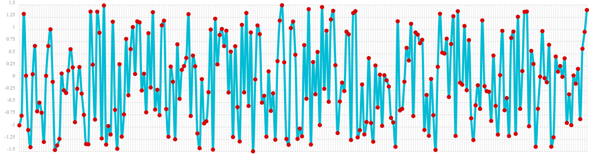

In the next example the random noise is added to the sine wave using the `ebeAdd` function.
The result of this is plotted in the image below. Notice that the sine wave has been hidden
somewhat within the noise. Its difficult to say for sure if there is structure. As plots
becomes more dense it can become harder to see a pattern hidden within noise.

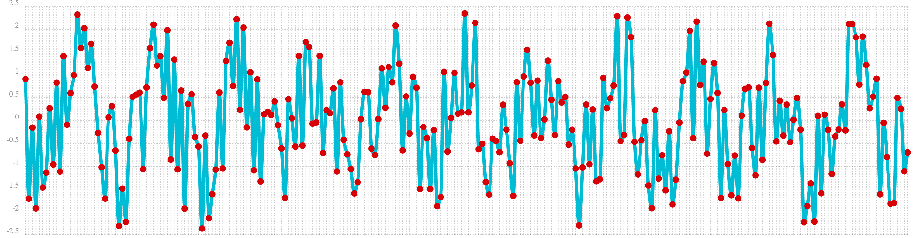

In the next examples autocorrelation is performed with each of the vectors shown above to see what the
autocorrelation plots look like.

In the example below the `conv` function is used to autocorrelate the first vector which is the sine wave.
Notice that the `conv` function is simply correlating the sine wave with itself.

The plot has a very distinct structure to it. As the sine wave is slid across a copy of itself the correlation
moves up and down in increasing intensity until it reaches a peak. This peak is directly in the center and is the
the point where the sine waves are directly lined up. Following the peak the correlation moves up and down in decreasing
intensity as the sine wave slides farther away from being directly lined up.

This is the autocorrelation plot of a pure signal.

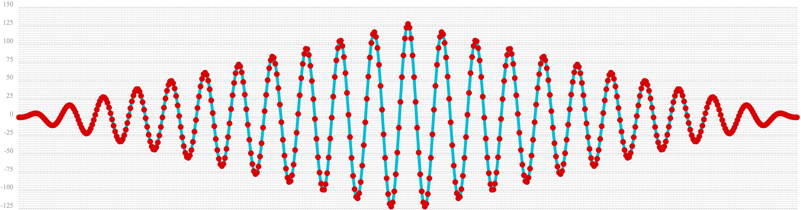

In the example below autocorrelation is performed with the vector of pure noise. Notice that the autocorrelation
plot has a very different plot then the sine wave. In this plot there is long period of low intensity correlation that appears
to be random. Then in the center a peak of high intensity correlation where the vectors are directly lined up.
This is followed by another long period of low intensity correlation.

This is the autocorrelation plot of pure noise.

image::images/math-expressions/noise-autocorrelation.png[]

In the example below autocorrelation is performed on the vector with the sine wave hidden within the noise.
Notice that this plot shows very clear signs of structure which is similar to autocorrelation plot of the
pure signal. The correlation is less intense due to noise but the shape of the correlation plot suggests
strongly that there is an underlying signal hidden within the noise.

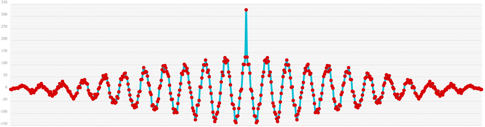

== Discrete Fourier Transform

The convolution-based functions described above are operating on signals in the time domain. In the time
domain the x-axis is time and the y-axis is the quantity of some value at a specific point in time.

The discrete Fourier Transform translates a time domain signal into the frequency domain.
In the frequency domain the x-axis is frequency, and y-axis is the accumulated power at a specific frequency.

The basic principle is that every time domain signal is composed of one or more signals (sine waves)
at different frequencies. The discrete Fourier transform decomposes a time domain signal into its component
frequencies and measures the power at each frequency.

The discrete Fourier transform has many important uses. In the example below, the discrete Fourier transform is used
to determine if a signal has structure or if it is purely random.

=== Complex Result

The `fft` function performs the discrete Fourier Transform on a vector of *real* data. The result
of the `fft` function is returned as *complex* numbers. A complex number has two parts, *real* and *imaginary*.
The *real* part of the result describes the magnitude of the signal at different frequencies.
The *imaginary* part of the result describes the *phase*. The examples below deal only with the *real*
part of the result.

The `fft` function returns a `matrix` with two rows. The first row in the matrix is the *real*
part of the complex result. The second row in the matrix is the *imaginary* part of the complex result.
The `rowAt` function can be used to access the rows so they can be processed as vectors.

=== Fast Fourier Transform Examples

In the first example the `fft` function is called on the sine wave used in the autocorrelation example.

The results of the `fft` function is a matrix. The `rowAt` function is used to return the first row of
the matrix which is a vector containing the real values of the `fft` response.

The plot of the real values of the `fft` response is shown below. Notice there are two
peaks on opposite sides of the plot. The plot is actually showing a mirrored response. The right side
of the plot is an exact mirror of the left side. This is expected when the `fft` is run on real rather than
complex data.

Also notice that the `fft` has accumulated significant power in a single peak. This is the power associated with
the specific frequency of the sine wave. The vast majority of frequencies in the plot have close to 0 power
associated with them. This `fft` shows a clear signal with very low levels of noise.

image::images/math-expressions/signal-fft.png[]

In the second example the `fft` function is called on a vector of random data similar to one used in the
autocorrelation example. The plot of the real values of the `fft` response is shown below.

Notice that in is this response there is no clear peak. Instead all frequencies have accumulated a random level of
power. This `fft` shows no clear sign of signal and appears to be noise.

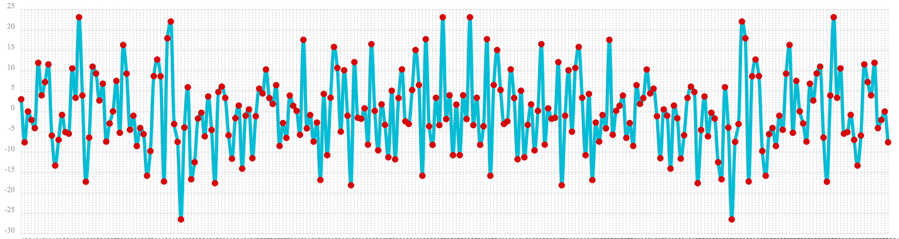

In the third example the `fft` function is called on the same signal hidden within noise that was used for
the autocorrelation example. The plot of the real values of the `fft` response is shown below.

Notice that there are two clear mirrored peaks, at the same locations as the `fft` of the pure signal. But
there is also now considerable noise on the frequencies. The `fft` has found the signal and but also
shows that there is considerable noise along with the signal.

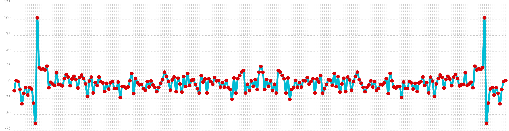
