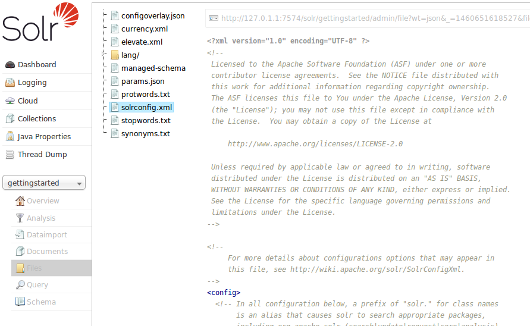

= Files Screen
:page-shortname: files-screen
:page-permalink: files-screen.html

The Files screen lets you browse & view the various configuration files (such `solrconfig.xml` and the schema file) for the collection you selected.

.The Files Screen

If you are using <<solrcloud.adoc#solrcloud,SolrCloud>>, the files displayed are the configuration files for this collection stored in ZooKeeper. In a standalone Solr installations, all files in the `conf` directory are displayed.

While `solrconfig.xml` defines the behavior of Solr as it indexes content and responds to queries, the Schema allows you to define the types of data in your content (field types), the fields your documents will be broken into, and any dynamic fields that should be generated based on patterns of field names in the incoming documents. Any other configuration files are used depending on how they are referenced in either `solrconfig.xml` or your schema.

Configuration files cannot be edited with this screen, so a text editor of some kind must be used.

This screen is related to the <<schema-browser-screen.adoc#schema-browser-screen,Schema Browser Screen>>, in that they both can display information from the schema, but the Schema Browser provides a way to drill into the analysis chain and displays linkages between field types, fields, and dynamic field rules.

Many of the options defined in these configuration files are described throughout the rest of this Guide. In particular, you will want to review these sections:

* <<indexing-and-basic-data-operations.adoc#indexing-and-basic-data-operations,Indexing and Basic Data Operations>>
* <<searching.adoc#searching,Searching>>
* <<the-well-configured-solr-instance.adoc#the-well-configured-solr-instance,The Well-Configured Solr Instance>>
* <<documents-fields-and-schema-design.adoc#documents-fields-and-schema-design,Documents, Fields, and Schema Design>>
