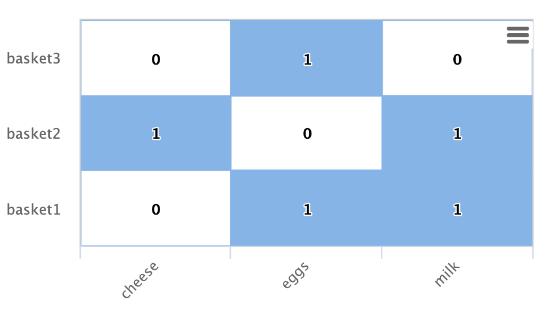
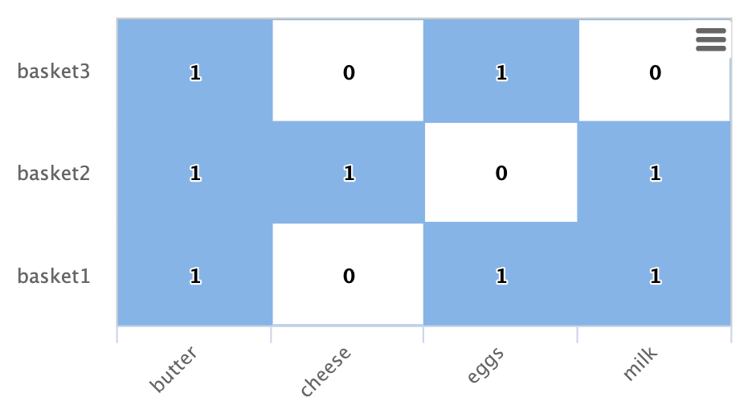

= Graph
// Licensed to the Apache Software Foundation (ASF) under one
// or more contributor license agreements.  See the NOTICE file
// distributed with this work for additional information
// regarding copyright ownership.  The ASF licenses this file
// to you under the Apache License, Version 2.0 (the
// "License"); you may not use this file except in compliance
// with the License.  You may obtain a copy of the License at
//
//   http://www.apache.org/licenses/LICENSE-2.0
//
// Unless required by applicable law or agreed to in writing,
// software distributed under the License is distributed on an
// "AS IS" BASIS, WITHOUT WARRANTIES OR CONDITIONS OF ANY
// KIND, either express or implied.  See the License for the
// specific language governing permissions and limitations
// under the License.

This section of the user guide covers the syntax and theory behind *graph expressions*. Examples are presented for two key graph use cases: *bipartite graph recommenders* and *event correlation* with
*temporal graph queries*.

== Graphs

Log records and other data indexed in Solr have connections between them that can be seen as a distributed graph.
Graph expressions provide a mechanism for identifying root nodes in the graph and walking their connections.
The general goal of the graph walk is to materialize a specific *subgraph* and perform *link analysis* to understand
the connections between nodes.

In the next few sections below we'll review the graph theory behind Solr's graph expressions.

=== Subgraphs

A subgraph is a smaller subset of the nodes and connections of the
larger graph. Graph expressions allow you to flexibly define and materialize a subgraph from the larger graph
stored in the distributed index.

Subgraphs play two important roles:

* They provide a local context for link analysis. The design of the subgraph defines the meaning of the link analysis.

* They provide a foreground graph that can be compared to the background index for anomaly detection purposes.

=== Bipartite Subgraphs

Graph expressions can be used to materialize *bipartite subgraphs*.
A bipartite graph is a graph where the nodes are split into two
distinct categories. The links between those two categories can then
be analyzed to study how they relate. Bipartite graphs are often discussed
in the context of collaborative filter recommender systems.

A bipartite graph between *shopping baskets* and *products* is a useful example.
Through link analysis between the shopping baskets and products
we can determine which products are most often purchased within the same shopping baskets.

In the example below there is a Solr collection called baskets
with three fields:

*id*: Unique ID

*basket_s*: Shopping basket ID

*product_s*: Product

Each record in the collection represents a product in a shopping basket.
All products in the same basket share the same basket ID.

Let's consider a simple example where we want to find a product
that is often sold with *butter*. In order to do this we could create a
*bipartite subgraph* of shopping baskets that contain *butter*.
We won't include butter itself in the graph as it doesn't help with
finding a complementary product for butter.

Below is an example of this bipartite subgraph represented as a matrix:

In this example there are three shopping baskets shown by the rows: basket1, basket2, basket3.

There are also three products shown by the columns: cheese, eggs, milk.

Each cell has a 1 or 0 signifying if the product is in the basket.

Let's look at how Solr graph expressions materializes this bipartite subgraph:

The `nodes` function is used to materialize a subgraph from the larger graph. Below is an example nodes function which materializes the bipartite graph shown in the matrix above.

[source,text]
----
nodes(baskets,
      random(baskets, q="product_s:butter", fl="basket_s", rows="3"),
      walk="basket_s->basket_s",
      fq="-product_s:butter",
      gather="product_s",
      trackTraversal="true")
----

Let's break down this example starting with the `random` function:

[source,text]
----
random(baskets, q="product_s:butter", fl="basket_s", rows="3")
----

The `random` function is searching the baskets collection with the query `product_s:butter`, and
returning 3 random samples. Each sample contains the `basket_s` field which is the basket id.
The three basket id's that are returned by the random sample are the *root nodes* of the graph query.

The `nodes` function is the graph query. The nodes function is operating over the three root nodes returned
by the random function.
It "walks" the graph by searching the `basket_s` field of the root nodes against the `basket_s` field in the index.
This finds all the product records for the root baskets.
It will then "gather" the `product_s` field from the records it finds in the walk.
A filter is applied so that records with butter in the product_s field will not be returned.

The `trackTraversal` flag tells the nodes expression to track the links between the root baskets and products.

=== Node Sets

The output of the nodes function is a *node set* that represents the subgraph specified by the nodes function.
The node set contains a unique set of nodes that are gathered during the graph walk.
The `node` property in the result is the value of the gathered node.
In the shopping basket example the `product_s` field is in the node property
because that was what was specified to be gathered in the nodes expression.

The output of the shopping basket graph expression is as follows:
[source,json]
----
{
  "result-set": {
    "docs": [
      {
        "node": "eggs",
        "collection": "baskets",
        "field": "product_s",
        "ancestors": [
          "basket1",
          "basket3"
        ],
        "level": 1
      },
      {
        "node": "cheese",
        "collection": "baskets",
        "field": "product_s",
        "ancestors": [
          "basket2"
        ],
        "level": 1
      },
      {
        "node": "milk",
        "collection": "baskets",
        "field": "product_s",
        "ancestors": [
          "basket1",
          "basket2"
        ],
        "level": 1
      },
      {
        "EOF": true,
        "RESPONSE_TIME": 12
      }
    ]
  }
}
----

The `ancestors` property in the result contains a unique, alphabetically sorted set of all the *inbound links*
to the node in the subgraph. In this case it shows the baskets that are linked to each product.
The ancestor links will only be tracked when the trackTraversal flag is turned on in the nodes expression.

=== Link Analysis and Degree Centrality

Link analysis is often performed to determine *node centrality*. When analyzing for centrality the
goal is to assign a weight to each node based on how connected it is in the subgraph.
There are different types of node centrality. Graph expressions very efficiently calculates
*inbound degree centrality* (in-degree).

Inbound degree centrality is calculated by counting the number of inbound
links to each node. For simplicity this document will sometimes refer
to inbound degree simply as degree.

Back to the shopping basket example:

We can calculate the degree of the products in the graph by summing the columns:
[source,text]
----
cheese: 1
eggs:   2
milk:   2
----

From the degree calculation we know that *eggs* and *milk* appear more frequently in shopping baskets with
butter than *cheese* does.

The nodes function can calculate degree centrality by adding the `count(*)` aggregation as shown below:

[source,text]
----
nodes(baskets,
      random(baskets, q="product_s:butter", fl="basket_s", rows="3"),
      walk="basket_s->basket_s",
      fq="-product_s:butter",
      gather="product_s",
      trackTraversal="true",
      count(*))
----

The output of this graph expression is as follows:

[source,json]
----
{
  "result-set": {
    "docs": [
      {
        "node": "eggs",
        "count(*)": 2,
        "collection": "baskets",
        "field": "product_s",
        "ancestors": [
          "basket1",
          "basket3"
        ],
        "level": 1
      },
      {
        "node": "cheese",
        "count(*)": 1,
        "collection": "baskets",
        "field": "product_s",
        "ancestors": [
          "basket2"
        ],
        "level": 1
      },
      {
        "node": "milk",
        "count(*)": 2,
        "collection": "baskets",
        "field": "product_s",
        "ancestors": [
          "basket1",
          "basket2"
        ],
        "level": 1
      },
      {
        "EOF": true,
        "RESPONSE_TIME": 17
      }
    ]
  }
}
----

The `count(+++*+++)` aggregation counts the "gathered" nodes, in this case the values in the `product_s` field.
Notice that the `count(+++*+++)` result is the same as the number of ancestors.
This will always be the case because the nodes function first deduplicates the edges before
counting the gathered nodes. Because of this the `count(+++*+++)` aggregation always calculates the
inbound degree centrality for the gathered nodes.

=== Dot Product

There is a direct relationship between the *inbound degree* with bipartite graph recommenders and the *dot product*.
This relationship can be clearly seen in our working example once we include a column for butter:

If we compute the dot product between the butter column and the other product columns you will find that the dot product equals the inbound degree in each case.
This tells us that a nearest neighbor search, using a maximum inner product similarity, would select the column with the highest inbound degree.

=== Limiting Basket Out-Degree

The recommendation can be made stronger by limiting the *out-degree* of the baskets. The out-degree is the
number of outbound links of a node in a graph. In the shopping basket example the outbound links
from the baskets link to products. So limiting the out-degree will limit the size of the baskets.

Why does limiting the size of the shopping baskets make a stronger recommendation? To answer this question it helps
to think about each shopping basket as *voting* for products that go with *butter*. In an election with two candidates
if you were to vote for both candidates the votes would cancel each other out and have no effect.
But if you vote for only one candidate your vote will affect the outcome. The same principle holds true
for recommendations. As a basket votes for more products it dilutes the strength of its recommendation for any
one product. A basket with just butter and one other item more strongly recommends that item.

The `maxDocFreq` parameter can be used to limit the graph "walk" to only include baskets that appear in
the index a certain number of times. Since each occurrence of a basket ID in the index is a link to a product,
limiting the document frequency of the basket ID will limit the out-degree of the basket. The `maxDocFreq` parameter is
applied per shard. If there is a single shard or documents are co-located by basket ID then the `maxDocFreq` will
be an exact count. Otherwise, it will return baskets with a max size of numShards * maxDocFreq.

The example below shows the `maxDocFreq` parameter applied to the `nodes` expression.

[source,text]
----
nodes(baskets,
      random(baskets, q="product_s:butter", fl="basket_s", rows="3"),
      walk="basket_s->basket_s",
      maxDocFreq="5",
      fq="-product_s:butter",
      gather="product_s",
      trackTraversal="true",
      count(*))
----

=== Node Scoring

The degree of the node describes how many nodes in the subgraph link to it.
But this does not tell us if the node is particularly central to this subgraph or if it is just a
very frequent node in the entire graph. Nodes that appear frequently in the subgraph but
infrequently in the entire graph can be considered more *relevant* to the subgraph.

The search index contains information about how frequently each node appears in the entire index.
Using a technique similar to *tf-idf* document scoring, graph expressions can combine the
degree of the node with its inverse document frequency in the index to determine a relevancy score.

The `scoreNodes` function scores the nodes. Below is an example of the scoreNodes function applied to
the shopping basket node set.

[source,text]
----
scoreNodes(nodes(baskets,
                 random(baskets, q="product_s:butter", fl="basket_s", rows="3"),
                 walk="basket_s->basket_s",
                 fq="-product_s:butter",
                 gather="product_s",
                 trackTraversal="true",
                 count(*)))
----

The output now includes a `nodeScore` property. In the output below notice how *eggs* has a higher
nodeScore than *milk* even though they have the same `count(+++*+++)`. This is because milk appears more
frequently in the entire index than eggs does. The `docFreq` property added by the `nodeScore` function
shows the document frequency in the index. Because of the lower `docFreq` eggs is considered more relevant
to this subgraph, and a better recommendation to be paired with butter.

[source,json]
----
{
  "result-set": {
    "docs": [
      {
        "node": "eggs",
        "nodeScore": 3.8930247,
        "field": "product_s",
        "numDocs": 10,
        "level": 1,
        "count(*)": 2,
        "collection": "baskets",
        "ancestors": [
          "basket1",
          "basket3"
        ],
        "docFreq": 2
      },
      {
        "node": "milk",
        "nodeScore": 3.0281217,
        "field": "product_s",
        "numDocs": 10,
        "level": 1,
        "count(*)": 2,
        "collection": "baskets",
        "ancestors": [
          "basket1",
          "basket2"
        ],
        "docFreq": 4
      },
      {
        "node": "cheese",
        "nodeScore": 2.7047482,
        "field": "product_s",
        "numDocs": 10,
        "level": 1,
        "count(*)": 1,
        "collection": "baskets",
        "ancestors": [
          "basket2"
        ],
        "docFreq": 1
      },
      {
        "EOF": true,
        "RESPONSE_TIME": 26
      }
    ]
  }
}
----

== Temporal Graph Expressions

The examples above lay the groundwork for temporal graph queries.
Temporal graph queries allow the `nodes` function to walk the graph using *windows of time* to surface
*cross-correlations* within the data. The nodes function currently supports graph walks using *ten second increments*
which is useful for *event correlation* and *root cause analysis* in log analytics.

In order to support temporal graph queries a ten second truncated timestamp in *ISO 8601* format must
be added to the log records as a string field at indexing time. Here is a sample ten second
truncated timestamp: `2021-02-10T20:51:30Z`. This small data change enables some very important
use cases so it's well worth the effort.

Solr's indexing tool for Solr logs, described <<logs.adoc#,here>>, already adds the ten second truncated timestamps.
So those using Solr to analyze Solr logs get temporal graph expressions for free.

=== Root Events

Once the ten second windows have been indexed with the log records we can devise a query that
creates a set of *root events*. We can demonstrate this with an example using Solr log records.

In this example we'll perform a Streaming Expression `facet` aggregation that finds the top 10, ten second windows
with the highest average query time. These time windows can be used to represent *slow query events* in a temporal
graph query.

Here is the facet function:

[source,text]
----
facet(solr_logs, q="+type_s:query +distrib_s:false",  buckets="time_ten_second_s", avg(qtime_i))
----

Below is a snippet of the results with the 25 windows with the highest average query times:

[source,text]
----
{
  "result-set": {
    "docs": [
      {
        "avg(qtime_i)": 105961.38461538461,
        "time_ten_second_s": "2020-08-25T21:05:00Z"
      },
      {
        "avg(qtime_i)": 93150.16666666667,
        "time_ten_second_s": "2020-08-25T21:04:50Z"
      },
      {
        "avg(qtime_i)": 87742,
        "time_ten_second_s": "2020-08-25T21:04:40Z"
      },
      {
        "avg(qtime_i)": 72081.71929824562,
        "time_ten_second_s": "2020-08-25T21:05:20Z"
      },
      {
        "avg(qtime_i)": 62741.666666666664,
        "time_ten_second_s": "2020-08-25T12:30:20Z"
      },
      {
        "avg(qtime_i)": 56526,
        "time_ten_second_s": "2020-08-25T12:41:20Z"
      },
      ...

      {
        "avg(qtime_i)": 12893,
        "time_ten_second_s": "2020-08-25T17:28:10Z"
      },
      {
        "EOF": true,
        "RESPONSE_TIME": 34
      }
    ]
  }
}
----
=== Temporal Bipartite Subgraphs

Once we've identified a set of root events it's easy to perform a graph query that creates a
bipartite graph of the log events types that occurred within the same ten second windows.
With Solr logs there is a field called `type_s` which is the type of log event.

In order to see what log events happened in the same ten second window of our root events we can "walk" the
ten second windows and gather the `type_s` field.

[source,text]
----
nodes(solr_logs,
      facet(solr_logs,
            q="+type_s:query +distrib_s:false",
            buckets="time_ten_second_s",
            avg(qtime_i)),
      walk="time_ten_second_s->time_ten_second_s",
      gather="type_s",
      count(*))
----

Below is the resulting node set:

[source,json]
----
{

  "result-set": {
    "docs": [
      {
        "node": "query",
        "count(*)": 10,
        "collection": "solr_logs",
        "field": "type_s",
        "level": 1
      },
      {
        "node": "admin",
        "count(*)": 2,
        "collection": "solr_logs",
        "field": "type_s",
        "level": 1
      },
      {
        "node": "other",
        "count(*)": 3,
        "collection": "solr_logs",
        "field": "type_s",
        "level": 1
      },
      {
        "node": "update",
        "count(*)": 2,
        "collection": "solr_logs",
        "field": "type_s",
        "level": 1
      },
      {
        "node": "error",
        "count(*)": 1,
        "collection": "solr_logs",
        "field": "type_s",
        "level": 1
      },
      {
        "EOF": true,
        "RESPONSE_TIME": 50
      }
    ]
  }
}
----

In this result set the `node` field holds the type of log events that occurred within the
same ten second windows as the root events. Notice that the event types include:
query, admin, update and error. The `count(+++*+++)` shows the degree centrality of the different
log event types.

Notice that there is only one *error* event within the same ten second windows of the slow query events.

=== Window Parameter

For event correlation and root cause analysis it's not enough to find events that occur
within the *same* ten second root event windows. What's needed is to find events that occur
within a window of time *prior to each root event*. The `window` parameter allows you to
specify this prior window of time as part of the query. The window parameter is an integer
which specifies the number of ten second time windows, prior to each root event window,
to include in the graph walk.

[source,text]
----
nodes(solr_logs,
      facet(solr_logs,
            q="+type_s:query +distrib_s:false",
            buckets="time_ten_second_s",
            avg(qtime_i)),
            walk="time_ten_second_s->time_ten_second_s",
      gather="type_s",
      window="3",
      count(*))
----

Below is the node set returned when the window parameter is added.
Notice that there are *now 29 error* events within the 3 ten second windows prior to the slow query events.

[source,json]
----
{
  "result-set": {
    "docs": [
      {
        "node": "query",
        "count(*)": 62,
        "collection": "solr_logs",
        "field": "type_s",
        "level": 1
      },
      {
        "node": "admin",
        "count(*)": 41,
        "collection": "solr_logs",
        "field": "type_s",
        "level": 1
      },
      {
        "node": "other",
        "count(*)": 48,
        "collection": "solr_logs",
        "field": "type_s",
        "level": 1
      },
      {
        "node": "update",
        "count(*)": 11,
        "collection": "solr_logs",
        "field": "type_s",
        "level": 1
      },
      {
        "node": "error",
        "count(*)": 29,
        "collection": "solr_logs",
        "field": "type_s",
        "level": 1
      },
      {
        "EOF": true,
        "RESPONSE_TIME": 117
      }
    ]
  }
}
----

=== Degree as a Representation of Correlation

By performing link analysis on the temporal bipartite graph we can calculate the
degree of each event type that occurs in the specified time windows.
We established in the bipartite graph recommender example the direct relationship between
*inbound degree* and the *dot product*. In the field of digital signal processing the
dot product is used to represent *correlation*.
In our temporal graph queries we can then view the inbound degree as a
representation of correlation between the root events and the events that
occur within the specified time windows.

=== Lag Parameter

Understanding the *lag* in the correlation is important for certain use cases.
In a lagged correlation an event occurs and following a *delay* another event occurs.
The window parameter doesn't capture the delay as we only know that an event
occurred somewhere within a prior window.

The `lag` parameter can be used to start calculating the window parameter a
number of ten second windows in the past. For example we could walk the graph in 20 second
windows starting from 30 seconds prior to a set of root events.
By adjusting the lag and re-running the query we can determine which lagged
window has the highest degree. From this we can determine the delay.

=== Node Scoring and Temporal Anomaly Detection

The concept of node scoring can be applied to temporal graph queries to find events that are
both *correlated* with a set of root events and *anomalous* to the root events.
The degree calculation establishes the correlation between events
but it does not establish if the event is a very common occurrence in
the entire graph or specific to the subgraph.

The `scoreNodes` functions can be applied to score the nodes based on the degree and the
commonality of the node's term in the index. This will establish whether the event is anomalous to
the root events.

[source,text]
----
scoreNodes(nodes(solr_logs,
                 facet(solr_logs,
                       q="+type_s:query +distrib_s:false",
                       buckets="time_ten_second_s",
                       avg(qtime_i)),
                 walk="time_ten_second_s->time_ten_second_s",
                 gather="type_s",
                 window="3",
                 count(*)))
----

Below is the node set once the `scoreNodes` function is applied.
Now we see that the *highest scoring node* is the *error* event.
This score give us a good indication of where to begin our *root cause analysis*.

[source,json]
----
{
  "result-set": {
    "docs": [
      {
        "node": "other",
        "nodeScore": 23.441727,
        "field": "type_s",
        "numDocs": 4513625,
        "level": 1,
        "count(*)": 48,
        "collection": "solr_logs",
        "docFreq": 99737
      },
      {
        "node": "query",
        "nodeScore": 16.957537,
        "field": "type_s",
        "numDocs": 4513625,
        "level": 1,
        "count(*)": 62,
        "collection": "solr_logs",
        "docFreq": 449189
      },
      {
        "node": "admin",
        "nodeScore": 22.829023,
        "field": "type_s",
        "numDocs": 4513625,
        "level": 1,
        "count(*)": 41,
        "collection": "solr_logs",
        "docFreq": 96698
      },
      {
        "node": "update",
        "nodeScore": 3.9480786,
        "field": "type_s",
        "numDocs": 4513625,
        "level": 1,
        "count(*)": 11,
        "collection": "solr_logs",
        "docFreq": 3838884
      },
      {
        "node": "error",
        "nodeScore": 26.62394,
        "field": "type_s",
        "numDocs": 4513625,
        "level": 1,
        "count(*)": 29,
        "collection": "solr_logs",
        "docFreq": 27622
      },
      {
        "EOF": true,
        "RESPONSE_TIME": 124
      }
    ]
  }
}
----
