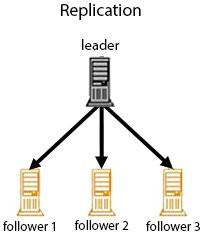

= Index Replication
// Licensed to the Apache Software Foundation (ASF) under one
// or more contributor license agreements.  See the NOTICE file
// distributed with this work for additional information
// regarding copyright ownership.  The ASF licenses this file
// to you under the Apache License, Version 2.0 (the
// "License"); you may not use this file except in compliance
// with the License.  You may obtain a copy of the License at
//
//   http://www.apache.org/licenses/LICENSE-2.0
//
// Unless required by applicable law or agreed to in writing,
// software distributed under the License is distributed on an
// "AS IS" BASIS, WITHOUT WARRANTIES OR CONDITIONS OF ANY
// KIND, either express or implied.  See the License for the
// specific language governing permissions and limitations
// under the License.

Index Replication distributes complete copies of a leader index to one or more follower servers. The leader server continues to manage updates to the index. All querying is handled by the followers. This division of labor enables Solr to scale to provide adequate responsiveness to queries against large search volumes.

The figure below shows a Solr configuration using index replication. The leader server's index is replicated on the followers.

.A Solr index can be replicated across multiple follower servers, which then process requests.

== Index Replication in Solr

Solr includes a Java implementation of index replication that works over HTTP:

* The configuration affecting replication is controlled by a single file, `solrconfig.xml`
* Supports the replication of configuration files as well as index files
* Works across platforms with same configuration
* No reliance on OS-dependent file system features (e.g., hard links)
* Tightly integrated with Solr; an admin page offers fine-grained control of each aspect of replication
* The Java-based replication feature is implemented as a request handler. Configuring replication is therefore similar to any normal request handler.

.Replication In SolrCloud
[NOTE]
====
Although there is no explicit concept of "leader/follower" nodes in a <<solrcloud.adoc#,SolrCloud>> cluster, the `ReplicationHandler` discussed on this page is still used by SolrCloud as needed to support "shard recovery" – but this is done in a peer to peer manner.

When using SolrCloud, the `ReplicationHandler` must be available via the `/replication` path. Solr does this implicitly unless overridden explicitly in your `solrconfig.xml`, but if you wish to override the default behavior, make certain that you do not explicitly set any of the "leader" or "follower" configuration options mentioned below, or they will interfere with normal SolrCloud operation.
====

== Replication Terminology

The table below defines the key terms associated with Solr replication.

Index::
A Lucene index is a directory of files. These files make up the searchable and returnable data of a Solr Core.

Distribution::
The copying of an index from the leader server to all followers. The distribution process takes advantage of Lucene's index file structure.

Inserts and Deletes::
As inserts and deletes occur in the index, the directory remains unchanged. Documents are always inserted into newly created segment files. Documents that are deleted are not removed from the segment files. They are flagged in the file, deletable, and are not removed from the segments until the segment is merged as part of normal index updates.

Leader and Follower::
A Solr replication leader is a single node which receives all updates initially and keeps everything organized. Solr replication follower nodes receive no updates directly, instead all changes (such as inserts, updates, deletes, etc.) are made against the single leader node. Changes made on the leader are distributed to all the follower nodes which service all query requests from the clients.

Update::
An update is a single change request against a single Solr instance. It may be a request to delete a document, add a new document, change a document, delete all documents matching a query, etc. Updates are handled synchronously within an individual Solr instance.

Optimization::
A process that compacts the index and merges segments in order to improve query performance. Optimization should only be run on the leader nodes. An optimized index may give query performance gains compared to an index that has become fragmented over a period of time with many updates. Distributing an optimized index requires a much longer time than the distribution of new segments to an un-optimized index.

WARNING: optimizing is not recommended unless it can be performed regularly as it may lead to a significantly larger portion of the index consisting of deleted documents than would normally be the case.

Segments::
A self contained subset of an index consisting of some documents and data structures related to the inverted index of terms in those documents.

mergeFactor::
A parameter that controls the number of segments in an index. For example, when mergeFactor is set to 3, Solr will fill one segment with documents until the limit maxBufferedDocs is met, then it will start a new segment. When the number of segments specified by mergeFactor is reached (in this example, 3) then Solr will merge all the segments into a single index file, then begin writing new documents to a new segment.

Snapshot::
A directory containing hard links to the data files of an index. Snapshots are distributed from the leader nodes when the followers pull them, "smart copying" any segments the follower node does not have in snapshot directory that contains the hard links to the most recent index data files.

== Configuring the ReplicationHandler

In addition to `ReplicationHandler` configuration options specific to the leader/follower roles, there are a few special configuration options that are generally supported (even when using SolrCloud).

* `maxNumberOfBackups` an integer value dictating the maximum number of backups this node will keep on disk as it receives `backup` commands.
* Similar to most other request handlers in Solr you may configure a set of <<requesthandlers-and-searchcomponents-in-solrconfig.adoc#searchhandlers,defaults, invariants, and/or appends>> parameters corresponding with any request parameters supported by the `ReplicationHandler` when <<HTTP API Commands for the ReplicationHandler,processing commands>>.

=== Configuring the Replication RequestHandler on a Leader Server

Before running a replication, you should set the following parameters on initialization of the handler:

`replicateAfter`::
String specifying action after which replication should occur. Valid values are commit, optimize, or startup. There can be multiple values for this parameter. If you use "startup", you need to have a "commit" and/or "optimize" entry also if you want to trigger replication on future commits or optimizes.

`backupAfter`::
String specifying action after which a backup should occur. Valid values are commit, optimize, or startup. There can be multiple values for this parameter. It is not required for replication, it just makes a backup.

`maxNumberOfBackups`::
Integer specifying how many backups to keep. This can be used to delete all but the most recent N backups.

`confFiles`::
The configuration files to replicate, separated by a comma.

`commitReserveDuration`::
If your commits are very frequent and your network is slow, you can tweak this parameter to increase the amount of time expected to be required to transfer data. The default is `00:00:10` i.e., 10 seconds.

The example below shows a possible 'leader' configuration for the `ReplicationHandler`, including a fixed number of backups and an invariant setting for the `maxWriteMBPerSec` request parameter to prevent followers from saturating its network interface

[source,xml]
----
<requestHandler name="/replication" class="solr.ReplicationHandler">
  <lst name="leader">
    <str name="replicateAfter">optimize</str>
    <str name="backupAfter">optimize</str>
    <str name="confFiles">schema.xml,stopwords.txt,elevate.xml</str>
  </lst>
  <int name="maxNumberOfBackups">2</int>
  <str name="commitReserveDuration">00:00:10</str>
  <lst name="invariants">
    <str name="maxWriteMBPerSec">16</str>
  </lst>
</requestHandler>
----

==== Replicating solrconfig.xml

In the configuration file on the leader server, include a line like the following:

[source,xml]
----
<str name="confFiles">solrconfig_follower.xml:solrconfig.xml,x.xml,y.xml</str>
----

This ensures that the local configuration `solrconfig_follower.xml` will be saved as `solrconfig.xml` on the follower. All other files will be saved with their original names.

On the leader server, the file name of the follower configuration file can be anything, as long as the name is correctly identified in the `confFiles` string; then it will be saved as whatever file name appears after the colon ':'.

=== Configuring the Replication RequestHandler on a Follower Server

The code below shows how to configure a ReplicationHandler on a follower.

[source,xml]
----
<requestHandler name="/replication" class="solr.ReplicationHandler">
  <lst name="follower">

    <!-- fully qualified url for the replication handler of leader. It is
         possible to pass on this as a request param for the fetchindex command -->
    <str name="leaderUrl">http://remote_host:port/solr/core_name/replication</str>

    <!-- Interval in which the follower should poll leader.  Format is HH:mm:ss .
         If this is absent follower does not poll automatically.

         But a fetchindex can be triggered from the admin or the http API -->

    <str name="pollInterval">00:00:20</str>

    <!-- THE FOLLOWING PARAMETERS ARE USUALLY NOT REQUIRED-->

    <!-- To use compression while transferring the index files. The possible
         values are internal|external.  If the value is 'external' make sure
         that your leader Solr has the settings to honor the accept-encoding header.
         If it is 'internal' everything will be taken care of automatically.
         USE THIS ONLY IF YOUR BANDWIDTH IS LOW.
         THIS CAN ACTUALLY SLOW DOWN REPLICATION IN A LAN -->
    <str name="compression">internal</str>

    <!-- The following values are used when the follower connects to the leader to
         download the index files.  Default values implicitly set as 5000ms and
         10000ms respectively. The user DOES NOT need to specify these unless the
         bandwidth is extremely low or if there is an extremely high latency -->

    <str name="httpConnTimeout">5000</str>
    <str name="httpReadTimeout">10000</str>

    <!-- If HTTP Basic authentication is enabled on the leader, then the follower
         can be configured with the following -->

    <str name="httpBasicAuthUser">username</str>
    <str name="httpBasicAuthPassword">password</str>
  </lst>
</requestHandler>
----

== Setting Up a Repeater with the ReplicationHandler

A leader may be able to serve only so many followers without affecting performance. Some organizations have deployed follower servers across multiple data centers. If each follower downloads the index from a remote data center, the resulting download may consume too much network bandwidth. To avoid performance degradation in cases like this, you can configure one or more followers as repeaters. A repeater is simply a node that acts as both a leader and a follower.

* To configure a server as a repeater, the definition of the Replication `requestHandler` in the `solrconfig.xml` file must include file lists of use for both leaders and followers.
* Be sure to set the `replicateAfter` parameter to commit, even if `replicateAfter` is set to optimize on the main leader. This is because on a repeater (or any follower), a commit is called only after the index is downloaded. The optimize command is never called on followers.
* Optionally, one can configure the repeater to fetch compressed files from the leader through the compression parameter to reduce the index download time.

Here is an example of a ReplicationHandler configuration for a repeater:

[source,xml]
----
<requestHandler name="/replication" class="solr.ReplicationHandler">
  <lst name="leader">
    <str name="replicateAfter">commit</str>
    <str name="confFiles">schema.xml,stopwords.txt,synonyms.txt</str>
  </lst>
  <lst name="follower">
    <str name="leaderUrl">http://leader.solr.company.com:8983/solr/core_name/replication</str>
    <str name="pollInterval">00:00:60</str>
  </lst>
</requestHandler>
----

== Commit and Optimize Operations

When a commit or optimize operation is performed on the leader, the RequestHandler reads the list of file names which are associated with each commit point. This relies on the `replicateAfter` parameter in the configuration to decide which types of events should trigger replication.

These operations are supported:

* `commit`: Triggers replication whenever a commit is performed on the leader index.
* `optimize`: Triggers replication whenever the leader index is optimized.
* `startup`: Triggers replication whenever the leader index starts up.

The `replicateAfter` parameter can accept multiple arguments. For example:

[source,xml]
----
<str name="replicateAfter">startup</str>
<str name="replicateAfter">commit</str>
<str name="replicateAfter">optimize</str>
----

== Follower Replication

The leader is totally unaware of the followers.

The follower continuously keeps polling the leader (depending on the `pollInterval` parameter) to check the current index version of the leader. If the follower finds out that the leader has a newer version of the index it initiates a replication process. The steps are as follows:

* The follower issues a `filelist` command to get the list of the files. This command returns the names of the files as well as some metadata (for example, size, a lastmodified timestamp, an alias if any).
* The follower checks with its own index if it has any of those files in the local index. It then runs the filecontent command to download the missing files. This uses a custom format (akin to the HTTP chunked encoding) to download the full content or a part of each file. If the connection breaks in between, the download resumes from the point it failed. At any point, the follower tries 5 times before giving up a replication altogether.
* The files are downloaded into a temp directory, so that if either the follower or the leader crashes during the download process, no files will be corrupted. Instead, the current replication will simply abort.
* After the download completes, all the new files are moved to the live index directory and the file's timestamp is same as its counterpart on the leader.
* A commit command is issued on the follower by the Follower's ReplicationHandler and the new index is loaded.

=== Replicating Configuration Files

To replicate configuration files, list them using using the `confFiles` parameter. Only files found in the `conf` directory of the leader's Solr instance will be replicated.

Solr replicates configuration files only when the index itself is replicated. That means even if a configuration file is changed on the leader, that file will be replicated only after there is a new commit/optimize on leader's index.

Unlike the index files, where the timestamp is good enough to figure out if they are identical, configuration files are compared against their checksum. The `schema.xml` files (on leader and follower) are judged to be identical if their checksums are identical.

As a precaution when replicating configuration files, Solr copies configuration files to a temporary directory before moving them into their ultimate location in the conf directory. The old configuration files are then renamed and kept in the same `conf/` directory. The ReplicationHandler does not automatically clean up these old files.

If a replication involved downloading of at least one configuration file, the ReplicationHandler issues a core-reload command instead of a commit command.

=== Resolving Corruption Issues on Follower Servers

If documents are added to the follower, then the follower is no longer in sync with its leader. However, the follower will not undertake any action to put itself in sync, until the leader has new index data.

When a commit operation takes place on the leader, the index version of the leader becomes different from that of the follower. The follower then fetches the list of files and finds that some of the files present on the leader are also present in the local index but with different sizes and timestamps. This means that the leader and follower have incompatible indexes.

To correct this problem, the follower then copies all the index files from leader to a new index directory and asks the core to load the fresh index from the new directory.

== HTTP API Commands for the ReplicationHandler

You can use the HTTP commands below to control the ReplicationHandler's operations.

`enablereplication`::
Enable replication on the "leader" for all its followers.
+
[source,bash]
http://_leader_host:port_/solr/_core_name_/replication?command=enablereplication

`disablereplication`::
Disable replication on the leader for all its followers.
+
[source,bash]
http://_leader_host:port_/solr/_core_name_/replication?command=disablereplication

`indexversion`::
Return the version of the latest replicatable index on the specified leader or follower.
+
[source,bash]
http://_host:port_/solr/_core_name_/replication?command=indexversion

`fetchindex`::
Force the specified follower to fetch a copy of the index from its leader.
+
[source.bash]
http://_follower_host:port_/solr/_core_name_/replication?command=fetchindex
+
If you like, you can pass an extra attribute such as `leaderUrl` or `compression` (or any other parameter which is specified in the `<lst name="follower">` tag) to do a one time replication from a leader. This obviates the need for hard-coding the leader in the follower.

`abortfetch`::
Abort copying an index from a leader to the specified follower.
+
[source,bash]
http://_follower_host:port_/solr/_core_name_/replication?command=abortfetch

`enablepoll`::
Enable the specified follower to poll for changes on the leader.
+
[source,bash]
http://_follower_host:port_/solr/_core_name_/replication?command=enablepoll

`disablepoll`::
Disable the specified follower from polling for changes on the leader.
+
[source,bash]
http://_follower_host:port_/solr/_core_name_/replication?command=disablepoll

`details`::
Retrieve configuration details and current status.
+
[source,bash]
http://_follower_host:port_/solr/_core_name_/replication?command=details

`filelist`::
Retrieve a list of Lucene files present in the specified host's index.
+
[source,bash]
http://_host:port_/solr/_core_name_/replication?command=filelist&generation=<_generation-number_>
+
You can discover the generation number of the index by running the `indexversion` command.

`backup`::
Create a backup on leader if there are committed index data in the server; otherwise, does nothing.
+
[source,bash]
http://_leader_host:port_/solr/_core_name_/replication?command=backup
+
This command is useful for making periodic backups. There are several supported request parameters:
+
* `numberToKeep:`: This can be used with the backup command unless the `maxNumberOfBackups` initialization parameter has been specified on the handler – in which case `maxNumberOfBackups` is always used and attempts to use the `numberToKeep` request parameter will cause an error.
* `name`: (optional) Backup name. The snapshot will be created in a directory called `snapshot.<name>` within the data directory of the core. By default the name is generated using date in `yyyyMMddHHmmssSSS` format. If `location` parameter is passed, that would be used instead of the data directory
* `repository`: The name of the backup repository to use. When not specified, it defaults to local file system.
* `location`: Backup location. Value depends on the repository in use. For file system repository, location defaults to core's dataDir, and if specified, it needs to be within `SOLR_HOME`, `SOLR_DATA_HOME` or the paths specified by solr.xml `allowPaths`.

`restore`::
Restore a backup from a backup repository.
+
[source,bash]
http://_leader_host:port_/solr/_core_name_/replication?command=restore
+
This command is used to restore a backup. There are several supported request parameters:
+
* `name`: (optional) Backup name. The name of the backed up index snapshot to be restored. If the name is not provided, it looks for backups with snapshot.<timestamp> format in the location directory. It picks the latest timestamp backup in that case.
* `repository`: The name of the backup repository where the backup resides. When not specified, it defaults to local file system.
* `location`: Backup location. Value depends on the repository in use. For file system repository, location defaults to core's dataDir, and if specified, it needs to be within `SOLR_HOME`, `SOLR_DATA_HOME` or the paths specified by solr.xml `allowPaths`.

`restorestatus`::
Check the status of a running restore operation.
+
[source,bash]
http://_leader_host:port_/solr/_core_name_/replication?command=restorestatus
+
This command is used to check the status of a restore operation. This command takes no parameters.
+
The status value can be "In Progress", "success", or "failed". If it failed then an "exception" will also be sent in the response.

`deletebackup`::
Delete any backup created using the `backup` command.
+
[source,bash]
http://_leader_host:port_ /solr/_core_name_/replication?command=deletebackup
+
There are two supported parameters:

* `name`: The name of the snapshot. A snapshot with the name `snapshot._name_` must exist. If not, an error is thrown.
* `location`: Location where the snapshot is created.

== Distribution and Optimization

Optimizing an index is not something most users should generally worry about - but in particular users should be aware of the impacts of optimizing an index when using the `ReplicationHandler`.

The time required to optimize a leader index can vary dramatically. A small index may be optimized in minutes. A very large index may take hours. The variables include the size of the index and the speed of the hardware.

Distributing a newly optimized index may take only a few minutes or up to an hour or more, again depending on the size of the index and the performance capabilities of network connections and disks. During optimization the machine is under load and does not process queries very well. Given a schedule of updates being driven a few times an hour to the followers, we cannot run an optimize with every committed snapshot.

Copying an optimized index means that the *entire* index will need to be transferred during the next `snappull`. This is a large expense, but not nearly as huge as running the optimize everywhere.

Consider this example: on a three-follower one-leader configuration, distributing a newly-optimized index takes approximately 80 seconds _total_. Rolling the change across a tier would require approximately ten minutes per machine (or machine group). If this optimize were rolled across the query tier, and if each follower node being optimized were disabled and not receiving queries, a rollout would take at least twenty minutes and potentially as long as an hour and a half. Additionally, the files would need to be synchronized so that the _following_ the optimize, `snappull` would not think that the independently optimized files were different in any way. This would also leave the door open to independent corruption of indexes instead of each being a perfect copy of the leader.

Optimizing on the leader allows for a straight-forward optimization operation. No query followers need to be taken out of service. The optimized index can be distributed in the background as queries are being normally serviced. The optimization can occur at any time convenient to the application providing index updates.

While optimizing may have some benefits in some situations, a rapidly changing index will not retain those benefits for long, and since optimization is an intensive process, it may be better to consider other options, such as lowering the merge factor (discussed in the section on <<indexconfig-in-solrconfig.adoc#merge-factors,Index Configuration>>).

TIP: Do not elect to optimize your index unless you have tangible evidence that it will significantly improve your search performance. Recent changes in Solr/Lucene have dramatically lessened the need to optimize as discussed at the above link.
