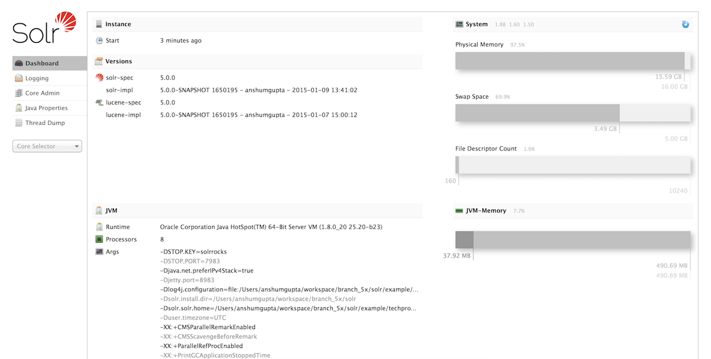

= Installing Solr
:toclevels: 1
// Licensed to the Apache Software Foundation (ASF) under one
// or more contributor license agreements.  See the NOTICE file
// distributed with this work for additional information
// regarding copyright ownership.  The ASF licenses this file
// to you under the Apache License, Version 2.0 (the
// "License"); you may not use this file except in compliance
// with the License.  You may obtain a copy of the License at
//
//   http://www.apache.org/licenses/LICENSE-2.0
//
// Unless required by applicable law or agreed to in writing,
// software distributed under the License is distributed on an
// "AS IS" BASIS, WITHOUT WARRANTIES OR CONDITIONS OF ANY
// KIND, either express or implied.  See the License for the
// specific language governing permissions and limitations
// under the License.

Installation of Solr on Unix-compatible or Windows servers generally requires simply extracting (or, unzipping) the download package.

Please be sure to review the <<solr-system-requirements.adoc#,Solr System Requirements>> before starting Solr.

== Available Solr Packages

Solr is available from the Solr website. Download the latest release https://solr.apache.org/downloads.html.

There are three separate packages:

* `solr-{solr-docs-version}.0.tgz` for Linux/Unix/OSX systems
* `solr-{solr-docs-version}.0.zip` for Microsoft Windows systems
* `solr-{solr-docs-version}.0-src.tgz` the package Solr source code. This is useful if you want to develop on Solr without using the official Git repository.

== Preparing for Installation

When getting started with Solr, all you need to do is extract the Solr distribution archive to a directory of your choosing. This will suffice as an initial development environment, but take care not to overtax this "toy" installation before setting up your true development and production environments.

When you've progressed past initial evaluation of Solr, you'll want to take care to plan your implementation. You may need to reinstall Solr on another server or make a clustered SolrCloud environment.

When you're ready to setup Solr for a production environment, please refer to the instructions provided on the <<taking-solr-to-production.adoc#,Taking Solr to Production>> page.

.What Size Server Do I Need?
[NOTE]
====
How to size your Solr installation is a complex question that relies on a number of factors, including the number and structure of documents, how many fields you intend to store, the number of users, etc.

It's highly recommended that you spend a bit of time thinking about the factors that will impact hardware sizing for your Solr implementation. A very good blog post that discusses the issues to consider is https://lucidworks.com/2012/07/23/sizing-hardware-in-the-abstract-why-we-dont-have-a-definitive-answer/[Sizing Hardware in the Abstract: Why We Don't have a Definitive Answer].
====

One thing to note when planning your installation is that a hard limit exists in Lucene for the number of documents in a single index: approximately 2.14 billion documents (2,147,483,647 to be exact). In practice, it is highly unlikely that such a large number of documents would fit and perform well in a single index, and you will likely need to distribute your index across a cluster before you ever approach this number. If you know you will exceed this number of documents in total before you've even started indexing, it's best to plan your installation with <<solrcloud.adoc#,SolrCloud>> as part of your design from the start.

== Package Installation

To keep things simple for now, extract the Solr distribution archive to your local home directory, for instance on Linux, do:

[source,bash,subs="attributes"]
----
cd ~/
tar zxf solr-{solr-docs-version}.0.tgz
----

Once extracted, you are now ready to run Solr using the instructions provided in the <<Starting Solr>> section below.

== Directory Layout

After installing Solr, you'll see the following directories and files within them:

bin/::
This directory includes several important scripts that will make using Solr easier.

solr and solr.cmd::: This is <<solr-control-script-reference.adoc#,Solr's Control Script>>, also known as `bin/solr` (*nix) / `bin/solr.cmd` (Windows). This script is the preferred tool to start and stop Solr. You can also create collections or cores, configure authentication, and work with configuration files when running in SolrCloud mode.

post::: The <<post-tool.adoc#,PostTool>>, which provides a simple command line interface for POSTing content to Solr.

solr.in.sh and solr.in.cmd:::
These are property files for *nix and Windows systems, respectively. System-level properties for Java, Jetty, and Solr are configured here. Many of these settings can be overridden when using `bin/solr` / `bin/solr.cmd`, but this allows you to set all the properties in one place.

install_solr_services.sh:::
This script is used on *nix systems to install Solr as a service. It is described in more detail in the section <<taking-solr-to-production.adoc#,Taking Solr to Production>>.

contrib/::
Solr's `contrib` directory includes add-on plugins for specialized features of Solr.

dist/::
The `dist` directory contains the main Solr .jar files.

docs/::
The `docs` directory includes a link to online Javadocs for Solr.

example/::
The `example` directory includes several types of examples that demonstrate various Solr capabilities. See the section <<Solr Examples>> below for more details on what is in this directory.

licenses/::
The `licenses` directory includes all of the licenses for 3rd party libraries used by Solr.

server/::
This directory is where the heart of the Solr application resides. A README in this directory provides a detailed overview, but here are some highlights:
* Solr's Admin UI (`server/solr-webapp`)
* Jetty libraries (`server/lib`)
* Log files (`server/logs`) and log configurations (`server/resources`). See the section <<configuring-logging.adoc#,Configuring Logging>> for more details on how to customize Solr's default logging.
* Sample configsets (`server/solr/configsets`)

== Solr Examples

Solr includes a number of example documents and configurations to use when getting started. If you ran through the <<solr-tutorial.adoc#,Solr Tutorial>>, you have already interacted with some of these files.

Here are the examples included with Solr:

exampledocs::
This is a small set of simple CSV, XML, and JSON files that can be used with `bin/post` when first getting started with Solr. For more information about using `bin/post` with these files, see <<post-tool.adoc#,Post Tool>>.

files::
The `files` directory provides a basic search UI for documents such as Word or PDF that you may have stored locally. See the README there for details on how to use this example.

films::
The `films` directory includes a robust set of data about movies in three formats: CSV, XML, and JSON. See the README there for details on how to use this dataset.

== Starting Solr

Solr includes a command line interface tool called `bin/solr` (Linux/MacOS) or `bin\solr.cmd` (Windows). This tool allows you to start and stop Solr, create cores and collections, configure authentication, and check the status of your system.

To use it to start Solr you can simply enter:

[source,bash]
----
bin/solr start
----

If you are running Windows, you can start Solr by running `bin\solr.cmd` instead.

[source,plain]
----
bin\solr.cmd start
----

This will start Solr in the background, listening on port 8983.

When you start Solr in the background, the script will wait to make sure Solr starts correctly before returning to the command line prompt.

TIP: All of the options for the Solr CLI are described in the section <<solr-control-script-reference.adoc#,Solr Control Script Reference>>.

=== Start Solr with a Specific Bundled Example

Solr also provides a number of useful examples to help you learn about key features. You can launch the examples using the `-e` flag. For instance, to launch the "techproducts" example, you would do:

[source,bash]
----
bin/solr -e techproducts
----

Currently, the available examples you can run are: techproducts, schemaless, and cloud. See the section <<solr-control-script-reference.adoc#running-with-example-configurations,Running with Example Configurations>> for details on each example.

.Getting Started with SolrCloud
NOTE: Running the `cloud` example starts Solr in <<solrcloud.adoc#,SolrCloud>> mode. For more information on starting Solr in SolrCloud mode, see the section <<getting-started-with-solrcloud.adoc#,Getting Started with SolrCloud>>.

=== Check if Solr is Running

If you're not sure if Solr is running locally, you can use the status command:

[source,bash]
----
bin/solr status
----

This will search for running Solr instances on your computer and then gather basic information about them, such as the version and memory usage.

That's it! Solr is running. If you need convincing, use a Web browser to see the Admin Console.

`\http://localhost:8983/solr/`

.The Solr Admin interface.

If Solr is not running, your browser will complain that it cannot connect to the server. Check your port number and try again.

=== Create a Core

If you did not start Solr with an example configuration, you would need to create a core in order to be able to index and search. You can do so by running:

[source,bash]
----
bin/solr create -c <name>
----

This will create a core that uses a data-driven schema which tries to guess the correct field type when you add documents to the index.

To see all available options for creating a new core, execute:

[source,bash]
----
bin/solr create -help
----
