= Loading Data
// Licensed to the Apache Software Foundation (ASF) under one
// or more contributor license agreements.  See the NOTICE file
// distributed with this work for additional information
// regarding copyright ownership.  The ASF licenses this file
// to you under the Apache License, Version 2.0 (the
// "License"); you may not use this file except in compliance
// with the License.  You may obtain a copy of the License at
//
//   http://www.apache.org/licenses/LICENSE-2.0
//
// Unless required by applicable law or agreed to in writing,
// software distributed under the License is distributed on an
// "AS IS" BASIS, WITHOUT WARRANTIES OR CONDITIONS OF ANY
// KIND, either express or implied.  See the License for the
// specific language governing permissions and limitations
// under the License.

Streaming Expressions allows CSV and TSV formatted data to be visualized and transformed
before loading it into Solr Cloud collections. A number of useful functions are provided
for parsing dates, creating unique ids, cleaning data, analyzing text and visualizing
data all before its loaded into Solr Cloud collections.

== Reading Files

The `cat` function can be used to read files under the "userfiles" directory in
SOLR_HOME. The `cat` function takes two parameters. The first parameter is a comma
delimited list of paths. If the path list contain directories, `cat` will crawl
all the files in the directory and sub-directories. If the path list contains only
files `cat` will operate crawl just the specific files.

The second parameter, *maxLines*, tells `cat` how many lines to read in total. If
*maxLines* is not provided, `cat` will read all lines from each file it crawls.

The `cat` function reads each line (up to maxLines) in files and for each line
emits a tuple with two fields:

* line: The text in the line.
* file: The relative path of the file under SOLR_HOME.

Below is an example of `cat` on the iris.csv file with a maxLines of 5:

[source,text]
----
cat("iris.csv", maxLines="5")
----

When this expression is sent to the `/stream` handler it responds with:

[source,json]
----
{
  "result-set": {
    "docs": [
      {
        "line": "sepal_length,sepal_width,petal_length,petal_width,species",
        "file": "iris.csv"
      },
      {
        "line": "5.1,3.5,1.4,0.2,setosa",
        "file": "iris.csv"
      },
      {
        "line": "4.9,3,1.4,0.2,setosa",
        "file": "iris.csv"
      },
      {
        "line": "4.7,3.2,1.3,0.2,setosa",
        "file": "iris.csv"
      },
      {
        "line": "4.6,3.1,1.5,0.2,setosa",
        "file": "iris.csv"
      },
      {
        "EOF": true,
        "RESPONSE_TIME": 0
      }
    ]
  }
}
----

== Parsing CSV and TSV Files

The `parseCSV` and `parseTSV` functions wrap the `cat` function and parse CSV
(comma separated values) and TSV (tab separated values). Both of these functions
expect a CSV or TSV header record at the beginning of each file.

Both `parseCSV` and `parseTSV` emit tuples with the header values mapped to their
corresponding values in each line.

[source,text]
----
parseCSV(cat("iris.csv", maxLines="5"))
----

When this expression is sent to the `/stream` handler it responds with:

[source,json]
----
{
  "result-set": {
    "docs": [
      {
        "sepal_width": "3.5",
        "species": "setosa",
        "petal_width": "0.2",
        "sepal_length": "5.1",
        "id": "iris.csv_2",
        "petal_length": "1.4"
      },
      {
        "sepal_width": "3",
        "species": "setosa",
        "petal_width": "0.2",
        "sepal_length": "4.9",
        "id": "iris.csv_3",
        "petal_length": "1.4"
      },
      {
        "sepal_width": "3.2",
        "species": "setosa",
        "petal_width": "0.2",
        "sepal_length": "4.7",
        "id": "iris.csv_4",
        "petal_length": "1.3"
      },
      {
        "sepal_width": "3.1",
        "species": "setosa",
        "petal_width": "0.2",
        "sepal_length": "4.6",
        "id": "iris.csv_5",
        "petal_length": "1.5"
      },
      {
        "EOF": true,
        "RESPONSE_TIME": 1
      }
    ]
  }
}
----

== Visualizing

Once that data has been parsed into tuples with `parseCSV` or `parseTSV` it can be
visualized using Zeppelin-Solr.

The example below shows the output of the `parseCSV` function visualized as a table.

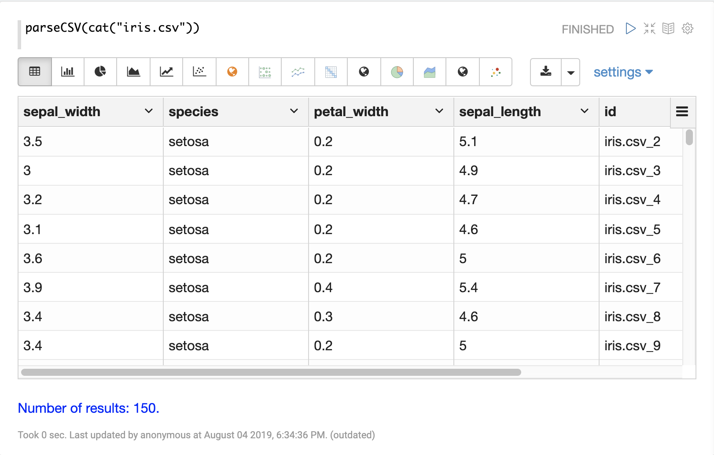

Columns from the table can then be visualized using one of Apache Zeppelins
visualizations. The example below shows a scatter plot of the petal_length and petal_width
grouped by species.

image::images/math-expressions/csv.png[]

== Transforming Data

=== Selecting fields and Field Types

The `select` function can be used to select specific fields from
the CSV file and map them to other field names for indexing.

Fields in the CSV file can be mapped to field names with
dynamic field suffixes. This approach allows for fine grain
control over schema field types without having to make any
changes to schema files.

Below is an example of selecting fields and mapping them
to specific field types.

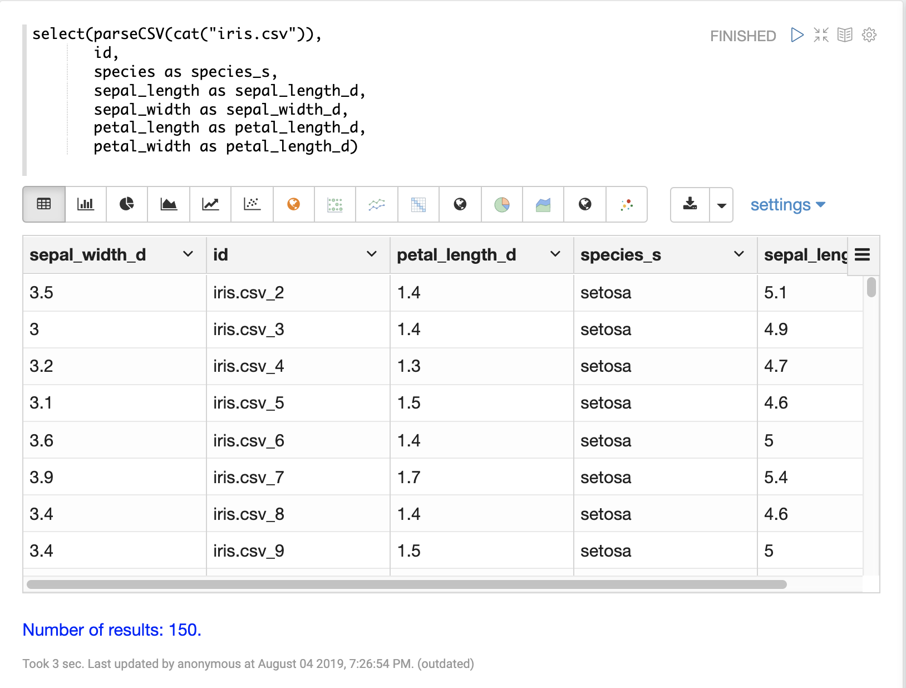

=== Unique ID

Both `parseCSV` and `parseTSV` emit an *id* field if one is not present in the records already.
The *id* field is a concatenation of the file path and the line number. This is a
convenient way to ensure that records have consistent ids if an id
is not present in file.

You can also map any fields in the file to the id field using the `select` function.
The `concat` function can be used to concatenate two or more fields in file
to create an id. Or a `uuid` function can be used to create a random unique id. If
the `uuid` function is used the data cannot be reloaded without first deleting
the data, as the `uuid` function does not produce the same id for each document
on subsequent loads.

Below is an example using the `concat` function to create a new id.

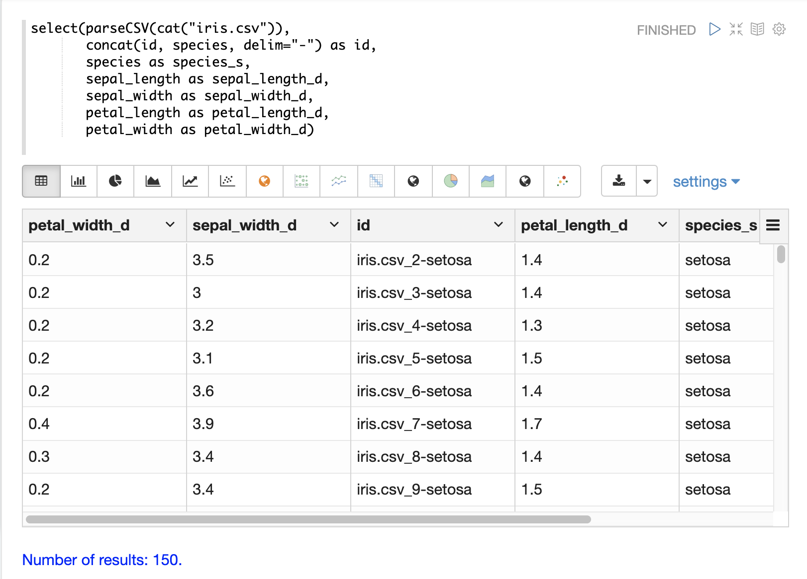

Below is an example using the `uuid` function to create a new id.

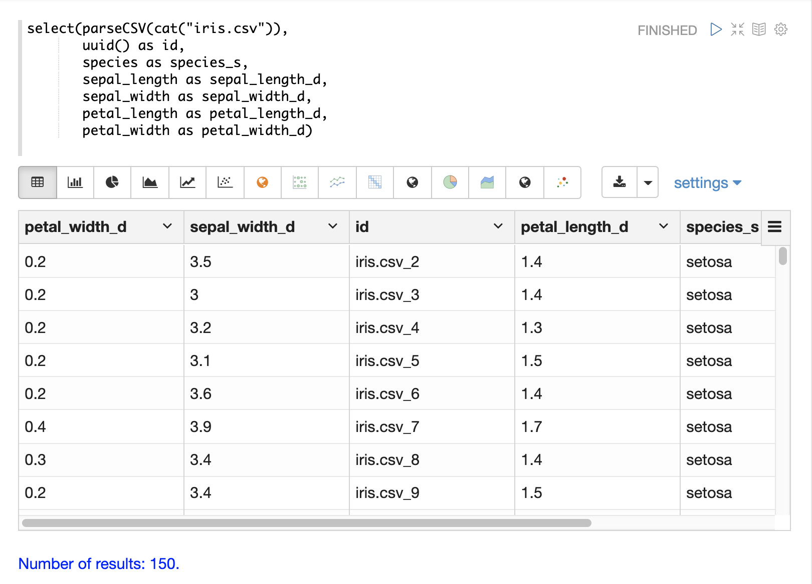

=== Record Number

The `recNum` function can be used inside of a `select` function to add a record number
to each tuple. The record number is useful for tracking location in the result set
and can be used for filtering strategies such as skipping, paging and striding described in
the *filtering* section below.

The example below shows the syntax of the `recNum` function:

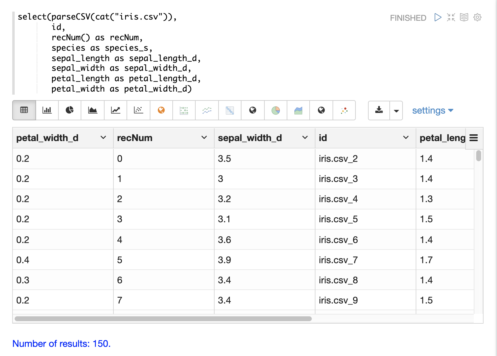

=== Parsing Dates

The `dateTime` function can be used to parse dates into ISO 8601 format
needed for loading into Solr date time field.

We can first inspect the format of the data time field in the CSV file:

[source,text]
----
select(parseCSV(cat("yr2017.csv", maxLines="2")),
       id,
       Created.Date)
----

When this expression is sent to the `/stream` handler it responds with:

[source,json]
----
{
  "result-set": {
    "docs": [
      {
        "id": "yr2017.csv_2",
        "Created.Date": "01/01/2017 12:00:00 AM"
      },
      {
        "EOF": true,
        "RESPONSE_TIME": 0
      }
    ]
  }
}
----

Then we can use the dateTime function to format the date time and
map it to Solr date time field.

The `dateTime` function takes three parameters. The field in the data
with the date string, a template to parse the date in the data
using the Java SimpleDateFormat template, and an optional time zone.

If the time zone is not present the time zone defaults to GMT time unless
it's included in the date string itself.

Below is an example of the `dateTime` function applied to the date format
in the example above.

[source,text]
----
select(parseCSV(cat("yr2017.csv", maxLines="2")),
       id,
       dateTime(Created.Date, "MM/dd/yyyy hh:mm:ss a", "EST") as cdate_dt)
----

When this expression is sent to the `/stream` handler it responds with:

[source,json]
----
{
  "result-set": {
    "docs": [
      {
        "cdate_dt": "2017-01-01T05:00:00Z",
        "id": "yr2017.csv_2"
      },
      {
        "EOF": true,
        "RESPONSE_TIME": 1
      }
    ]
  }
}
----

=== String Manipulation

The `upper`, `lower`, `split`, `valueAt`, `trim` and `concat` functions can be used to manipulate
strings inside of the `select` function.

The example below shows the `upper` function used to upper case the *species*
field.

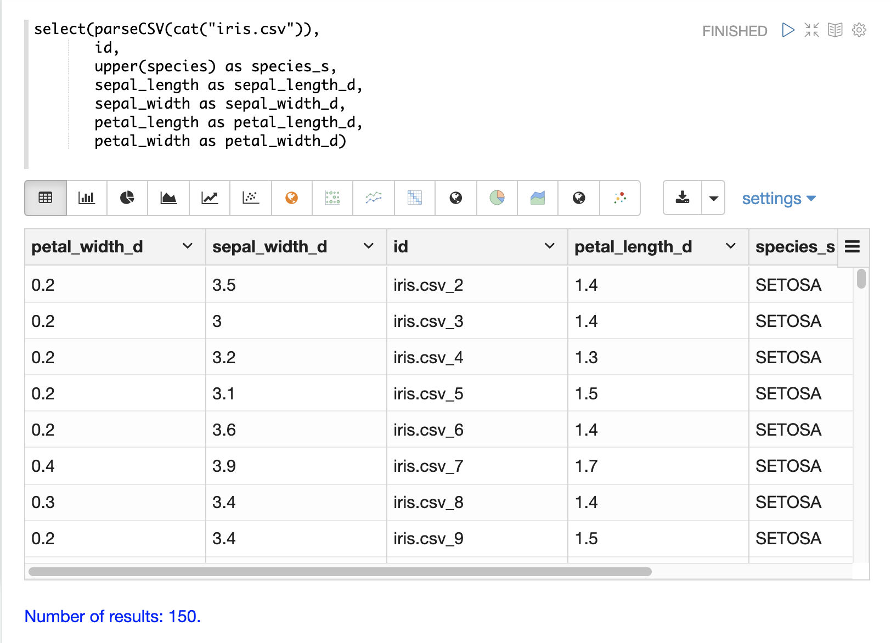

The example below shows the `split` function which splits a field on
delimiter. This can be used to create multi-value fields from fields
with an internal delimiter.

The example below demonstrates this with a direct call to
the /stream handler:

[source,text]
----
select(parseCSV(cat("iris.csv")),
       id,
       split(id, "_") as parts_ss,
       species as species_s,
       sepal_length as sepal_length_d,
       sepal_width as sepal_width_d,
       petal_length as petal_length_d,
       petal_width as petal_width_d)
----

When this expression is sent to the `/stream` handler it responds with:

[source,json]
----
{
  "result-set": {
    "docs": [
      {
        "petal_width_d": "0.2",
        "sepal_width_d": "3.5",
        "id": "iris.csv_2",
        "petal_length_d": "1.4",
        "species_s": "setosa",
        "sepal_length_d": "5.1",
        "parts_ss": [
          "iris.csv",
          "2"
        ]
      },
      {
        "petal_width_d": "0.2",
        "sepal_width_d": "3",
        "id": "iris.csv_3",
        "petal_length_d": "1.4",
        "species_s": "setosa",
        "sepal_length_d": "4.9",
        "parts_ss": [
          "iris.csv",
          "3"
        ]
      },
      ...
----

The `valueAt` function can be used to select a specific index from
a split array.

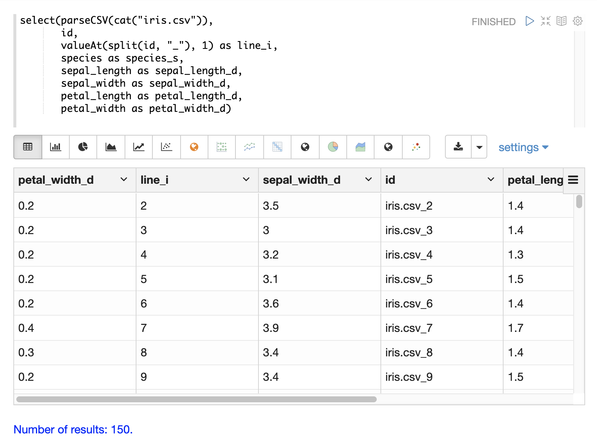

=== Filtering Results

The `having` function can be used to filter records. Filtering can be used to explore specific record sets before
indexing or to filter records that are indexed. The `having` function wraps another stream and applies
a boolean function to each tuple. If the logic function returns true the tuple is returned.

The following boolean functions are supported: `eq`, `gt`, `gteq`, `lt`, `lteq`, `matches`, `and`, `or`,
`not`, `notNull`, `isNull`.

Below are some strategies for using the `having` function to filter records.

==== Finding a Specific Id or Record Number

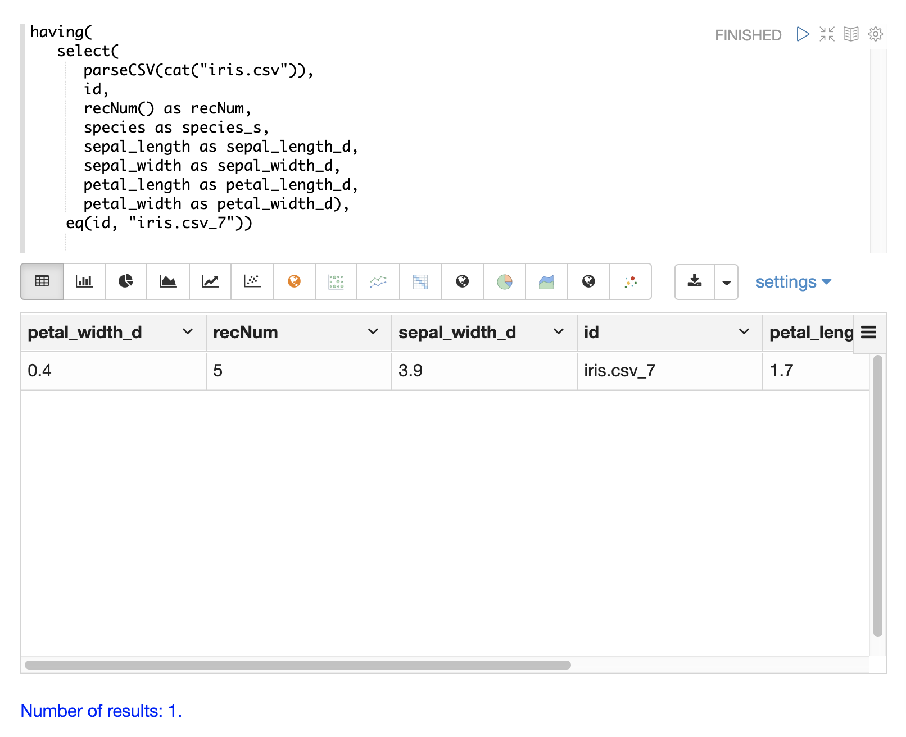

==== Skipping

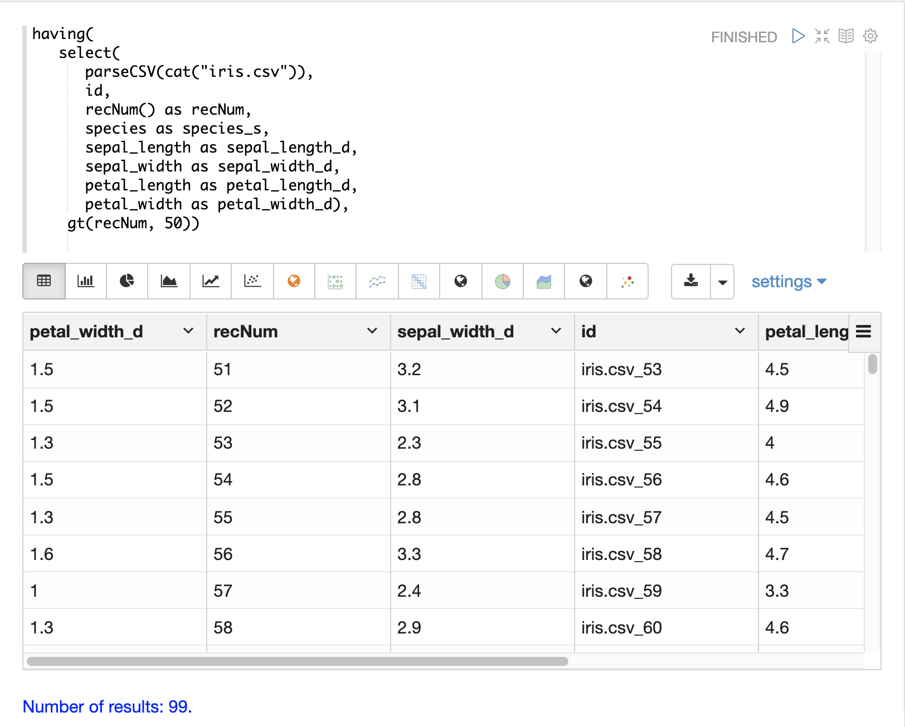

==== Paging

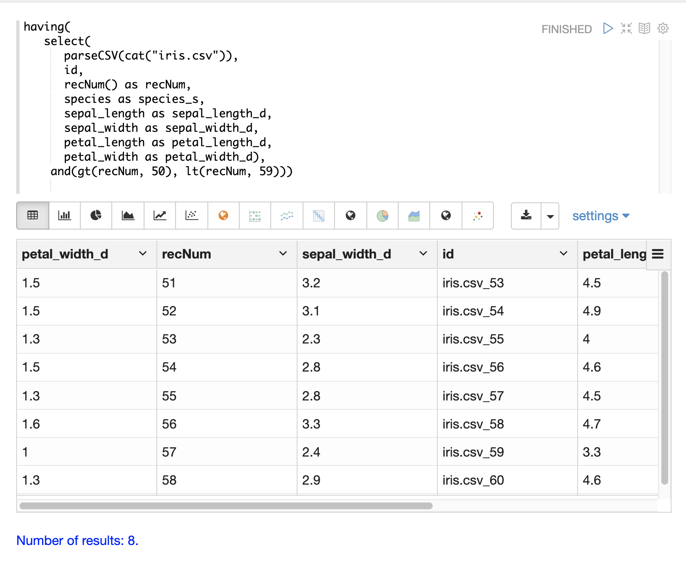

==== Striding

image::images/math-expressions/striding.png[]

==== Regex Matching

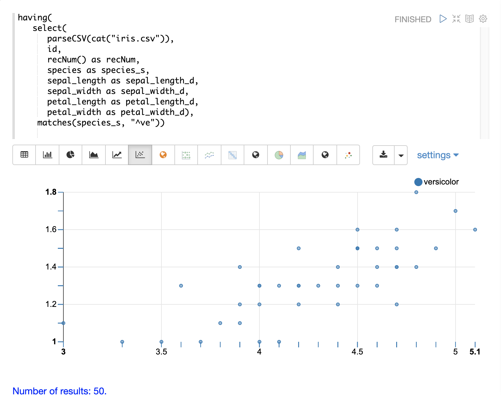

=== Handling Nulls

In most cases nulls do not need to be handled directly unless there is specific logic needed
to handle nulls during the load.

The `select` function does not output fields that contain a null value. This means
as nulls are encountered in the data the fields are not included in the tuples.

The string manipulation functions all return null if they encounter a null. This means
the null will be passed through to the `select` function and the fields with nulls
will simply be left off the record.

=== Text Analysis

== Loading Data

When the data is ready to load, the `update` function can be used to send the
data to a Solr Cloud collection for indexing. The `update` function adds documents to Solr in batches
and returns a tuple for each batch with some summary information about the batch and load.

In the example below the update expression is loaded using Zeppelin-Solr because the
data set is small. For larger loads it's best to run the load from a curl command
where the output of the `update` function can be spooled to disk.

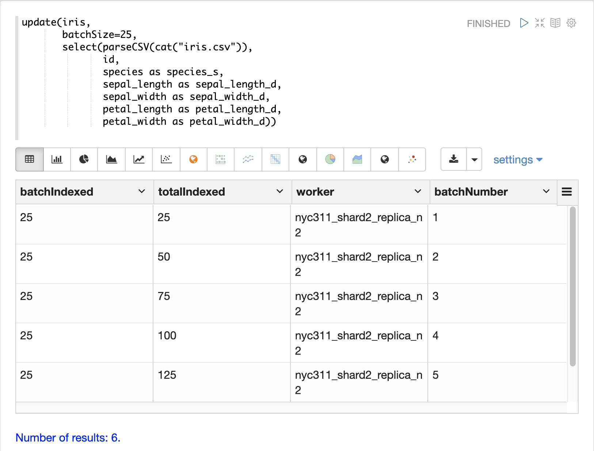

