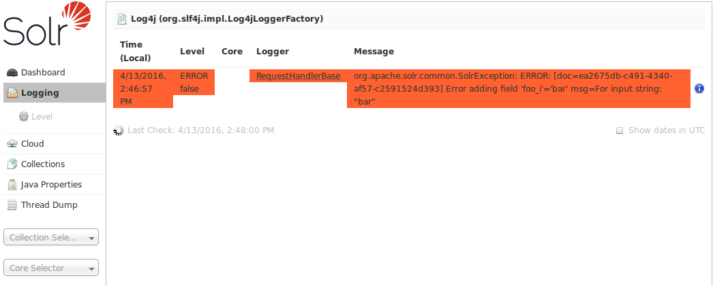
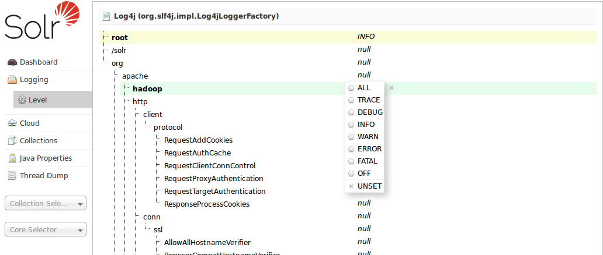

= Logging
// Licensed to the Apache Software Foundation (ASF) under one
// or more contributor license agreements.  See the NOTICE file
// distributed with this work for additional information
// regarding copyright ownership.  The ASF licenses this file
// to you under the Apache License, Version 2.0 (the
// "License"); you may not use this file except in compliance
// with the License.  You may obtain a copy of the License at
//
//   http://www.apache.org/licenses/LICENSE-2.0
//
// Unless required by applicable law or agreed to in writing,
// software distributed under the License is distributed on an
// "AS IS" BASIS, WITHOUT WARRANTIES OR CONDITIONS OF ANY
// KIND, either express or implied.  See the License for the
// specific language governing permissions and limitations
// under the License.

The Logging page shows recent messages logged by this Solr node.

When you click the link for "Logging", a page similar to the one below will be displayed:

.The Main Logging Screen, including an example of an error due to a bad document sent by a client

While this example shows logged messages for only one core, if you have multiple cores in a single instance, they will each be listed, with the level for each.

== Selecting a Logging Level

When you select the *Level* link on the left, you see the hierarchy of classpaths and classnames for your instance. A row highlighted in yellow indicates that the class has logging capabilities. Click on a highlighted row, and a menu will appear to allow you to change the log level for that class. Characters in boldface indicate that the class will not be affected by level changes to root.

.Log level selection

For an explanation of the various logging levels, see <<configuring-logging.adoc#,Configuring Logging>>.
