= Log Analytics
// Licensed to the Apache Software Foundation (ASF) under one
// or more contributor license agreements.  See the NOTICE file
// distributed with this work for additional information
// regarding copyright ownership.  The ASF licenses this file
// to you under the Apache License, Version 2.0 (the
// "License"); you may not use this file except in compliance
// with the License.  You may obtain a copy of the License at
//
//   http://www.apache.org/licenses/LICENSE-2.0
//
// Unless required by applicable law or agreed to in writing,
// software distributed under the License is distributed on an
// "AS IS" BASIS, WITHOUT WARRANTIES OR CONDITIONS OF ANY
// KIND, either express or implied.  See the License for the
// specific language governing permissions and limitations
// under the License.

This section of the user guide provides an introduction to Solr log analytics.

NOTE: This is an appendix of the <<math-expressions.adoc#,Visual Guide to Streaming Expressions and Math Expressions>>. All the functions described below are covered in detail in the guide.
See the <<math-start.adoc#,Getting Started>> chapter to learn how to get started with visualizations and Apache Zeppelin.

== Loading

The out-of-the-box Solr log format can be loaded into a Solr index using the `bin/postlogs` command line tool
located in the `bin/` directory of the Solr distribution.

NOTE: If working from the source distribution the
distribution must first be built before `postlogs` can be run.

The `postlogs` script is designed to be run from the root directory of the Solr distribution.

The `postlogs` script takes two parameters:

* Solr base URL (with collection): `http://localhost:8983/solr/logs`
* File path to root of the logs directory: All files found under this directory (including sub-directories) will be indexed.
If the path points to a single log file only that log file will be loaded.

Below is a sample execution of the `postlogs` tool:

[source,text]
----
./bin/postlogs http://localhost:8983/solr/logs /var/logs/solrlogs
----

The example above will index all the log files under `/var/logs/solrlogs` to the `logs` collection found at the base url `http://localhost:8983/solr`.

== Exploring

Log exploration is often the first step in log analytics and visualization.

When working with unfamiliar installations exploration can be used to understand which collections are
covered in the logs, what shards and cores are in those collections and the types of operations being
performed on those collections.

Even with familiar Solr installations exploration is still extremely
important while troubleshooting because it will often turn up surprises such as unknown errors or
unexpected admin or indexing operations.

=== Sampling

The first step in exploration is to take a random sample from the `logs` collection
with the `random` function.

In the example below the `random` function is run with one
parameter which is the name of the collection to sample.

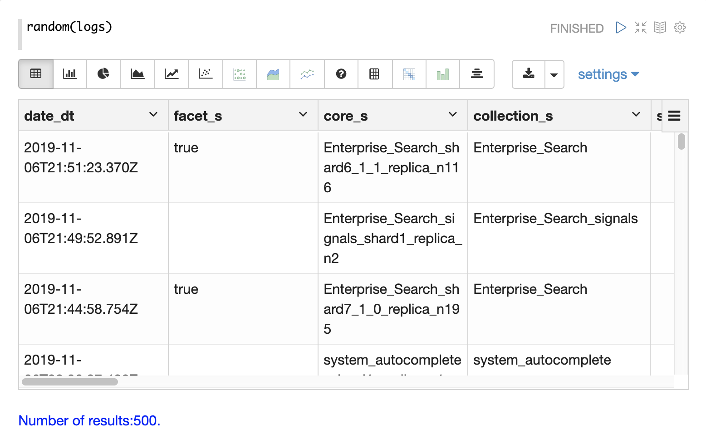

The sample contains 500 random records with their full field list. By looking
at this sample we can quickly learn about the *fields* available in the `logs` collection.

=== Time Period

Each log record contains a time stamp in the `date_dt` field.
Its often useful to understand what time period the logs cover and how many log records have been
indexed.

The `stats` function can be run to display this information.

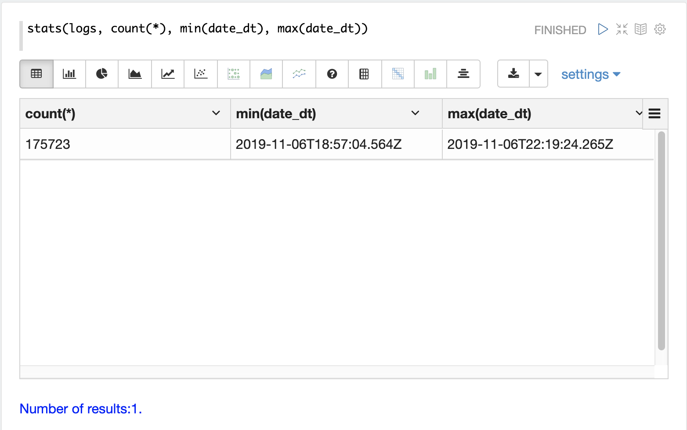

=== Record Types

One of the key fields in the index is the `type_s` field which is the type of log
record.

The `facet` expression can be used to visualize the different types of log records and how many
records of each type are in the index.

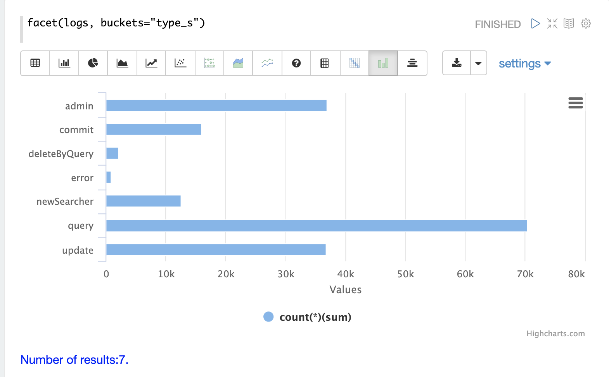

=== Collections

Another important field is the `collection_s` field which is the collection that the
log record was generated from.

The `facet` expression can be used to visualize the different collections and how many log records
they generate.

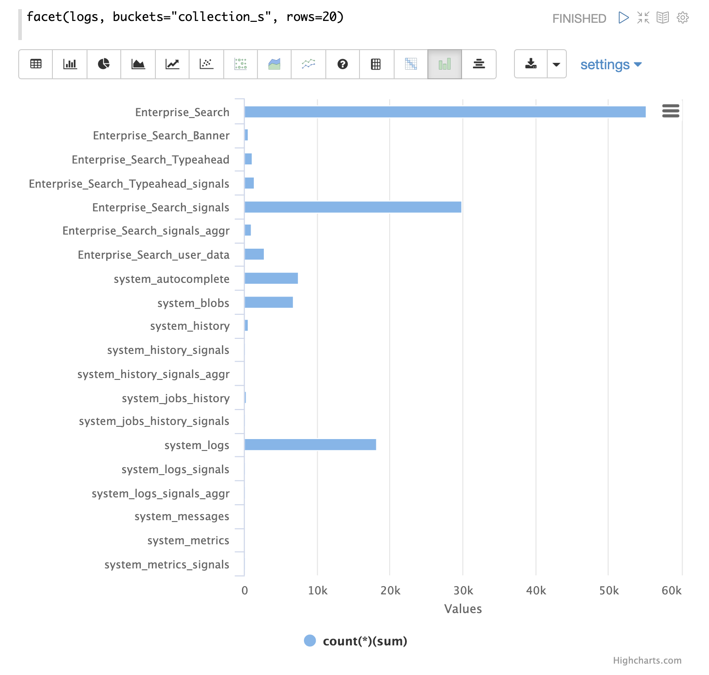

=== Record Type by Collection

A two dimensional `facet` can be run to visualize the record types by collection.

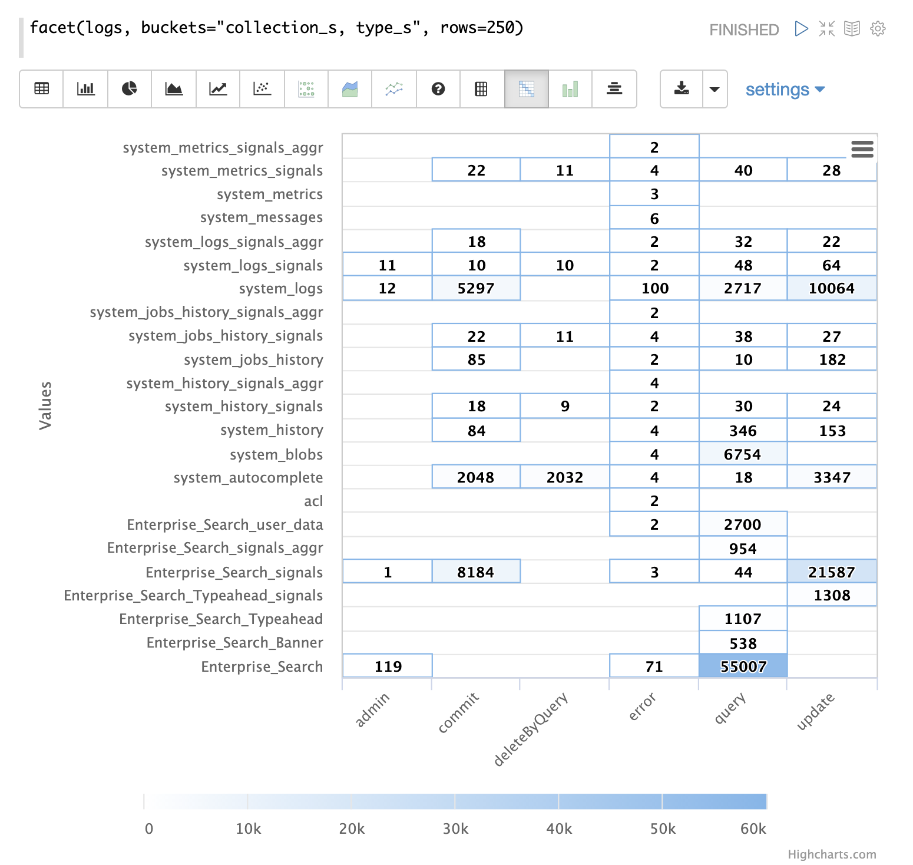

=== Time Series

The `timeseries` function can be used to visualize a time series for a specific time range
of the logs.

In the example below a time series is used to visualize the log record counts
at 15 second intervals.

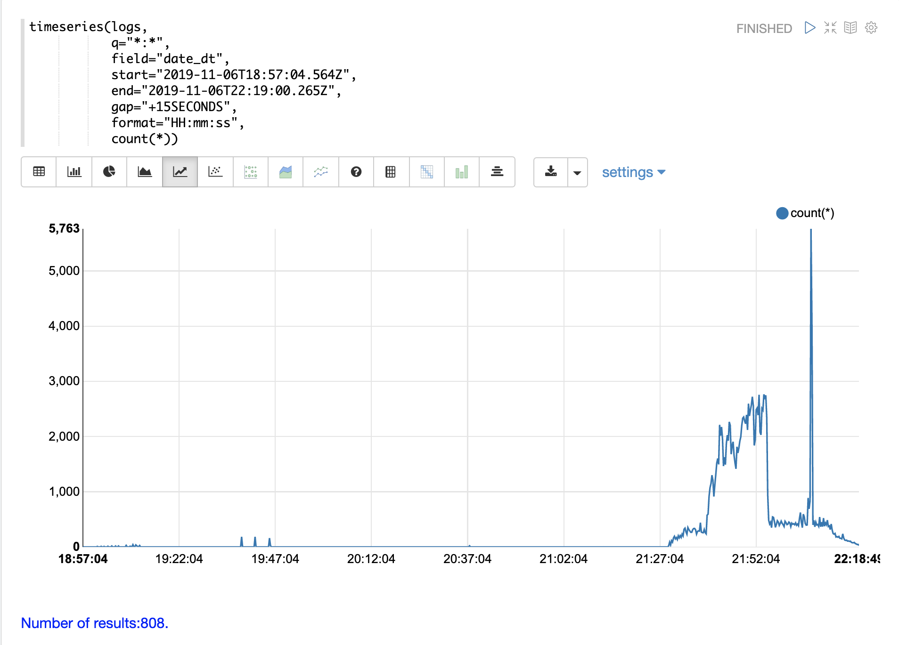

Notice that there is a very low level of log activity up until hour 21 minute 27.
Then a burst of log activity occurs from minute 27 to minute 52.

This is then followed by a large spike of log activity.

The example below breaks this down further by adding a query on the `type_s` field to only
visualize *query* activity in the log.

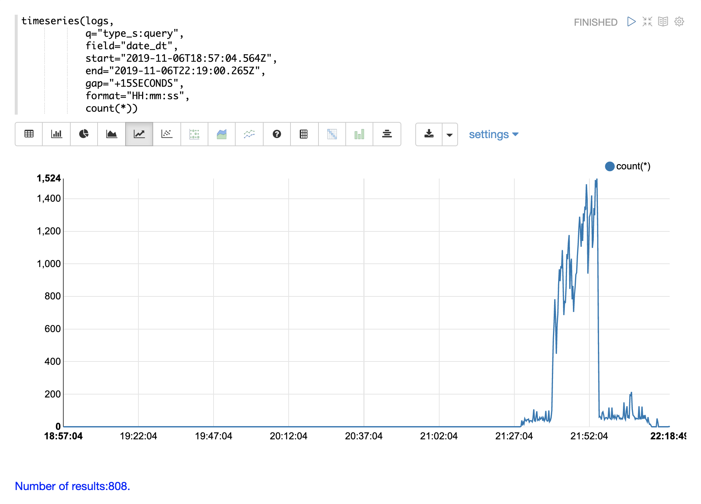

Notice the query activity accounts for more then half of the burst of log records between
21:27 and 21:52. But the query activity does not account for the large spike in
log activity that follows.

We can account for that spike by changing the search to include only *update*, *commit*,
and *deleteByQuery* records in the logs. We can also narrow by collection
so we know where these activities are taking place.

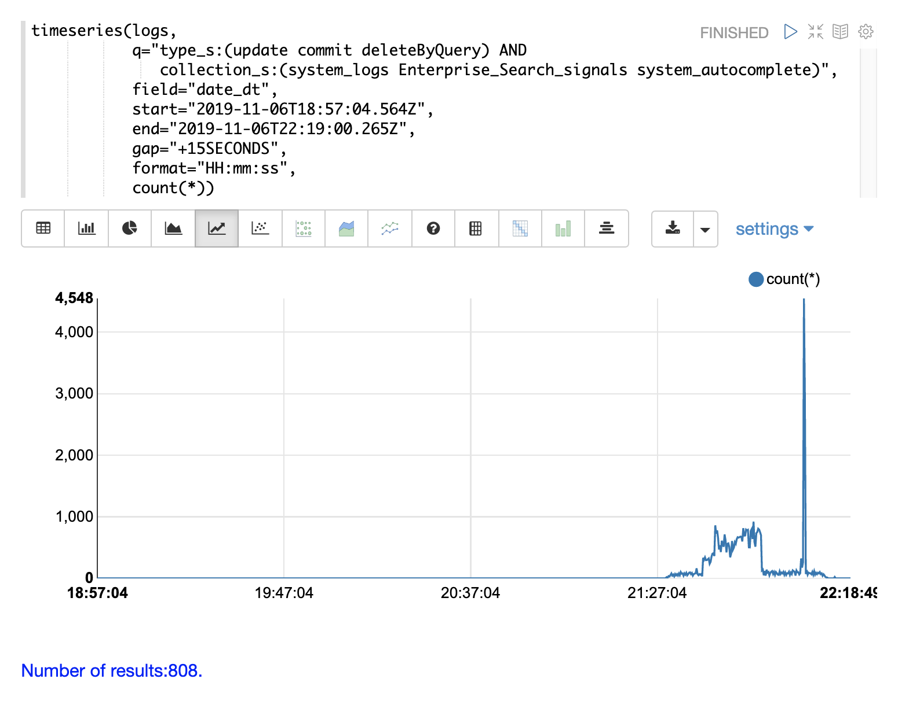

Through the various exploratory queries and visualizations we now have a much
better understanding of what's contained in the logs.

== Query Counting

Distributed searches produce more than one log record for each query. There will be one *top level* log
record for
the top level distributed query and a *shard level* log record on one replica from each shard. There may also
be a set of *ids* queries to retrieve fields by id from the shards to complete the page of results.

There are fields in the log index that can be used to differentiate between the three types of query records.

The examples below use the `stats` function to count the different types of query records in the logs.
The same queries can be used with `search`, `random` and `timeseries` functions to return results
for specific types of query records.

=== Top Level Queries

To find all the top level queries in the logs, add a query to limit results to log records with `distrib_s:true` as follows:

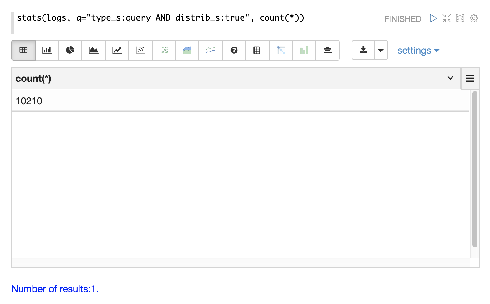

=== Shard Level Queries

To find all the shard level queries that are not IDs queries, adjust the query to limit results to logs with `distrib_s:false AND ids_s:false`
as follows:

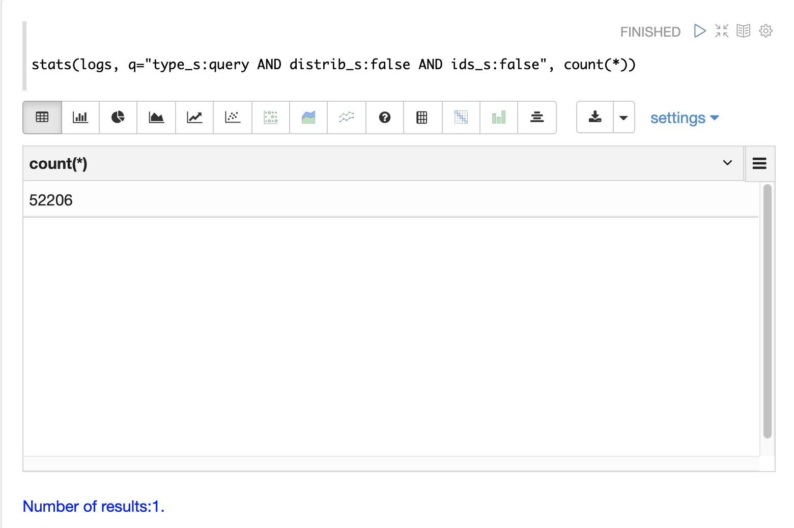

=== ID Queries

To find all the *ids* queries, adjust the query to limit results to logs with `distrib_s:false AND ids_s:true`
as follows:

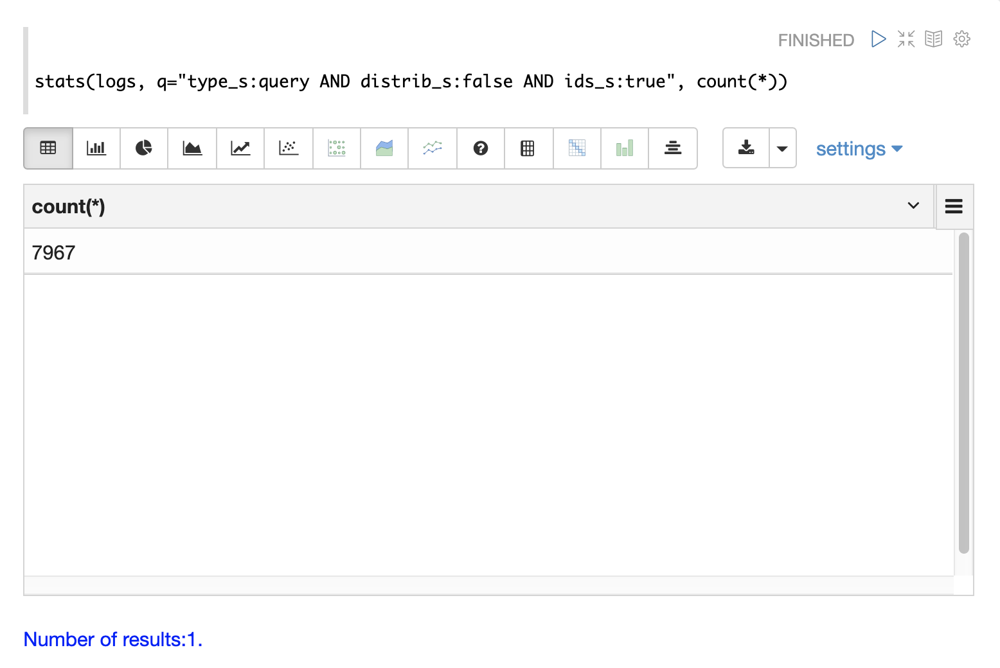

== Query Performance

One of the important tasks of Solr log analytics is understanding how well a Solr cluster is performing.

The `qtime_i` field contains the query time (QTime) in milliseconds
from the log records.
There are number of powerful visualizations and statistical approaches for analyzing query performance.

=== QTime Scatter Plot

Scatter plots can be used to visualize random samples of the `qtime_i`
field.
The example below demonstrates a scatter plot of 500 random samples
from the `ptest1` collection of log records.

In this example, `qtime_i` is plotted on the y-axis and the x-axis is simply a sequence to spread the query times out across the plot.

NOTE: The `x` field is included in the field list.
The `random` function automatically generates a sequence for the x-axis when `x` is included in the field list.

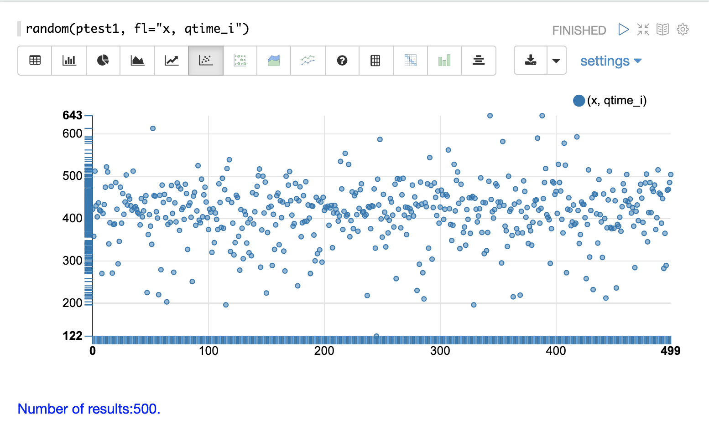

From this scatter plot we can tell a number of important things about the query times:

* The sample query times range from a low of 122 to a high of 643.
* The mean appears to be just above 400 ms.
* The query times tend to cluster closer to the mean and become less frequent as they move away
from the mean.

=== Highest QTime Scatter Plot

It's often useful to be able to visualize the highest query times recorded in the log data.
This can be done by using the `search` function and sorting on `qtime_i desc`.

In the example below the `search` function returns the highest 500 query times from the `ptest1` collection and sets the results to the variable `a`.
Then the `col` function is used to extract the `qtime_i` column from the result set into a vector, which is set to variable `y`.

Then the `zplot` function is used plot the query times on the y-axis of the scatter plot.

NOTE: The `rev` function is used to reverse the query times vector so the visualization displays from lowest to highest query times.

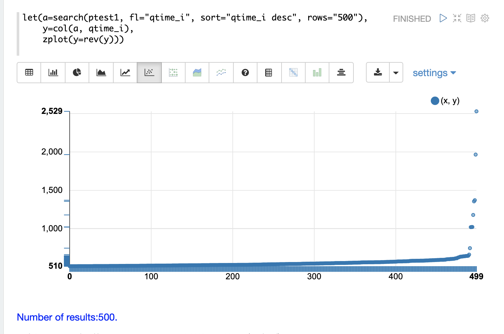

From this plot we can see that the 500 highest query times start at 510ms and slowly move higher, until the last 10 spike upwards, culminating at the highest query time of 2529ms.

=== QTime Distribution

In this example a visualization is created which shows the
distribution of query times rounded to the nearest second.

The example below starts by taking a random sample of 10000 log records with a `type_s`* of `query`.
The results of the `random` function are assigned to the variable `a`.

The `col` function is then used extract the `qtime_i` field from the results.
The vector of query times is set to variable `b`.

The `scalarDivide` function is then used to divide all elements of the query time vector by 1000.
This converts the query times from milli-seconds to seconds.
The result is set to variable `c`.

The `round` function then rounds all elements of the query times vector to the nearest second.
This means all query times less than 500ms will round to 0.

The `freqTable` function is then applied to the vector of query times rounded to
the nearest second.

The resulting frequency table is shown in the visualization below.
The x-axis is the number of seconds.
The y-axis is the number of query times that rounded to each second.

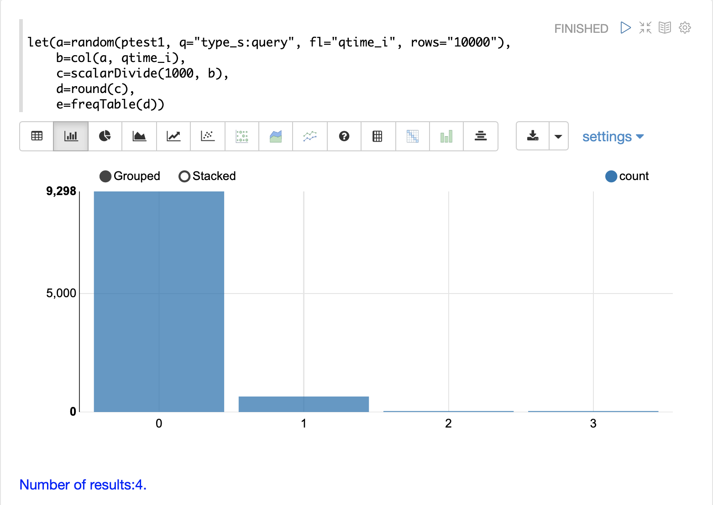

Notice that roughly 93 percent of the query times rounded to 0, meaning they were under 500ms.
About 6 percent round to 1 and the rest rounded to either 2 or 3 seconds.

=== QTime Percentiles Plot

A percentile plot is another powerful tool for understanding the distribution of query times in the logs.
The example below demonstrates how to create and interpret percentile plots.

In this example an `array` of percentiles is created and set to variable `p`.

Then a random sample of 10000 log records is drawn and set to variable `a`.
The `col` function is then used to extract the `qtime_i` field from the sample results and this vector is set to variable `b`.

The `percentile` function is then used to calculate the value at each percentile for the vector of query times.
The array of percentiles set to variable `p` tells the `percentile` function
which percentiles to calculate.

Then the `zplot` function is used to plot the *percentiles* on the x-axis and
the *query time* at each percentile on the y-axis.

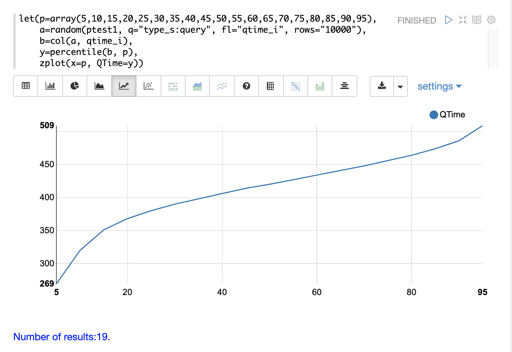

From the plot we can see that the 80th percentile has a query time of 464ms.
This means that 80% percent of queries are below 464ms.

=== QTime Time Series

A time series aggregation can also be run to visualization how QTime changes over time.

The example below shows a time series, area chart that visualizes *average query time* at 15 second intervals for a 3 minute section of a log.

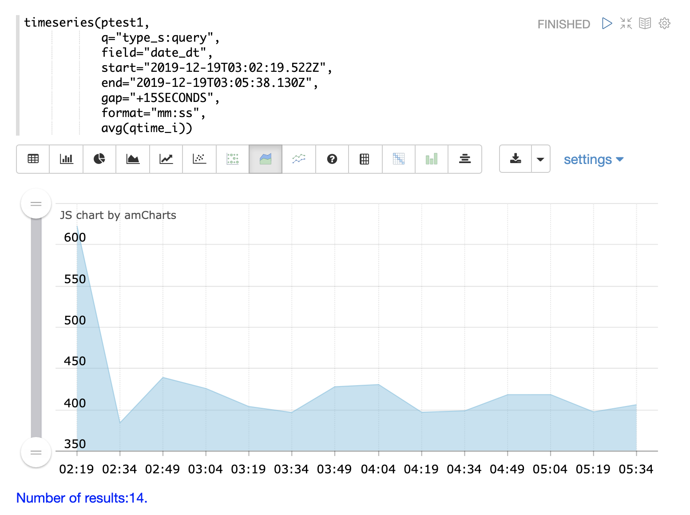

== Performance Troubleshooting

If query analysis determines that queries are not performing as expected then log analysis can also be used to troubleshoot the cause of the slowness.
The section below demonstrates several approaches for locating the source of query slowness.

=== Slow Nodes

In a distributed search the final search performance is only as fast as the slowest responding shard in the cluster.
Therefore one slow node can be responsible for slow overall search time.

The fields `core_s`, `replica_s` and `shard_s` are available in the log records.
These fields allow average query time to be calculated by *core*, *replica* or *shard*.

The `core_s` field is particularly useful as its the most granular element and
the naming convention often includes the collection, shard and replica information.

The example below uses the `facet` function to calculate `avg(qtime_i)` by core.

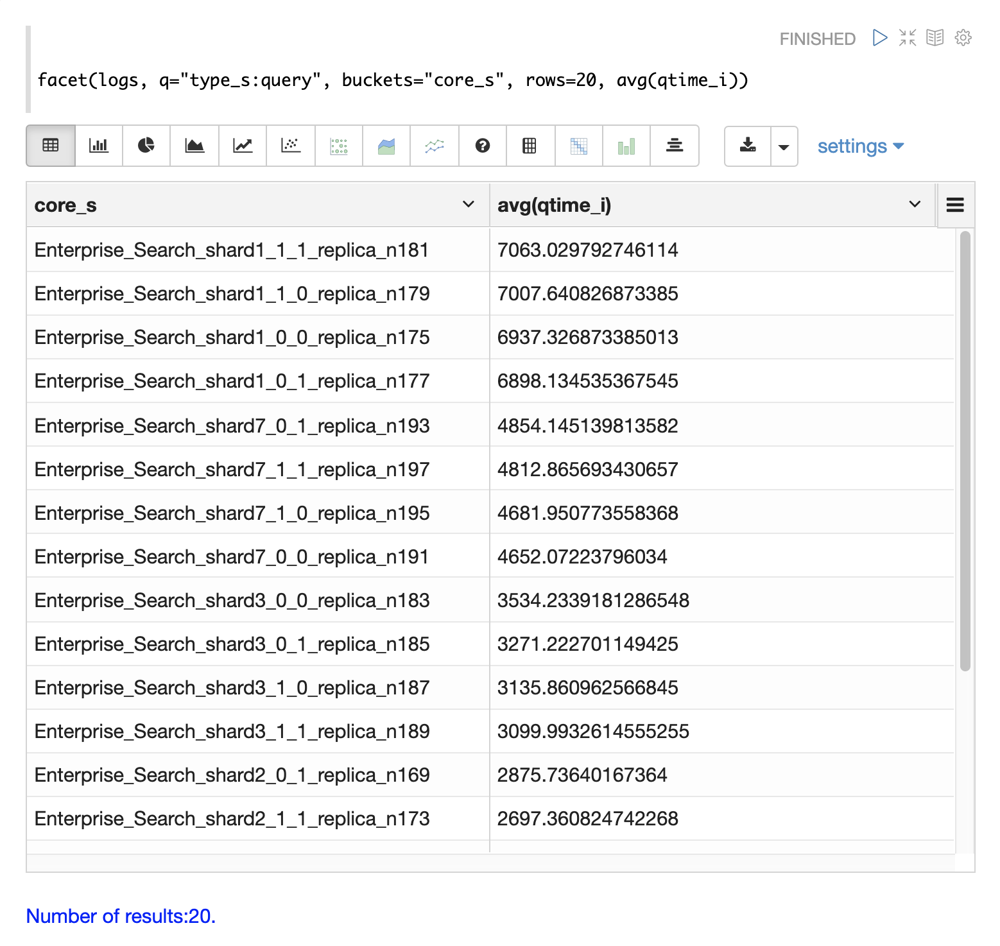

Notice in the results that the `core_s` field contains information about the
*collection*, *shard*, and *replica*.
The example also shows that qtime seems to be significantly higher for certain cores in the same collection.
This should trigger a deeper investigation as to why those cores might be performing slower.

=== Slow Queries

If query analysis shows that most queries are performing well but there are outlier queries that are slow, one reason for this may be that specific queries are slow.

The `q_s` and `q_t` fields both hold the value of the *q* parameter from Solr requests.
The `q_s` field is a string field and the `q_t` field has been tokenized.

The `search` function can be used to return the top N slowest queries in the logs by sorting the results by `qtime_i desc`. the example
below demonstrates this:

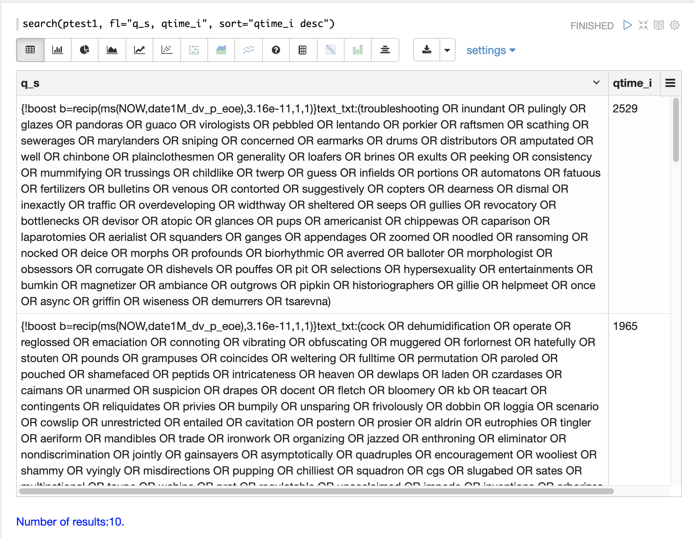

Once the queries have been retrieved they can be inspected and tried individually to determine if the query is consistently slow.
If the query is shown to be slow a plan to improve the query performance
can be devised.

=== Commits

Commits and activities that cause commits, such as full index replications, can result in slower query performance.
Time series visualization can help to determine if commits are
related to degraded performance.

The first step is to visualize the query performance issue.
The time series below limits the log results to records that are type `query` and computes the `max(qtime_i)` at ten minute intervals.
The plot shows the day, hour and minute on the x-axis and `max(qtime_i)` in milliseconds on the y-axis.
Notice there are some extreme spikes in max `qtime_i` that need to be understood.

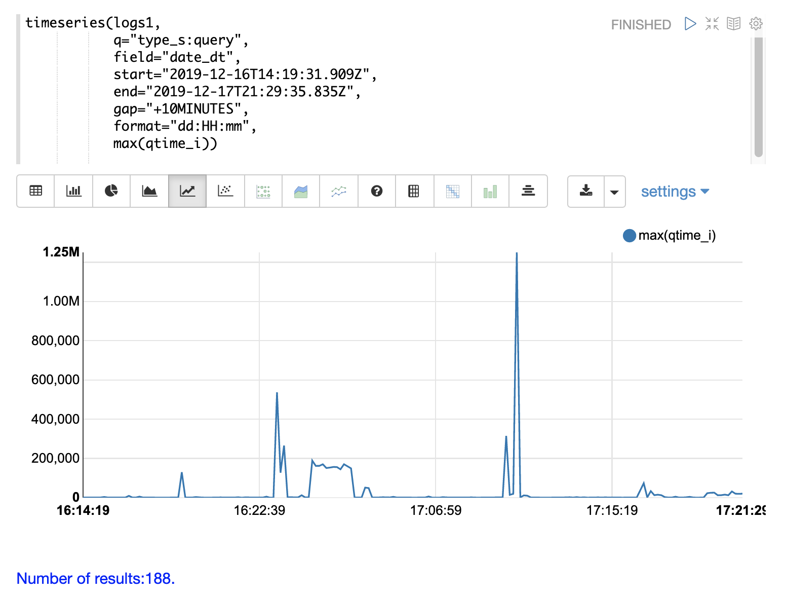

The next step is to generate a time series that counts commits across the same time intervals.
The time series below uses the same `start`, `end` and `gap` as the initial time series.
But this time series is computed for records that have a type of `commit`.
The count for the commits is calculated and plotted on y-axis.

Notice that there are spikes in commit activity that appear near the spikes in max `qtime_i`.

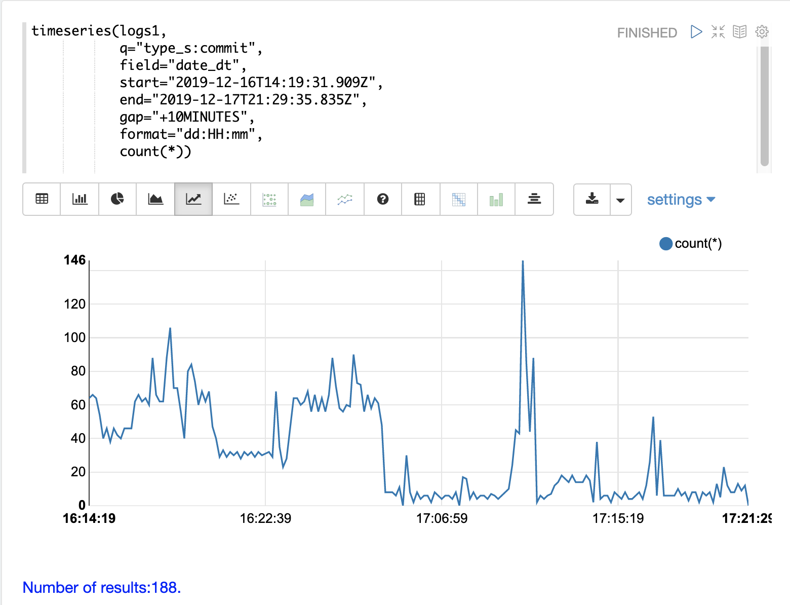

The final step is to overlay the two time series in the same plot.

This is done by performing both time series and setting the results to variables, in this case
`a` and `b`.

Then the `date_dt` and `max(qtime_i)` fields are extracted as vectors from the first time series and set to variables using the `col` function.
And the `count(*)` field is extracted from the second time series.

The `zplot` function is then used to plot the time stamp vector on the x-axis and the max qtimes and commit count vectors on y-axis.

NOTE: The `minMaxScale` function is used to scale both vectors
between 0 and 1 so they can be visually compared on the same plot.

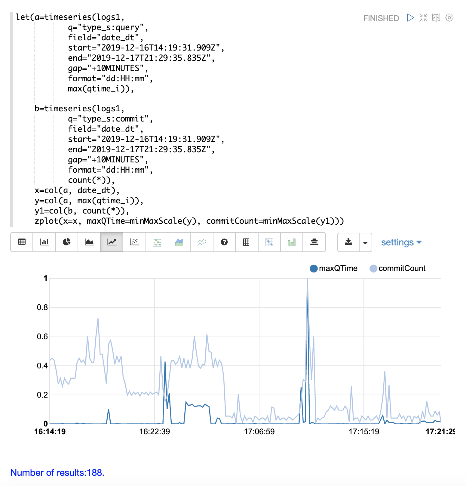

Notice in this plot that the commit count seems to be closely related to spikes
in max `qtime_i`.

== Errors

The log index will contain any error records found in the logs. Error records will have a `type_s` field value of `error`.

The example below searches for error records:

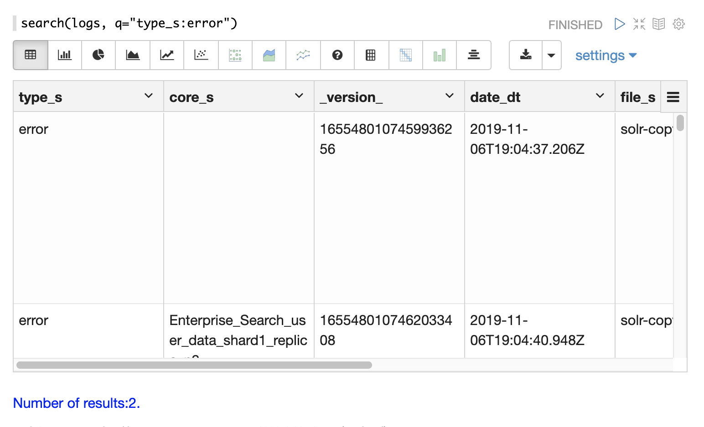

If the error is followed by a stack trace the stack trace will be present in the searchable field `stack_t`.
The example below shows a search on the `stack_t` field and the stack trace presented in the result.

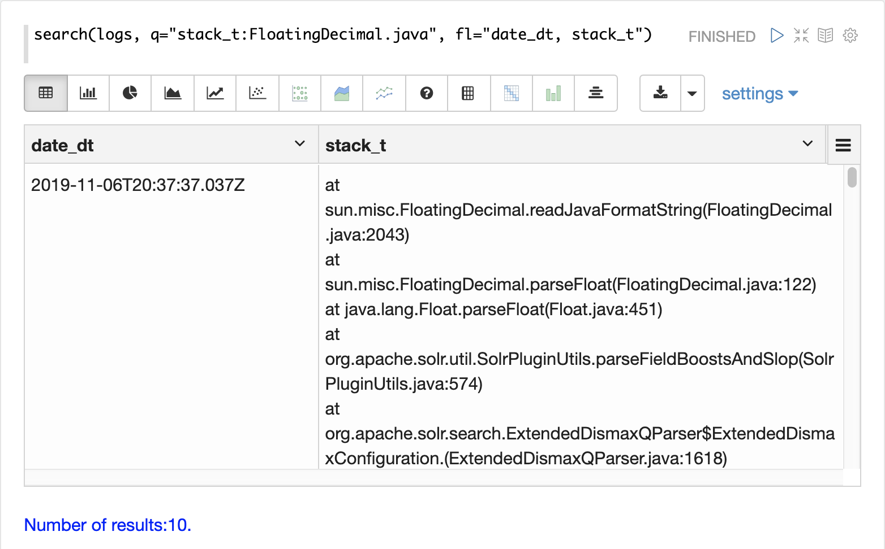
