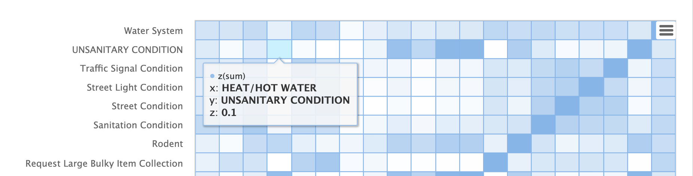
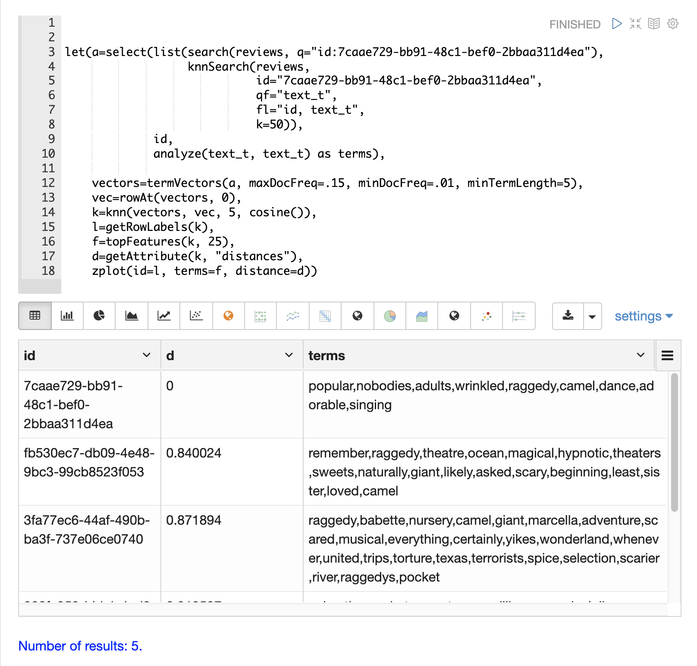
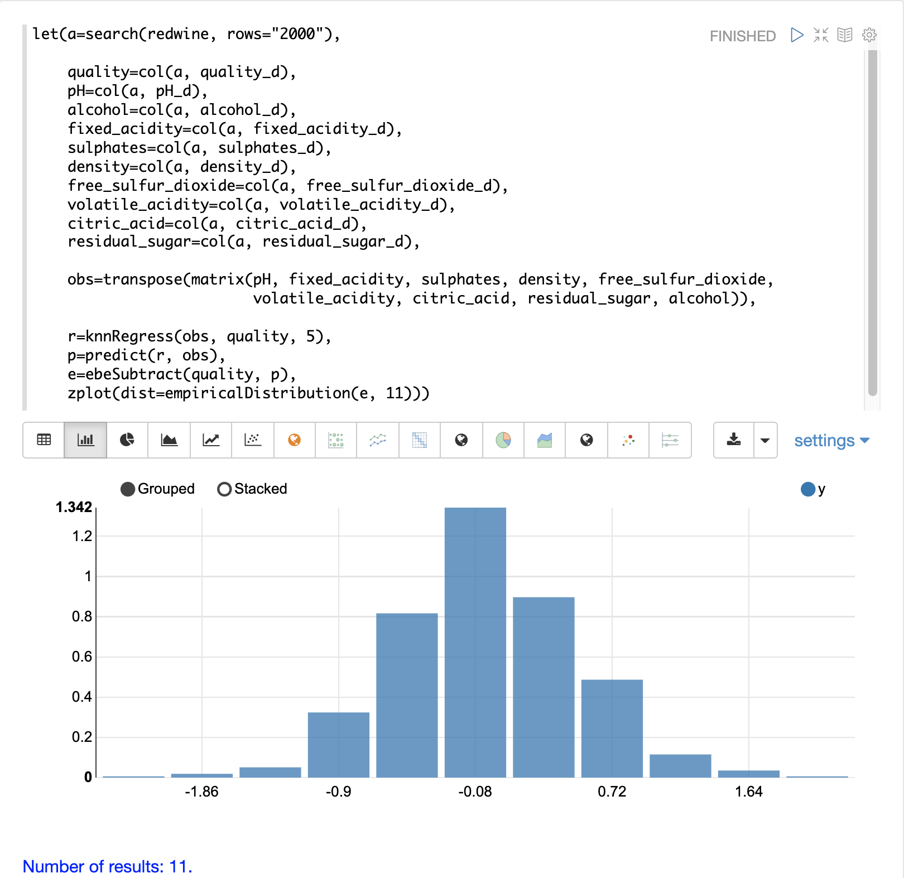
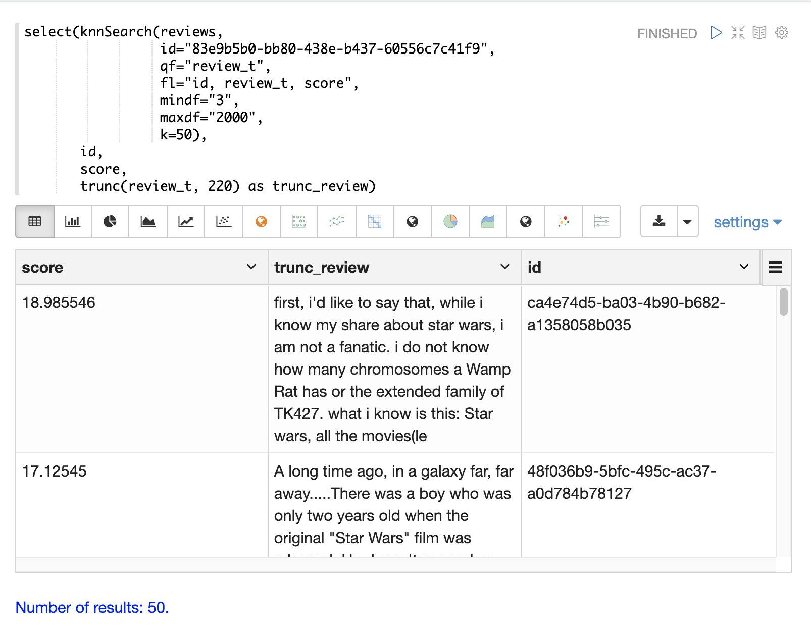
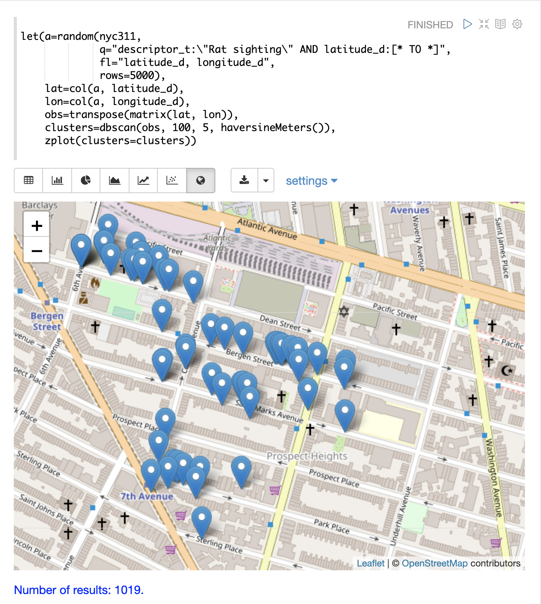
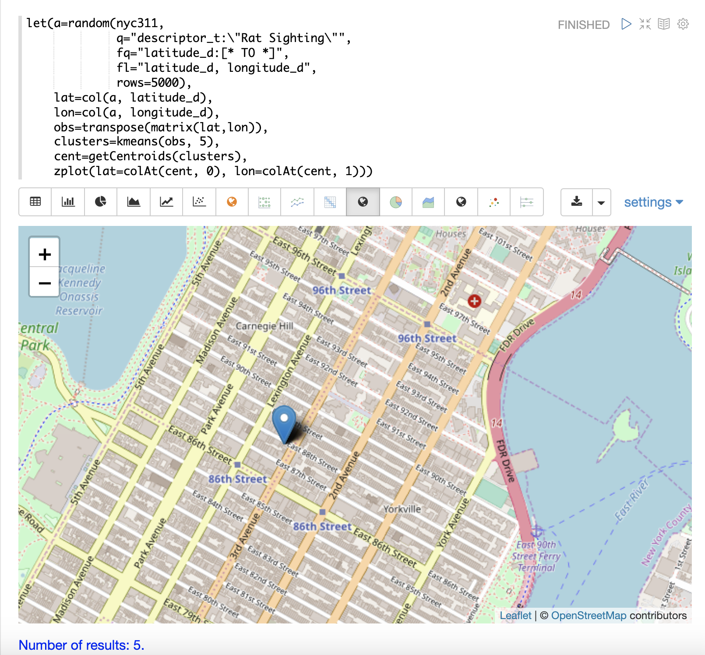
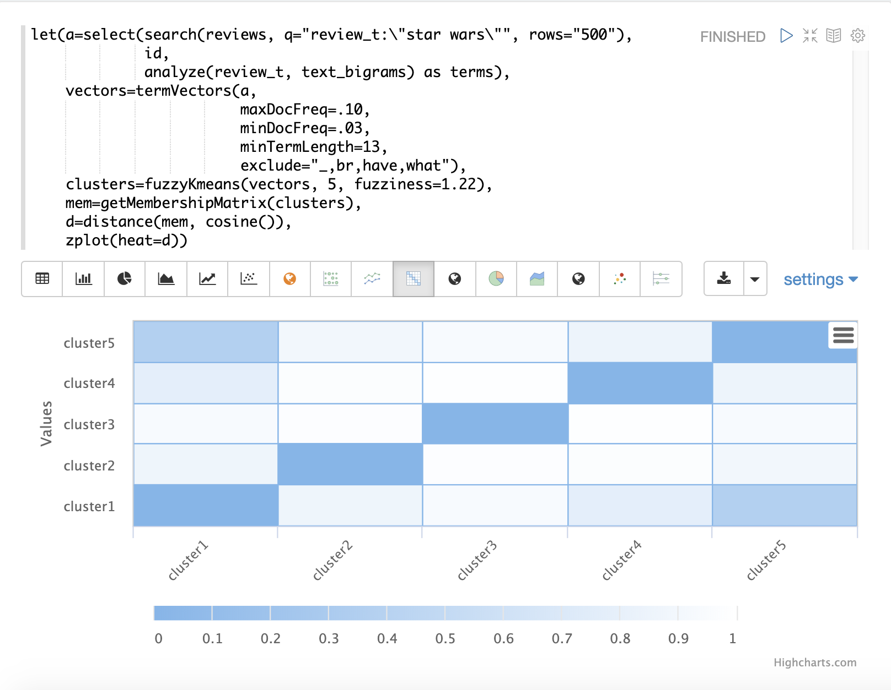
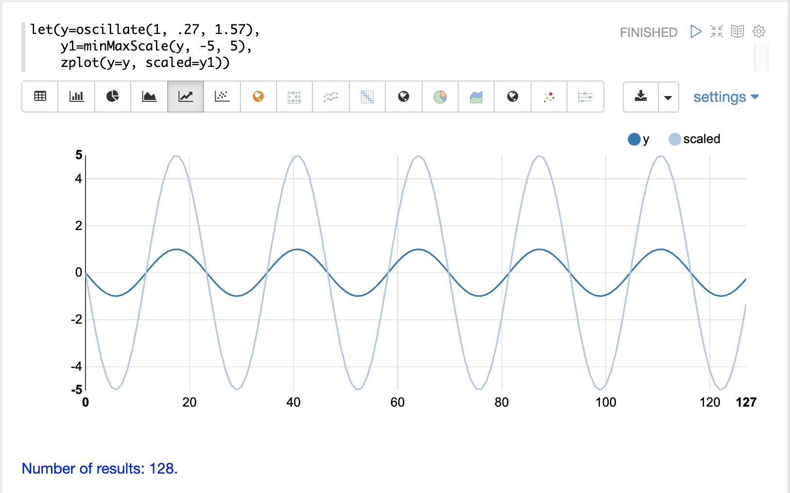
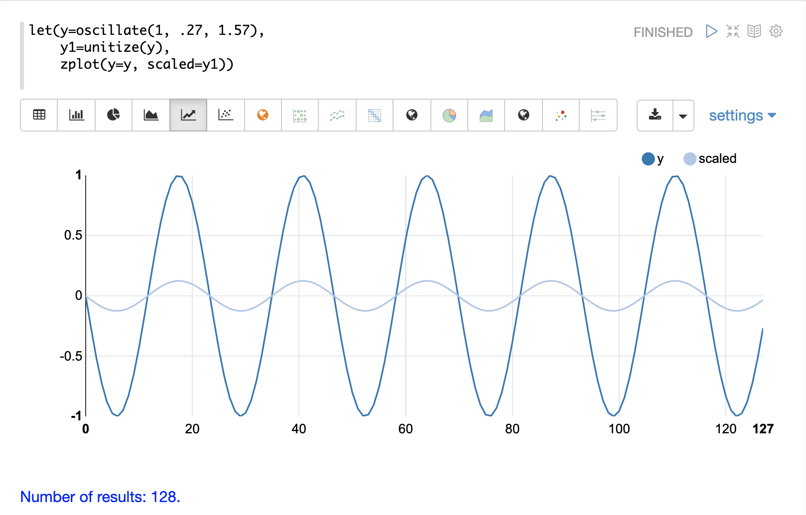

= Machine Learning
// Licensed to the Apache Software Foundation (ASF) under one
// or more contributor license agreements.  See the NOTICE file
// distributed with this work for additional information
// regarding copyright ownership.  The ASF licenses this file
// to you under the Apache License, Version 2.0 (the
// "License"); you may not use this file except in compliance
// with the License.  You may obtain a copy of the License at
//
//   http://www.apache.org/licenses/LICENSE-2.0
//
// Unless required by applicable law or agreed to in writing,
// software distributed under the License is distributed on an
// "AS IS" BASIS, WITHOUT WARRANTIES OR CONDITIONS OF ANY
// KIND, either express or implied.  See the License for the
// specific language governing permissions and limitations
// under the License.

This section of the math expressions user guide covers machine learning
functions.

== Distance and Distance Matrices

The `distance` function computes the distance for two numeric arrays or a distance matrix for the columns of a matrix.

There are six distance measure functions that return a function that performs the actual distance calculation:

* `euclidean` (default)
* `manhattan`
* `canberra`
* `earthMovers`
* `cosine`
* `haversineMeters` (Geospatial distance measure)

The distance measure functions can be used with all machine learning functions
that support distance measures.

Below is an example for computing Euclidean distance for two numeric arrays:

[source,text]
----
let(a=array(20, 30, 40, 50),
    b=array(21, 29, 41, 49),
    c=distance(a, b))
----

When this expression is sent to the `/stream` handler it responds with:

[source,json]
----
{
  "result-set": {
    "docs": [
      {
        "c": 2
      },
      {
        "EOF": true,
        "RESPONSE_TIME": 0
      }
    ]
  }
}
----

Below the distance is calculated using Manhattan distance.

[source,text]
----
let(a=array(20, 30, 40, 50),
    b=array(21, 29, 41, 49),
    c=distance(a, b, manhattan()))
----

When this expression is sent to the `/stream` handler it responds with:

[source,json]
----
{
  "result-set": {
    "docs": [
      {
        "c": 4
      },
      {
        "EOF": true,
        "RESPONSE_TIME": 1
      }
    ]
  }
}
----

=== Distance Matrices

Distance matrices are powerful tools for visualizing the distance
between two or more
vectors.

The `distance` function builds a distance matrix
if a matrix is passed as the parameter. The distance matrix is computed for the *columns*
of the matrix.

The example below demonstrates the power of distance matrices combined with 2 dimensional faceting.

In this example the `facet2D` function is used to generate a two dimensional facet aggregation
over the fields `complaint_type_s` and `zip_s` from the `nyc311` complaints database.
The *top 20* complaint types and the *top 25* zip codes for each complaint type are aggregated.
The result is a stream of tuples each containing the fields `complaint_type_s`, `zip_s` and the count for the pair.

The `pivot` function is then used to pivot the fields into a *matrix* with the `zip_s`
field as the *rows* and the `complaint_type_s` field as the *columns*. The `count(*)` field populates
the values in the cells of the matrix.

The `distance` function is then used to compute the distance matrix for the columns
of the matrix using `cosine` distance. This produces a distance matrix
that shows distance between complaint types based on the zip codes they appear in.

Finally the `zplot` function is used to plot the distance matrix as a heat map. Notice that the
heat map has been configured so that the intensity of color increases as the distance between vectors
decreases.

image::images/math-expressions/distance.png[]

The heat map is interactive, so mousing over one of the cells pops up the values
for the cell.

Notice that HEAT/HOT WATER and UNSANITARY CONDITION complaints have a cosine distance of .1 (rounded to the nearest
tenth).

== K-Nearest Neighbor (KNN)

The `knn` function searches the rows of a matrix with a search vector and
returns a matrix of the k-nearest neighbors. This allows for secondary vector
searches over result sets.

The `knn` function supports changing of the distance measure by providing one of the following
distance measure functions:

* `euclidean` (Default)
* `manhattan`
* `canberra`
* `earthMovers`
* `cosine`
* `haversineMeters` (Geospatial distance measure)

The example below shows how to perform a secondary search over an aggregation
result set. The goal of the example is to find zip codes in the nyc311 complaint
database that have similar complaint types to the zip code 10280.

The first step in the example is to use the `facet2D` function to perform a two
dimensional aggregation over the `zip_s` and `complaint_type_s` fields. In the example
the top 119 zip codes and top 5 complaint types for each zip code are calculated
for the borough of Manhattan. The result is a list of tuples each containing
the `zip_s`, `complaint_type_s` and the `count(*)` for the combination.

The list of tuples is then *pivoted* into a matrix with the `pivot` function.
The `pivot` function in this example returns a matrix with rows of zip codes
and columns of complaint types.
The `count(*)` field from the tuples populates the cells of the matrix.
This matrix will be used as the secondary search matrix.

The next step is to locate the vector for the 10280 zip code.
This is done in three steps in the example.
The first step is to retrieve the row labels from the matrix with the `getRowLabels` function.
The row labels in this case are zip codes which were populated by the `pivot` function.
Then the `indexOf` function is used to find the *index* of the "10280" zip code in the list of row labels.
The `rowAt` function is then used to return the vector at that *index* from the matrix.
This vector is the *search vector*.

Now that we have a matrix and search vector we can use the `knn` function to perform the search.
In the example the `knn` function searches the matrix with the search vector with a K of 5, using
*cosine* distance. Cosine distance is useful for comparing sparse vectors which is the case in this
example. The `knn` function returns a matrix with the top 5 nearest neighbors to the search vector.

The `knn` function populates the row and column labels of the return matrix and
also adds a vector of *distances* for each row as an attribute to the matrix.

In the example the `zplot` function extracts the row labels and
the distance vector with the `getRowLabels` and `getAttribute` functions.
The `topFeatures` function is used to extract
the top 5 column labels for each zip code vector, based on the counts for each
column. Then `zplot` outputs the data in a format that can be visualized in
a table with Zeppelin-Solr.

The table above shows each zip code returned by the `knn` function along
with the list of complaints and distances. These are the zip codes that are most similar
to the 10280 zip code based on their top 5 complaint types.

== K-Nearest Neighbor Regression

K-nearest neighbor regression is a non-linear, bivariate and multivariate regression method.
KNN regression is a lazy learning
technique which means it does not fit a model to the training set in advance. Instead the
entire training set of observations and outcomes are held in memory and predictions are made
by averaging the outcomes of the k-nearest neighbors.

The `knnRegress` function is used to perform nearest neighbor regression.

=== 2D Non-Linear Regression

The example below shows the *regression plot* for KNN regression applied to a 2D scatter plot.

In this example the `random` function is used to draw 500 random samples from the `logs` collection
containing two fields `filesize_d` and `eresponse_d`. The sample is then vectorized with the
`filesize_d` field stored in a vector assigned to variable *x* and the `eresponse_d` vector stored in
variable `y`. The `knnRegress` function is then applied with `20` as the nearest neighbor parameter,
which returns a KNN function which can be used to predict values.
The `predict` function is then called on the KNN function to predict values for the original `x` vector.
Finally `zplot` is used to plot the original `x` and `y` vectors along with the predictions.

image::images/math-expressions/knnRegress.png[]

Notice that the regression plot shows a non-linear relations ship between the `filesize_d`
field and the `eresponse_d` field. Also note that KNN regression
plots a non-linear curve through the scatter plot. The larger the size
of K (nearest neighbors), the smoother the line.

=== Multivariate Non-Linear Regression

The `knnRegress` function is also a powerful and flexible tool for
multi-variate non-linear regression.

In the example below a multi-variate regression is performed using
a database designed for analyzing and predicting wine quality. The
database contains nearly 1600 records with 9 predictors of wine quality:
pH, alcohol, fixed_acidity, sulphates, density, free_sulfur_dioxide,
volatile_acidity, citric_acid, residual_sugar. There is also a field
called quality assigned to each wine ranging
from 3 to 8.

KNN regression can be used to predict wine quality for vectors containing
the predictor values.

In the example a search is performed on the `redwine` collection to
return all the rows in the database of observations. Then the quality field and
predictor fields are read into vectors and set to variables.

The predictor variables are added as rows to a matrix which is
transposed so each row in the matrix contains one observation with the 9
predictor values.
This is our observation matrix which is assigned to the variable `obs`.

Then the `knnRegress` function regresses the observations with quality outcomes.
The value for K is set to 5 in the example, so the average quality of the 5
nearest neighbors will be used to calculate the quality.

The `predict` function is then used to generate a vector of predictions
for the entire observation set. These predictions will be used to determine
how well the KNN regression performed over the observation data.

The error, or *residuals*, for the regression are then calculated by
subtracting the *predicted* quality from the *observed* quality.
The `ebeSubtract` function is used to perform the element-by-element
subtraction between the two vectors.

Finally the `zplot` function formats the predictions and errors for
for the visualization of the *residual plot*.

image::images/math-expressions/redwine1.png[]

The residual plot plots the *predicted* values on the x-axis and the *error* for the
prediction on the y-axis. The scatter plot shows how the errors
are distributed across the full range of predictions.

The residual plot can be interpreted to understand how the KNN regression performed on the
training data.

* The plot shows the prediction error appears to be fairly evenly distributed
above and below zero. The density of the errors increases as it approaches zero. The
bubble size reflects the density of errors at the specific point in the plot.
This provides an intuitive feel for the distribution of the model's error.

* The plot also visualizes the variance of the error across the range of
predictions. This provides an intuitive understanding of whether the KNN predictions
will have similar error variance across the full range predictions.

The residuals can also be visualized using a histogram to better understand
the shape of the residuals distribution. The example below shows the same KNN
regression as above with a plot of the distribution of the errors.

In the example the `zplot` function is used to plot the `empiricalDistribution`
function of the residuals, with an 11 bin histogram.

Notice that the errors follow a bell curve centered close to 0. From this plot
we can see the probability of getting prediction errors between -1 and 1 is quite high.

*Additional KNN Regression Parameters*

The `knnRegression` function has three additional parameters that make it suitable for many different regression scenarios.

. Any of the distance measures can be used for the regression simply by adding the function to the call.
This allows for regression analysis over sparse vectors (`cosine`), dense vectors and geo-spatial lat/lon vectors (`haversineMeters`).
+
Sample syntax:
+
[source,text]
----
r=knnRegress(obs, quality, 5, cosine()),
----

. The `robust` named parameter can be used to perform a regression analysis that is robust to outliers in the outcomes.
When the `robust` parameter is used the median outcome of the k-nearest neighbors is used rather than the average.
+
Sample syntax:
+
[source,text]
----
r=knnRegress(obs, quality, 5, robust="true"),
----

. The `scale` named parameter can be used to scale the columns of the observations and search vectors
at prediction time. This can improve the performance of the KNN regression when the feature columns
are at different scales causing the distance calculations to be place too much weight on the larger columns.
+
Sample syntax:
+
[source,text]
----
r=knnRegress(obs, quality, 5, scale="true"),
----

== knnSearch

The `knnSearch` function returns the k-nearest neighbors
for a document based on text similarity.
Under the covers the `knnSearch` function uses Solr's <<other-parsers.adoc#more-like-this-query-parser,More Like This>> query parser plugin.
This capability uses the search engine's query, term statistics, scoring, and ranking capability to perform a fast, nearest neighbor search for similar documents over large distributed indexes.

The results of this search can be used directly or provide *candidates* for machine learning operations such as a secondary KNN vector search.

The example below shows the `knnSearch` function on a movie reviews data set. The search returns the 50 documents most similar to a specific document ID (`83e9b5b0...`) based on the similarity of the `review_t` field.
The `mindf` and `maxdf` specify the minimum and maximum document frequency of the terms used to perform the search.
These parameters can make the query faster by eliminating high frequency terms and also improves accuracy by removing noise terms from the search.

NOTE: In this example the `select`
function is used to truncate the review in the output to 220 characters to make it easier
to read in a table.

== DBSCAN

DBSCAN clustering is a powerful density-based clustering algorithm which is particularly well suited for geospatial clustering.
DBSCAN uses two parameters to filter result sets to clusters of specific density:

* `eps` (Epsilon): Defines the distance between points to be considered as neighbors

* `min` points: The minimum number of points needed in a cluster for it to be returned.

=== 2D Cluster Visualization

The `zplot` function has direct support for plotting 2D clusters by using the `clusters` named parameter.

The example below uses DBSCAN clustering and cluster visualization to find
the *hot spots* on a map for rat sightings in the NYC 311 complaints database.

In this example the `random` function draws a sample of records from the `nyc311` collection where
the complaint description matches "rat sighting" and latitude is populated in the record.
The latitude and longitude fields are then vectorized and added as rows to a matrix.
The matrix is transposed so each row contains a single latitude, longitude
point.
The `dbscan` function is then used to cluster the latitude and longitude points.
Notice that the `dbscan` function in the example has four parameters.

* `obs` : The observation matrix of lat/lon points

* `eps` : The distance between points to be considered a cluster. 100 meters in the example.

* `min points`: The minimum points in a cluster for the cluster to be returned by the function. `5` in the example.

* `distance measure`: An optional distance measure used to determine the
distance between points. The default is Euclidean distance.
The example uses `haversineMeters` which returns the distance in meters which is much more meaningful for geospatial use cases.

Finally, the `zplot` function is used to visualize the clusters on a map with Zeppelin-Solr.
The map below has been zoomed to a specific area of Brooklyn with a high density of rat sightings.

image::images/math-expressions/dbscan1.png[]

Notice in the visualization that only 1019 points were returned from the 5000 samples.
This is the power of the DBSCAN algorithm to filter records that don't match the criteria
of a cluster. The points that are plotted all belong to clearly defined clusters.

The map visualization can be zoomed further to explore the locations of specific clusters.
The example below shows a zoom into an area of dense clusters.

== K-Means Clustering

The `kmeans` functions performs k-means clustering of the rows of a matrix.
Once the clustering has been completed there are a number of useful functions available
for examining and visualizing the clusters and centroids.

=== Clustered Scatter Plot

In this example we'll again be clustering 2D lat/lon points of rat sightings. But unlike the DBSCAN example, k-means clustering
does not on its own
perform any noise reduction. So in order to reduce the noise a smaller random sample is selected from the data than was used
for the DBSCAN example.

We'll see that sampling itself is a powerful noise reduction tool which helps visualize the cluster density.
This is because there is a higher probability that samples will be drawn from higher density clusters and a lower
probability that samples will be drawn from lower density clusters.

In this example the `random` function draws a sample of 1500 records from the `nyc311` (complaints database) collection where
the complaint description matches "rat sighting" and latitude is populated in the record. The latitude and longitude fields
are then vectorized and added as rows to a matrix. The matrix is transposed so each row contains a single latitude, longitude
point. The `kmeans` function is then used to cluster the latitude and longitude points into 21 clusters.
Finally, the `zplot` function is used to visualize the clusters as a scatter plot.

image::images/math-expressions/2DCluster1.png[]

The scatter plot above shows each lat/lon point plotted on a Euclidean plain with longitude on the
x-axis and
latitude on the y-axis. The plot is dense enough so the outlines of the different boroughs are visible
if you know the boroughs of New York City.

Each cluster is shown in a different color. This plot provides interesting
insight into the densities of rat sightings throughout the five boroughs of New York City. For
example it highlights a cluster of dense sightings in Brooklyn at cluster1
surrounded by less dense but still high activity clusters.

=== Plotting the Centroids

The centroids of each cluster can then be plotted on a map to visualize the center of the
clusters. In the example below the centroids are extracted from the clusters using the `getCentroids`
function, which returns a matrix of the centroids.

The centroids matrix contains 2D lat/lon points. The `colAt` function can then be used
to extract the latitude and longitude columns by index from the matrix so they can be
plotted with `zplot`. A map visualization is used below to display the centroids.

image::images/math-expressions/centroidplot.png[]

The map can then be zoomed to get a closer look at the centroids in the high density areas shown
in the cluster scatter plot.

=== Phrase Extraction

K-means clustering produces centroids or *prototype* vectors which can be used to represent
each cluster. In this example the key features of the centroids are extracted
to represent the key phrases for clusters of TF-IDF term vectors.

NOTE: The example below works with TF-IDF _term vectors_.
The section <<term-vectors.adoc#,Text Analysis and Term Vectors>> offers
a full explanation of this features.

In the example the `search` function returns documents where the `review_t` field matches the phrase "star wars".
The `select` function is run over the result set and applies the `analyze` function
which uses the Lucene/Solr analyzer attached to the schema field `text_bigrams` to re-analyze the `review_t`
field. This analyzer returns bigrams which are then annotated to documents in a field called `terms`.

The `termVectors` function then creates TD-IDF term vectors from the bigrams stored in the `terms` field.
The `kmeans` function is then used to cluster the bigram term vectors into 5 clusters.
Finally the top 5 features are extracted from the centroids and returned.
Notice that the features are all bigram phrases with semantic significance.

[source,text]
----
let(a=select(search(reviews, q="review_t:\"star wars\"", rows="500"),
             id,
             analyze(review_t, text_bigrams) as terms),
    vectors=termVectors(a, maxDocFreq=.10, minDocFreq=.03, minTermLength=13, exclude="_,br,have"),
    clusters=kmeans(vectors, 5),
    centroids=getCentroids(clusters),
    phrases=topFeatures(centroids, 5))
----

When this expression is sent to the `/stream` handler it responds with:

[source,text]
----
{
  "result-set": {
    "docs": [
      {
        "phrases": [
          [
            "empire strikes",
            "rebel alliance",
            "princess leia",
            "luke skywalker",
            "phantom menace"
          ],
          [
            "original star",
            "main characters",
            "production values",
            "anakin skywalker",
            "luke skywalker"
          ],
          [
            "carrie fisher",
            "original films",
            "harrison ford",
            "luke skywalker",
            "ian mcdiarmid"
          ],
          [
            "phantom menace",
            "original trilogy",
            "harrison ford",
            "john williams",
            "empire strikes"
          ],
          [
            "science fiction",
            "fiction films",
            "forbidden planet",
            "character development",
            "worth watching"
          ]
        ]
      },
      {
        "EOF": true,
        "RESPONSE_TIME": 46
      }
    ]
  }
}
----

== Multi K-Means Clustering

K-means clustering will produce different outcomes depending on
the initial placement of the centroids. K-means is fast enough
that multiple trials can be performed so that the best outcome can be selected.

The `multiKmeans` function runs the k-means clustering algorithm for a given number of trials and selects the
best result based on which trial produces the lowest intra-cluster variance.

The example below is identical to the phrase extraction example except that it uses `multiKmeans` with 15 trials,
rather than a single trial of the `kmeans` function.

[source,text]
----
let(a=select(search(reviews, q="review_t:\"star wars\"", rows="500"),
             id,
             analyze(review_t, text_bigrams) as terms),
    vectors=termVectors(a, maxDocFreq=.10, minDocFreq=.03, minTermLength=13, exclude="_,br,have"),
    clusters=multiKmeans(vectors, 5, 15),
    centroids=getCentroids(clusters),
    phrases=topFeatures(centroids, 5))
----

This expression returns the following response:

[source,json]
----
{
  "result-set": {
    "docs": [
      {
        "phrases": [
          [
            "science fiction",
            "original star",
            "production values",
            "fiction films",
            "forbidden planet"
          ],
          [
            "empire strikes",
            "princess leia",
            "luke skywalker",
            "phantom menace"
          ],
          [
            "carrie fisher",
            "harrison ford",
            "luke skywalker",
            "empire strikes",
            "original films"
          ],
          [
            "phantom menace",
            "original trilogy",
            "harrison ford",
            "character development",
            "john williams"
          ],
          [
            "rebel alliance",
            "empire strikes",
            "princess leia",
            "original trilogy",
            "luke skywalker"
          ]
        ]
      },
      {
        "EOF": true,
        "RESPONSE_TIME": 84
      }
    ]
  }
}
----

== Fuzzy K-Means Clustering

The `fuzzyKmeans` function is a soft clustering algorithm which
allows vectors to be assigned to more then one cluster. The `fuzziness` parameter
is a value between `1` and `2` that determines how fuzzy to make the cluster assignment.

After the clustering has been performed the `getMembershipMatrix` function can be called
on the clustering result to return a matrix describing the probabilities
of cluster membership for each vector.
This matrix can be used to understand relationships between clusters.

In the example below `fuzzyKmeans` is used to cluster the movie reviews matching the phrase "star wars".
But instead of looking at the clusters or centroids, the `getMembershipMatrix` is used to return the
membership probabilities for each document. The membership matrix is comprised of a row for each
vector that was clustered. There is a column in the matrix for each cluster.
The values in the matrix contain the probability that a specific vector belongs to a specific cluster.

In the example the `distance` function is then used to create a *distance matrix* from the columns of the
membership matrix. The distance matrix is then visualized with the `zplot` function as a heat map.

In the example `cluster1` and `cluster5` have the shortest distance between the clusters.
Further analysis of the features in both clusters can be performed to understand
the relationship between `cluster1` and `cluster5`.

NOTE: The heat map has been configured to increase in color intensity as the distance shortens.

== Feature Scaling

Before performing machine learning operations its often necessary to
scale the feature vectors so they can be compared at the same scale.

All the scaling functions below operate on vectors and matrices.
When operating on a matrix the rows of the matrix are scaled.

=== Min/Max Scaling

The `minMaxScale` function scales a vector or matrix between a minimum and maximum value.
By default it will scale between `0` and `1` if min/max values are not provided.

Below is a plot of a sine wave, with an amplitude of 1, before and
after it has been scaled between -5 and 5.

Below is a simple example of min/max scaling of a matrix between 0 and 1.
Notice that once brought into the same scale the vectors are the same.

[source,text]
----
let(a=array(20, 30, 40, 50),
    b=array(200, 300, 400, 500),
    c=matrix(a, b),
    d=minMaxScale(c))
----

When this expression is sent to the `/stream` handler it responds with:

[source,json]
----
{
  "result-set": {
    "docs": [
      {
        "d": [
          [
            0,
            0.3333333333333333,
            0.6666666666666666,
            1
          ],
          [
            0,
            0.3333333333333333,
            0.6666666666666666,
            1
          ]
        ]
      },
      {
        "EOF": true,
        "RESPONSE_TIME": 0
      }
    ]
  }
}
----

=== Standardization

The `standardize` function scales a vector so that it has a
mean of 0 and a standard deviation of 1.

Below is a plot of a sine wave, with an amplitude of 1, before and
after it has been standardized.

image::images/math-expressions/standardize.png[]

Below is a simple example of of a standardized matrix.
Notice that once brought into the same scale the vectors are the same.

[source,text]
----
let(a=array(20, 30, 40, 50),
    b=array(200, 300, 400, 500),
    c=matrix(a, b),
    d=standardize(c))
----

When this expression is sent to the `/stream` handler it responds with:

[source,json]
----
{
  "result-set": {
    "docs": [
      {
        "d": [
          [
            -1.161895003862225,
            -0.3872983346207417,
            0.3872983346207417,
            1.161895003862225
          ],
          [
            -1.1618950038622249,
            -0.38729833462074165,
            0.38729833462074165,
            1.1618950038622249
          ]
        ]
      },
      {
        "EOF": true,
        "RESPONSE_TIME": 17
      }
    ]
  }
}
----

=== Unit Vectors

The `unitize` function scales vectors to a magnitude of 1. A vector with a
magnitude of 1 is known as a unit vector. Unit vectors are preferred
when the vector math deals with vector direction rather than magnitude.

Below is a plot of a sine wave, with an amplitude of 1, before and
after it has been unitized.

Below is a simple example of a unitized matrix.
Notice that once brought into the same scale the vectors are the same.

[source,text]
----
let(a=array(20, 30, 40, 50),
    b=array(200, 300, 400, 500),
    c=matrix(a, b),
    d=unitize(c))
----

When this expression is sent to the `/stream` handler it responds with:

[source,json]
----
{
  "result-set": {
    "docs": [
      {
        "d": [
          [
            0.2721655269759087,
            0.40824829046386296,
            0.5443310539518174,
            0.6804138174397716
          ],
          [
            0.2721655269759087,
            0.4082482904638631,
            0.5443310539518174,
            0.6804138174397717
          ]
        ]
      },
      {
        "EOF": true,
        "RESPONSE_TIME": 6
      }
    ]
  }
}
----
