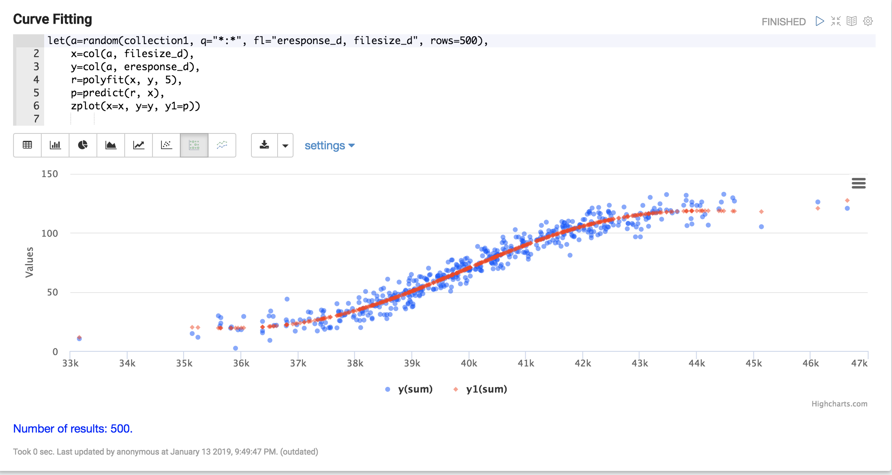

= Math Expressions
:page-children: visualization, math-start, scalar-math, vector-math, variables, matrix-math, vectorization, term-vectors, statistics, probability-distributions, simulations, time-series, regression, numerical-analysis, curve-fitting, dsp, machine-learning, computational-geometry

// Licensed to the Apache Software Foundation (ASF) under one
// or more contributor license agreements.  See the NOTICE file
// distributed with this work for additional information
// regarding copyright ownership.  The ASF licenses this file
// to you under the Apache License, Version 2.0 (the
// "License"); you may not use this file except in compliance
// with the License.  You may obtain a copy of the License at
//
//   http://www.apache.org/licenses/LICENSE-2.0
//
// Unless required by applicable law or agreed to in writing,
// software distributed under the License is distributed on an
// "AS IS" BASIS, WITHOUT WARRANTIES OR CONDITIONS OF ANY
// KIND, either express or implied.  See the License for the
// specific language governing permissions and limitations
// under the License.

== A Visual Guide

== Table of Contents

*<<visualization.adoc#visualization,Visualizations>>*: Gallery of Streaming Expressions and Math Expressions visualizations.

*<<math-start.adoc#getting-started,Getting Started>>*: Getting started with Streaming Expressions, Math Expressions and Visualization.

*<<matrix-math.adoc#search-sample,Searching, Sampling and Aggregation>>*:  Searching, random sampling, aggregation and visualization of result sets.

*<<scalar-math.adoc#scalar-math,Scalar Math>>*: Math functions and visualization applied to numbers.

*<<vector-math.adoc#vector-math,Vector Math>>*: Vector math, manipulation and visualization.

*<<variables.adoc#variables,Variables and Caching>>*: Assigning, visualizing and caching variables.

*<<matrix-math.adoc#matrix-math,Matrix Math>>*: Matrix math and manipulation.

*<<term-vectors.adoc#term-vectors,Text Analysis and Term Vectors>>*: Text analysis and TF-IDF term vectors.

*<<statistics.adoc#statistics,Statistics>>*: Core statistical functions.

*<<probability-distributions.adoc#probability-distributions,Probability>>*: Real, discrete and empirical probability distributions.

*<<simulations.adoc#simulations,Simulations and Sampling Distributions>>*:  Monte Carlo simulations and the Sampling Distribution of the Mean.

*<<regression.adoc#regression,Linear Regression>>*: Simple and multivariate linear regression.

*<<numerical-analysis.adoc#numerical-analysis,Interpolation, Derivatives and Integrals>>*: Numerical analysis math expressions.

*<<dsp.adoc#dsp,Digital Signal Processing>>*: Functions commonly used with digital signal processing.

*<<curve-fitting.adoc#curve-fitting,Curve Fitting>>*: Polynomial, Harmonic and Gaussian curve fitting.

*<<time-series.adoc#time-series,Time Series>>*: Aggregation, smoothing, differencing and anomaly detection of time series.

*<<machine-learning.adoc#machine-learning,Machine Learning>>*: Functions used in machine learning.

*<<computational-geometry.adoc#computational-geometry,Computational Geometry>>*: Convex Hulls and Enclosing Disks.

