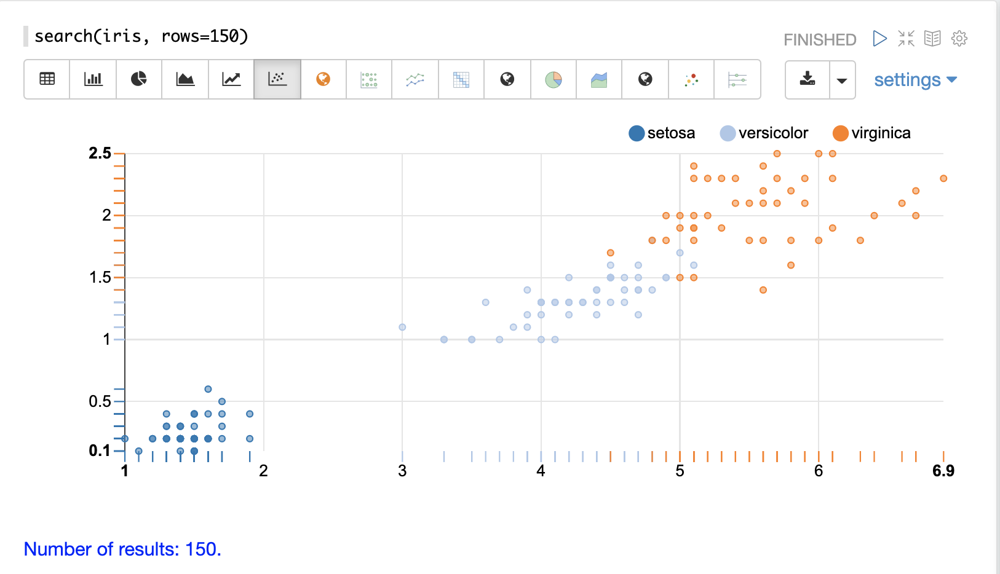

= Streaming Expressions and Math Expressions
:page-children: visualization, math-start, loading, search-sample, transform, scalar-math, vector-math, variables, matrix-math, term-vectors, probability-distributions, statistics, regression, curve-fitting, time-series, numerical-analysis, dsp, simulations, machine-learning, graph, computational-geometry, logs
:page-show-toc: false

// Licensed to the Apache Software Foundation (ASF) under one
// or more contributor license agreements.  See the NOTICE file
// distributed with this work for additional information
// regarding copyright ownership.  The ASF licenses this file
// to you under the Apache License, Version 2.0 (the
// "License"); you may not use this file except in compliance
// with the License.  You may obtain a copy of the License at
//
//   http://www.apache.org/licenses/LICENSE-2.0
//
// Unless required by applicable law or agreed to in writing,
// software distributed under the License is distributed on an
// "AS IS" BASIS, WITHOUT WARRANTIES OR CONDITIONS OF ANY
// KIND, either express or implied.  See the License for the
// specific language governing permissions and limitations
// under the License.

== A Visual Guide

== Table of Contents

*<<visualization.adoc#,Visualizations>>*: Gallery of streaming expression and math expression visualizations.

*<<math-start.adoc#,Getting Started>>*: Getting started with streaming expressions, math expressions, and visualization.

*<<loading.adoc#,Data Loading>>*: Visualizing, transforming and loading CSV files.

*<<search-sample.adoc#,Searching, Sampling and Aggregation>>*: Searching, sampling, aggregation and visualization of result sets.

*<<transform.adoc#,Transforming Data>>*: Transforming and filtering result sets.

*<<scalar-math.adoc#,Scalar Math>>*: Math functions and visualization applied to numbers.

*<<vector-math.adoc#,Vector Math>>*: Vector math, manipulation and visualization.

*<<variables.adoc#, Variables and Vectorization>>*: Vectorizing result sets and assigning and visualizing variables.

*<<matrix-math.adoc#,Matrix Math>>*: Matrix math, manipulation and visualization.

*<<term-vectors.adoc#,Text Analysis and Term Vectors>>*: Text analysis and TF-IDF term vectors.

*<<probability-distributions.adoc#,Probability>>*: Continuous and discrete probability distribution functions.

*<<statistics.adoc#,Statistics>>*: Descriptive statistics, histograms, percentiles, correlation, inference tests and other stats functions.

*<<regression.adoc#,Linear Regression>>*: Simple and multivariate linear regression.

*<<curve-fitting.adoc#,Curve Fitting>>*: Polynomial, harmonic and Gaussian curve fitting.

*<<time-series.adoc#,Time Series>>*: Time series aggregation, visualization, smoothing, differencing, anomaly detection and forecasting.

*<<numerical-analysis.adoc#,Interpolation and Numerical Calculus>>*: Interpolation, derivatives and integrals.

*<<dsp.adoc#,Signal Processing>>*: Convolution, cross-correlation, autocorrelation and fast Fourier transforms.

*<<simulations.adoc#,Simulations>>*: Monte Carlo simulations and random walks

*<<machine-learning.adoc#,Machine Learning>>*: Distance, KNN, DBSCAN, K-means, fuzzy K-means and other ML functions.

*<<graph.adoc#,Graph>>*: Bipartite graphs, in-degree centrality, graph recommenders, temporal graphs and event correlation.

*<<computational-geometry.adoc#,Computational Geometry>>*: Convex Hulls and Enclosing Disks.

*<<logs.adoc#,Appendix A>>*: Solr log analytics and visualization.
