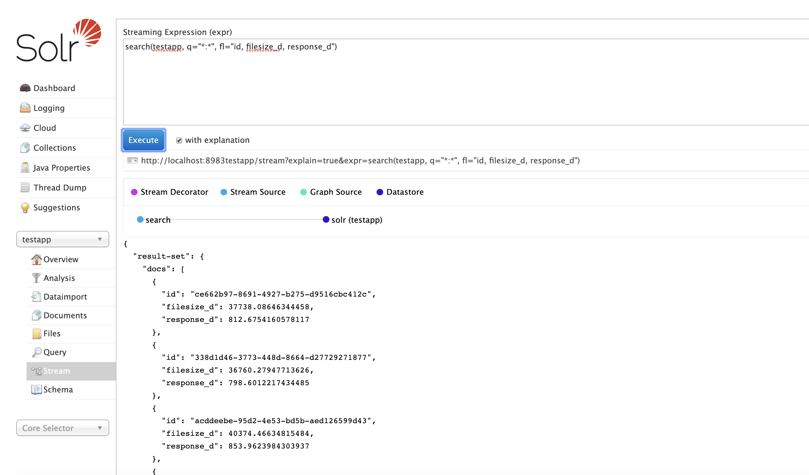
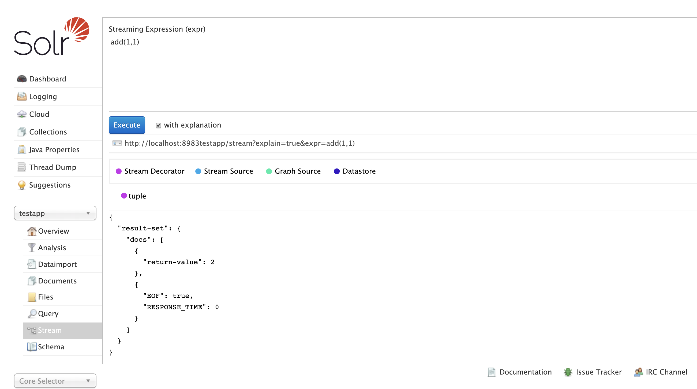
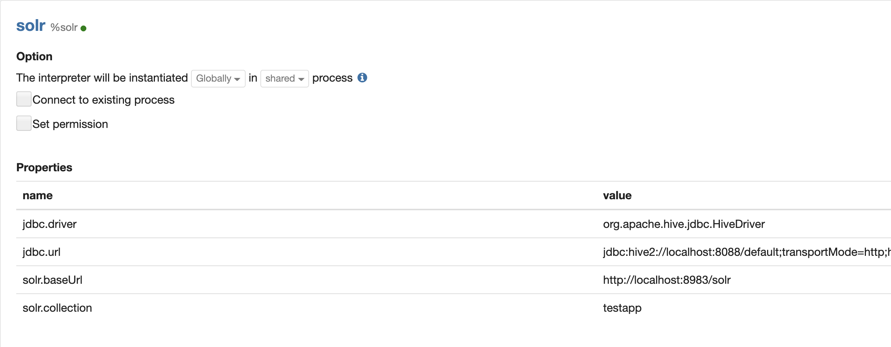

= Getting Started
// Licensed to the Apache Software Foundation (ASF) under one
// or more contributor license agreements.  See the NOTICE file
// distributed with this work for additional information
// regarding copyright ownership.  The ASF licenses this file
// to you under the Apache License, Version 2.0 (the
// "License"); you may not use this file except in compliance
// with the License.  You may obtain a copy of the License at
//
//   http://www.apache.org/licenses/LICENSE-2.0
//
// Unless required by applicable law or agreed to in writing,
// software distributed under the License is distributed on an
// "AS IS" BASIS, WITHOUT WARRANTIES OR CONDITIONS OF ANY
// KIND, either express or implied.  See the License for the
// specific language governing permissions and limitations
// under the License.

== Language

*Streaming Expressions* and *Math Expressions* are function languages that run
inside Solr Cloud. The languages consist of functions
that are designed to be *composed* to form programming logic.

*Streaming Expressions* are functions that return streams of tuples. Streaming Expression functions can be
composed to form a transformation pipeline. The pipeline starts with a *Stream Source*, such as *search*,
which initiates a stream of tuples. One or more *Stream Decorators*, such as *select*, wraps the Stream Source and transforms
the stream of Tuples.

*Math Expressions* are functions that operate over and return primitives and in-memory
arrays and matrices. The core use case for Math Expressions is performing mathematical operations and
visualization.

Streaming Expressions and Math Expressions can be combined to *search,
sample, aggregate, transform, analyze* and *visualize* data in Solr Cloud collections.

== Execution

Solr's /stream handler executes Streaming Expressions and Math Expressions.
The /stream handler compiles the expression, runs the expression logic
and returns a JSON result.

=== Admin Stream Panel

The easiest way to run Streaming Expressions and Math expressions is through
the *stream* panel on the Solr admin
UI.

A sample *search* Streaming Expression is shown in the screenshot below:

A sample *add* Math Expression is shown in the screenshot below:

=== Curl Example

The http interface to the /stream handler can be used to
send an streaming expression request and retrieve the response.

Curl is a useful tool for running streaming expressions when the result
needs to be spooled to disk or is too large for the Solr admin stream panel. Below
is an example of a curl command to the /stream handler.

[source,text]
----
curl --data-urlencode 'expr=search(enron_emails,
                                   q="from:1800flowers*",
                                   fl="from, to",
                                   sort="from asc")' http://localhost:8983/solr/enron_emails/stream

----

The JSON response from the stream handler for this request is shown below:

[source,text]
----
{"result-set":{"docs":[
   {"from":"1800flowers.133139412@s2u2.com","to":"lcampbel@enron.com"},
   {"from":"1800flowers.93690065@s2u2.com","to":"jtholt@ect.enron.com"},
   {"from":"1800flowers.96749439@s2u2.com","to":"alewis@enron.com"},
   {"from":"1800flowers@1800flowers.flonetwork.com","to":"lcampbel@enron.com"},
   {"from":"1800flowers@1800flowers.flonetwork.com","to":"lcampbel@enron.com"},
   {"from":"1800flowers@1800flowers.flonetwork.com","to":"lcampbel@enron.com"},
   {"from":"1800flowers@1800flowers.flonetwork.com","to":"lcampbel@enron.com"},
   {"from":"1800flowers@1800flowers.flonetwork.com","to":"lcampbel@enron.com"},
   {"from":"1800flowers@shop2u.com","to":"ebass@enron.com"},
   {"from":"1800flowers@shop2u.com","to":"lcampbel@enron.com"},
   {"from":"1800flowers@shop2u.com","to":"lcampbel@enron.com"},
   {"from":"1800flowers@shop2u.com","to":"lcampbel@enron.com"},
   {"from":"1800flowers@shop2u.com","to":"ebass@enron.com"},
   {"from":"1800flowers@shop2u.com","to":"ebass@enron.com"},
   {"EOF":true,"RESPONSE_TIME":33}]}
}
----

== Visualization

The visualizations in this guide were performed with Apache Zeppelin using the
Zeppelin-Solr interpreter.

=== Zeppelin-Solr

The Zeppelin-Solr interpreter allows Streaming Expressions and Math Expressions
to be executed and results visualized in Apache Zeppelin. The instructions for
 installing and configuring Zeppelin-Solr can be found on the Github repository for
 the project:
https://github.com/lucidworks/zeppelin-solr

Once installed the Solr Interpreter can be configured to connect to your Solr instance.
The screenshot below shows the panel for configuring Zeppelin-Solr.

Configure the solr.baseUrl and solr.collection to point to the location where the Streaming
Expressions and Math Expressions will be sent for execution. The solr.collection is
just the execution collection and does not need to hold data, although it can hold data.
Streaming Expressions can choose to query any of the collections that are attached
to the same Solr Cloud as the execution collection.

=== zplot

Streaming Expression result sets can be visualized automatically by Zeppelin-Solr.

Math Expression results need to be formatted for visualization using the `zplot` function.
The `zplot` function has support for plotting *vectors*, *matrices*, *probability distributions* and
*2D clustering results*.

There are many examples in the guide which show how to visualize both Streaming Expressions
and Math Expressions.
