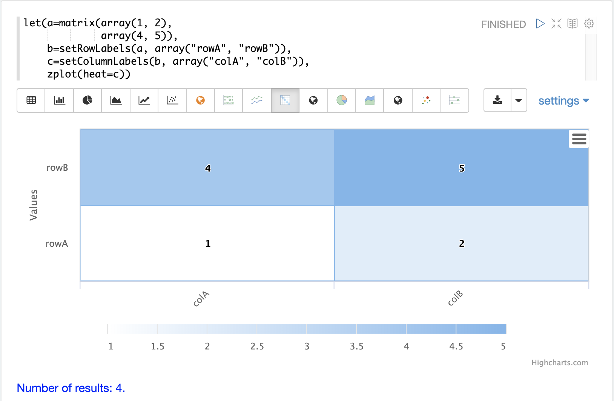

= Matrices and Matrix Math
// Licensed to the Apache Software Foundation (ASF) under one
// or more contributor license agreements.  See the NOTICE file
// distributed with this work for additional information
// regarding copyright ownership.  The ASF licenses this file
// to you under the Apache License, Version 2.0 (the
// "License"); you may not use this file except in compliance
// with the License.  You may obtain a copy of the License at
//
//   http://www.apache.org/licenses/LICENSE-2.0
//
// Unless required by applicable law or agreed to in writing,
// software distributed under the License is distributed on an
// "AS IS" BASIS, WITHOUT WARRANTIES OR CONDITIONS OF ANY
// KIND, either express or implied.  See the License for the
// specific language governing permissions and limitations
// under the License.

Matrices are used as both inputs and outputs of many mathematical functions.
This section of the user guide covers the basics of matrix creation,
manipulation and matrix math.

== Matrices

A matrix can be created with the `matrix` function.
The matrix function is passed a list of `arrays` with
each array representing a *row* in the matrix.

The example below creates a two-by-two matrix.

[source,text]
----
matrix(array(1, 2),
       array(4, 5))
----

When this expression is sent to the `/stream` handler it
responds with:

[source,json]
----
{
  "result-set": {
    "docs": [
      {
        "return-value": [
          [
            1,
            2
          ],
          [
            4,
            5
          ]
        ]
      },
      {
        "EOF": true,
        "RESPONSE_TIME": 0
      }
    ]
  }}
----

== Row and Column Labels

A matrix can have column and rows and labels. The functions
`setRowLabels`, `setColumnLabels`, `getRowLabels`, and `getColumnLabels`
can be used to set and get the labels.
The label values are set using string arrays.

The example below sets the row and column labels. In other sections of the
user guide examples are shown where functions return matrices
with the labels already set.

Below is a simple example of setting and getting row and column labels
on a matrix.

[source,text]
----
let(echo="d, e",
    a=matrix(array(1, 2),
             array(4, 5)),
    b=setRowLabels(a, array("rowA", "rowB")),
    c=setColumnLabels(b, array("colA", "colB")),
    d=getRowLabels(c),
    e=getColumnLabels(c))
----

When this expression is sent to the `/stream` handler it
responds with:

[source,json]
----
{
  "result-set": {
    "docs": [
      {
        "d": [
          "rowA",
          "rowB"
        ],
        "e": [
          "colA",
          "colB"
        ]
      },
      {
        "EOF": true,
        "RESPONSE_TIME": 0
      }
    ]
  }
}
----

== Visualization

The `zplot` function can plot matrices as a heat map using the `heat` named parameter.
Heat maps are powerful visualization tools for displaying <<statistics.adoc#correlation-matrices,*correlation*>> and <<machine-learning.adoc#distance-and-distance-matrices,*distance*>> matrices described later in the guide.
The example below shows a 2x2 matrix visualized using the heat map
visualization in Apache Zeppelin.

NOTE: In the visualization below the rows are read from the *bottom* up, which is a common convention for heat maps.

== Accessing Rows and Columns

The rows and columns of a matrix can be accessed using the `rowAt`
and `colAt` functions.

The example below creates a 2 by 2 matrix and returns the second column of the matrix.
Notice that the matrix is passed variables in this example rather than
directly passed a list of arrays.

[source,text]
----
let(a=array(1, 2),
    b=array(4, 5),
    c=matrix(a, b),
    d=colAt(c, 1))
----

When this expression is sent to the `/stream` handler it
responds with:

[source,json]
----
{
  "result-set": {
    "docs": [
      {
        "d": [
          2,
          5
        ]
      },
      {
        "EOF": true,
        "RESPONSE_TIME": 0
      }
    ]
  }
}
----

== Matrix Attributes

A matrix can also have an arbitrary set of named attributes associated
with it. Certain functions, such as the `termVectors` function,
return matrices that contain attributes that describe data in the matrix.

Attributes can be retrieved by name using the `getAttribute` function and
the entire attribute map can be returned using the `getAttributes`
function.

== Matrix Dimensions

The dimensions of a matrix can be determined using the
`rowCount` and `columnCount` functions.

The example below retrieves the dimensions of a matrix.

[source,text]
----
let(echo="b,c",
    a=matrix(array(1, 2, 3),
             array(4, 5, 6)),
    b=rowCount(a),
    c=columnCount(a))
----

When this expression is sent to the `/stream` handler it
responds with:

[source,json]
----
{
  "result-set": {
    "docs": [
      {
        "b": 2,
        "c": 3
      },
      {
        "EOF": true,
        "RESPONSE_TIME": 0
      }
    ]
  }
}
----

== Matrix Transposition

A matrix can be https://en.wikipedia.org/wiki/Transpose[transposed]
using the `transpose` function.

An example of matrix transposition is shown below:

[source,text]
----
let(a=matrix(array(1, 2),
             array(4, 5)),
    b=transpose(a))
----

When this expression is sent to the `/stream` handler it
responds with:

[source,json]
----
{
  "result-set": {
    "docs": [
      {
        "b": [
          [
            1,
            4
          ],
          [
            2,
            5
          ]
        ]
      },
      {
        "EOF": true,
        "RESPONSE_TIME": 24
      }
    ]
  }
}
----

== Matrix Summations

The rows and columns of a matrix can be summed with the `sumRows` and `sumColumns` functions.
Below is an example of the `sumRows` function which returns an
array with the sum of each row.

[source,text]
----
let(a=matrix(array(1, 2, 3),
             array(4, 5, 6)),
    b=sumRows(a))
----

When this expression is sent to the `/stream` handler it
responds with:

[source,json]
----
{
  "result-set": {
    "docs": [
      {
        "b": [
          6,
          15
        ]
      },
      {
        "EOF": true,
        "RESPONSE_TIME": 2
      }
    ]
  }
}
----

The `grandSum` function returns the sum of all values in the matrix.
Below is an example of the `grandSum` function:

[source,text]
----
let(a=matrix(array(1, 2, 3),
             array(4, 5, 6)),
    b=grandSum(a))
----

When this expression is sent to the `/stream` handler it
responds with:

[source,json]
----
{
  "result-set": {
    "docs": [
      {
        "b": 21
      },
      {
        "EOF": true,
        "RESPONSE_TIME": 0
      }
    ]
  }
}
----

== Scalar Matrix Math

The same scalar math functions that apply to vectors can also be applied to matrices: `scalarAdd`, `scalarSubtract`,
`scalarMultiply`, `scalarDivide`.

Below is an example of the `scalarAdd` function which adds a scalar value to each element in a matrix.

[source,text]
----
let(a=matrix(array(1, 2),
             array(4, 5)),
    b=scalarAdd(10, a))
----

When this expression is sent to the `/stream` handler it responds with:

[source,json]
----
{
  "result-set": {
    "docs": [
      {
        "b": [
          [
            11,
            12
          ],
          [
            14,
            15
          ]
        ]
      },
      {
        "EOF": true,
        "RESPONSE_TIME": 0
      }
    ]
  }
}
----

== Matrix Addition and Subtraction

Two matrices can be added and subtracted using the `ebeAdd` and `ebeSubtract` functions,
which perform element-by-element addition
and subtraction of matrices.

Below is a simple example of an element-by-element addition using `ebeAdd` of a matrix by itself:

[source,text]
----
let(a=matrix(array(1, 2),
             array(4, 5)),
    b=ebeAdd(a, a))
----

When this expression is sent to the `/stream` handler it responds with:

[source,json]
----
{
  "result-set": {
    "docs": [
      {
        "b": [
          [
            2,
            4
          ],
          [
            8,
            10
          ]
        ]
      },
      {
        "EOF": true,
        "RESPONSE_TIME": 0
      }
    ]
  }
}
----

== Matrix Multiplication

Matrix multiplication can be accomplished using the `matrixMult` function.
Below is a simple example of matrix multiplication:

[source,text]
----
let(a=matrix(array(1, 2),
             array(4, 5)),
    b=matrix(array(11, 12),
             array(14, 15)),
    c=matrixMult(a, b))
----

When this expression is sent to the `/stream` handler it
responds with:

[source,json]
----
{
  "result-set": {
    "docs": [
      {
        "c": [
          [
            39,
            42
          ],
          [
            114,
            123
          ]
        ]
      },
      {
        "EOF": true,
        "RESPONSE_TIME": 0
      }
    ]
  }
}
----
