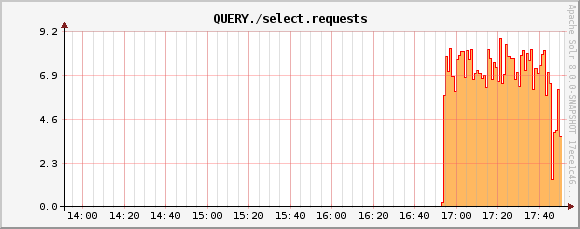
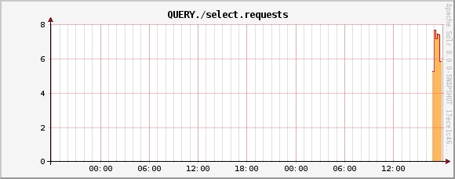
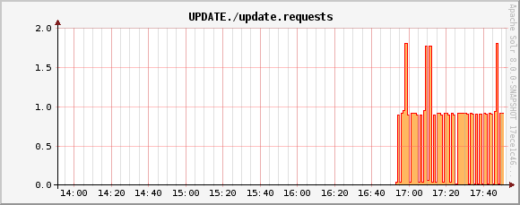
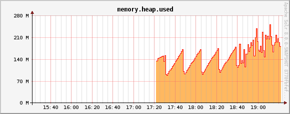
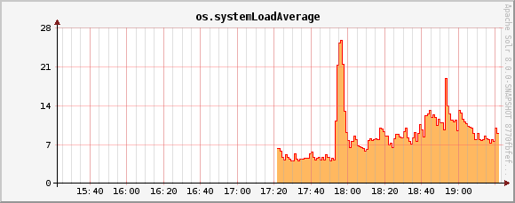

= Metrics History
// Licensed to the Apache Software Foundation (ASF) under one
// or more contributor license agreements.  See the NOTICE file
// distributed with this work for additional information
// regarding copyright ownership.  The ASF licenses this file
// to you under the Apache License, Version 2.0 (the
// "License"); you may not use this file except in compliance
// with the License.  You may obtain a copy of the License at
//
//   http://www.apache.org/licenses/LICENSE-2.0
//
// Unless required by applicable law or agreed to in writing,
// software distributed under the License is distributed on an
// "AS IS" BASIS, WITHOUT WARRANTIES OR CONDITIONS OF ANY
// KIND, either express or implied.  See the License for the
// specific language governing permissions and limitations
// under the License.

[NOTE]
This functionality is now deprecated and will be removed in Solr 9.0.

Solr collects long-term history of certain key metrics both in SolrCloud and in standalone mode.

This information can be used for very simple monitoring and troubleshooting, but also some
SolrCloud components (e.g., autoscaling) can use this data for making informed decisions based on
long-term trends of selected metrics.

[IMPORTANT]
====
The `.system` collection must exist if metrics history should be persisted. If this collection
is absent then metrics history will still be collected and kept in memory but it will be lost
on node restart.
====

== Design

Before discussing how to configure metrics storage, a bit of explanation about how it works may be helpful.

=== Round-Robin Databases

The metrics history data is maintained as multi-resolution time series, with a fixed total number of data points
per metric history (a fixed size window). Multi-resolution refers to the fact that data from the most detailed
time series is periodically resampled to create coarser-grained time series, which in turn
are periodically resampled again to build even coarser-grained series.

In the default configuration selected metrics are sampled every 60 seconds, and the following
time series are built:

* 240 samples, every 60 sec (4 hours)
* 288 samples, every 600 sec (48 hours)
* 336 samples, every 1h (2 weeks)
* 180 samples, every 4h (2 months)
* 365 samples, every 1 day (1 year)

This means that the total number of samples in all data series is constant, and consequently
the size of this data structure is also constant (because the size of the moving window is fixed, and
older samples are replaced by newer ones). This arrangement is referred to as a
round-robin database, and Solr uses implementation of this concept provided by the https://github.com/rrd4j/rrd4j[RRD4j] library.

=== Storage
Databases created with RRD4j are compact - for the time series specified above the total size
of data is around 11kB for each of the primary time series, including its resampled data. Each database may contain
several primary time series ("datasources" in RRD4j parlance) and their re-sampled versions (called
"archives").

This data is updated in memory and then periodically stored in the `.system`
collection in the form of Solr documents with a binary `data_bin` field, each document
containing data of one full database. This method of storage is much more compact and generates less
update operations than storing each data point in a separate Solr document. The Metrics History API allows retrieving
detailed data from each database, including retrieval of all individual datapoints.

Databases are identified primarily by their corresponding metric registry name, so for databases that
keep track of aggregated metrics this will be e.g., `solr.jvm`, `solr.node`, `solr.collection.gettingstarted`.
For databases with non-aggregated metrics the name consists of the registry name, optionally with a node name
to identify databases with the same name coming from different nodes. For example, per-node databases are
named like this: `solr.jvm.localhost:8983_solr`, `solr.node.localhost:7574_solr`, but per-replica names are
already unique across the cluster so they are named like this: `solr.core.gettingstarted.shard1.replica_n1`.

=== Collected Metrics
Currently the following selected metrics are tracked:

* Non-aggregated `solr.core` and aggregated `solr.collection` metrics:
** `QUERY./select.requests`
** `UPDATE./update.requests`
** `INDEX.sizeInBytes`
** `numShards` (aggregated, active shards)
** `numReplicas` (aggregated, active replicas)

* `solr.node` metrics:
** `CONTAINER.fs.coreRoot.usableSpace`
** `numNodes` (aggregated, number of live nodes)

* `solr.jvm` metrics:
** `memory.heap.used`
** `os.processCpuLoad`
** `os.systemLoadAverage`

Separate databases are created for each of these groups, and each database keeps data for
all metrics listed in that group.

NOTE: Currently this list is not configurable. Also, if you change this list in the code then
all existing databases must be first removed from the `.system` collection because RRD4j doesn't allow
adding new datasources once the database is created.

=== SolrRrdBackendFactory
This component is responsible for managing in-memory databases and periodically saving them
to the `.system` collection. If the `.system` collection is not available the updates to the
databases will be kept in memory, until the time when `.system` collection becomes available.

If the `.system` collection is permanently unavailable then data will not be saved and it will
be lost when the Solr node is shut down.

=== MetricsHistoryHandler
This component provides a REST API for accessing the metrics history. It is also responsible for
collecting and periodically updating the in-memory databases.

This handler also performs aggregation of metrics on per-collection level, and on a cluster level.
By default only these aggregated metrics are tracked - historic data from each node and each replica
in each collection is not collected separately. Aggregated databases are managed on the Overseer leader
node but they are still accessible from other nodes even if they are not persisted - the handler redirects
the call from originating node to the current Overseer leader.

The handler assumes that a simple aggregation (sum of partial metric values from each resource) is
sufficient. This happens to make sense for the default built-in sets of metrics. Future extensions will
provide other aggregation strategies (such as, average, max, min, etc.).

This handler is automatically disabled when metrics collection is disabled using the
`<metrics enabled="false">` element in `solr.xml`.

== Metrics History Configuration
There are two ways to configure this subsystem:

* `/clusterprops.json` - this is the primary mechanism. It uses the cluster properties JSON
file in ZooKeeper. Configuration is stored in the `/metrics/history` element in a JSON map.

* `solr.xml` - this is the secondary mechanism, which is not recommended but provided for consistency
with the existing metrics configuration section in this file. Configuration is stored in the
`/solr/metrics/history` element of this file.

Currently the following configuration options are supported:

`enable`:: boolean, default is `true`.
If this is `false` then metrics history is not collected.
When this is `true` then metrics are periodically collected, aggregated and saved.

`enableReplicas`:: boolean, default is `false`. When this is `true` non-aggregated history will be
collected for each replica in each collection. When this is `false` then only aggregated history
is collected for each collection.

`enableNodes`:: boolean, default is `false`. When this is `true` then non-aggregated history will be
collected separately for each node (for node and JVM metrics), with database names consisting of
base registry name with appended node name, e.g., `solr.jvm.localhost:8983_solr`. When this is `false`
then only aggregated history will be collected in a single `solr.jvm` and `solr.node` cluster-wide
databases.

`collectPeriod`:: integer, in seconds, default is `60`. Metrics values will be collected and respective
databases updated every `collectPeriod` seconds.
+
[IMPORTANT]
====
Value of `collectPeriod` must be at least 1, and if it's changed then all previously existing databases
with their historic data must be manually removed (new databases will be created automatically).
====

`syncPeriod`:: integer, in seconds, default is `60`. Data from modified databases will be saved to Solr
every `syncPeriod` seconds. When accessing the databases via REST API in `index` mode the visibility of
most recent data depends on this period, because requests accessing the data from other nodes see only
the version of the data that is stored in the `.system` collection.

=== Example Configuration
Example `/clusterprops.json` file with metrics history configuration that turns on the collection of
per-node metrics history for node and JVM metrics. Typically this file will also contain other
properties unrelated to Metrics History API.

[source,json]
----
{
  "metrics" : {
    "history" : {
      "enable" : true,
      "enableNodes" : true,
      "syncPeriod" : 300
    }
  }
}
----

== Metrics History API
Main entry point for accessing metrics history is `/admin/metrics/history` (or `/api/cluster/metrics/history`
for v2 API).

The following sections describe actions available in this API. All calls have at least one
required parameter `action`.

All responses contain a section named `state`, which reports the current internal state of the API:

`enableReplicas`:: boolean, corresponds to the `enableReplicas` configuration setting.

`enableNodes`:: boolean, corresponds to the `enableNodes` configuration setting.

`mode`:: one of the following values:

* `inactive` - when metrics collection is disabled (but access to existing metrics history is still available).
* `memory` - when metrics history is kept only in memory because `.system` collection doesn't exist. In this mode
clients can access metrics history available on the node that received the request and on the Overseer leader.
* `index` - when metrics history is periodically stored in the `.system` collection. Data available in memory on
the node that accepted the request is retrieved from memory, any other data is retrieved from the
`.system` collection (so it's at least `syncPeriod` old).

Also, the response header section (`responseHeader`) contains `zkConnected` boolean property that indicates
whether the current node is a part of SolrCloud cluster.

=== List Databases
The query parameter `action=list` produces a list of available databases. It supports the following parameters:

`rows`:: optional integer, default is `500`. Maximum number of results to return.

Example:
In this SolrCloud example the API is in `memory` mode, and the request was made to a node that is
not Overseer leader. The API transparently forwarded the request to Overseer leader.

[source,bash]
----
curl http://localhost:7574/solr/admin/metrics/history?action=list&rows=10
----
[source,json]
----
{
  "responseHeader": {
    "zkConnected": true,
    "status": 0,
    "QTime": 9
  },
  "metrics": {
    "solr.collection..system": {
      "lastModified": 1528360138,
      "node": "127.0.0.1:8983_solr"
    },
    "solr.collection.gettingstarted": {
      "lastModified": 1528360138,
      "node": "127.0.0.1:8983_solr"
    },
    "solr.jvm": {
      "lastModified": 1528360138,
      "node": "127.0.0.1:8983_solr"
    },
    "solr.node": {
      "lastModified": 1528360138,
      "node": "127.0.0.1:8983_solr"
    }
  },
  "state": {
    "enableReplicas": false,
    "enableNodes": false,
    "mode": "memory"
  }
}
----

Note the presence of the `node` element in each section, which shows where the information is coming
from - when API is in `memory` mode this indicates which results are local and which ones are retrieved
from the Overseer leader node. When the API is in `index` mode this element always shows the node name that
received the request (because the data is retrieved from the `.system` collection anyway).

Each section also contains a `lastModified` element, which contains the last modification time when the
database was update. All timestamps returned from this API correspond to Unix epoch time in seconds.

=== Database Status
The query parameter `action=status` provides detailed status of the selected database.

The following parameters are supported:

`name`:: string, required: database name.

Example:
[source,bash]
----
curl http://localhost:7574/solr/admin/metrics/history?action=status&name=solr.collection.gettingstarted
----
[source,json]
----
{
  "responseHeader": {
    "zkConnected": true,
    "status": 0,
    "QTime": 46
  },
  "metrics": {
    "solr.collection.gettingstarted": {
      "status": {
        "lastModified": 1528318361,
        "step": 60,
        "datasourceCount": 5,
        "archiveCount": 5,
        "datasourceNames": [
          "numShards",
          "numReplicas",
          "QUERY./select.requests",
          "UPDATE./update.requests",
          "INDEX.sizeInBytes"
        ],
        "datasources": [
          {
            "datasource": "DS:numShards:GAUGE:120:U:U",
            "lastValue": 2
          },
          {
            "datasource": "DS:numReplicas:GAUGE:120:U:U",
            "lastValue": 4
          },
          "..."
        ],
        "archives": [
          {
            "archive": "RRA:AVERAGE:0.5:1:240",
            "steps": 1,
            "consolFun": "AVERAGE",
            "xff": 0.5,
            "startTime": 1528303980,
            "endTime": 1528318320,
            "rows": 240
          },
          {
            "archive": "RRA:AVERAGE:0.5:10:288",
            "steps": 10,
            "consolFun": "AVERAGE",
            "xff": 0.5,
            "startTime": 1528146000,
            "endTime": 1528318200,
            "rows": 288
          },
          "..."
        ]
      },
      "node": "127.0.0.1:7574_solr"
    }
  },
  "state": {
    "enableReplicas": false,
    "enableNodes": false,
    "mode": "index"
  }
}
----

=== Get Database Data
The query parameter `action=get` retrieves all data collected in the specified database.

The following parameters are supported:

`name`:: string, required: database name.
`format`:: string, optional, default is `list`. Format of the data. Currently the
following formats are supported:

* `list` - each datapoint is returned as separate JSON element. For efficiency, for each
datasource in a database for each time series the timestamps are provided separately from
values (because points from all datasources in a given time series share the same timestamps).
* `string` - all datapoint values and timestamps are returned as strings, with values separated by new line character.
* `graph` - data is returned as PNG images, Base64-encoded, containing graphs of each time series values over time.

In each case the response is structured in a similar way: archive identifiers are keys in a JSON map,
all data is placed in a `data` element, with timestamps / datapoints / graphs as values in lists or maps.

==== Examples
This is the output using the default `list` format:
[source,bash]
----
curl http://localhost:8983/solr/admin/metrics/history?action=get&name=solr.collection.gettingstarted
----
[source,json]
----
{
  "responseHeader": {
    "zkConnected": true,
    "status": 0,
    "QTime": 4
  },
  "metrics": {
    "solr.collection.gettingstarted": {
      "data": {
        "RRA:AVERAGE:0.5:1:240": {
          "timestamps": [
            1528304160,
            1528304220,
            "..."
          ],
          "values": {
            "numShards": [
              "NaN",
              2.0,
              "..."
            ],
            "numReplicas": [
              "NaN",
              4.0,
              "..."
            ],
          }
        },
        "RRA:AVERAGE:0.5:10:288": {
          "timestamps": [
            1528145400,
            1528146000,
          ],
      "lastModified": 1528318606,
      "node": "127.0.0.1:8983_solr"
    }
  },
  "state": {
    "enableReplicas": false,
    "enableNodes": false,
    "mode": "index"
  }}}}
----

This is the output when using the `string` format:
[source,bash]
----
curl http://localhost:8983/solr/admin/metrics/history?action=get&name=solr.collection.gettingstarted&format=string
----
[source,json]
----
{
  "responseHeader": {
    "zkConnected": true,
    "status": 0,
    "QTime": 2
  },
  "metrics": {
    "solr.collection.gettingstarted": {
      "data": {
        "RRA:AVERAGE:0.5:1:240": {
          "timestamps": "1527254820\n1527254880\n1527254940\n...",
          "values": {
            "numShards": "NaN\n2.0\n2.0\n2.0\n2.0\n2.0\n2.0\n...",
            "numReplicas": "NaN\n4.0\n4.0\n4.0\n4.0\n4.0\n4.0\n...",
            "QUERY./select.requests": "NaN\n123\n456\n789\n...",
            "..."
          }
        },
        "RRA:AVERAGE:0.5:10:288": {
                "..."
  }}}}}
----

This is the output when using the `graph` format:
[source,bash]
----
curl http://localhost:8983/solr/admin/metrics/history?action=get&name=solr.collection.gettingstarted&format=graph
----
[source,json]
----
{
  "responseHeader": {
    "zkConnected": true,
    "status": 0,
    "QTime": 2
  },
  "metrics": {
    "solr.collection.gettingstarted": {
      "data": {
        "RRA:AVERAGE:0.5:1:240": {
          "values": {
            "numShards": "iVBORw0KGgoAAAANSUhEUgAAAkQAAA...",
            "numReplicas": "iVBORw0KGgoAAAANSUhEUgAAAkQA...",
            "QUERY./select.requests": "iVBORw0KGgoAAAANS...",
            "..."
          }
        },
        "RRA:AVERAGE:0.5:10:288": {
          "values": {
            "numShards": "iVBORw0KGgoAAAANSUhEUgAAAkQAAA...",
            "..."
          }
  }}}}}
----

.Example 60 sec resolution history graph for `QUERY./select.requests` metric

.Example 10 min resolution history graph for `QUERY./select.requests` metric

.Example 60 sec resolution history graph for `UPDATE./update.requests` metric

.Example 60 sec resolution history graph for `memory.heap.used` metric

.Example 60 sec resolution history graph for `os.systemLoadAverage` metric

