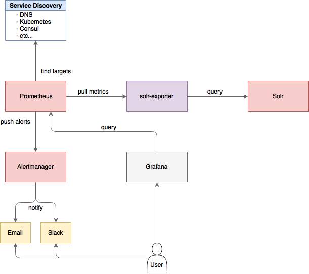

= Monitoring Solr with Prometheus and Grafana
// Licensed to the Apache Software Foundation (ASF) under one
// or more contributor license agreements.  See the NOTICE file
// distributed with this work for additional information
// regarding copyright ownership.  The ASF licenses this file
// to you under the Apache License, Version 2.0 (the
// "License"); you may not use this file except in compliance
// with the License.  You may obtain a copy of the License at
//
//   http://www.apache.org/licenses/LICENSE-2.0
//
// Unless required by applicable law or agreed to in writing,
// software distributed under the License is distributed on an
// "AS IS" BASIS, WITHOUT WARRANTIES OR CONDITIONS OF ANY
// KIND, either express or implied.  See the License for the
// specific language governing permissions and limitations
// under the License.

If you use https://prometheus.io[Prometheus] and https://grafana.com[Grafana] for metrics storage and data visualization, Solr includes a Prometheus exporter to collect metrics and other data.

A Prometheus exporter (`solr-exporter`) allows users to monitor not only Solr metrics which come from <<metrics-reporting.adoc#metrics-api,Metrics API>>, but also facet counts which come from <<searching.adoc#,Searching>> and responses to <<collections-api.adoc#,Collections API>> commands and <<ping.adoc#,PingRequestHandler>> requests.

This graphic provides a more detailed view:

.solr-exporter Diagram

The Prometheus exporter is included in Solr as a contrib, and is located in `contrib/prometheus-exporter` in your Solr instance.

There are three aspects to running `solr-exporter`:

* Modify the `solr-exporter-config.xml` to define the data to collect. Solr has a default configuration you can use, but if you would like to modify it before running the exporter the first time, see the section below <<Exporter Configuration>>.
* Start the exporter from within Solr. See the section below <<Starting the Exporter>>.
* Modify your Prometheus configuration to listen on the correct port. See the section below <<Prometheus Configuration>>

== Starting the Exporter
You can start `solr-exporter` by running `./bin/solr-exporter` (Linux) or `.\bin\solr-exporter.cmd` (Windows) from the `contrib/prometheus-exporter` directory.

See the commands below depending on your operating system and Solr operating mode:

[.dynamic-tabs]
--
[example.tab-pane#solr-exporter-linux]
====
[.tab-label]*Linux*

.Standalone mode
[source,bash]
----
$ cd contrib/prometheus-exporter
$ ./bin/solr-exporter -p 9854 -b http://localhost:8983/solr -f ./conf/solr-exporter-config.xml -n 8
----

.SolrCloud mode
[source,bash]
----
$ cd contrib/prometheus-exporter
$ ./bin/solr-exporter -p 9854 -z localhost:2181/solr -f ./conf/solr-exporter-config.xml -n 16
----
====

[example.tab-pane#solr-exporter-windows]
====
[.tab-label]*Windows*

.Standalone mode
[source,text]
----
> cd contrib\prometheus-exporter
> .\bin\solr-exporter.cmd -p 9854 -b http://localhost:8983/solr -f .\conf\solr-exporter-config.xml -n 8
----

.SolrCloud mode
[source,text]
----
> cd contrib\prometheus-exporter
> .\bin\solr-exporter -p 9854 -z localhost:2181/solr -f .\conf\solr-exporter-config.xml -n 16
----
====
--

=== Command Line Parameters

The list of available parameters for the Prometheus Exporter.
All parameters can be provided via an environment variable, instead of through the command line.

`h`, `--help`::
Displays command line help and usage.

`-p`, `--port`, `$PORT`::
The port where Prometheus will listen for new data. This port will be used to configure Prometheus.
It can be any port not already in use on your server. The default is `9983`.

`-b`, `--baseurl`, `$SOLR_URL`::
The Solr base URL (such as `\http://localhost:8983/solr`) when Solr is running in Standalone mode.
If you are running Solr in SolrCloud mode, do not specify this parameter.
If neither the `-b` parameter nor the `-z` parameter are defined, the default is `-b \http://localhost:8983/solr`.

`-z`, `--zkhost`, `$ZK_HOST`::
The ZooKeeper connect string (such as `localhost:9983`, or `localhost:2181/solr`) when Solr is running in SolrCloud mode.
If you are running Solr in Standalone mode, do not specify this parameter.
If neither the `-b` parameter nor the `-z` parameter are defined, the `-b` parameter default is used.

`-f`, `--config-file`, `$CONFIG_FILE`::
The path to the configuration file that defines the Solr metrics to read. The default is `contrib/prometheus-exporter/conf/solr-exporter-config.xml`.

`-n`, `--num-threads`, `$NUM_THREADS`::
The number of threads. The `solr-exporter` creates thread pools for requests to Solr. Request latency can be improved by increasing the number of threads. The default is `1`.

`-s`, `--scrape-interval`, `$SCRAPE_INTERVAL`::
The number of seconds between collecting metrics from Solr.
The `solr-exporter` collects metrics from Solr every few seconds controlled by this setting.
These metrics are cached and returned regardless of how frequently prometheus is configured to pull metrics from this tool.
The freshness of the metrics can be improved by reducing the scrape interval but do not set it to a very low value because metrics collection can be expensive and can execute arbitrary searches to ping Solr.
The default value is 60 seconds.

The Solr's metrics exposed by `solr-exporter` can be seen at: `\http://localhost:8983/solr/admin/metrics`.

=== Environment Variable Options

The `./bin` scripts provided with the Prometheus Exporter support the use of custom java options through the following environment variables:

`JAVA_HEAP`::
Sets the initial (`Xms`) and max (`Xmx`) Java heap size. The default is `512m`.

`JAVA_MEM`::
Custom java memory settings (e.g., `-Xms1g -Xmx2g`). This is ignored if `JAVA_HEAP` is provided.

`GC_TUNE`::
Custom Java garbage collection settings. The default is `-XX:+UseG1GC`.

`JAVA_OPTS`::
Extra JVM options.

`ZK_CREDS_AND_ACLS`::
Credentials for connecting to a ZooKeeper host that is protected with ACLs.
For more information on what to include in this variable, refer to the section <<zookeeper-access-control.adoc#zookeeper-acls-in-solr-scripts,ZooKeeper Access Control>> or the <<getting-metrics-from-a-secured-solrcloud,example below>>.

`CLASSPATH_PREFIX`::
Location of extra libraries to load when starting the `solr-exporter`.

All <<#command-line-parameters,command line parameters>> are able to be provided via environment variables when using the `./bin` scripts.

=== Getting Metrics from a Secured SolrCloud

Your SolrCloud might be secured by measures described in <<securing-solr.adoc#,Securing Solr>>.
The security configuration can be injected into `solr-exporter` using environment variables in a fashion similar to other clients using <<using-solrj.adoc#,SolrJ>>.
This is possible because the main script picks up <<Environment Variable Options>>  and passes them on to the Java process.

Example for a SolrCloud instance secured by <<basic-authentication-plugin.adoc#,Basic Authentication>>, <<enabling-ssl.adoc#,SSL>> and <<zookeeper-access-control.adoc#,ZooKeeper Access Control>>:

Suppose you have a file `basicauth.properties` with the Solr Basic-Auth credentials:

----
httpBasicAuthUser=myUser
httpBasicAuthPassword=myPassword
----

Then you can start the Exporter as follows (Linux).

[source,bash]
----
$ cd contrib/prometheus-exporter
$ export JAVA_OPTS="-Djavax.net.ssl.trustStore=truststore.p12 -Djavax.net.ssl.trustStorePassword=truststorePassword -Dsolr.httpclient.builder.factory=org.apache.solr.client.solrj.impl.PreemptiveBasicAuthClientBuilderFactory -Dsolr.httpclient.config=basicauth.properties"
$ export ZK_CREDS_AND_ACLS="-DzkCredentialsProvider=org.apache.solr.common.cloud.VMParamsSingleSetCredentialsDigestZkCredentialsProvider -DzkDigestUsername=readonly-user -DzkDigestPassword=zkUserPassword"
$ export CLASSPATH_PREFIX="../../server/solr-webapp/webapp/WEB-INF/lib/commons-codec-1.11.jar"
$ ./bin/solr-exporter -p 9854 -z zk1:2181,zk2:2181,zk3:2181 -f ./conf/solr-exporter-config.xml -n 16
----

Note: The Exporter needs the `commons-codec` library for SSL/BasicAuth, but does not bring it. Therefore the example reuses it from the Solr web app. Of course, you can use a different source.

== Exporter Configuration
The configuration for the `solr-exporter` defines the data to get from Solr. This includes the metrics, but can also include queries to the PingRequestHandler, the Collections API, and a query to any query request handler.

A default example configuration is in `contrib/prometheus-exporter/conf/solr-exporter-config.xml`. Below is a slightly shortened version of it:

[source,xml]
----
<config>

  <rules>

    <ping>
      <lst name="request">
        <lst name="query">
          <str name="path">/admin/ping</str>
        </lst>
        <arr name="jsonQueries">
          <str>
            . as $object | $object |
            (if $object.status == "OK" then 1.0 else 0.0 end) as $value |
            {
              name         : "solr_ping",
              type         : "GAUGE",
              help         : "See following URL: https://lucene.apache.org/solr/guide/ping.html",
              label_names  : [],
              label_values : [],
              value        : $value
            }
          </str>
        </arr>
      </lst>
    </ping>

    <metrics>
      <lst name="request">
        <lst name="query">
          <str name="path">/admin/metrics</str>
          <lst name="params">
            <str name="group">all</str>
            <str name="type">all</str>
            <str name="prefix"></str>
            <str name="property"></str>
          </lst>
        </lst>
        <arr name="jsonQueries">
          <!--
            jetty metrics
          -->
          <str>
            .metrics["solr.jetty"] | to_entries | .[] | select(.key | startswith("org.eclipse.jetty.server.handler.DefaultHandler")) | select(.key | endswith("xx-responses")) as $object |
            $object.key | split(".") | last | split("-") | first as $status |
            $object.value.count as $value |
            {
            name         : "solr_metrics_jetty_response_total",
            type         : "COUNTER",
            help         : "See following URL: https://lucene.apache.org/solr/guide/metrics-reporting.html",
            label_names  : ["status"],
            label_values : [$status],
            value        : $value
            }
          </str>
...
        </arr>
      </lst>
    </metrics>

    <collections>
      <lst name="request">
        <lst name="query">
          <str name="path">/admin/collections</str>
          <lst name="params">
            <str name="action">CLUSTERSTATUS</str>
          </lst>
        </lst>
        <arr name="jsonQueries">
          <str>
            .cluster.live_nodes | length as $value|
            {
              name         : "solr_collections_live_nodes",
              type         : "GAUGE",
              help         : "See following URL: https://lucene.apache.org/solr/guide/collections-api.html#clusterstatus",
              label_names  : [],
              label_values : [],
              value        : $value
            }
          </str>
...
        </arr>
      </lst>
    </collections>

    <search>
      <lst name="request">
        <lst name="query">
          <str name="collection">collection1</str>
          <str name="path">/select</str>
          <lst name="params">
            <str name="q">*:*</str>
            <str name="start">0</str>
            <str name="rows">0</str>
            <str name="json.facet">
              {
                category: {
                  type: terms,
                  field: cat
                }
              }
            </str>
          </lst>
        </lst>
        <arr name="jsonQueries">
          <str>
            .facets.category.buckets[] as $object |
            $object.val as $term |
            $object.count as $value |
            {
              name         : "solr_facets_category",
              type         : "GAUGE",
              help         : "Category facets",
              label_names  : ["term"],
              label_values : [$term],
              value        : $value
            }
          </str>
        </arr>
      </lst>
    </search>

  </rules>

</config>
----

=== Configuration Tags and Elements
The `solr-exporter` works by making a request to Solr according to the definitions in the configuration file, scraping the response, and converting it to a JSON structure Prometheus can understand. The configuration file defines the elements to request, how to scrape them, and where to place the extracted data in the JSON template.

The `solr-exporter` configuration file always starts and closes with two simple elements:

[source,xml]
----
<config>
  <rules>

  </rules>
</config>
----

Between these elements, the data the `solr-exporter` should request is defined. There are several possible types of requests to make:

[horizontal]
`<ping>`:: Scrape the response to a <<ping.adoc#,PingRequestHandler>> request.
`<metrics>`:: Scrape the response to a <<metrics-reporting.adoc#metrics-api,Metrics API>> request.
`<collections>`:: Scrape the response to a <<collections-api.adoc#,Collections API>> request.
`<search>`:: Scrape the response to a <<searching.adoc#,search>> request.

Within each of these types, we need to define the query and how to work with the response. To do this, we define two additional elements:

`<query>`::
Defines the query parameter(s) used for the request. This section uses several additional properties to define your query:

`collection`::: The collection to issue the query against. Only used in SolrCloud mode.
`core`::: The core to issue the query against. Only used in Standalone mode.
`path`::: The path to the query endpoint where the request will be sent. Examples include `admin/metrics` or `/select` or `admin/collections`.
`params`::: Additional query parameters. These will vary depending on the request type and the endpoint. For example, if using the Metrics endpoint, you can add parameters to limit the query to a certain group and/or prefix. If you're using the Collections API, the command you want to use would be a parameter.

`<jsonQueries>`::
This is an array that defines one or more JSON Queries in jq syntax. For more details about how to structure these queries, see https://stedolan.github.io/jq/manual/[the jq user manual].
+
A jq query has to output JSON in the following format:
+
[source,json]
----
{
  "name": "solr_ping",
  "type": "GAUGE",
  "help": "See following URL: https://lucene.apache.org/solr/guide/ping.html",
  "label_names": ["base_url","core"],
  "label_values": ["http://localhost:8983/solr","collection1"],
  "value": 1.0
}
----

See the section <<Exposition Format>> below for information about what information should go into each property, and an example of how the above example is translated for Prometheus.

=== Exposition Format

The `solr-exporter` converts the JSON to the following exposition format:

[source,plain]
----
# TYPE <name> <type>
# HELP <name> <help>
<name>{<label_names[0]>=<label_values[0]>,<label_names[1]>=<labelvalues[1]>,...} <value>
----

The following parameters should be set:

`name`::
The metric name to set. For more details, see https://prometheus.io/docs/practices/naming/[Prometheus naming best practices].

`type`::
The type of the metric, can be `COUNTER`, `GAUGE`, `SUMMARY`, `HISTOGRAM` or `UNTYPED`. For more details, see https://prometheus.io/docs/concepts/metric_types/[Prometheus metric types].

`help`::
Help text for the metric.

`label_names`::
Label names for the metric. For more details, see https://prometheus.io/docs/practices/naming/[Prometheus naming best practices].

`label_values`::
Label values for the metric. For more details, see https://prometheus.io/docs/practices/naming/[Prometheus naming best practices].

`value`::
Value for the metric. Value must be set to Double type.

For example, `solr-exporter` converts the JSON in the previous section to the following:

[source,plain]
----
# TYPE solr_ping gauge
# HELP solr_ping See following URL: https://lucene.apache.org/solr/guide/ping.html
solr_ping{base_url="http://localhost:8983/solr",core="collection1"} 1.0
----

== Prometheus Configuration

Prometheus is a separate server that you need to download and deploy.   More information can be found at the Prometheus https://prometheus.io/docs/prometheus/latest/getting_started/[Getting Started] page.

In order for Prometheus to know about the `solr-exporter`, the listen address must be added to the Prometheus server's `prometheus.yml` configuration file, as in this example:

[source,plain]
----
scrape_configs:
  - job_name: 'solr'
    static_configs:
      - targets: ['localhost:9854']
----

If you already have a section for `scrape_configs`, you can add the `job_name` and other values in the same section.

When you apply the settings to Prometheus, it will start to pull Solr's metrics from `solr-exporter`.

You can test that the Prometheus server, `solr-exporter`, and Solr are working together by browsing to http://localhost:9090 and
doing a query for `solr_ping` metric in the Prometheus GUI:

.Prometheus Solr Ping expression
image::images/monitoring-solr-with-prometheus-and-grafana/prometheus-solr-ping.png[image,width=800]

== Sample Grafana Dashboard

Grafana is another separate server that you need to download and deploy.   More information can be found on the Grafana https://grafana.com/docs/grafana/latest/[Documentation] site.
Grafana consumes data from many sources, including the Prometheus server that you previously set up.

A Grafana sample dashboard is provided in the following JSON file: `contrib/prometheus-exporter/conf/grafana-solr-dashboard.json`.
You can place this with your other Grafana dashboard configurations and modify it as necessary depending on any customization you've done for the `solr-exporter` configuration.

TIP: You can directly import the Solr dashboard https://grafana.com/grafana/dashboards/12456[via grafana.com] by using the Import function with the dashboard id `12456`.

This screenshot shows what it might look like:

.Grafana Dashboard
image::images/monitoring-solr-with-prometheus-and-grafana/grafana-solr-dashboard.png[image,width=800]
