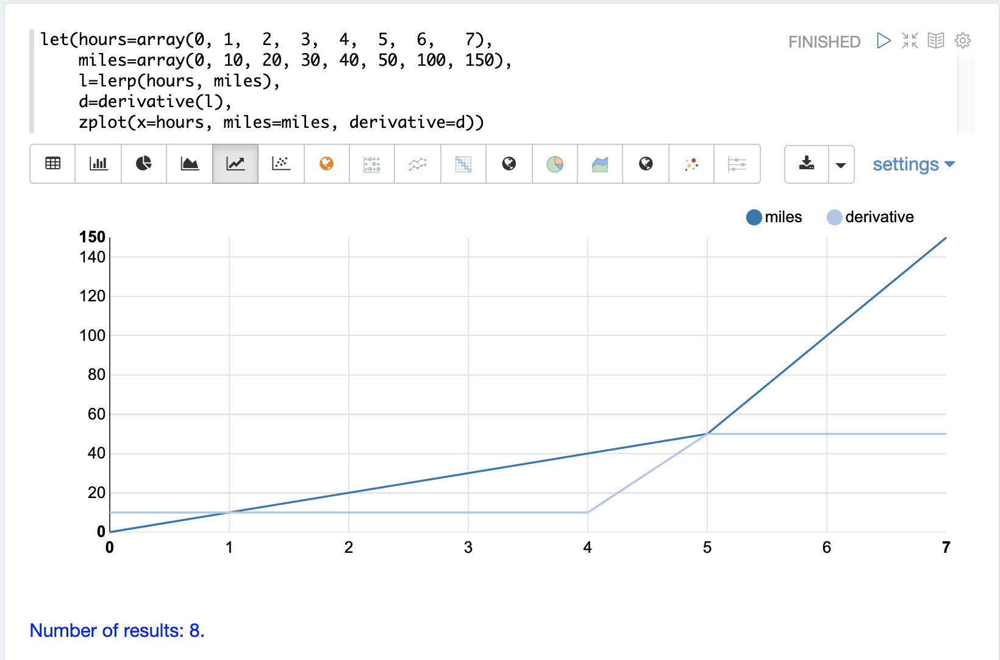

= Interpolation, Derivatives and Integrals
// Licensed to the Apache Software Foundation (ASF) under one
// or more contributor license agreements.  See the NOTICE file
// distributed with this work for additional information
// regarding copyright ownership.  The ASF licenses this file
// to you under the Apache License, Version 2.0 (the
// "License"); you may not use this file except in compliance
// with the License.  You may obtain a copy of the License at
//
//   http://www.apache.org/licenses/LICENSE-2.0
//
// Unless required by applicable law or agreed to in writing,
// software distributed under the License is distributed on an
// "AS IS" BASIS, WITHOUT WARRANTIES OR CONDITIONS OF ANY
// KIND, either express or implied.  See the License for the
// specific language governing permissions and limitations
// under the License.

Interpolation, derivatives and integrals are three interrelated topics which are part of the field of mathematics called numerical analysis. This section explores the math expressions available for numerical anlysis.

== Interpolation

Interpolation is used to construct new data points between a set of known control of points.
The ability to predict new data points allows for sampling along the curve defined by the
control points.

The interpolation functions described below all return an _interpolation function_
that can be passed to other functions which make use of the sampling capability.

If returned directly the interpolation function returns an array containing predictions for each of the
control points. This is useful in the case of `loess` interpolation which first smooths the control points
and then interpolates the smoothed points. All other interpolation functions simply return the original
control points because interpolation predicts a curve that passes through the original control points.

There are different algorithms for interpolation that will result in different predictions
along the curve. The math expressions library currently supports the following
interpolation functions:

* `lerp`: Linear interpolation predicts points that pass through each control point and
  form straight lines between control points.
* `spline`: Spline interpolation predicts points that pass through each control point
and form a smooth curve between control points.
* `akima`: Akima spline interpolation is similar to spline interpolation but is stable to outliers.
* `loess`: Loess interpolation first performs a non-linear local regression to smooth the original
control points. Then a spline is used to interpolate the smoothed control points.

=== Sampling Along the Curve

One way to better understand interpolation is to visualize what it means to sample along a curve. The example
below zooms in on a specific region of a curve by sampling the curve between a specific *x* axis range.

image::images/math-expressions/interpolate1.png[]

The visualization above first creates two arrays with *x* and *y* axis points. Notice that the *x* axis ranges from
 0 to 9. Then the `akima`, `spline` and `lerp`
functions are applied to the vectors to create three interpolation functions.

Then 500 hundred random samples are drawn from a uniform distribution between 0 and 3. These are
the new zoomed in *x* axis points, between 0 and 3. Notice that we are sampling a specific
area of the curve.

Then the `predict` function is used to predict *y* axis points for
the sampled *x* axis, for all three interpolation functions. Finally all three prediction vectors
are plotted with the sampled *x* axis points.

The red line is the `lerp` interpolation, the blue line is the `akima` and the purple line is
the `spline` interpolation. You can see they each produce different curves in between the control
points.

=== Smoothing Interpolation

The `loess` function is a smoothing interpolator which means it doesn't derive
a function that passes through the original control points. Instead the `loess` function
returns a function that smooths the original control points.

A technique known as local regression is used to compute the smoothed curve.  The size of the
neighborhood of the local regression can be adjusted
to control how close the new curve conforms to the original control points.

The `loess` function is passed *`x`*- and *`y`*-axes and fits a smooth curve to the data.
If only a single array is provided it is treated as the *`y`*-axis and a sequence is generated
for the *`x`*-axis.

The example below shows the `loess` function being used to model a monthly
time series. In the example the `timeseries` function is used generate
a monthly time series of average closing prices for the stock ticker
*amzn*. The *date_dt* and *avg(close_d)* fields from the time series
are then vectorized and stored in variables *x* and *y*. The `loess`
function is then applied to the *y* vector containing the average closing
prices. The *bandwidth* named parameter specifies the percentage
of the data set used to compute the local regression. The `loess` function
returns the fitted model of smoothed data points.

The `zplot` function is then used to plot the *x*, *y* and *y1*
variables.

image::images/math-expressions/loess.png[]

== Derivatives

The derivative of a function measures the rate of change of the *`y`* value in respects to the
rate of change of the *`x`* value.

The `derivative` function can compute the derivative of any of the interpolation functions.
Each interpolation function will produce different derivatives that match the characteristics
of the interpolation function.

A simple example shows how the `derivative` function is used with interpolation functions.

In the example two vectors are created, one representing hours and one representing
miles traveled. The `lerp` function function is then used to create a linear interpolation
of the *hours* and *miles* vectors. The `derivatve` function is then applied to the
linear interpolation function. Finally `zplot` is used to plot the *hours* on the *x* axis and
*miles* on *y* axis, as well as the derivative at each *x* axis point.

Notice that miles traveled line has a slope of 10 until the 5th hour where
it abrubtly changes to a a slope of 50. The derivative line visualizes the
changes in slope. Notice that the derivative are calculated along
straight lines showing immediate change from one point to the next. This
is because linear intepolation (`lerp`) is used as the interpolation
function. If `spline` or `akima` had been used it would have produced
a derivative with rounded curves.

The example below shows how to plot the derivative for a time series generated
by the `timeseries` function. In the example a monthly time series is
generated for the average closing price for the stock ticker `amzn`.
The *avg(close)* column is vectorized and interpolated using linear
interpolation (`lerp`).  The `zplot` function is the used to plot the derivative
of the time series.

image::images/math-expressions/derivative2.png[]

The `derivative` function can also be applied to other functions
such as the `oscillate` function and the `derivative` function itself.
In the example below the `oscillate` function is used to produce a sine wave.
The `derivative` function is then used to create a derivative of the sine
wave which is set to variable y1. Then the `derivative` function operates
over the first derivative to take the derivative of the derivative. This
is known as the second derivative, which is used to show the acceration of
the rate of the change.

The `zplot` function is then used to plot the sine wave (blue), the first derivative
(yellow) and the second derivative (green).

image::images/math-expressions/derivatives.png[]

== Integrals

An integral is a measure of the volume underneath a curve.
The `integrate` function computes an integral for a specific
range of an interpolated curve.

In the example below the `integrate` function computes an
integral for the entire range of the curve, 0 through 20.

[source,text]
----
let(x=array(0, 1, 2, 3, 4, 5, 6, 7, 8, 9, 10, 11, 12, 13, 14, 15, 16, 17, 18, 19, 20),
    y=array(0, 1, 2, 3, 4, 5.7, 6, 7, 7, 7,6, 7, 7, 7, 6, 5, 5, 3, 2, 1, 0),
    curve=loess(x, y, bandwidth=.3),
    integral=integrate(curve,  0, 20))
----

When this expression is sent to the `/stream` handler it
responds with:

[source,json]
----
{
  "result-set": {
    "docs": [
      {
        "integral": 90.17446104846645
      },
      {
        "EOF": true,
        "RESPONSE_TIME": 0
      }
    ]
  }
}
----

In the next example an integral is computed for the range of 0 through 10.

[source,text]
----
let(x=array(0, 1, 2, 3, 4, 5, 6, 7, 8, 9, 10, 11, 12, 13, 14, 15, 16, 17, 18, 19, 20),
    y=array(0, 1, 2, 3, 4, 5.7, 6, 7, 7, 7,6, 7, 7, 7, 6, 5, 5, 3, 2, 1, 0),
    curve=loess(x, y, bandwidth=.3),
    integral=integrate(curve,  0, 10))
----

When this expression is sent to the `/stream` handler it
responds with:

[source,json]
----
{
  "result-set": {
    "docs": [
      {
        "integral": 45.300912584519914
      },
      {
        "EOF": true,
        "RESPONSE_TIME": 0
      }
    ]
  }
}
----

== Bicubic Spline

The `bicubicSpline` function can be used to interpolate and predict values
anywhere within a grid of data.

A simple example will make this more clear:

[source,text]
----
let(years=array(1998, 2000, 2002, 2004, 2006),
    floors=array(1, 5, 9, 13, 17, 19),
    prices = matrix(array(300000, 320000, 330000, 350000, 360000, 370000),
                    array(320000, 330000, 340000, 350000, 365000, 380000),
                    array(400000, 410000, 415000, 425000, 430000, 440000),
                    array(410000, 420000, 425000, 435000, 445000, 450000),
                    array(420000, 430000, 435000, 445000, 450000, 470000)),
    bspline=bicubicSpline(years, floors, prices),
    prediction=predict(bspline, 2003, 8))
----

In this example a bicubic spline is used to interpolate a matrix of real estate data.
Each row of the matrix represent specific `years`. Each column of the matrix
represents `floors` of the building. The grid of numbers is the average selling price of
an apartment for each year and floor. For example in 2002 the average selling price for
the 9th floor was `415000` (row 3, column 3).

The `bicubicSpline` function is then used to
interpolate the grid, and the `predict` function is used to predict a value for year 2003, floor 8.
Notice that the matrix does not include a data point for year 2003, floor 8. The `bicupicSpline`
function creates that data point based on the surrounding data in the matrix:

[source,json]
----
{
  "result-set": {
    "docs": [
      {
        "prediction": 418279.5009328358
      },
      {
        "EOF": true,
        "RESPONSE_TIME": 0
      }
    ]
  }
}
----
