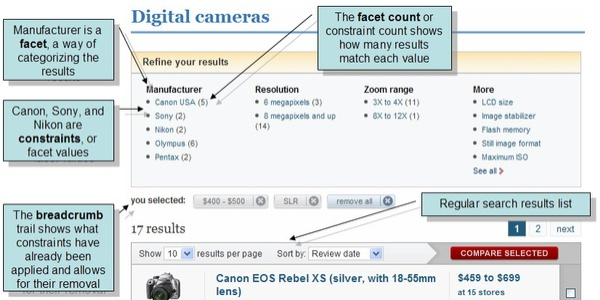
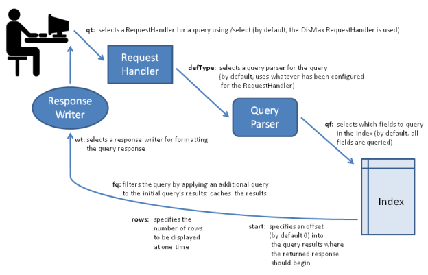

= Overview of Searching in Solr
// Licensed to the Apache Software Foundation (ASF) under one
// or more contributor license agreements.  See the NOTICE file
// distributed with this work for additional information
// regarding copyright ownership.  The ASF licenses this file
// to you under the Apache License, Version 2.0 (the
// "License"); you may not use this file except in compliance
// with the License.  You may obtain a copy of the License at
//
//   http://www.apache.org/licenses/LICENSE-2.0
//
// Unless required by applicable law or agreed to in writing,
// software distributed under the License is distributed on an
// "AS IS" BASIS, WITHOUT WARRANTIES OR CONDITIONS OF ANY
// KIND, either express or implied.  See the License for the
// specific language governing permissions and limitations
// under the License.

Solr offers a rich, flexible set of features for search. To understand the extent of this flexibility, it's helpful to begin with an overview of the steps and components involved in a Solr search.

When a user runs a search in Solr, the search query is processed by a *request handler*. A request handler is a Solr plug-in that defines the logic to be used when Solr processes a request. Solr supports a variety of request handlers. Some are designed for processing search queries, while others manage tasks such as index replication.

Search applications select a particular request handler by default. In addition, applications can be configured to allow users to override the default selection in preference of a different request handler.

To process a search query, a request handler calls a *query parser*, which interprets the terms and parameters of a query. Different query parsers support different syntax. Solr's default query parser is known as the <<the-standard-query-parser.adoc#,Standard Query Parser>>,or more commonly just the "lucene" query parser. Solr also includes the <<the-dismax-query-parser.adoc#,DisMax>>query parser, and the <<the-extended-dismax-query-parser.adoc#,Extended DisMax>> (eDisMax) query parser. The <<the-standard-query-parser.adoc#,standard>> query parser's syntax allows for greater precision in searches, but the DisMax query parser is much more tolerant of errors. The DisMax query parser is designed to provide an experience similar to that of popular search engines such as Google, which rarely display syntax errors to users. The Extended DisMax query parser is an improved version of DisMax that handles the full Lucene query syntax while still tolerating syntax errors. It also includes several additional features.

In addition, there are <<common-query-parameters.adoc#,common query parameters>> that are accepted by all query parsers.

Input to a query parser can include:

* search strings---that is, _terms_ to search for in the index
* _parameters for fine-tuning the query_ by increasing the importance of particular strings or fields, by applying Boolean logic among the search terms, or by excluding content from the search results
* _parameters for controlling the presentation of the query response_, such as specifying the order in which results are to be presented or limiting the response to particular fields of the search application's schema.

Search parameters may also specify a *filter query*. As part of a search response, a filter query runs a query against the entire index and caches the results. Because Solr allocates a separate cache for filter queries, the strategic use of filter queries can improve search performance. (Despite their similar names, query filters are not related to analysis filters. Filter queries perform queries at search time against data already in the index, while analysis filters, such as Tokenizers, parse content for indexing, following specified rules).

A search query can request that certain terms be highlighted in the search response; that is, the selected terms will be displayed in colored boxes so that they "jump out" on the screen of search results. <<highlighting.adoc#,*Highlighting*>> can make it easier to find relevant passages in long documents returned in a search. Solr supports multi-term highlighting. Solr includes a rich set of search parameters for controlling how terms are highlighted.

Search responses can also be configured to include *snippets* (document excerpts) featuring highlighted text. Popular search engines such as Google and Yahoo! return snippets in their search results: 3-4 lines of text offering a description of a search result.

To help users zero in on the content they're looking for, Solr supports grouping search results to aid further exploration.

<<faceting.adoc#,*Faceting*>> is the arrangement of search results into categories (which are based on indexed terms). Within each category, Solr reports on the number of hits for relevant term, which is called a facet constraint. Faceting makes it easy for users to explore search results on sites such as movie sites and product review sites, where there are many categories and many items within a category.

The screen shot below shows an example of faceting from the CNET Web site (CBS Interactive Inc.), which was the first site to use Solr.

Faceting makes use of fields defined when the search applications were indexed. In the example above, these fields include categories of information that are useful for describing digital cameras: manufacturer, resolution, and zoom range.

Solr also supports a feature called <<morelikethis.adoc#,MoreLikeThis>>, which enables users to submit new queries that focus on particular terms returned in an earlier query. MoreLikeThis queries can make use of faceting or clustering to provide additional aid to users.

A Solr component called a <<response-writers.adoc#,*response writer*>> manages the final presentation of the query response. Solr includes a variety of response writers, including an <<response-writers.adoc#standard-xml-response-writer,XML Response Writer>> and a <<response-writers.adoc#json-response-writer,JSON Response Writer>>.

The diagram below summarizes some key elements of the search process.

