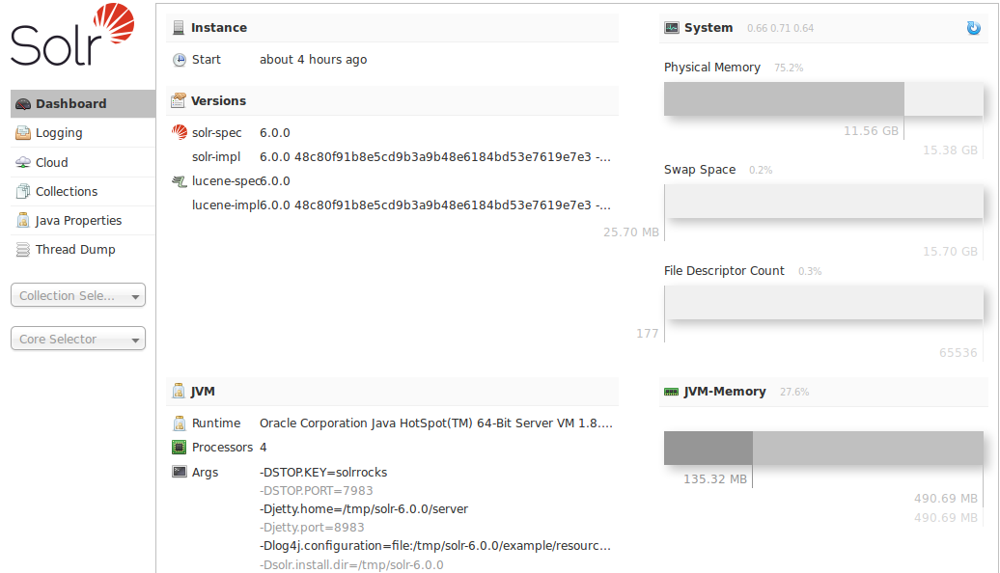
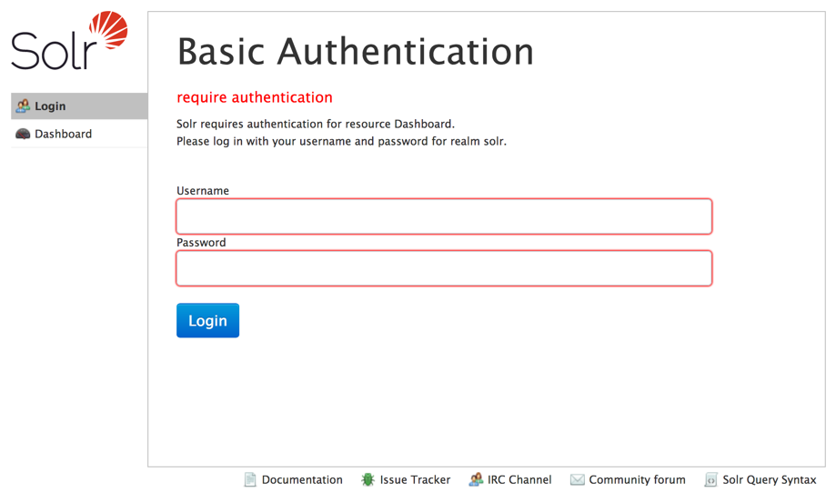
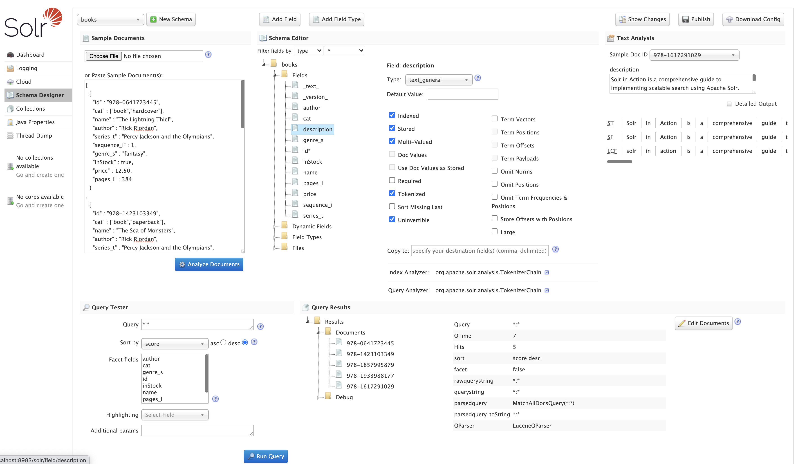
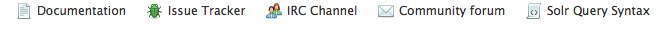

= Overview of the Solr Admin UI
// Licensed to the Apache Software Foundation (ASF) under one
// or more contributor license agreements.  See the NOTICE file
// distributed with this work for additional information
// regarding copyright ownership.  The ASF licenses this file
// to you under the Apache License, Version 2.0 (the
// "License"); you may not use this file except in compliance
// with the License.  You may obtain a copy of the License at
//
//   http://www.apache.org/licenses/LICENSE-2.0
//
// Unless required by applicable law or agreed to in writing,
// software distributed under the License is distributed on an
// "AS IS" BASIS, WITHOUT WARRANTIES OR CONDITIONS OF ANY
// KIND, either express or implied.  See the License for the
// specific language governing permissions and limitations
// under the License.

Solr features a Web interface that provides online access to many Solr configuration options and features.

== Dashboard

Accessing the URL `\http://hostname:8983/solr/` will show the main dashboard, which is divided into two parts.

.Solr Dashboard

The left-side of the screen is a menu under the Solr logo that provides the navigation through the screens of the UI.

The first set of links are for system-level information and configuration and provide access to <<logging.adoc#,Logging>>, <<collections-core-admin.adoc#,Collection/Core Administration>>, and <<java-properties.adoc#,Java Properties>>, among other things.

At the end of this information is at least one pulldown listing Solr cores configured for this instance.
On <<solrcloud.adoc#,SolrCloud>> nodes, an additional pulldown list shows all collections in this cluster.
Clicking on a collection or core name shows secondary menus of information for the specified collection or core, such as a <<schema-browser-screen.adoc#,Schema Browser>>, <<files-screen.adoc#,Config Files>>, <<plugins-stats-screen.adoc#,Plugins & Statistics>>, and an ability to perform <<query-screen.adoc#,Queries>> on indexed data.

The left-side navigation appears on every screen, while the center changes to  the detail of the option selected.
The Dashboard shows several information items in the center of the screen, including system uptime, the version being run, system-level data, JVM arguments, and the security plugins enabled (if any).

Under the covers, the Solr Admin UI uses the same HTTP APIs available to all clients to access Solr-related data to drive an external interface.

[TIP]
====
The path to the Solr Admin UI given above is `\http://hostname:port/solr`, which redirects to `\http://hostname:port/solr/\#/`. A convenience redirect is also supported, so simply accessing the Admin UI at `\http://hostname:port/` will also redirect to `\http://hostname:port/solr/#/`.
====

== Login Screen

If authentication has been enabled, Solr will present a login screen to unauthenticated users before allowing them further access to the Admin UI.

.Login Screen

This login screen currently only works with Basic Authentication.
See the section <<basic-authentication-plugin.adoc#,Basic Authentication Plugin>> for
 details on how to configure Solr to use this method of authentication.

Once logged in, the left-hand navigation will show the current user with an option to logout.

If Kerberos is enabled and the user has a valid ticket, the login screen will be skipped.
However, if the user does not have a valid ticket, they will see a message that they need to obtain a valid ticket before continuing.

== Schema Designer

The <<schema-designer.adoc#,Schema Designer>> screen provides an interactive experience to create a schema using sample data.

.Only Visible When Using SolrCloud
[NOTE]
====
The Schema Designer is only available on Solr instances running in <<solrcloud.adoc#,SolrCloud>> mode.
====

== Getting Assistance

At the bottom of each screen of the Admin UI is a set of links that can be used to get more assistance with configuring and using Solr.

.Assistance icons

These icons include the following links.

// TODO: Change column width to %autowidth.spread when https://github.com/asciidoctor/asciidoctor-pdf/issues/599 is fixed

[cols="25,75",options="header"]
|===
|Link |Description
|Documentation |Navigates to the Apache Solr documentation hosted on https://solr.apache.org/.
|Issue Tracker |Navigates to the JIRA issue tracking server for the Apache Solr project. This server resides at https://issues.apache.org/jira/browse/SOLR.
|IRC Channel |Navigates to Solr's http://en.wikipedia.org/wiki/Internet_Relay_Chat[IRC] live-chat room: http://webchat.freenode.net/?channels=#solr.
|Community forum |Navigates to the Apache Wiki page which has further information about ways to engage in the Solr User community mailing lists: https://cwiki.apache.org/confluence/display/solr/UsingMailingLists.
|Solr Query Syntax |Navigates to the section <<query-syntax-and-parsing.adoc#,Query Syntax and Parsing>> in this Reference Guide.
|===

These links cannot be modified without editing the `index.html` in the `server/solr/solr-webapp` directory that contains the Admin UI files.
