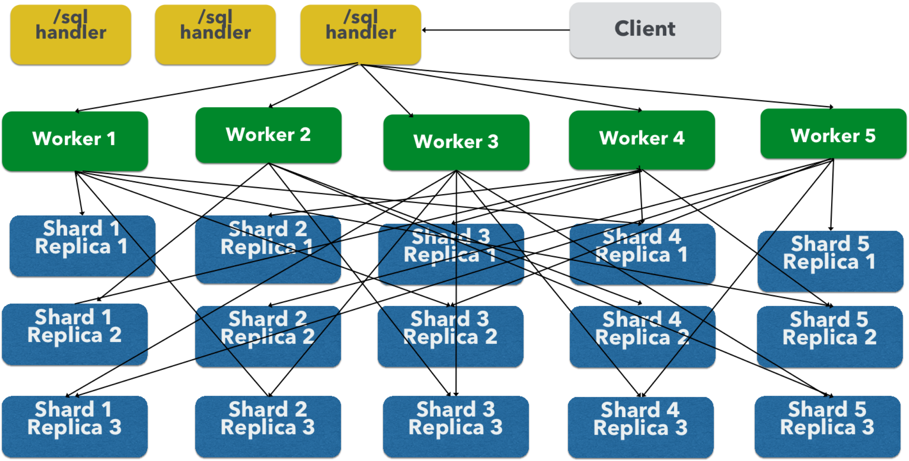

= Parallel SQL Interface
:page-children: solr-jdbc-dbvisualizer, solr-jdbc-squirrel-sql, solr-jdbc-apache-zeppelin, solr-jdbc-python-jython, solr-jdbc-r
// Licensed to the Apache Software Foundation (ASF) under one
// or more contributor license agreements.  See the NOTICE file
// distributed with this work for additional information
// regarding copyright ownership.  The ASF licenses this file
// to you under the Apache License, Version 2.0 (the
// "License"); you may not use this file except in compliance
// with the License.  You may obtain a copy of the License at
//
//   http://www.apache.org/licenses/LICENSE-2.0
//
// Unless required by applicable law or agreed to in writing,
// software distributed under the License is distributed on an
// "AS IS" BASIS, WITHOUT WARRANTIES OR CONDITIONS OF ANY
// KIND, either express or implied.  See the License for the
// specific language governing permissions and limitations
// under the License.

Solr's Parallel SQL Interface brings the power of SQL to SolrCloud.

The SQL interface seamlessly combines SQL with Solr's full-text search capabilities. Both MapReduce style and JSON Facet API aggregations are supported, which means the SQL interface can be used to support both *high query volume* and *high cardinality* use cases.

== SQL Architecture

The SQL interface allows sending a SQL query to Solr and getting documents streamed back in response. Under the covers, Solr's SQL interface uses the Apache Calcite SQL engine to translate SQL queries to physical query plans implemented as <<streaming-expressions.adoc#,Streaming Expressions>>.

=== Solr Collections and DB Tables

In a standard `SELECT` statement such as `SELECT <expressions> FROM <table>`, the table names correspond to Solr collection names. Table names are case insensitive.

Column names in the SQL query map directly to fields in the Solr index for the collection being queried. These identifiers are case sensitive. Aliases are supported, and can be referenced in the `ORDER BY` clause.

The `*` syntax to indicate all fields is only supported for queries with a `LIMIT` and includes the `score` field. The `score` field can be used only with queries that contain a `LIMIT` clause.

For example, we could index Solr's sample documents and then construct an SQL query like this:

[source,sql]
----
SELECT manu as mfr, price as retail FROM techproducts
----

The collection in Solr we are using is "techproducts", and we've asked for the "manu" and "price" fields to be returned and aliased with new names. While this example does not use those aliases, we could build on this to ORDER BY one or more of those fields.

More information about how to structure SQL queries for Solr is included in the section <<Solr SQL Syntax>> below.

=== Aggregation Modes

The SQL feature of Solr can work with aggregations (grouping of results) in two ways:

* `facet`: This is the *default* aggregation mode, which uses the JSON Facet API or StatsComponent for aggregations. In this scenario the aggregations logic is pushed down into the search engine and only the aggregates are sent across the network. This is Solr's normal mode of operation. This is fast when the cardinality of GROUP BY fields is low to moderate. But it breaks down when you have high cardinality fields in the GROUP BY field.
* `map_reduce`: This implementation shuffles tuples to worker nodes and performs the aggregation on the worker nodes. It involves sorting and partitioning the entire result set and sending it to worker nodes. In this approach the tuples arrive at the worker nodes sorted by the GROUP BY fields. The worker nodes can then rollup the aggregates one group at a time. This allows for unlimited cardinality aggregation, but you pay the price of sending the entire result set across the network to worker nodes.

These modes are defined with the `aggregationMode` property when sending the request to Solr.

As noted, the choice between aggregation modes depends on the cardinality of the fields you are working with. If you have low-to-moderate cardinality in the fields you are grouping by, the 'facet' aggregation mode will give you a higher performance because only the final groups are returned, very similar to how facets work today. If, however, you have high cardinality in the fields, the "map_reduce" aggregation mode with worker nodes provide a much more performant option.

== Configuration

The request handlers used for the SQL interface are configured to load implicitly, meaning there is little to do to start using this feature.

[[sql-request-handler]]
=== /sql Request Handler

The `/sql` handler is the front end of the Parallel SQL interface. All SQL queries are sent to the `/sql` handler to be processed. The handler also coordinates the distributed MapReduce jobs when running `GROUP BY` and `SELECT DISTINCT` queries in `map_reduce` mode. By default the `/sql` handler will choose worker nodes from its own collection to handle the distributed operations. In this default scenario the collection where the `/sql` handler resides acts as the default worker collection for MapReduce queries.

By default, the `/sql` request handler is configured as an implicit handler, meaning that it is always enabled in every Solr installation and no further configuration is required.

==== Authorization for SQL Requests

If your Solr cluster is configured to use the <<rule-based-authorization-plugin.adoc#,Rule-based Authorization Plugin>>,
then you need to grant `GET` and `POST` permission on the `/sql`, `/select`, and `/export` endpoints for all collections you intend to execute SQL queries against.
The `/select` endpoint is used for `LIMIT` queries, whereas the `/export` handler is used for queries without a `LIMIT`, so in most cases, you'll want to grant access to both.
If you're using a worker collection for the `/sql` handler, then you only need to grant access to the `/sql` endpoint for the worker collection and not the collections in the data tier.
Behind the scenes, the SQL handler also sends requests using the internal Solr server identity to the `/admin/luke` endpoint to get schema metadata for a collection.
Consequently, you do not need to grant explicit permission to the `/admin/luke` endpoint for users to execute SQL queries.

[IMPORTANT]
====
As described below in the section <<Best Practices>>, you may want to set up a separate collection for parallelized SQL queries. If you have high cardinality fields and a large amount of data, please be sure to review that section and consider using a separate collection.
====

=== /stream and /export Request Handlers

The Streaming API is an extensible parallel computing framework for SolrCloud. <<streaming-expressions.adoc#,Streaming Expressions>> provide a query language and a serialization format for the Streaming API.

The Streaming API provides support for fast MapReduce allowing it to perform parallel relational algebra on extremely large data sets. Under the covers the SQL interface parses SQL queries using the Apache Calcite SQL Parser. It then translates the queries to the parallel query plan. The parallel query plan is expressed using the Streaming API and Streaming Expressions.

Like the `/sql` request handler, the `/stream` and `/export` request handlers are configured as implicit handlers, and no further configuration is required.

=== Fields

In some cases, fields used in SQL queries must be configured as DocValue fields. If queries are unlimited, all fields must be DocValue fields. If queries are limited (with the `limit` clause) then fields do not have to be have DocValues enabled.

.Multi-valued Fields
[IMPORTANT]
====
Multi-valued fields in the project list will be returned as a `List` of values; with JDBC, use `getObject(col)` to retrieve the multi-valued field and then cast to a `List`.
In general, you can project, filter, and group by, but you cannot sort by multi-valued fields.
====

=== Sending Queries

The SQL Interface provides a basic JDBC driver and an HTTP interface to perform queries.

=== JDBC Driver

The JDBC Driver ships with SolrJ. Below is sample code for creating a connection and executing a query with the JDBC driver:

[source,java]
----
Connection con = null;
try {
    con = DriverManager.getConnection("jdbc:solr://" + zkHost + "?collection=collection1&aggregationMode=map_reduce&numWorkers=2");
    stmt = con.createStatement();
    rs = stmt.executeQuery("SELECT a_s, sum(a_f) as sum FROM collection1 GROUP BY a_s ORDER BY sum desc");

    while(rs.next()) {
        String a_s = rs.getString("a_s");
        double s = rs.getDouble("sum");
    }
} finally {
    rs.close();
    stmt.close();
    con.close();
}
----

The connection URL must contain the `zkHost` and the `collection` parameters. The collection must be a valid SolrCloud collection at the specified ZooKeeper host. The collection must also be configured with the `/sql` handler. The `aggregationMode` and `numWorkers` parameters are optional.

=== HTTP Interface

Solr accepts parallel SQL queries through the `/sql` handler.

Below is a sample curl command performing a SQL aggregate query in facet mode:

[source,bash]
----
curl --data-urlencode 'stmt=SELECT to, count(*) FROM collection4 GROUP BY to ORDER BY count(*) desc LIMIT 10' http://localhost:8983/solr/collection4/sql?aggregationMode=facet
----

Below is sample result set:

[source,json]
----
{"result-set":{"docs":[
   {"count(*)":9158,"to":"pete.davis@enron.com"},
   {"count(*)":6244,"to":"tana.jones@enron.com"},
   {"count(*)":5874,"to":"jeff.dasovich@enron.com"},
   {"count(*)":5867,"to":"sara.shackleton@enron.com"},
   {"count(*)":5595,"to":"steven.kean@enron.com"},
   {"count(*)":4904,"to":"vkaminski@aol.com"},
   {"count(*)":4622,"to":"mark.taylor@enron.com"},
   {"count(*)":3819,"to":"kay.mann@enron.com"},
   {"count(*)":3678,"to":"richard.shapiro@enron.com"},
   {"count(*)":3653,"to":"kate.symes@enron.com"},
   {"EOF":"true","RESPONSE_TIME":10}]}
}
----

Notice that the result set is an array of tuples with key/value pairs that match the SQL column list. The final tuple contains the EOF flag which signals the end of the stream.

== Solr SQL Syntax

Solr supports a broad range of SQL syntax.

.SQL Parser is Case Insensitive
[IMPORTANT]
====
The SQL parser being used by Solr to translate the SQL statements is case insensitive. However, for ease of reading, all examples on this page use capitalized keywords.
====

.SELECT * is only supported when using LIMIT
[IMPORTANT]
====
In general, you should project the fields you need to return for each query explicitly and avoid using `select *`, which is generally considered a bad practice and
can lead to unexpected results when the underlying Solr schema changes.
However, Solr does support `select *` for queries that also include a `LIMIT` clause.
All stored fields and the `score` will be included in the results.
Without a `LIMIT` clause, only fields with docValues enabled can be returned.
====

=== Escaping Reserved Words

The SQL parser will return an error if a reserved word is used in the SQL query. Reserved words can be escaped and included in the query using the back tick. For example:

[source,sql]
----
select `from` from emails
----

=== SELECT Statements

Solr supports limited and unlimited select queries. The syntax between the two types of queries are identical except for the `LIMIT` clause in the SQL statement. However, they have very different execution plans and different requirements for how the data is stored. The sections below explores both types of queries.

==== Basic SELECT statement with LIMIT

A limited select query follows this basic syntax:

[source,sql]
----
SELECT fieldA as fa, fieldB as fb, fieldC as fc FROM tableA WHERE fieldC = 'term1 term2' ORDER BY fa desc LIMIT 100
----

We've covered many syntax options with this example, so let's walk through what's possible below.

=== WHERE Clause and Boolean Predicates

[IMPORTANT]
====
The WHERE clause must have a field on one side of the predicate. Two constants `(5 < 10`) or two fields `(fielda > fieldb)` is not supported. Subqueries are also not supported.
====

The `WHERE` clause allows Solr's search syntax to be injected into the SQL query. In the example:

[source,sql]
----
WHERE fieldC = 'term1 term2'
----

The predicate above will execute a full text search for the phrase 'term1 term2' in fieldC.

To execute a non-phrase query, simply add parens inside of the single quotes. For example:

[source,sql]
----
WHERE fieldC = '(term1 term2)'
----

The predicate above searches for `term1` OR `term2` in `fieldC`.

The Solr range query syntax can be used as follows:

[source,sql]
----
WHERE fieldC = '[0 TO 100]'
----

Complex boolean queries can be specified as follows:

[source,sql]
----
WHERE ((fieldC = 'term1' AND fieldA = 'term2') OR (fieldB = 'term3'))
----

To specify NOT queries, you use the `AND NOT` syntax as follows:

[source,sql]
----
WHERE (fieldA = 'term1') AND NOT (fieldB = 'term2')
----

==== Supported WHERE Operators

The parallel SQL interface supports and pushes down most common SQL operators, specifically:

[width="100%",options="header",]
|===
|Operator |Description |Example |Solr Query
|= |Equals |`fielda = 10` |`fielda:10`
|<> |Does not equal |`fielda <> 10` |`-fielda:10`
|> |Greater than |`fielda > 10` |`fielda:{10 TO *]`
|>= |Greater than or equals |`fielda >= 10` |`fielda:[10 TO *]`
|< |Less than |`fielda < 10` |`fielda:[* TO 10}`
|\<= |Less than or equals |`fielda \<= 10` |`fielda:[* TO 10]`
|IN |Specify multiple values (shorthand for multiple OR clasues) |`fielda IN (10,20,30)` |`(fielda:10 OR fielda:20 OR fielda:30)`
|LIKE |Wildcard match on string or text fields |`fielda LIKE 'day%'` |`{!complexphrase}fielda:"day*"`
|BETWEEN |Range match |`fielda BETWEEN 2 AND 4` |`fielda: [2 TO 4]`
|IS NULL |Match columns with null value |`fielda IS NULL` |+++(*:* -field:*)+++
|IS NOT NULL |Match columns with value |`fielda IS NOT NULL` |`field:*`
|===

* Use `<>` instead of `!=` for not equals
* IN, LIKE, BETWEEN support the NOT keyword to find rows where the condition is not true, such as `fielda NOT LIKE 'day%'`
* String literals must be wrapped in single-quotes; double-quotes indicate database objects and not a string literal.
* A simplistic LIKE can be used with an asterisk wildcard, such as `field = 'sam*'`; this is Solr specific and not part of the SQL standard.
* The maximum number of values for an `IN` clause is limited by the `maxBooleanClauses` configured for your collection.
* When performing ANDed range queries over a multi-valued field, Apache Calcite short-circuits to zero results if the ANDed predicates appear to be disjoint sets. For example, +++b_is \<= 2 AND b_is >= 5+++ appears to Calcite to be disjoint sets, which they are from a single-valued field perspective. However, this may not be the case with multi-valued fields, as Solr might match documents. The work-around is to use Solr query syntax directly inside of an equals expression wrapped in parens: +++b_is = '(+[5 TO *] +[* TO 2])'+++

=== ORDER BY Clause

The `ORDER BY` clause maps directly to Solr fields. Multiple `ORDER BY` fields and directions are supported.

The `score` field is accepted in the `ORDER BY` clause in queries where a limit is specified.

If the `ORDER BY` clause contains the exact fields in the `GROUP BY` clause, then there is no-limit placed on the returned results. If the `ORDER BY` clause contains different fields than the `GROUP BY` clause, a limit of 100 is automatically applied. To increase this limit you must specify a value in the `LIMIT` clause.

Order by fields are case sensitive.

==== OFFSET with FETCH

Queries that specify an `ORDER BY` clause may also use the `OFFSET` (0-based index) and `FETCH` operators to page through results; `OFFSET` without `FETCH` is not supported and generates an exception.
For example, the following query requests the second page of 10 results:
[source,sql]
----
ORDER BY ... OFFSET 10 FETCH NEXT 10 ROWS ONLY
----
Paging with SQL suffers the same performance penalty of paging in Solr queries using `start` and `rows` where the distributed query must
over-fetch `OFFSET` + `LIMIT` documents from each shard and then sort the results from each shard to generate the page of results returned to the client.
Consequently, this feature should only be used for small OFFSET / FETCH sizes, such as paging up to 10,000 documents per shard. Solr SQL does not enforce any hard limits but the deeper you go into the results,
each subsequent page request takes longer and consumes more resources. Solr's `cursorMark` feature for deep paging is not supported in SQL; use a SQL query without a `LIMIT` to stream large result sets through the `/export` handler instead.
SQL `OFFSET` is not intended for deep-paging type use cases.

=== LIMIT Clause

Limits the result set to the specified size. In the example above the clause `LIMIT 100` will limit the result set to 100 records.

There are a few differences to note between limited and unlimited queries:

* Limited queries support `score` in the field list and `ORDER BY`. Unlimited queries do not.
* Limited queries allow any stored field in the field list. Unlimited queries require the fields to be stored as a DocValues field.
* Limited queries allow any indexed field in the `ORDER BY` list. Unlimited queries require the fields to be stored as a DocValues field.
* If a field is indexed but not stored and does not have docValues, you can filter and sort on the field, but you cannot return it in results.

=== SELECT DISTINCT Queries

The SQL interface supports both MapReduce and Facet implementations for `SELECT DISTINCT` queries.

The MapReduce implementation shuffles tuples to worker nodes where the Distinct operation is performed. This implementation can perform the Distinct operation over extremely high cardinality fields.

The Facet implementation pushes down the Distinct operation into the search engine using the JSON Facet API. This implementation is designed for high performance, high QPS scenarios on low-to-moderate cardinality fields.

The `aggregationMode` parameter is available in the both the JDBC driver and HTTP interface to choose the underlying implementation (`map_reduce` or `facet`). The SQL syntax is identical for both implementations:

[source,sql]
----
SELECT distinct fieldA as fa, fieldB as fb FROM tableA ORDER BY fa desc, fb desc
----

=== Statistical Functions

The SQL interface supports simple statistics calculated on numeric fields.
The supported functions are `COUNT(*)`, `COUNT(DISTINCT field)`, `APPROX_COUNT_DISTINCT(field)`, `MIN`, `MAX`, `SUM`, and `AVG`.

Because these functions never require data to be shuffled, the aggregations are pushed down into the search engine and are generated by the <<the-stats-component.adoc#,StatsComponent>>.

[source,sql]
----
SELECT COUNT(*) as count, SUM(fieldB) as sum FROM tableA WHERE fieldC = 'Hello'
----

The `APPROX_COUNT_DISTINCT` metric uses Solr's HyperLogLog (hll) statistical function to compute an approximate cardinality for the given field and should be used when query performance is important and an exact count is not needed.

=== GROUP BY Aggregations

The SQL interface also supports `GROUP BY` aggregate queries.

As with `SELECT DISTINCT` queries, the SQL interface supports both a MapReduce implementation and a Facet implementation. The MapReduce implementation can build aggregations over extremely high cardinality fields. The Facet implementations provides high performance aggregation over fields with moderate levels of cardinality.

==== Basic GROUP BY with Aggregates

Here is a basic example of a GROUP BY query that requests aggregations:

[source,sql]
----
  SELECT fieldA as fa, fieldB as fb, COUNT(*) as count, SUM(fieldC) as sum, AVG(fieldY) as avg
    FROM tableA
   WHERE fieldC = 'term1 term2'
GROUP BY fa, fb
  HAVING sum > 1000
ORDER BY sum asc
   LIMIT 100
----

Let's break this down into pieces:

==== Column Identifiers and Aliases

The Column Identifiers can contain both fields in the Solr index and aggregate functions. The supported aggregate functions are:

* `COUNT(*)`: Counts the number of records over a set of buckets.
* `SUM(field)`: Sums a numeric field over over a set of buckets.
* `AVG(field)`: Averages a numeric field over a set of buckets.
* `MIN(field)`: Returns the min value of a numeric field over a set of buckets.
* `MAX(field)`: Returns the max value of a numerics over a set of buckets.

The non-function fields in the field list determine the fields to calculate the aggregations over.

Computing the number of distinct values for a specific field within each group using `COUNT(DISTINCT <field>)` is not currently supported by Solr;
only `COUNT(*)` can be computed for each GROUP BY dimension.

=== HAVING Clause

The `HAVING` clause may contain any function listed in the field list. Complex `HAVING` clauses such as this are supported:

[source,sql]
----
  SELECT fieldA, fieldB, COUNT(*), SUM(fieldC), AVG(fieldY)
    FROM tableA
   WHERE fieldC = 'term1 term2'
GROUP BY fieldA, fieldB
  HAVING ((SUM(fieldC) > 1000) AND (AVG(fieldY) <= 10))
ORDER BY SUM(fieldC) ASC
   LIMIT 100
----

== Best Practices

=== Separate Collections

It makes sense to create a separate SolrCloud collection just for the `/sql` handler. This collection can be created using SolrCloud's standard collection API.

Since this collection only exists to handle `/sql` requests and provide a pool of worker nodes, this collection does not need to hold any data. Worker nodes are selected randomly from the entire pool of available nodes in the `/sql` handler's collection. So to grow this collection dynamically replicas can be added to existing shards. New replicas will automatically be put to work after they've been added.

== Parallel SQL Queries

An earlier section describes how the SQL interface translates the SQL statement to a streaming expression. One of the parameters of the request is the `aggregationMode`, which defines if the query should use a MapReduce-like shuffling technique or push the operation down into the search engine.

=== Parallelized Queries

The Parallel SQL architecture consists of three logical tiers: a *SQL* tier, a *Worker* tier, and a *Data Table* tier. By default the SQL and Worker tiers are collapsed into the same physical SolrCloud collection.

==== SQL Tier

The SQL tier is where the `/sql` handler resides. The `/sql` handler takes the SQL query and translates it to a parallel query plan. It then selects worker nodes to execute the plan and sends the query plan to each worker node to be run in parallel.

Once the query plan has been executed by the worker nodes, the `/sql` handler then performs the final merge of the tuples returned by the worker nodes.

==== Worker Tier

The workers in the worker tier receive the query plan from the `/sql` handler and execute the parallel query plan. The parallel execution plan includes the queries that need to be made on the Data Table tier and the relational algebra needed to satisfy the query. Each worker node assigned to the query is shuffled 1/N of the tuples from the Data Tables. The worker nodes execute the query plan and stream tuples back to the worker nodes.

==== Data Table Tier

The Data Table tier is where the tables reside. Each table is its own SolrCloud collection. The Data Table layer receives queries from the worker nodes and emits tuples (search results). The Data Table tier also handles the initial sorting and partitioning of tuples sent to the workers. This means the tuples are always sorted and partitioned before they hit the network. The partitioned tuples are sent directly to the correct worker nodes in the proper sort order, ready to be reduced.

.How Parallel SQL Queries are Distributed

The image above shows the three tiers broken out into different SolrCloud collections for clarity. In practice the `/sql` handler and worker collection by default share the same collection.

*Note:* The image shows the network flow for a single Parallel SQL Query (SQL over MapReduce). This network flow is used when `map_reduce` aggregation mode is used for `GROUP BY` aggregations or the `SELECT DISTINCT` query. The traditional SolrCloud network flow (without workers) is used when the `facet` aggregation mode is used.

Below is a description of the flow:

. The client sends a SQL query to the `/sql` handler. The request is handled by a single `/sql` handler instance.
. The `/sql` handler parses the SQL query and creates the parallel query plan.
. The query plan is sent to worker nodes (in green).
. The worker nodes execute the plan in parallel. The diagram shows each worker node contacting a collection in the Data Table tier (in blue).
. The collection in the Data Table tier is the table from the SQL query. Notice that the collection has five shards each with 3 replicas.
. Notice that each worker contacts one replica from each shard. Because there are 5 workers, each worker is returned 1/5 of the search results from each shard. The partitioning is done inside of the Data Table tier so there is no duplication of data across the network.
. Also notice with this design ALL replicas in the data layer are shuffling (sorting & partitioning) data simultaneously. As the number of shards, replicas and workers grows this design allows for a massive amount of computing power to be applied to a single query.
. The worker nodes process the tuples returned from the Data Table tier in parallel. The worker nodes perform the relational algebra needed to satisfy the query plan.
. The worker nodes stream tuples back to the `/sql` handler where the final merge is done, and finally the tuples are streamed back to the client.

== SQL Clients and Database Visualization Tools

The SQL interface supports queries sent from SQL clients and database visualization tools such as DbVisualizer and Apache Zeppelin.

=== Generic Clients

For most Java based clients, the following jars will need to be placed on the client classpath:

* all .jars found in `$SOLR_HOME/dist/solrj-libs`
* the SolrJ .jar found at `$SOLR_HOME/dist/solr-solrj-<version>.jar`

If you are using Maven, the `org.apache.solr.solr-solrj` artifact contains the required jars.

Once the jars are available on the classpath, the Solr JDBC driver name is `org.apache.solr.client.solrj.io.sql.DriverImpl` and a connection can be made with the following connection string format:

[source,plain]
----
jdbc:solr://SOLR_ZK_CONNECTION_STRING?collection=COLLECTION_NAME
----

There are other parameters that can be optionally added to the connection string like `aggregationMode` and `numWorkers`.

=== DbVisualizer

A step-by-step guide for setting up https://www.dbvis.com/[DbVisualizer] is in the section <<solr-jdbc-dbvisualizer.adoc#,Solr JDBC - DbVisualizer>>.

=== SQuirreL SQL

A step-by-step guide for setting up http://squirrel-sql.sourceforge.net[SQuirreL SQL] is in the section <<solr-jdbc-squirrel-sql.adoc#,Solr JDBC - SQuirreL SQL>>.

=== Apache Zeppelin

A step-by-step guide for setting up http://zeppelin.apache.org/[Apache Zeppelin] is in the section <<solr-jdbc-apache-zeppelin.adoc#,Solr JDBC - Apache Zeppelin>>.

=== Python/Jython

Examples of using Python and Jython for connecting to Solr with the Solr JDBC driver are available in the section <<solr-jdbc-python-jython.adoc#,Solr JDBC - Python/Jython>>.

=== R

Examples of using R for connecting to Solr with the Solr JDBC driver are available in the section <<solr-jdbc-r.adoc#,Solr JDBC - R>>.
