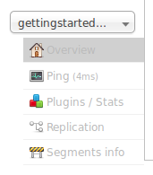

= Ping
// Licensed to the Apache Software Foundation (ASF) under one
// or more contributor license agreements.  See the NOTICE file
// distributed with this work for additional information
// regarding copyright ownership.  The ASF licenses this file
// to you under the Apache License, Version 2.0 (the
// "License"); you may not use this file except in compliance
// with the License.  You may obtain a copy of the License at
//
//   http://www.apache.org/licenses/LICENSE-2.0
//
// Unless required by applicable law or agreed to in writing,
// software distributed under the License is distributed on an
// "AS IS" BASIS, WITHOUT WARRANTIES OR CONDITIONS OF ANY
// KIND, either express or implied.  See the License for the
// specific language governing permissions and limitations
// under the License.

Choosing Ping under a core name issues a `ping` request to check whether the core is up and responding to requests.

.Ping Option in Core Dropdown

The search executed by a Ping is configured with the <<request-parameters-api.adoc#request-parameters-api,Request Parameters API>>. See <<implicit-requesthandlers.adoc#implicit-requesthandlers,Implicit RequestHandlers>> for the paramset to use for the `/admin/ping` endpoint.

The Ping option doesn't open a page, but the status of the request can be seen on the core overview page shown when clicking on a collection name. The length of time the request has taken is displayed next to the Ping option, in milliseconds.

== Ping API Examples

While the UI screen makes it easy to see the ping response time, the underlying ping command can be more useful when executed by remote monitoring tools:

*Input*

[source,bash]
----
http://localhost:8983/solr/<core-name>/admin/ping
----

This command will ping the core name for a response.

*Input*

[source,bash]
----
http://localhost:8983/solr/<collection-name>/admin/ping?distrib=true&wt=xml
----

This command will ping all replicas of the given collection name for a response:

*Sample Output*

[source,xml]
----
<response>
   <lst name="responseHeader">
      <int name="status">0</int>
      <int name="QTime">13</int>
      <lst name="params">
         <str name="q">{!lucene}*:*</str>
         <str name="distrib">false</str>
         <str name="df">_text_</str>
         <str name="rows">10</str>
         <str name="echoParams">all</str>
      </lst>
   </lst>
   <str name="status">OK</str>
</response>
----

Both API calls have the same output. A status=OK indicates that the nodes are responding.

*SolrJ Example with SolrPing*

[source,java]
----
SolrPing ping = new SolrPing();
ping.getParams().add("distrib", "true"); //To make it a distributed request against a collection
rsp = ping.process(solrClient, collectionName);
int status = rsp.getStatus();
----

*SolrJ Example with SolrClient*

[source,java]
----
SolrClient client = new HttpSolrClient.Builder(solrUrl).build();
SolrPingResponse pingResponse = client.ping(collectionName);
int status = pingResponse.getStatus();
----
