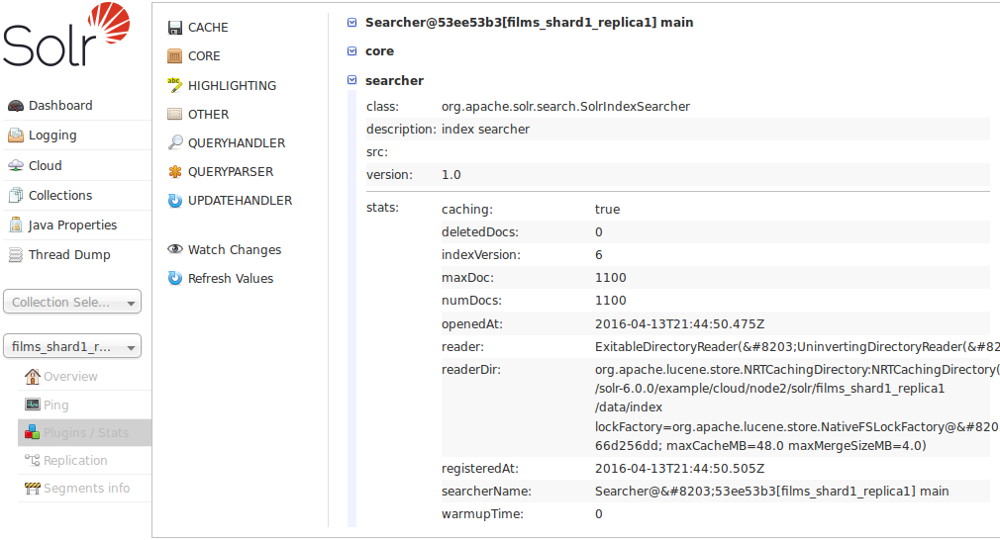

= Plugins & Stats Screen
:page-shortname: plugins-stats-screen
:page-permalink: plugins-stats-screen.html

The Plugins screen shows information and statistics about the status and performance of various plugins running in each Solr core. You can find information about the performance of the Solr caches, the state of Solr's searchers, and the configuration of Request Handlers and Search Components.

Choose an area of interest on the right, and then drill down into more specifics by clicking on one of the names that appear in the central part of the window. In this example, we've chosen to look at the Searcher stats, from the Core area:

.Searcher Statistics

The display is a snapshot taken when the page is loaded. You can get updated status by choosing to either *Watch Changes* or *Refresh Values*. Watching the changes will highlight those areas that have changed, while refreshing the values will reload the page with updated information.
