= Probability Distributions
// Licensed to the Apache Software Foundation (ASF) under one
// or more contributor license agreements.  See the NOTICE file
// distributed with this work for additional information
// regarding copyright ownership.  The ASF licenses this file
// to you under the Apache License, Version 2.0 (the
// "License"); you may not use this file except in compliance
// with the License.  You may obtain a copy of the License at
//
//   http://www.apache.org/licenses/LICENSE-2.0
//
// Unless required by applicable law or agreed to in writing,
// software distributed under the License is distributed on an
// "AS IS" BASIS, WITHOUT WARRANTIES OR CONDITIONS OF ANY
// KIND, either express or implied.  See the License for the
// specific language governing permissions and limitations
// under the License.

This section of the user guide covers the probability distribution
framework included in the math expressions library.

== Probability Distribution Framework

The probability distribution framework includes many commonly used <<Real Distributions,real>>
and <<Discrete,discrete>> probability distributions, including support for <<empiricaldistribution,empirical>>
and <<enumerateddistribution,enumerated>> distributions that model real world data.

The probability distribution framework also includes a set of functions that use the probability distributions
to support probability calculations and sampling.

== Visualization

Probability distributions can be visualized with Zeppelin-Solr using the
`zplot` function with the `dist` parameter, which visualizes the
probability density function (PDF) of the distribution.

Example visualizations are shown with each distribution below.

=== Real Distributions

Real probability distributions work with real/continuous numbers (floating points). Below
are the supported real probability distributions.

==== empiricalDistribution

The `empiricalDistribution` function creates a real probability
distribution from actual data.

Empirical distributions can be used to conveniently visualize the probability density of a random sample from a Solr Cloud
collection. The example below shows the zplot function visualizing the probability density of a random sample
with a 32 bin histogram.

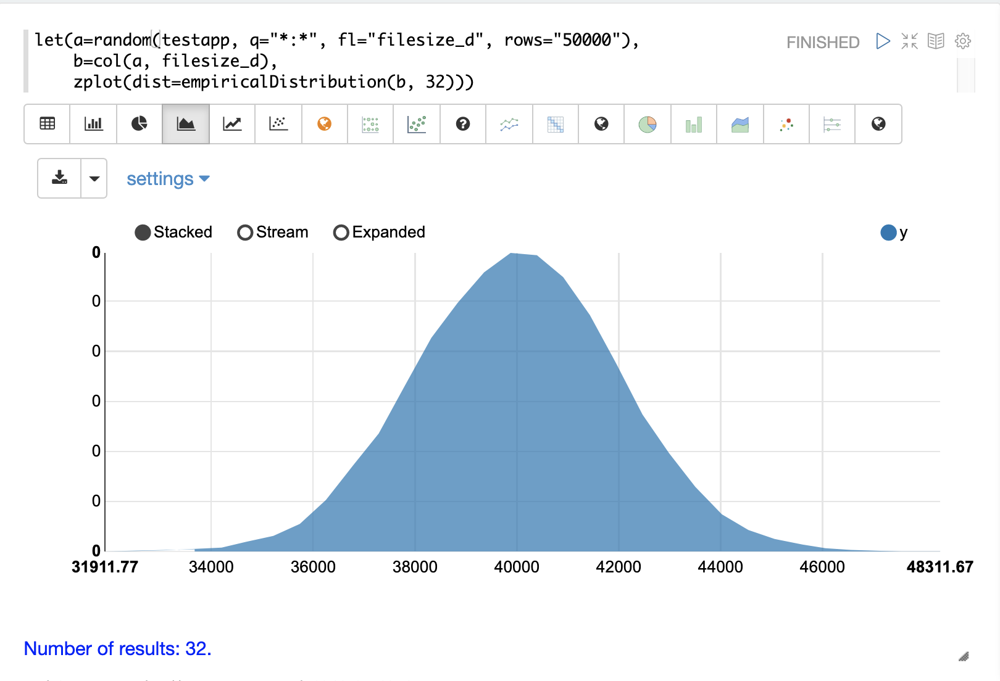

==== normalDistribution

The visualization below shows a normal distribution with a `mean` of 0 and `standard
deviation` of 1.

image::images/math-expressions/dist.png[]

==== logNormalDistribution

The visualization below shows a log normal distribution with a `shape` of .25 and `scale`
of 0.

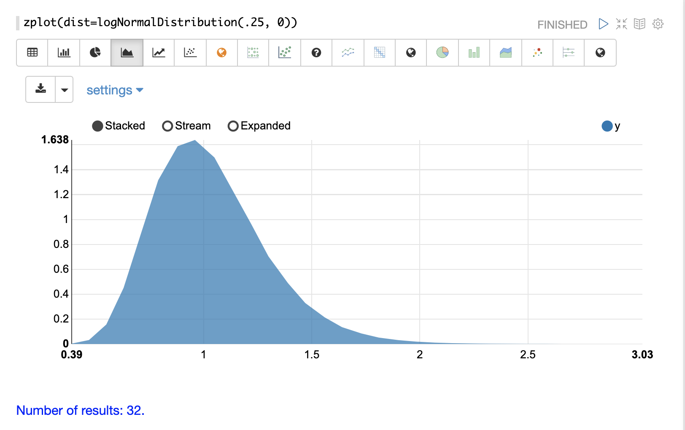

==== gammaDistribution

The visualization below shows a gamma distribution with a `shape` of 7.5 and `scale`
of 1.

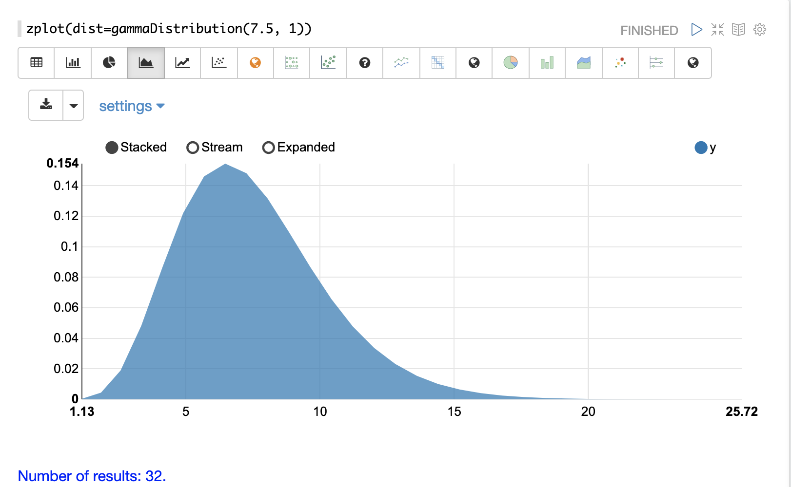

==== betaDistribution

The visualization below shows a gamma distribution with a `shape1` of 2 and `shape2`
of 2.

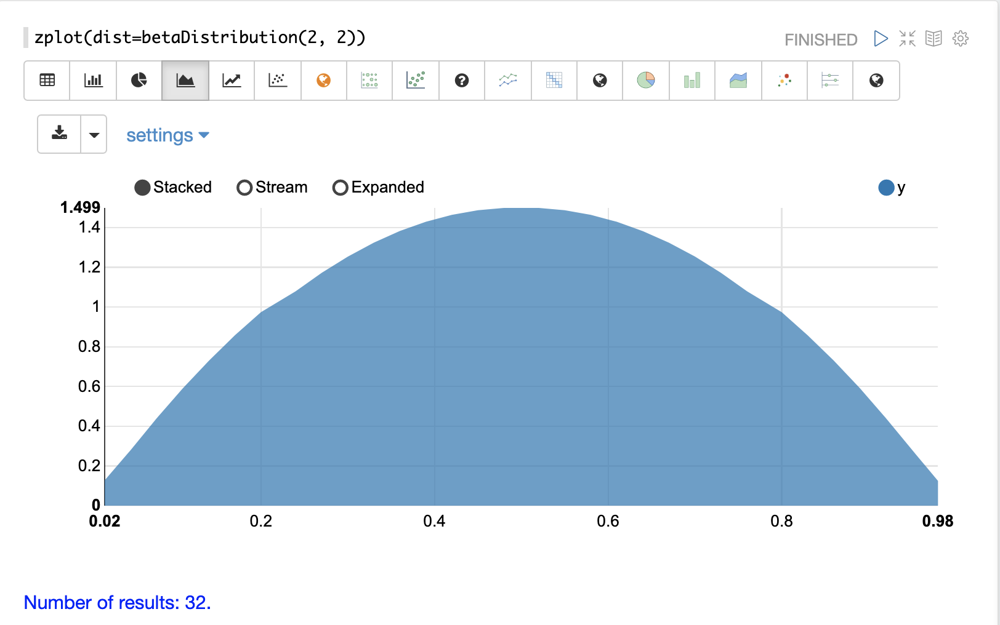

==== uniformDistribution

The visualization below shows a uniform distribution between 0 and 10.

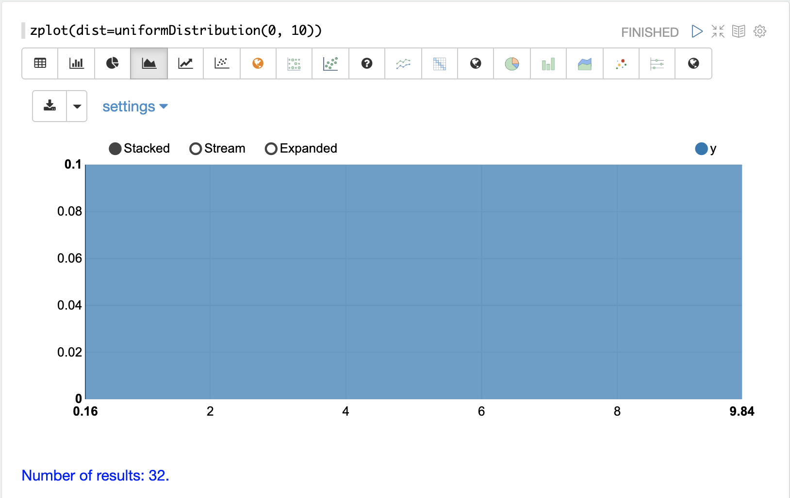

==== weibullDistribution

The visualization below shows a Weibull distribution with a `shape` of 5 and `scale`
of 1.

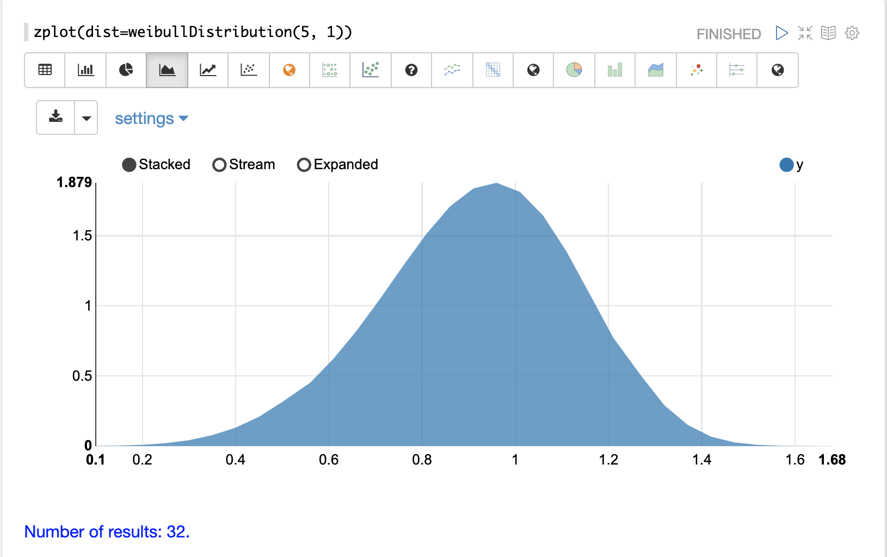

==== triangularDistribution

The visualization below shows a triangular distribution with a low of 5 a mode of 10
and a high value of 20.

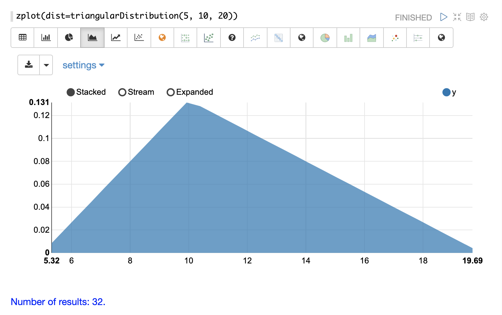

==== constantDistribution

The visualization below shows a constant distribution of 10.5.

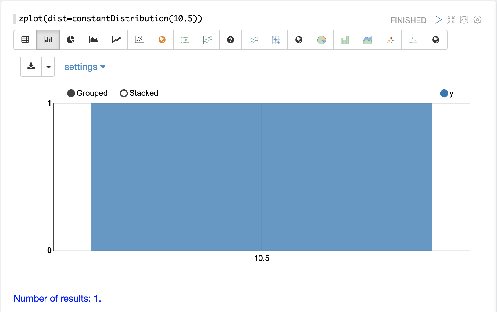

=== Discrete

Discrete probability distributions work with discrete numbers (integers). Below are the
supported discrete probability distributions.

==== enumeratedDistribution

The `enumeratedDistribution` function creates a discrete
distribution function
from an enumerated list of values and probabilities or
from a data set of discrete values

The visualization below shows an enumerated distribution created from a list of
discrete values and probabilities.

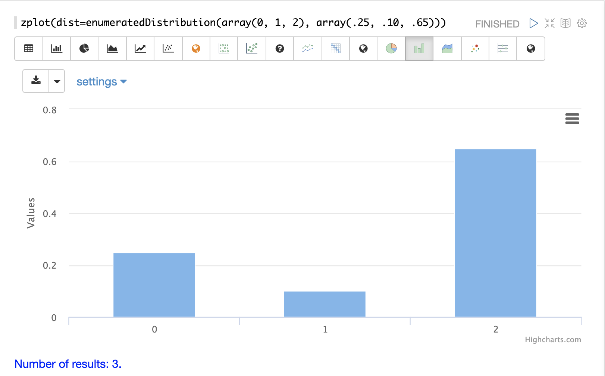

The visualization below shows an enumerated distribution generated from a random
sample of a field of discrete integers.

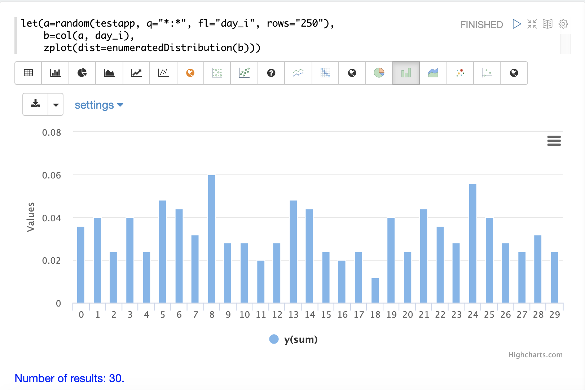

==== poissonDistribution

The visualization below shows a Poisson distribution with a `mean` of 15.

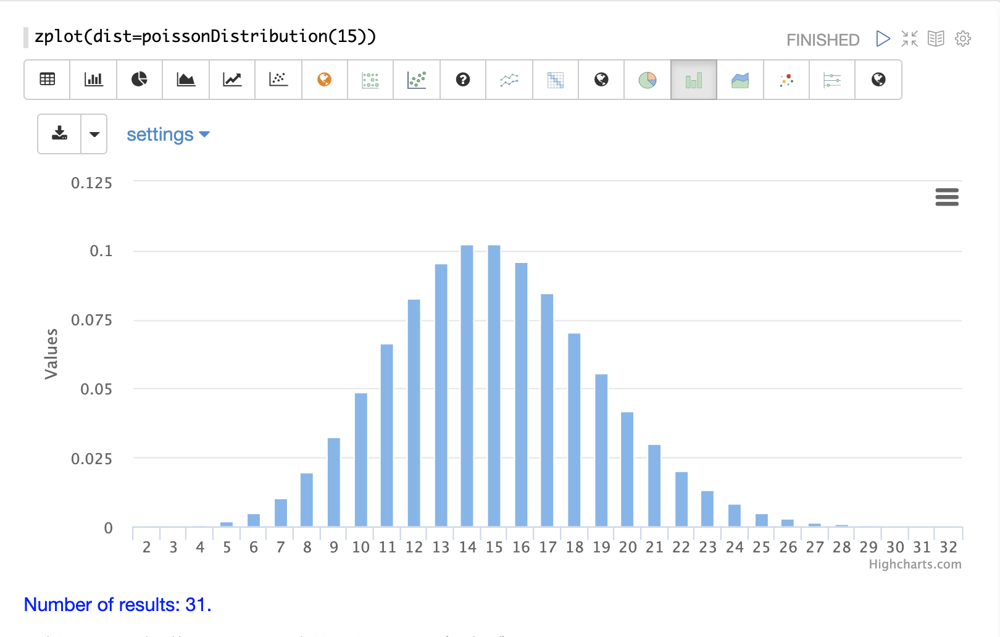

==== binomialDistribution

The visualization below shows a binomial distribution with a 100 trials and .15
probability of success.

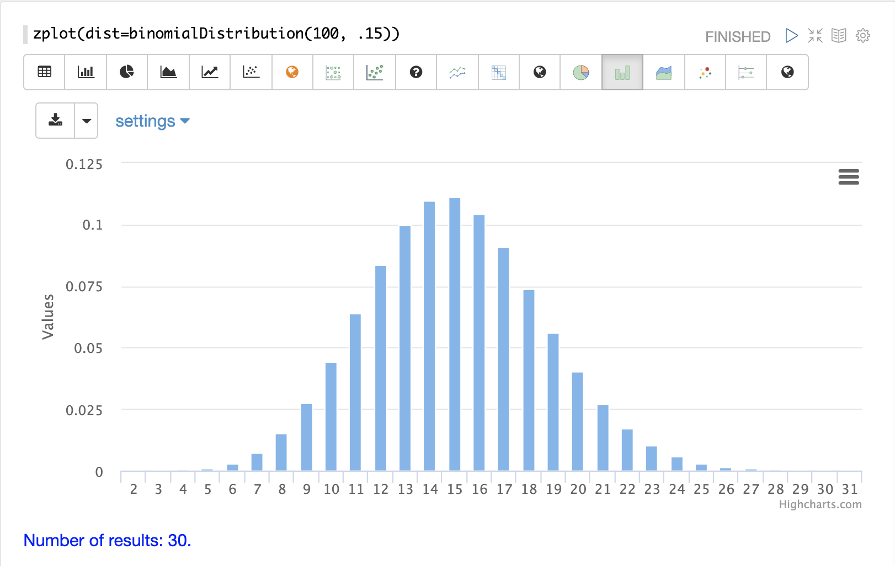

==== uniformIntegerDistribution

The visualization below shows a uniform integer distribution between 0 and 10.

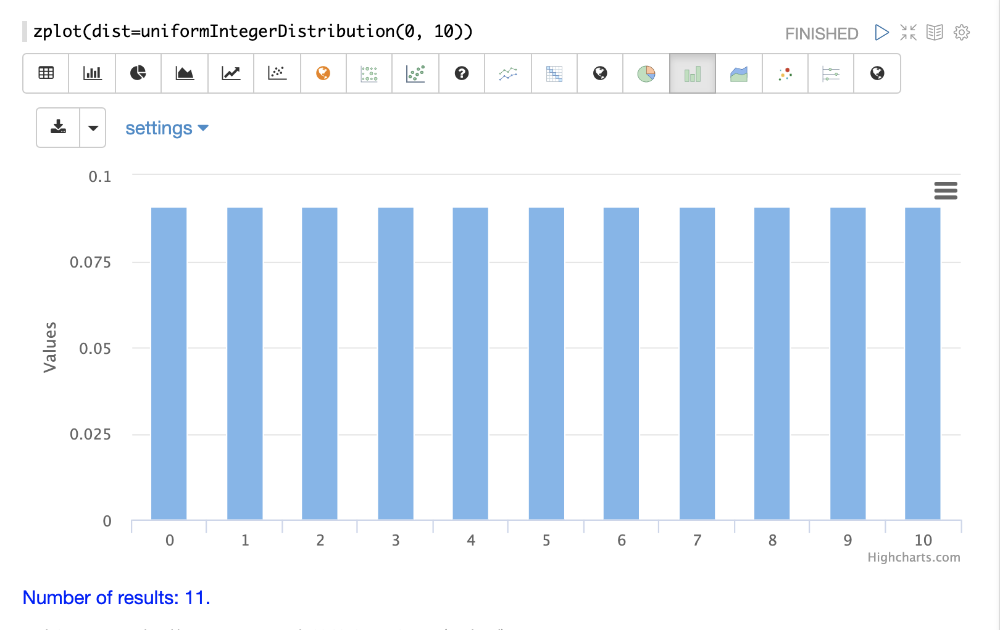

==== geometricDistribution

The visualization below shows a geometric distribution probability of success of
.25.

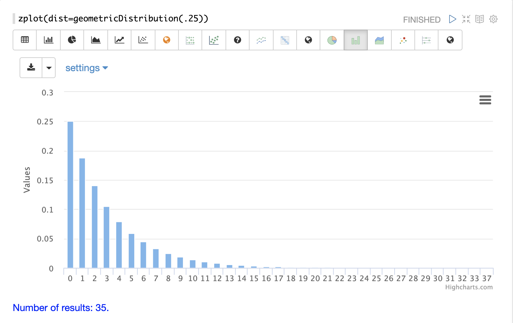

==== zipFDistribution

The visualization below shows a ZipF distribution with a size of 50 and exponent of 1.

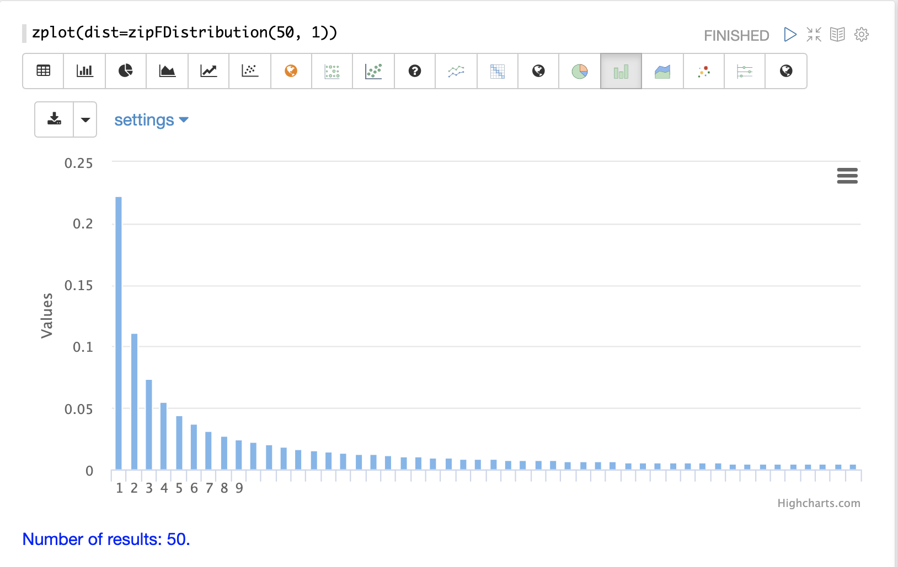

=== Cumulative Probability

The `cumulativeProbability` function can be used with all
probability distributions to calculate the
cumulative probability of encountering a specific
random variable within a specific distribution.

Below is example of calculating the cumulative probability
of a random variable within a normal distribution.

[source,text]
----
let(a=normalDistribution(10, 5),
    b=cumulativeProbability(a, 12))
----

In this example a normal distribution function is created
with a mean of 10 and a standard deviation of 5. Then
the cumulative probability of the value 12 is calculated for this
specific distribution.

When this expression is sent to the `/stream` handler it responds with:

[source,json]
----
{
  "result-set": {
    "docs": [
      {
        "b": 0.6554217416103242
      },
      {
        "EOF": true,
        "RESPONSE_TIME": 0
      }
    ]
  }
}
----

Below is an example of a cumulative probability calculation
using an empirical distribution.

In the example an empirical distribution is created from a random
sample taken from the `price_f` field.

The cumulative probability of the value `.75` is then calculated.
The `price_f` field in this example was generated using a
uniform real distribution between 0 and 1, so the output of the
 `cumulativeProbability` function is very close to .75.

[source,text]
----
let(a=random(collection1, q="*:*", rows="30000", fl="price_f"),
    b=col(a, price_f),
    c=empiricalDistribution(b),
    d=cumulativeProbability(c, .75))
----

When this expression is sent to the `/stream` handler it responds with:

[source,json]
----
{
  "result-set": {
    "docs": [
      {
        "b": 0.7554217416103242
      },
      {
        "EOF": true,
        "RESPONSE_TIME": 0
      }
    ]
  }
}
----

=== Discrete Probability

The `probability` function can be used with any discrete
distribution function to compute the probability of a
discrete value.

Below is an example which calculates the probability
of a discrete value within a Poisson distribution.

In the example a Poisson distribution function is created
with a mean of `100`. Then the
probability of encountering a sample of the discrete value 101 is calculated for this
specific distribution.

[source,text]
----
let(a=poissonDistribution(100),
    b=probability(a, 101))
----

When this expression is sent to the `/stream` handler it responds with:

[source,json]
----
{
  "result-set": {
    "docs": [
      {
        "b": 0.039466333474403106
      },
      {
        "EOF": true,
        "RESPONSE_TIME": 0
      }
    ]
  }
}
----

Below is an example of a probability calculation using an enumerated distribution.

In the example an enumerated distribution is created from a random
sample taken from the `day_i` field, which was created using a uniform integer distribution between 0 and 30.

The probability of the discrete value 10 is then calculated.

[source,text]
----
let(a=random(collection1, q="*:*", rows="30000", fl="day_i"),
    b=col(a, day_i),
    c=enumeratedDistribution(b),
    d=probability(c, 10))
----

When this expression is sent to the `/stream` handler it responds with:

[source,json]
----
{
  "result-set": {
    "docs": [
      {
        "d": 0.03356666666666666
      },
      {
        "EOF": true,
        "RESPONSE_TIME": 488
      }
    ]
  }
}
----

=== Sampling

All probability distributions support sampling. The `sample`
function returns 1 or more random samples from a probability distribution.

Below is an example drawing a single sample from a normal distribution.

[source,text]
----
let(a=normalDistribution(10, 5),
    b=sample(a))
----

When this expression is sent to the `/stream` handler it responds with:

[source,json]
----
{
  "result-set": {
    "docs": [
      {
        "b": 11.24578055004963
      },
      {
        "EOF": true,
        "RESPONSE_TIME": 0
      }
    ]
  }
}
----

Below is an example drawing 10 samples from a normal distribution.

[source,text]
----
let(a=normalDistribution(10, 5),
    b=sample(a, 10))
----

When this expression is sent to the `/stream` handler it responds with:

[source,json]
----
{
  "result-set": {
    "docs": [
      {
        "b": [
          10.18444709339441,
          9.466947971749377,
          1.2420697166234458,
          11.074501226984806,
          7.659629052136225,
          0.4440887839190708,
          13.710925254778786,
          2.089566359480239,
          0.7907293097654424,
          2.8184587681006734
        ]
      },
      {
        "EOF": true,
        "RESPONSE_TIME": 3
      }
    ]
  }
}
----

=== Multivariate Normal Distribution

The multivariate normal distribution is a generalization of the
univariate normal distribution to higher dimensions.

The multivariate normal distribution models two or more random
variables that are normally distributed. The relationship between the variables is defined by a covariance matrix.

==== Sampling

The `sample` function can be used to draw samples
from a multivariate normal distribution in much the same
way as a univariate normal distribution.

The difference is that each sample will be an array containing a sample
drawn from each of the underlying normal distributions.
If multiple samples are drawn, the `sample` function returns a matrix with a
sample in each row. Over the long term the columns of the sample
matrix will conform to the covariance matrix used to parametrize the
multivariate normal distribution.

The example below demonstrates how to initialize and draw samples
from a multivariate normal distribution.

In this example 5000 random samples are selected from a collection of log records. Each sample contains
the fields `filesize_d` and `response_d`. The values of both fields conform to a normal distribution.

Both fields are then vectorized. The `filesize_d` vector is stored in
variable *`b`* and the `response_d` variable is stored in variable *`c`*.

An array is created that contains the means of the two vectorized fields.

Then both vectors are added to a matrix which is transposed. This creates
an observation matrix where each row contains one observation of
`filesize_d` and `response_d`. A covariance matrix is then created from the columns of
the observation matrix with the `cov` function. The covariance matrix describes the covariance between
`filesize_d` and `response_d`.

The `multivariateNormalDistribution` function is then called with the
array of means for the two fields and the covariance matrix. The model for the
multivariate normal distribution is assigned to variable *`g`*.

Finally five samples are drawn from the multivariate normal distribution.

[source,text]
----
let(a=random(collection2, q="*:*", rows="5000", fl="filesize_d, response_d"),
    b=col(a, filesize_d),
    c=col(a, response_d),
    d=array(mean(b), mean(c)),
    e=transpose(matrix(b, c)),
    f=cov(e),
    g=multiVariateNormalDistribution(d, f),
    h=sample(g, 5))
----

The samples are returned as a matrix, with each row representing one sample. There are two
columns in the matrix. The first column contains samples for `filesize_d` and the second
column contains samples for `response_d`. Over the long term the covariance between
the columns will conform to the covariance matrix used to instantiate the
multivariate normal distribution.

[source,json]
----
{
  "result-set": {
    "docs": [
      {
        "h": [
          [
            41974.85669321393,
            779.4097049705296
          ],
          [
            42869.19876441414,
            834.2599296790783
          ],
          [
            38556.30444839889,
            720.3683470060988
          ],
          [
            37689.31290928216,
            686.5549428100018
          ],
          [
            40564.74398214547,
            769.9328090774
          ]
        ]
      },
      {
        "EOF": true,
        "RESPONSE_TIME": 162
      }
    ]
  }
}
----
