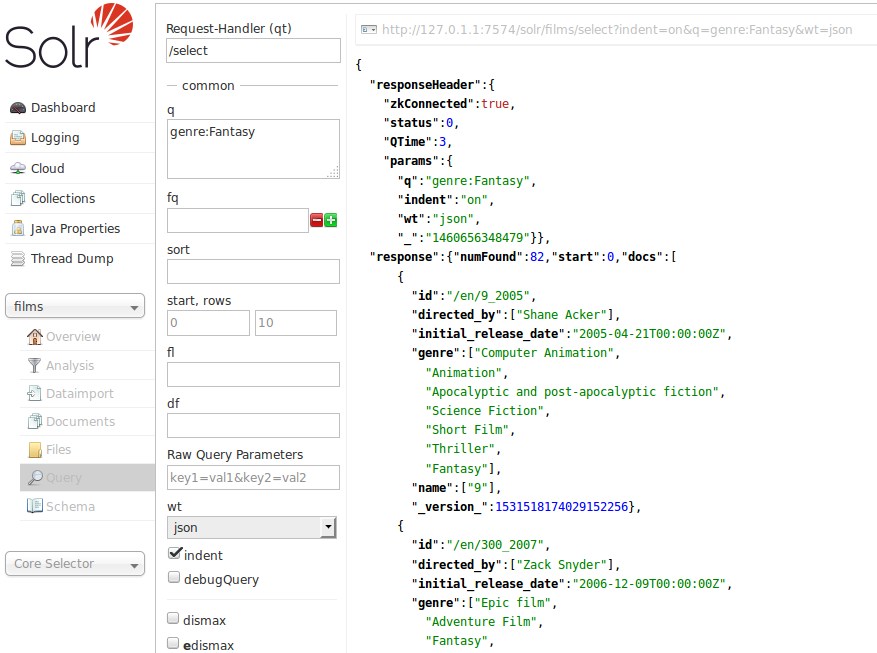

= Query Screen
// Licensed to the Apache Software Foundation (ASF) under one
// or more contributor license agreements.  See the NOTICE file
// distributed with this work for additional information
// regarding copyright ownership.  The ASF licenses this file
// to you under the Apache License, Version 2.0 (the
// "License"); you may not use this file except in compliance
// with the License.  You may obtain a copy of the License at
//
//   http://www.apache.org/licenses/LICENSE-2.0
//
// Unless required by applicable law or agreed to in writing,
// software distributed under the License is distributed on an
// "AS IS" BASIS, WITHOUT WARRANTIES OR CONDITIONS OF ANY
// KIND, either express or implied.  See the License for the
// specific language governing permissions and limitations
// under the License.

You can use the *Query* screen to submit a search query to a Solr collection and analyze the results.

In the example in the screenshot, a query has been submitted, and the screen shows the query results sent to the browser as JSON.

.JSON Results of a Query

In this example, a query for `genre:Fantasy` was sent to a "films" collection. Defaults were used for all other options in the form, which are explained briefly in the table below, and covered in detail in later parts of this Guide.

The response is shown to the right of the form. Requests to Solr are simply HTTP requests, and the query submitted is shown in light type above the results; if you click on this it will open a new browser window with just this request and response (without the rest of the Solr Admin UI). The rest of the response is shown in JSON, which is the default output format.

The response has at least two sections, but may have several more depending on the options chosen. The two sections it always has are the `responseHeader` and the `response`. The `responseHeader` includes the status of the search (`status`), the processing time (`QTime`), and the parameters (`params`) that were used to process the query.

The `response` includes the documents that matched the query, in `doc` sub-sections. The fields return depend on the parameters of the query (and the defaults of the request handler used). The number of results is also included in this section.

This screen allows you to experiment with different query options, and inspect how your documents were indexed. The query parameters available on the form are some basic options that most users want to have available, but there are dozens more available which could be simply added to the basic request by hand (if opened in a browser). The following parameters are available:

Request-handler (qt)::
Specifies the query handler for the request. If a query handler is not specified, Solr processes the response with the standard query handler.

q::
The query event. See <<searching.adoc#,Searching>> for an explanation of this parameter.

fq::
The filter queries. See <<common-query-parameters.adoc#,Common Query Parameters>> for more information on this parameter.

sort::
Sorts the response to a query in either ascending or descending order based on the response's score or another specified characteristic.

start, rows::
`start` is the offset into the query result starting at which documents should be returned. The default value is 0, meaning that the query should return results starting with the first document that matches. This field accepts the same syntax as the start query parameter, which is described in <<searching.adoc#,Searching>>. `rows` is the number of rows to return.

fl::
Defines the fields to return for each document. You can explicitly list the stored fields, <<function-queries.adoc#,functions>>, and <<transforming-result-documents.adoc#,doc transformers>> you want to have returned by separating them with either a comma or a space.

wt::
Specifies the Response Writer to be used to format the query response. Defaults to JSON if not specified.

indent::
Click this button to request that the Response Writer use indentation to make the responses more readable.

debugQuery::
Click this button to augment the query response with debugging information, including "explain info" for each document returned. This debugging information is intended to be intelligible to the administrator or programmer.

dismax::
Click this button to enable the Dismax query parser. See <<the-dismax-query-parser.adoc#,The DisMax Query Parser>> for further information.

edismax::
Click this button to enable the Extended query parser. See <<the-extended-dismax-query-parser.adoc#,The Extended DisMax Query Parser>> for further information.

hl:: Click this button to enable highlighting in the query response. See <<highlighting.adoc#,Highlighting>> for more information.

facet::
Enables faceting, the arrangement of search results into categories based on indexed terms. See <<faceting.adoc#,Faceting>> for more information.

spatial::
Click to enable using location data for use in spatial or geospatial searches. See <<spatial-search.adoc#,Spatial Search>> for more information.

spellcheck::
Click this button to enable the Spellchecker, which provides inline query suggestions based on other, similar, terms. See <<spell-checking.adoc#,Spell Checking>> for more information.
