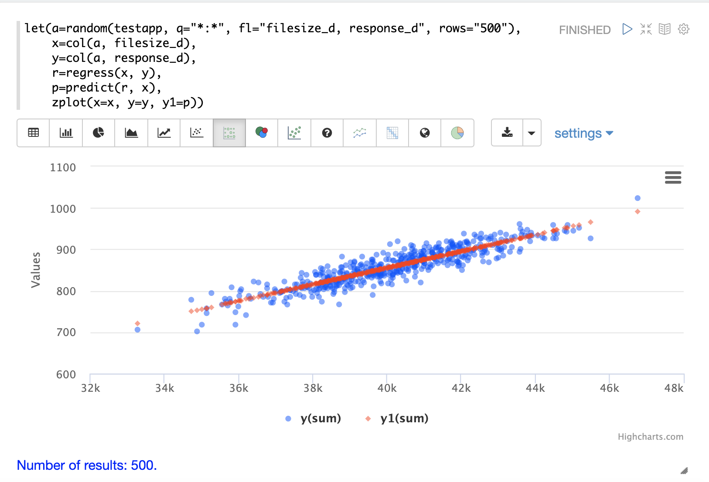

= Linear Regression
// Licensed to the Apache Software Foundation (ASF) under one
// or more contributor license agreements.  See the NOTICE file
// distributed with this work for additional information
// regarding copyright ownership.  The ASF licenses this file
// to you under the Apache License, Version 2.0 (the
// "License"); you may not use this file except in compliance
// with the License.  You may obtain a copy of the License at
//
//   http://www.apache.org/licenses/LICENSE-2.0
//
// Unless required by applicable law or agreed to in writing,
// software distributed under the License is distributed on an
// "AS IS" BASIS, WITHOUT WARRANTIES OR CONDITIONS OF ANY
// KIND, either express or implied.  See the License for the
// specific language governing permissions and limitations
// under the License.

The math expressions library supports simple and multivariate linear regression.

== Simple Linear Regression

The `regress` function is used to build a linear regression model
between two random variables. Sample observations are provided with two
numeric arrays. The first numeric array is the independent variable and
the second array is the dependent variable.

In the example below the `random` function selects 5000 random samples each containing
the fields `filesize_d` and `response_d`. The two fields are vectorized
and stored in variables *`b`* and *`c`*. Then the `regress` function performs a regression
analysis on the two numeric arrays.

The `regress` function returns a single tuple with the results of the regression
analysis.

[source,text]
----
let(a=random(testapp, q="*:*", rows="50000", fl="filesize_d, response_d"),
    x=col(a, filesize_d),
    y=col(a, response_d),
    r=regress(x, y))
----

Note that in this regression analysis the value of `RSquared` is `.75`. This means that changes in
`filesize_d` explain 75% of the variability of the `response_d` variable:

[source,json]
----
{
  "result-set": {
    "docs": [
      {
        "significance": 0,
        "totalSumSquares": 96595678.64838874,
        "R": 0.9052835767815126,
        "RSquared": 0.8195383543903288,
        "meanSquareError": 348.6502485633668,
        "intercept": 55.64040842391729,
        "slopeConfidenceInterval": 0.0000822026526346821,
        "regressionSumSquares": 79163863.52071753,
        "slope": 0.019984612363694493,
        "interceptStdErr": 1.6792610845256566,
        "N": 50000
      },
      {
        "EOF": true,
        "RESPONSE_TIME": 344
      }
    ]
  }
}
----

The diagnostics can be visualized in a table using Zeppelin-Solr.

image::images/math-expressions/diagnostics.png[]

=== Prediction

The `predict` function uses the regression model to make predictions.
Using the example above the regression model can be used to predict the value
of `response_d` given a value for `filesize_d`.

In the example below the `predict` function uses the regression analysis to predict
the value of `response_d` for the `filesize_d` value of `40000`.

[source,text]
----
let(a=random(testapp, q="*:*", rows="5000", fl="filesize_d, response_d"),
    x=col(a, filesize_d),
    y=col(a, response_d),
    r=regress(x, y),
    p=predict(r, 40000))
----

When this expression is sent to the `/stream` handler it responds with:

[source,json]
----
{
  "result-set": {
    "docs": [
      {
        "p": 748.079241022975
      },
      {
        "EOF": true,
        "RESPONSE_TIME": 95
      }
    ]
  }
}
----

The `predict` function can also make predictions for an array of values. In this
case it returns an array of predictions.

In the example below the `predict` function uses the regression analysis to
predict values for each of the 5000 samples of `filesize_d` used to generate the model.
In this case 5000 predictions are returned.

[source,text]
----
let(a=random(testapp, q="*:*", rows="5000", fl="filesize_d, response_d"),
    x=col(a, filesize_d),
    y=col(a, response_d),
    r=regress(x, y),
    p=predict(r, x))
----

When this expression is sent to the `/stream` handler it responds with:

[source,json]
----
{
  "result-set": {
    "docs": [
      {
        "p": [
          742.2525322514165,
          709.6972488729955,
          687.8382568904871,
          820.2511324266264,
          720.4006432289061,
          761.1578181053039,
          759.1304101159126,
          699.5597256337142,
          742.4738911248204,
          769.0342605881644,
          746.6740473150268,
          ...
          ]
      },
      {
        "EOF": true,
        "RESPONSE_TIME": 113
      }
    ]
  }
}
----

=== Regression Plot

Using *zplot* and the Zeppelin-Solr interpreter we can visualize both the observations and the predictions in
the same scatter plot. In the example below zplot is plotting the filesize_d observations on the
*x* axis, the response_d observations on the *y* access and the predictions on the *y1* access.

=== Residuals

The difference between the observed value and the predicted value is known as the
residual. There isn't a specific function to calculate the residuals but vector
math can used to perform the calculation.

In the example below the predictions are stored in variable *`p`*. The `ebeSubtract`
function is then used to subtract the predictions
from the actual `response_d` values stored in variable *`y`*. Variable *`e`* contains
the array of residuals.

[source,text]
----
let(a=random(testapp, q="*:*", rows="500", fl="filesize_d, response_d"),
    x=col(a, filesize_d),
    y=col(a, response_d),
    r=regress(x, y),
    p=predict(r, x),
    e=ebeSubtract(y, p))
----

When this expression is sent to the `/stream` handler it responds with:

[source,json]
----
{
  "result-set": {
    "docs": [
      {
        "e": [
          31.30678554491226,
          -30.292830927953446,
          -30.49508862647258,
          -30.499884780783532,
          -9.696458959319784,
          -30.521563961535094,
          -30.28380938033081,
          -9.890289849359306,
          30.819723560583157,
          -30.213178859683012,
          -30.609943619066826,
          10.527700442607625,
          10.68046928406568,
          ...
          ]
      },
      {
        "EOF": true,
        "RESPONSE_TIME": 113
      }
    ]
  }
}
----

=== Residual Plot

Using *zplot* and Zeppelin-Solr we can visualize the residuals with
a residuals plot.

image::images/math-expressions/residual-plot.png[]

== Multivariate Linear Regression

The `olsRegress` function performs a multivariate linear regression analysis. Multivariate linear
regression models the linear relationship between two or more independent variables and a dependent variable.

The example below extends the simple linear regression example by introducing a new independent variable
called `service_d`. The `service_d` variable is the service level of the request and it can range from 1 to 4
in the data-set. The higher the service level, the higher the bandwidth available for the request.

Notice that the two independent variables `filesize_d` and `service_d` are vectorized and stored
in the variables *`b`* and *`c`*. The variables *`b`* and *`c`* are then added as rows to a `matrix`. The matrix is
then transposed so that each row in the matrix represents one observation with `filesize_d` and `service_d`.
The `olsRegress` function then performs the multivariate regression analysis using the observation matrix as the
independent variables and the `response_d` values, stored in variable *`d`*, as the dependent variable.

[source,text]
----
let(a=random(collection2, q="*:*", rows="30000", fl="filesize_d, service_d, response_d"),
    b=col(a, filesize_d),
    c=col(a, service_d),
    d=col(a, response_d),
    e=transpose(matrix(b, c)),
    f=olsRegress(e, d))
----

Notice in the response that the RSquared of the regression analysis is 1. This means that linear relationship between
`filesize_d` and `service_d` describe 100% of the variability of the `response_d` variable:

[source,json]
----
{
  "result-set": {
    "docs": [
      {
        "f": {
          "regressionParametersStandardErrors": [
            2.0660690430026933e-13,
            5.1212982077663434e-18,
            9.10920932555875e-15
          ],
          "RSquared": 1,
          "regressionParameters": [
            6.553210695971329e-12,
            0.019999999999999858,
            -20.49999999999968
          ],
          "regressandVariance": 2124.130825172683,
          "regressionParametersVariance": [
            [
              0.013660174897582315,
              -3.361258014840509e-7,
              -0.00006893737578369605
            ],
            [
              -3.361258014840509e-7,
              8.393183709503206e-12,
              6.430253229589981e-11
            ],
            [
              -0.00006893737578369605,
              6.430253229589981e-11,
              0.000026553878455570856
            ]
          ],
          "adjustedRSquared": 1,
          "residualSumSquares": 9.373703759269822e-20
        }
      },
      {
        "EOF": true,
        "RESPONSE_TIME": 690
      }
    ]
  }
}
----

=== Prediction

The `predict` function can also be used to make predictions for multivariate linear regression.

Below is an example of a single prediction using the multivariate linear regression model and a single observation.
The observation is an array that matches the structure of the observation matrix used to build the model. In this case
the first value represents a `filesize_d` of `40000` and the second value represents a `service_d` of `4`.

[source,text]
----
let(a=random(collection2, q="*:*", rows="5000", fl="filesize_d, service_d, response_d"),
    b=col(a, filesize_d),
    c=col(a, service_d),
    d=col(a, response_d),
    e=transpose(matrix(b, c)),
    f=olsRegress(e, d),
    g=predict(f, array(40000, 4)))
----

When this expression is sent to the `/stream` handler it responds with:

[source,json]
----
{
  "result-set": {
    "docs": [
      {
        "g": 718.0000000000005
      },
      {
        "EOF": true,
        "RESPONSE_TIME": 117
      }
    ]
  }
}
----

The `predict` function can also make predictions for more than one multivariate observation. In this scenario
an observation matrix used.

In the example below the observation matrix used to build the multivariate regression model
is passed to the `predict` function and it returns an array of predictions.

[source,text]
----
let(a=random(collection2, q="*:*", rows="5000", fl="filesize_d, service_d, response_d"),
    b=col(a, filesize_d),
    c=col(a, service_d),
    d=col(a, response_d),
    e=transpose(matrix(b, c)),
    f=olsRegress(e, d),
    g=predict(f, e))
----

When this expression is sent to the `/stream` handler it responds with:

[source,json]
----
{
  "result-set": {
    "docs": [
      {
        "e": [
          685.498283591961,
          801.2175699959365,
          776.7638245911025,
          610.3559852681935,
          751.0925865965207,
          787.2914663381897,
          744.3632053810668,
          688.3729301599697,
          765.367783417171,
          724.9309687628346,
          834.4350712384264,
          ...
          ]
      },
      {
        "EOF": true,
        "RESPONSE_TIME": 113
      }
    ]
  }
}
----

=== Residuals

Once the predictions are generated the residuals can be calculated using the same approach used with
simple linear regression.

Below is an example of the residuals calculation following a multivariate linear regression. In the example
the predictions stored variable *`g`* are subtracted from observed values stored in variable *`d`*.

[source,text]
----
let(a=random(collection2, q="*:*", rows="5000", fl="filesize_d, service_d, response_d"),
    b=col(a, filesize_d),
    c=col(a, service_d),
    d=col(a, response_d),
    e=transpose(matrix(b, c)),
    f=olsRegress(e, d),
    g=predict(f, e),
    h=ebeSubtract(d, g))
----

When this expression is sent to the `/stream` handler it responds with:

[source,json]
----
{
  "result-set": {
    "docs": [
      {
        "e": [
         1.1368683772161603e-13,
         1.1368683772161603e-13,
         0,
         1.1368683772161603e-13,
         0,
         1.1368683772161603e-13,
         0,
         2.2737367544323206e-13,
         1.1368683772161603e-13,
         2.2737367544323206e-13,
         1.1368683772161603e-13,
          ...
          ]
      },
      {
        "EOF": true,
        "RESPONSE_TIME": 113
      }
    ]
  }
}
----
