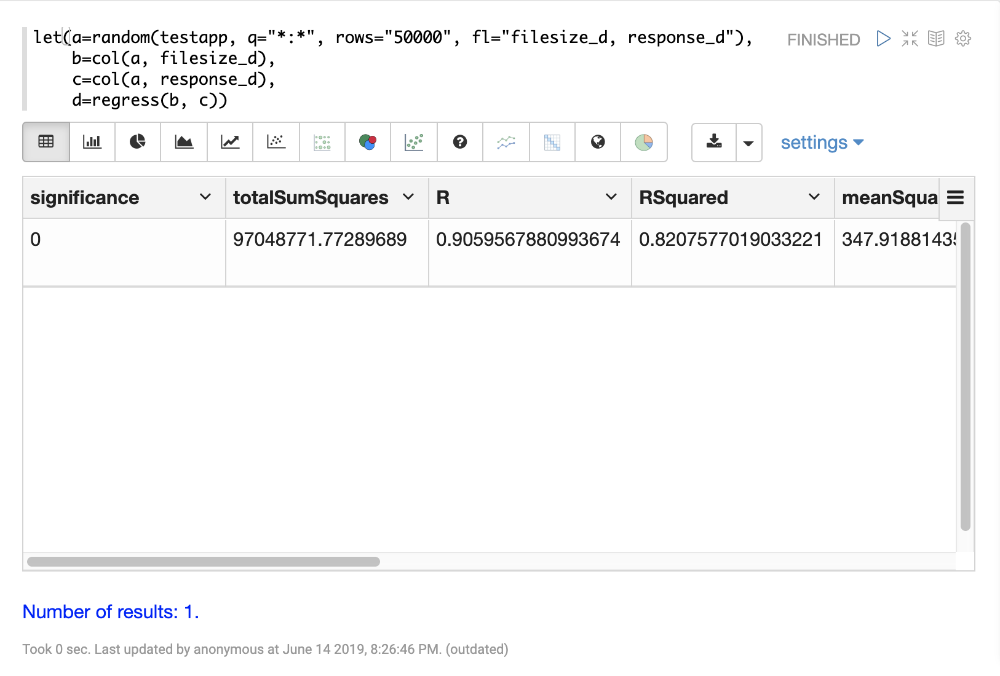
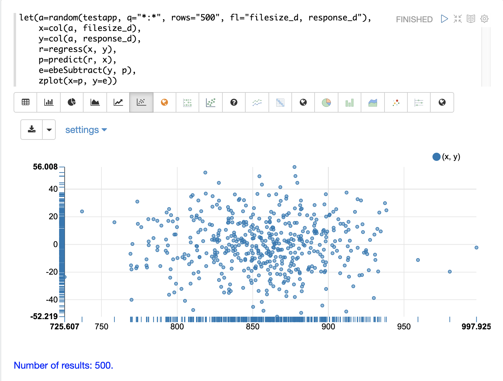
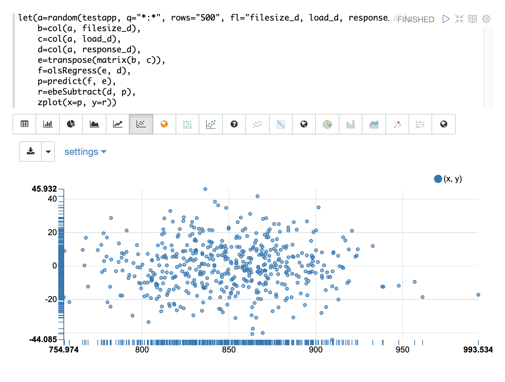

= Linear Regression
// Licensed to the Apache Software Foundation (ASF) under one
// or more contributor license agreements.  See the NOTICE file
// distributed with this work for additional information
// regarding copyright ownership.  The ASF licenses this file
// to you under the Apache License, Version 2.0 (the
// "License"); you may not use this file except in compliance
// with the License.  You may obtain a copy of the License at
//
//   http://www.apache.org/licenses/LICENSE-2.0
//
// Unless required by applicable law or agreed to in writing,
// software distributed under the License is distributed on an
// "AS IS" BASIS, WITHOUT WARRANTIES OR CONDITIONS OF ANY
// KIND, either express or implied.  See the License for the
// specific language governing permissions and limitations
// under the License.

The math expressions library supports simple and multivariate linear regression.

== Simple Linear Regression

The `regress` function is used to build a linear regression model
between two random variables. Sample observations are provided with two
numeric arrays. The first numeric array is the independent variable and
the second array is the dependent variable.

In the example below the `random` function selects 50000 random samples each containing
the fields `filesize_d` and `response_d`. The two fields are vectorized
and stored in variables `x` and `y`. Then the `regress` function performs a regression
analysis on the two numeric arrays.

The `regress` function returns a single tuple with the results of the regression
analysis.

[source,text]
----
let(a=random(logs, q="*:*", rows="50000", fl="filesize_d, response_d"),
    x=col(a, filesize_d),
    y=col(a, response_d),
    r=regress(x, y))
----

Note that in this regression analysis the value of `RSquared` is `.75`. This means that changes in
`filesize_d` explain 75% of the variability of the `response_d` variable:

[source,json]
----
{
  "result-set": {
    "docs": [
      {
        "significance": 0,
        "totalSumSquares": 96595678.64838874,
        "R": 0.9052835767815126,
        "RSquared": 0.8195383543903288,
        "meanSquareError": 348.6502485633668,
        "intercept": 55.64040842391729,
        "slopeConfidenceInterval": 0.0000822026526346821,
        "regressionSumSquares": 79163863.52071753,
        "slope": 0.019984612363694493,
        "interceptStdErr": 1.6792610845256566,
        "N": 50000
      },
      {
        "EOF": true,
        "RESPONSE_TIME": 344
      }
    ]
  }
}
----

The diagnostics can be visualized in a table using Zeppelin-Solr.

=== Prediction

The `predict` function uses the regression model to make predictions.
Using the example above the regression model can be used to predict the value
of `response_d` given a value for `filesize_d`.

In the example below the `predict` function uses the regression analysis to predict
the value of `response_d` for the `filesize_d` value of `40000`.

[source,text]
----
let(a=random(logs, q="*:*", rows="5000", fl="filesize_d, response_d"),
    x=col(a, filesize_d),
    y=col(a, response_d),
    r=regress(x, y),
    p=predict(r, 40000))
----

When this expression is sent to the `/stream` handler it responds with:

[source,json]
----
{
  "result-set": {
    "docs": [
      {
        "p": 748.079241022975
      },
      {
        "EOF": true,
        "RESPONSE_TIME": 95
      }
    ]
  }
}
----

The `predict` function can also make predictions for an array of values. In this
case it returns an array of predictions.

In the example below the `predict` function uses the regression analysis to
predict values for each of the 5000 samples of `filesize_d` used to generate the model.
In this case 5000 predictions are returned.

[source,text]
----
let(a=random(logs, q="*:*", rows="5000", fl="filesize_d, response_d"),
    x=col(a, filesize_d),
    y=col(a, response_d),
    r=regress(x, y),
    p=predict(r, x))
----

When this expression is sent to the `/stream` handler it responds with:

[source,json]
----
{
  "result-set": {
    "docs": [
      {
        "p": [
          742.2525322514165,
          709.6972488729955,
          687.8382568904871,
          820.2511324266264,
          720.4006432289061,
          761.1578181053039,
          759.1304101159126,
          699.5597256337142,
          742.4738911248204,
          769.0342605881644,
          746.6740473150268
          ]
      },
      {
        "EOF": true,
        "RESPONSE_TIME": 113
      }
    ]
  }
}
----

=== Regression Plot

Using `zplot` and the Zeppelin-Solr interpreter we can visualize both the observations and the predictions in
the same scatter plot.
In the example below `zplot` is plotting the `filesize_d` observations on the
x-axis, the `response_d` observations on the y-axis and the predictions on the y1-axis.

image::images/math-expressions/linear.png[]

=== Residuals

The difference between the observed value and the predicted value is known as the
residual. There isn't a specific function to calculate the residuals but vector
math can used to perform the calculation.

In the example below the predictions are stored in variable `p`. The `ebeSubtract`
function is then used to subtract the predictions
from the actual `response_d` values stored in variable `y`. Variable `e` contains
the array of residuals.

[source,text]
----
let(a=random(logs, q="*:*", rows="500", fl="filesize_d, response_d"),
    x=col(a, filesize_d),
    y=col(a, response_d),
    r=regress(x, y),
    p=predict(r, x),
    e=ebeSubtract(y, p))
----

When this expression is sent to the `/stream` handler it responds with:

[source,json]
----
{
  "result-set": {
    "docs": [
      {
        "e": [
          31.30678554491226,
          -30.292830927953446,
          -30.49508862647258,
          -30.499884780783532,
          -9.696458959319784,
          -30.521563961535094,
          -30.28380938033081,
          -9.890289849359306,
          30.819723560583157,
          -30.213178859683012,
          -30.609943619066826,
          10.527700442607625,
          10.68046928406568
          ]
      },
      {
        "EOF": true,
        "RESPONSE_TIME": 113
      }
    ]
  }
}
----

=== Residual Plot

Using `zplot` and Zeppelin-Solr we can visualize the residuals with
a residuals plot. The example residual plot below plots the predicted value on the
x-axis and the error of the prediction on the y-axis.

The residual plot can be used to interpret reliability of the model. Three things to look for are:

. Do the residuals appear to be normally distributed with a mean of 0?
This makes it easier to interpret the results of the model to determine if the distribution of the errors is acceptable for predictions.
It also makes it easier to use a model of the residuals for anomaly detection on new predictions.

. Do the residuals appear to be *heteroscedastic*?
Which means is the variance of the residuals the same across the range of predictions?
By plotting the prediction on the x-axis and error on y-axis we can see if the variability stays the same as the predictions get higher.
If the residuals are heteroscedastic it means that we can trust the models error to be consistent across the range of predictions.

. Is there any pattern to the residuals? If so there is likely still a signal within the data that needs to be modeled.

== Multivariate Linear Regression

The `olsRegress` function performs a multivariate linear regression analysis. Multivariate linear
regression models the linear relationship between two or more independent variables and a dependent variable.

The example below extends the simple linear regression example by introducing a new independent variable
called `load_d`. The `load_d` variable is the load on the network while the file is being downloaded.

Notice that the two independent variables `filesize_d` and `load_d` are vectorized and stored
in the variables `b` and `c`. The variables `b` and `c` are then added as rows to a `matrix`. The matrix is
then transposed so that each row in the matrix represents one observation with `filesize_d` and `service_d`.
The `olsRegress` function then performs the multivariate regression analysis using the observation matrix as the
independent variables and the `response_d` values, stored in variable *`d`*, as the dependent variable.

[source,text]
----
let(a=random(testapp, q="*:*", rows="30000", fl="filesize_d, load_d, response_d"),
    x=col(a, filesize_d),
    y=col(a, load_d),
    z=col(a, response_d),
    m=transpose(matrix(x, y)),
    r=olsRegress(m, z))
----

Notice in the response that the `RSquared` of the regression analysis is `1`. This means that linear relationship between
`filesize_d` and `service_d` describe 100% of the variability of the `response_d` variable:

[source,json]
----
{
  "result-set": {
    "docs": [
      {
        "regressionParametersStandardErrors": [
          1.7792032752524236,
          0.0000429945089590394,
          0.0008592489428291642
        ],
        "RSquared": 0.8850359458670845,
        "regressionParameters": [
          0.7318766882597804,
          0.01998298784650873,
          0.10982104952105468
        ],
        "regressandVariance": 1938.8190758686717,
        "regressionParametersVariance": [
          [
            0.014201127587649602,
            -3.326633951803927e-7,
            -0.000001732754417954437
          ],
          [
            -3.326633951803927e-7,
            8.292732891338694e-12,
            2.0407522508189773e-12
          ],
          [
            -0.000001732754417954437,
            2.0407522508189773e-12,
            3.3121477630934995e-9
          ]
        ],
        "adjustedRSquared": 0.8850282808303053,
        "residualSumSquares": 6686612.141261716
      },
      {
        "EOF": true,
        "RESPONSE_TIME": 374
      }
    ]
  }
}
----

=== Prediction

The `predict` function can also be used to make predictions for multivariate linear regression.

Below is an example of a single prediction using the multivariate linear regression model and a single observation.
The observation is an array that matches the structure of the observation matrix used to build the model. In this case
the first value represents a `filesize_d` of `40000` and the second value represents a `load_d` of `4`.

[source,text]
----
let(a=random(logs, q="*:*", rows="5000", fl="filesize_d, load_d, response_d"),
    x=col(a, filesize_d),
    y=col(a, load_d),
    z=col(a, response_d),
    m=transpose(matrix(x, y)),
    r=olsRegress(m, z),
    p=predict(r, array(40000, 4)))
----

When this expression is sent to the `/stream` handler it responds with:

[source,json]
----
{
  "result-set": {
    "docs": [
      {
        "p": 801.7725344814675
      },
      {
        "EOF": true,
        "RESPONSE_TIME": 70
      }
    ]
  }
}
----

The `predict` function can also make predictions for more than one multivariate observation. In this scenario
an observation matrix used.

In the example below the observation matrix used to build the multivariate regression model
is passed to the `predict` function and it returns an array of predictions.

[source,text]
----
let(a=random(logs, q="*:*", rows="5000", fl="filesize_d, load_d, response_d"),
    x=col(a, filesize_d),
    y=col(a, load_d),
    z=col(a, response_d),
    m=transpose(matrix(x, y)),
    r=olsRegress(m, z),
    p=predict(r, m))
----

When this expression is sent to the `/stream` handler it responds with:

[source,json]
----
{
  "result-set": {
    "docs": [
      {
        "p": [
          917.7122088913725,
          900.5418518783401,
          871.7805676516689,
          822.1887964840801,
          828.0842807117554,
          785.1262470470162,
          833.2583851225845,
          802.016811579941,
          841.5253327135974,
          896.9648275225625,
          858.6511235977382,
          869.8381475112501
          ]
      },
      {
        "EOF": true,
        "RESPONSE_TIME": 113
      }
    ]
  }
}
----

=== Residuals

Once the predictions are generated the residuals can be calculated using the same approach used with
simple linear regression.

Below is an example of the residuals calculation following a multivariate linear regression. In the example
the predictions stored variable `g` are subtracted from observed values stored in variable `d`.

[source,text]
----
let(a=random(logs, q="*:*", rows="5000", fl="filesize_d, load_d, response_d"),
    x=col(a, filesize_d),
    y=col(a, load_d),
    z=col(a, response_d),
    m=transpose(matrix(x, y)),
    r=olsRegress(m, z),
    p=predict(r, m),
    e=ebeSubtract(z, p))
----

When this expression is sent to the `/stream` handler it responds with:

[source,json]
----
{
  "result-set": {
    "docs": [
      {
        "e": [
          21.452271655340496,
          9.647947283595727,
          -23.02328008866334,
          -13.533046479596806,
          -16.1531952414299,
          4.966514036315402,
          23.70151322413119,
          -4.276176642246014,
          10.781062392156628,
          0.00039750380267378205,
          -1.8307638852961645
          ]
      },
      {
        "EOF": true,
        "RESPONSE_TIME": 113
      }
    ]
  }
}
----

=== Residual Plot

The residual plot for multi-variate linear regression is the same as for simple linear regression.
The predictions are plotted on the x-axis and the error is plotted on the y-axis.

The residual plot for multi-variate linear regression can be interpreted in the exact same way as simple linear regression.
