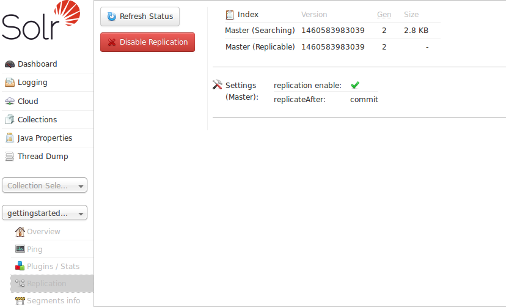

= Replication Screen
// Licensed to the Apache Software Foundation (ASF) under one
// or more contributor license agreements.  See the NOTICE file
// distributed with this work for additional information
// regarding copyright ownership.  The ASF licenses this file
// to you under the Apache License, Version 2.0 (the
// "License"); you may not use this file except in compliance
// with the License.  You may obtain a copy of the License at
//
//   http://www.apache.org/licenses/LICENSE-2.0
//
// Unless required by applicable law or agreed to in writing,
// software distributed under the License is distributed on an
// "AS IS" BASIS, WITHOUT WARRANTIES OR CONDITIONS OF ANY
// KIND, either express or implied.  See the License for the
// specific language governing permissions and limitations
// under the License.

The Replication screen shows you the current replication state for the core you have specified. <<solrcloud.adoc#,SolrCloud>> has supplanted much of this functionality, but if you are still using Leader-Follower index replication, you can use this screen to:

. View the replicatable index state. (on a leader node)
. View the current replication status (on a follower node)
. Disable replication. (on a leader node)

.Caution When Using SolrCloud
[IMPORTANT]
====
When using <<getting-started-with-solrcloud.adoc#,SolrCloud>>, do not attempt to disable replication via this screen.

====

More details on how to configure replication is available in the section called <<index-replication.adoc#,Index Replication>>.
