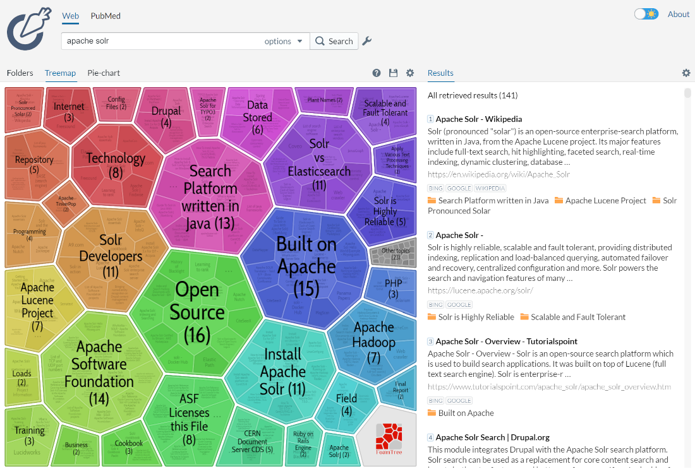
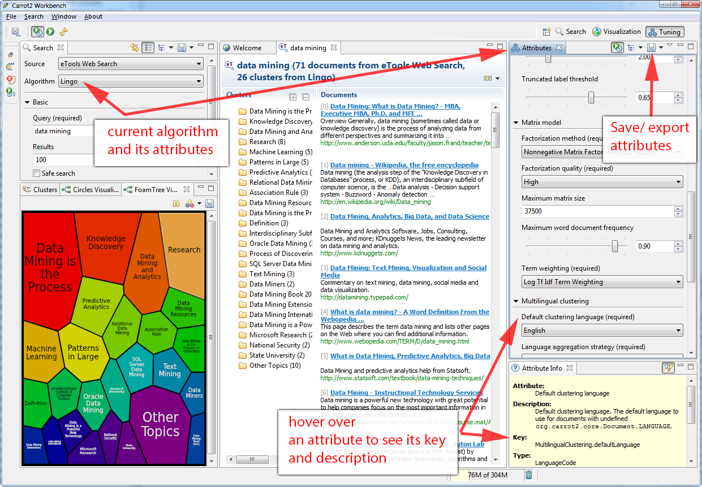

= Result Clustering
// Licensed to the Apache Software Foundation (ASF) under one
// or more contributor license agreements.  See the NOTICE file
// distributed with this work for additional information
// regarding copyright ownership.  The ASF licenses this file
// to you under the Apache License, Version 2.0 (the
// "License"); you may not use this file except in compliance
// with the License.  You may obtain a copy of the License at
//
//   http://www.apache.org/licenses/LICENSE-2.0
//
// Unless required by applicable law or agreed to in writing,
// software distributed under the License is distributed on an
// "AS IS" BASIS, WITHOUT WARRANTIES OR CONDITIONS OF ANY
// KIND, either express or implied.  See the License for the
// specific language governing permissions and limitations
// under the License.

The *clustering* (or *cluster analysis*) plugin attempts to automatically discover groups of related search hits (documents) and assign human-readable labels to these groups.

By default in Solr, the clustering algorithm is applied to the search result of each single query -— this is called an _on-line_ clustering. While Solr contains an extension for full-index clustering (_off-line_ clustering) this section will focus on discussing on-line clustering only.

Clusters discovered for a given query can be perceived as _dynamic facets_. This is beneficial when regular faceting is difficult (field values are not known in advance) or when the queries are exploratory in nature. Take a look at the http://search.carrot2.org/stable/search?query=solr&results=100&source=web&view=foamtree[Carrot2] project's demo page to see an example of search results clustering in action (the groups in the visualization have been discovered automatically in search results to the right, there is no external information involved).



The query issued to the system was _Solr_. It seems clear that faceting could not yield a similar set of groups, although the goals of both techniques are similar—to let the user explore the set of search results and either rephrase the query or narrow the focus to a subset of current documents. Clustering is also similar to <<result-grouping.adoc#result-grouping,Result Grouping>> in that it can help to look deeper into search results, beyond the top few hits.

== Clustering Concepts

Each *document* passed to the clustering component is composed of several logical parts:

* a unique identifier,
* origin URL,
* the title,
* the main content,
* a language code of the title and content.

The identifier part is mandatory, everything else is optional but at least one of the text fields (title or content) will be required to make the clustering process reasonable. It is important to remember that logical document parts must be mapped to a particular schema and its fields. The content (text) for clustering can be sourced from either a stored text field or context-filtered using a highlighter, all these options are explained below in the <<Clustering Configuration,configuration>> section.

A *clustering algorithm* is the actual logic (implementation) that discovers relationships among the documents in the search result and forms human-readable cluster labels. Depending on the choice of the algorithm the clusters may (and probably will) vary. Solr comes with several algorithms implemented in the open source http://carrot2.org[Carrot2] project, commercial alternatives also exist.

== Clustering Quick Start Example

The "```techproducts```" example included with Solr is pre-configured with all the necessary components for result clustering -- but they are disabled by default.

To enable the clustering component contrib and a dedicated search handler configured to use it, specify a JVM System Property when running the example:

[source,bash]
----
bin/solr start -e techproducts -Dsolr.clustering.enabled=true
----

You can now try out the clustering handler by opening the following URL in a browser:

`\http://localhost:8983/solr/techproducts/clustering?q=\*:*&rows=100&wt=xml`

The output XML should include search hits and an array of automatically discovered clusters at the end, resembling the output shown here:

[source,xml]
----
<response>
  <lst name="responseHeader">
    <int name="status">0</int>
    <int name="QTime">299</int>
  </lst>
  <result name="response" numFound="32" start="0" maxScore="1.0">
    <doc>
      <str name="id">GB18030TEST</str>
      <str name="name">Test with some GB18030 encoded characters</str>
      <arr name="features">
        <str>No accents here</str>
        <str>这是一个功能</str>
        <str>This is a feature (translated)</str>
        <str>这份文件是很有光泽</str>
        <str>This document is very shiny (translated)</str>
      </arr>
      <float name="price">0.0</float>
      <str name="price_c">0,USD</str>
      <bool name="inStock">true</bool>
      <long name="_version_">1448955395025403904</long>
      <float name="score">1.0</float>
    </doc>

    <!-- more search hits, omitted -->
  </result>

  <arr name="clusters">
    <lst>
      <arr name="labels">
        <str>DDR</str>
      </arr>
      <double name="score">3.9599865057283354</double>
      <arr name="docs">
        <str>TWINX2048-3200PRO</str>
        <str>VS1GB400C3</str>
        <str>VDBDB1A16</str>
      </arr>
    </lst>
    <lst>
      <arr name="labels">
        <str>iPod</str>
      </arr>
      <double name="score">11.959228467119022</double>
      <arr name="docs">
        <str>F8V7067-APL-KIT</str>
        <str>IW-02</str>
        <str>MA147LL/A</str>
      </arr>
    </lst>

    <!-- More clusters here, omitted. -->

    <lst>
      <arr name="labels">
        <str>Other Topics</str>
      </arr>
      <double name="score">0.0</double>
      <bool name="other-topics">true</bool>
      <arr name="docs">
        <str>adata</str>
        <str>apple</str>
        <str>asus</str>
        <str>ati</str>
        <!-- other unassigned document IDs here -->
      </arr>
    </lst>
  </arr>
</response>
----

There were a few clusters discovered for this query (`\*:*`), separating search hits into various categories: DDR, iPod, Hard Drive, etc. Each cluster has a label and score that indicates the "goodness" of the cluster. The score is algorithm-specific and is meaningful only in relation to the scores of other clusters in the same set. In other words, if cluster _A_ has a higher score than cluster _B_, cluster _A_ should be of better quality (have a better label and/or more coherent document set). Each cluster has an array of identifiers of documents belonging to it. These identifiers correspond to the `uniqueKey` field declared in the schema.

Depending on the quality of input documents, some clusters may not make much sense. Some documents may be left out and not be clustered at all; these will be assigned to the synthetic _Other Topics_ group, marked with the `other-topics` property set to `true` (see the XML dump above for an example). The score of the other topics group is zero.

== Installing the Clustering Contrib

The clustering contrib extension requires `dist/solr-clustering-*.jar` and all JARs under `contrib/clustering/lib`.

== Clustering Configuration

=== Declaration of the Clustering Search Component and Request Handler

Clustering extension is a search component and must be declared in `solrconfig.xml`. Such a component can be then appended to a request handler as the last component in the chain (because it requires search results which must be previously fetched by the search component).

An example configuration could look as shown below.

. Include the required contrib JARs. Note that by default paths are relative to the Solr core so they may need adjustments to your configuration, or an explicit specification of the `$solr.install.dir`.
+
[source,xml]
----
<lib dir="${solr.install.dir:../../..}/contrib/clustering/lib/" regex=".*\.jar" />
<lib dir="${solr.install.dir:../../..}/dist/" regex="solr-clustering-\d.*\.jar" />
----
. Declaration of the search component. Each component can also declare multiple clustering pipelines ("engines"), which can be selected at runtime by passing `clustering.engine=(engine name)` URL parameter.
+
[source,xml]
----
<searchComponent name="clustering" class="solr.clustering.ClusteringComponent">
  <!-- Lingo clustering algorithm -->
  <lst name="engine">
    <str name="name">lingo</str>
    <str name="carrot.algorithm">org.carrot2.clustering.lingo.LingoClusteringAlgorithm</str>
  </lst>

  <!-- An example definition for the STC clustering algorithm. -->
  <lst name="engine">
    <str name="name">stc</str>
    <str name="carrot.algorithm">org.carrot2.clustering.stc.STCClusteringAlgorithm</str>
  </lst>
</searchComponent>
----
. A request handler to which we append the clustering component declared above.
+
[source,xml]
----
<requestHandler name="/clustering"
                class="solr.SearchHandler">
  <lst name="defaults">
    <bool name="clustering">true</bool>
    <bool name="clustering.results">true</bool>

    <!-- Logical field to physical field mapping. -->
    <str name="carrot.url">id</str>
    <str name="carrot.title">doctitle</str>
    <str name="carrot.snippet">content</str>

    <!-- Configure any other request handler parameters. We will cluster the
         top 100 search results so bump up the 'rows' parameter. -->
    <str name="rows">100</str>
    <str name="fl">*,score</str>
  </lst>

  <!-- Append clustering at the end of the list of search components. -->
  <arr name="last-components">
    <str>clustering</str>
  </arr>
</requestHandler>
----

=== Configuration Parameters of the Clustering Component

The following parameters of each clustering engine or the entire clustering component (depending where they are declared) are available.

`clustering`::
When `true`, clustering component is enabled.

`clustering.engine`::
Declares which clustering engine to use. If not present, the first declared engine will become the default one.

`clustering.results`::
When `true`, the component will perform clustering of search results (this should be enabled).

`clustering.collection`::
When `true`, the component will perform clustering of the whole document index (this section does not cover full-index clustering).

At the engine declaration level, the following parameters are supported.

`carrot.algorithm`::
The algorithm class.

`carrot.resourcesDir`::
Algorithm-specific resources and configuration files (stop words, other lexical resources, default settings). By default points to `conf/clustering/carrot2/`

`carrot.outputSubClusters`::
If `true` and the algorithm supports hierarchical clustering, sub-clusters will also be emitted. Default value: true.

`carrot.numDescriptions`::
Maximum number of per-cluster labels to return (if the algorithm assigns more than one label to a cluster).

The `carrot.algorithm` parameter should contain a fully qualified class name of an algorithm supported by the http://project.carrot2.org[Carrot2] framework. Currently, the following algorithms are available:

* `org.carrot2.clustering.lingo.LingoClusteringAlgorithm` (open source)
* `org.carrot2.clustering.stc.STCClusteringAlgorithm` (open source)
* `org.carrot2.clustering.kmeans.BisectingKMeansClusteringAlgorithm` (open source)
* `com.carrotsearch.lingo3g.Lingo3GClusteringAlgorithm` (commercial)

For a comparison of characteristics of these algorithms see the following links:

* http://doc.carrot2.org/#section.advanced-topics.fine-tuning.choosing-algorithm
* http://project.carrot2.org/algorithms.html
* http://carrotsearch.com/lingo3g-comparison.html

The question of which algorithm to choose depends on the amount of traffic (STC is faster than Lingo, but arguably produces less intuitive clusters, Lingo3G is the fastest algorithm but is not free or open source), expected result (Lingo3G provides hierarchical clusters, Lingo and STC provide flat clusters), and the input data (each algorithm will cluster the input slightly differently). There is no one answer which algorithm is "the best".

=== Contextual and Full Field Clustering

The clustering engine can apply clustering to the full content of (stored) fields or it can run an internal highlighter pass to extract context-snippets before clustering. Highlighting is recommended when the logical snippet field contains a lot of content (this would affect clustering performance). Highlighting can also increase the quality of clustering because the content passed to the algorithm will be more focused around the query (it will be query-specific context). The following parameters control the internal highlighter.

`carrot.produceSummary`::
When `true` the clustering component will run a highlighter pass on the content of logical fields pointed to by `carrot.title` and `carrot.snippet`. Otherwise full content of those fields will be clustered.

`carrot.fragSize`::
The size, in characters, of the snippets (aka fragments) created by the highlighter. If not specified, the default highlighting fragsize (`hl.fragsize`) will be used.

`carrot.summarySnippets`:: The number of summary snippets to generate for clustering. If not specified, the default highlighting snippet count (`hl.snippets`) will be used.

=== Logical to Document Field Mapping

As already mentioned in <<Clustering Concepts>>, the clustering component clusters "documents" consisting of logical parts that need to be mapped onto physical schema of data stored in Solr. The field mapping attributes provide a connection between fields and logical document parts. Note that the content of title and snippet fields must be *stored* so that it can be retrieved at search time.

`carrot.title`::
The field (alternatively comma- or space-separated list of fields) that should be mapped to the logical document's title. The clustering algorithms typically give more weight to the content of the title field compared to the content (snippet). For best results, the field should contain concise, noise-free content. If there is no clear title in your data, you can leave this parameter blank.

`carrot.snippet`::
The field (alternatively comma- or space-separated list of fields) that should be mapped to the logical document's main content. If this mapping points to very large content fields the performance of clustering may drop significantly. An alternative then is to use query-context snippets for clustering instead of full field content. See the description of the `carrot.produceSummary` parameter for details.

`carrot.url`::
The field that should be mapped to the logical document's content URL. Leave blank if not required.

=== Clustering Multilingual Content

The field mapping specification can include a `carrot.lang` parameter, which defines the field that stores http://www.loc.gov/standards/iso639-2/php/code_list.php[ISO 639-1] code of the language in which the title and content of the document are written. This information can be stored in the index based on apriori knowledge of the documents' source or a language detection filter applied at indexing time. All algorithms inside the Carrot2 framework will accept ISO codes of languages defined in https://github.com/carrot2/carrot2/blob/master/core/carrot2-core/src/org/carrot2/core/LanguageCode.java[LanguageCode enum].

The language hint makes it easier for clustering algorithms to separate documents from different languages on input and to pick the right language resources for clustering. If you do have multi-lingual query results (or query results in a language different than English), it is strongly advised to map the language field appropriately.

`carrot.lang`::
The field that stores ISO 639-1 code of the language of the document's text fields.

`carrot.lcmap`::
A mapping of arbitrary strings into ISO 639 two-letter codes used by `carrot.lang`. The syntax of this parameter is the same as `langid.map.lcmap`, for example: `langid.map.lcmap=japanese:ja polish:pl english:en`

The default language can also be set using Carrot2-specific algorithm attributes (in this case the http://doc.carrot2.org/#section.attribute.lingo.MultilingualClustering.defaultLanguage[MultilingualClustering.defaultLanguage] attribute).

== Tweaking Algorithm Settings

The algorithms that come with Solr are using their default settings which may be inadequate for all data sets. All algorithms have lexical resources and resources (stop words, stemmers, parameters) that may require tweaking to get better clusters (and cluster labels). For Carrot2-based algorithms it is probably best to refer to a dedicated tuning application called Carrot2 Workbench (screenshot below). From this application one can export a set of algorithm attributes as an XML file, which can be then placed under the location pointed to by `carrot.resourcesDir`.



=== Providing Defaults for Clustering

The default attributes for all engines (algorithms) declared in the clustering component are placed under `carrot.resourcesDir` and with an expected file name of `engineName-attributes.xml`. So for an engine named `lingo` and the default value of `carrot.resourcesDir`, the attributes would be read from a file in `conf/clustering/carrot2/lingo-attributes.xml`.

An example XML file changing the default language of documents to Polish is shown below.

[source,xml]
----
<attribute-sets default="attributes">
  <attribute-set id="attributes">
    <value-set>
      <label>attributes</label>
      <attribute key="MultilingualClustering.defaultLanguage">
        <value type="org.carrot2.core.LanguageCode" value="POLISH"/>
      </attribute>
    </value-set>
  </attribute-set>
</attribute-sets>
----

=== Tweaking Algorithms at Query-Time

The clustering component and Carrot2 clustering algorithms can accept query-time attribute overrides. Note that certain things (for example lexical resources) can only be initialized once (at startup, via the XML configuration files).

An example query that changes the `LingoClusteringAlgorithm.desiredClusterCountBase` parameter for the Lingo algorithm:

[source,text]
http://localhost:8983/solr/techproducts/clustering?q=*:*&rows=100&LingoClusteringAlgorithm.desiredClusterCountBase=20

The clustering engine (the algorithm declared in `solrconfig.xml`) can also be changed at runtime by passing `clustering.engine=name` request attribute:

[source,text]
http://localhost:8983/solr/techproducts/clustering?q=*:*&rows=100&clustering.engine=kmeans

== Performance Considerations with Dynamic Clustering

Dynamic clustering of search results comes with two major performance penalties:

* Increased cost of fetching a larger-than-usual number of search results (50, 100 or more documents),
* Additional computational cost of the clustering itself.

For simple queries, the clustering time will usually dominate the fetch time. If the document content is very long the retrieval of stored content can become a bottleneck. The performance impact of clustering can be lowered in several ways:

* feed less content to the clustering algorithm by enabling `carrot.produceSummary` attribute,
* perform clustering on selected fields (titles only) to make the input smaller,
* use a faster algorithm (STC instead of Lingo, Lingo3G instead of STC),
* tune the performance attributes related directly to a specific algorithm.

Some of these techniques are described in _Apache SOLR and Carrot2 integration strategies_ document, available at http://carrot2.github.io/solr-integration-strategies. The topic of improving performance is also included in the Carrot2 manual at http://doc.carrot2.org/#section.advanced-topics.fine-tuning.performance.

== Additional Resources

The following resources provide additional information about the clustering component in Solr and its potential applications.

* Apache Solr and Carrot2 integration strategies: http://carrot2.github.io/solr-integration-strategies
* Clustering and Visualization of Solr search results (video from Berlin BuzzWords conference, 2011): http://vimeo.com/26616444
