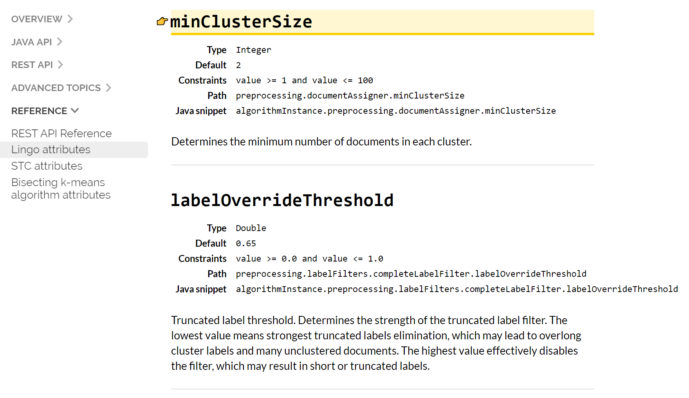

= Result Clustering
// Licensed to the Apache Software Foundation (ASF) under one
// or more contributor license agreements.  See the NOTICE file
// distributed with this work for additional information
// regarding copyright ownership.  The ASF licenses this file
// to you under the Apache License, Version 2.0 (the
// "License"); you may not use this file except in compliance
// with the License.  You may obtain a copy of the License at
//
//   http://www.apache.org/licenses/LICENSE-2.0
//
// Unless required by applicable law or agreed to in writing,
// software distributed under the License is distributed on an
// "AS IS" BASIS, WITHOUT WARRANTIES OR CONDITIONS OF ANY
// KIND, either express or implied.  See the License for the
// specific language governing permissions and limitations
// under the License.

[IMPORTANT]
====
The clustering component implementation and API (parameters) have changed significantly
in version 9.0. Please refer to the Solr Guide version matching your Solr release
exactly.
====

The *clustering* (or *cluster analysis*) plugin attempts to automatically discover groups of related search hits (documents) and assign human-readable labels to these groups.

The clustering algorithm in Solr is applied to documents included in search result of each single query -— this is called an _on-line_ clustering.

Clusters discovered for a given query can be perceived as _dynamic facets_. This is beneficial when regular faceting is difficult (field values are not known in advance) or when the queries are exploratory in nature. Take a look at the https://search.carrot2.org/#/search/web/apache%20solr/treemap[Carrot^2^] project's demo page to see an example of search results clustering in action (the groups in the visualization have been discovered automatically in search results to the right, there is no external information involved).

image::images/result-clustering/carrot2.png[image,width=900]

The query issued to the system was _Apache Solr_. It seems clear that faceting could not yield a similar set of groups, although the goals of both techniques are similar—to let the user explore the set of search results and either rephrase the query or narrow the focus to a subset of current documents. Clustering is also similar to <<result-grouping.adoc#result-grouping,Result Grouping>> in that it can help to look deeper into search results, beyond the top few hits.

== Configuration Quick Starter

The clustering extension works as a search component. It needs to be declared and configured in `solrconfig.xml`, for example:

[source,xml]
----
<searchComponent class="org.apache.solr.handler.clustering.ClusteringComponent" name="clustering">
  <lst name="engine">
    <str name="name">lingo</str>
    <str name="clustering.fields">title, content</str>
    <str name="clustering.algorithm">Lingo</str>
  </lst>
</searchComponent>
----

The above declares the clustering component with a single *engine* -- there may be
multiple engines declared and switched at runtime. We will return to the details of
how to configure engines later.

The clustering component must be attached to a `SearchHandler` and explicitly enabled
via property `clustering`. It is important to attach it as the *last* component in the handler's pipeline, as shown below:

[source,xml]
----
  <requestHandler name="/select" class="solr.SearchHandler">
    <lst name="defaults">
      <bool name="clustering">true</bool>
      <str name="clustering.engine">lingo</str>
    </lst>

    <arr name="last-components">
      <str>clustering</str>
    </arr>
  </requestHandler>
----

Once attached, as in the example above, the clustering will be performed automatically
on all documents matching the search handler's query. The clustering extension will take into
account all text fields listed in `clustering.fields` parameter of the engine and will
product a section of the response called `clusters` containing the discovered structure of
groups, for example (JSON response for brevity):

[source,json]
----
{
    "clusters": [
        {
          "labels": ["Memory"],
          "score": 6.80,
          "docs":[ "0579B002",
            "EN7800GTX/2DHTV/256M",
            "TWINX2048-3200PRO",
            "VDBDB1A16",
            "VS1GB400C3"]},
        {
          "labels":["Coins and Notes"],
          "score":28.560285143284457,
          "docs":["EUR",
            "GBP",
            "NOK",
            "USD"]},
        {
          "labels":["TFT LCD"],
          "score":15.355729924203429,
          "docs":["3007WFP",
            "9885A004",
            "MA147LL/A",
            "VA902B"]}
    ]
}
----

The `labels` element of each cluster is a dynamically discovered phrase that describes and applies to all document identifiers under `docs` element.

== Solr Distribution Example

The `techproducts` example included with Solr is pre-configured with all the necessary components for result clustering -- but they are disabled by default.

To enable the clustering component extension and the dedicated search handler configured to use it, specify a JVM System Property when running the example:

[source,bash]
----
bin/solr start -e techproducts -Dsolr.clustering.enabled=true
----

You can now try out the clustering handler by opening the following URL in a browser:

`\http://localhost:8983/solr/techproducts/clustering?q=\*:*&rows=100&wt=xml`

The output XML should include search hits and an array of automatically discovered clusters at the end, resembling the output shown here:

[source,xml]
----
<response>
  <lst name="responseHeader">
    <int name="status">0</int>
    <int name="QTime">299</int>
  </lst>
  <result name="response" numFound="32" start="0" maxScore="1.0">
    <doc>
      <str name="id">GB18030TEST</str>
      <str name="name">Test with some GB18030 encoded characters</str>
      <arr name="features">
        <str>No accents here</str>
        <str>这是一个功能</str>
        <str>This is a feature (translated)</str>
        <str>这份文件是很有光泽</str>
        <str>This document is very shiny (translated)</str>
      </arr>
      <float name="price">0.0</float>
      <str name="price_c">0,USD</str>
      <bool name="inStock">true</bool>
      <long name="_version_">1448955395025403904</long>
      <float name="score">1.0</float>
    </doc>

    <!-- more search hits, omitted -->
  </result>

  <arr name="clusters">
    <lst>
      <arr name="labels">
        <str>DDR</str>
      </arr>
      <double name="score">3.9599865057283354</double>
      <arr name="docs">
        <str>TWINX2048-3200PRO</str>
        <str>VS1GB400C3</str>
        <str>VDBDB1A16</str>
      </arr>
    </lst>
    <lst>
      <arr name="labels">
        <str>iPod</str>
      </arr>
      <double name="score">11.959228467119022</double>
      <arr name="docs">
        <str>F8V7067-APL-KIT</str>
        <str>IW-02</str>
        <str>MA147LL/A</str>
      </arr>
    </lst>

    <!-- More clusters here, omitted. -->

    <lst>
      <arr name="labels">
        <str>Other Topics</str>
      </arr>
      <double name="score">0.0</double>
      <bool name="other-topics">true</bool>
      <arr name="docs">
        <str>adata</str>
        <str>apple</str>
        <str>asus</str>
        <str>ati</str>
        <!-- other unassigned document IDs here -->
      </arr>
    </lst>
  </arr>
</response>
----

A few clusters discovered for this query (`\*:*`), separate all search hits into various categories: DDR, iPod, Hard Drive, etc. Each cluster has a label and score that indicates the "goodness" of the cluster. The score is algorithm-specific and is meaningful only in relation to the scores of other clusters in the same set. In other words, if cluster _A_ has a higher score than cluster _B_, cluster _A_ should be of better quality (have a better label and/or more coherent document set). Each cluster has an array of identifiers of documents belonging to it. These identifiers correspond to the `uniqueKey` field declared in the schema.

Sometimes cluster labels may not make much sense (this depends on many factors -- text in clustered fields, number of documents, algorithm paramerters). Also, some documents may be left out and not be clustered at all; these will be assigned to the synthetic _Other Topics_ group, marked with the `other-topics` property set to `true` (see the XML dump above for an example). The score of the other topics group is zero.

== Installation

The clustering contrib extension requires `dist/solr-clustering-*.jar` and all JARs under `contrib/clustering/lib`.

You can include the required contrib JARs in `solrconfig.xml` as shown below (by default paths are relative to the Solr core so they may need adjustments to your configuration, or an explicit specification of the `$solr.install.dir`):

[source,xml]
----
<lib dir="${solr.install.dir:../../..}/contrib/clustering/lib/" regex=".*\.jar" />
<lib dir="${solr.install.dir:../../..}/dist/" regex="solr-clustering-\d.*\.jar" />
----

== Configuration

=== Component Configuration

The following properties control `ClusteringComponent` state.

`clustering`::
The component is by default disabled, even if properly declared and attached to a search handler. The `clustering` property must be set to `true` to enable it (this can be done by setting
   up default parameters in the search handler -- see below).

`clustering.engine`::
Declares which engine to use. If not present, the first declared active engine is used.

=== Clustering Engines

The declaration of clustering component in `solrconfig.xml` must include one or more predefined configurations called _engines_. For example, consider the configuration below:

[source,xml]
----
<searchComponent class="org.apache.solr.handler.clustering.ClusteringComponent" name="clustering">
  <lst name="engine">
      <str name="name">lingo</str>
      <str name="clustering.algorithm">Lingo</str>
      <str name="clustering.fields">title, content</str>
  </lst>

  <lst name="engine">
      <str name="name">stc</str>
      <str name="clustering.algorithm">STC</str>
      <str name="clustering.fields">title</str>
  </lst>
</searchComponent>
----

This declares two separate engines (`lingo` and `stc`): these configurations have a
different clustering algorithm, and a different set of clustered document fields. The
active engine can be selected by passing `clustering.engine=_name_` parameter
at runtime (via URL) or as the default within the search handler's configuration,
as shown below:

[source,xml]
----
<requestHandler name="/clustering" class="solr.SearchHandler">
  <lst name="defaults">
    <!-- Clustering component enabled. -->
    <bool name="clustering">true</bool>
    <str name="clustering.engine">stc</str>

    <!-- Cluster the top 100 search results - bump up the 'rows' parameter. -->
    <str name="rows">100</str>
  </lst>

  <!-- Append clustering at the end of the list of search components. -->
  <arr name="last-components">
    <str>clustering</str>
  </arr>
</requestHandler>
----

=== Clustering Engine Configuration Parameters

Each declared engine can be configured using a number of parameters described below.

`clustering.fields` (_required_)::
A comma (or space) separated list of text fields which should contain the text
content for clustering. At least one field must be provided. The fields are separate from search handler's `fl` parameter so that clustered fields don't have to be included in the response.

`clustering.algorithm` (_required_)::
The clustering algorithm is the actual logic (implementation) that discovers relationships among the documents and forms human-readable cluster labels. This parameter sets the name of the clustering algorithm this engine is going to use. Algorithms are supplied to Solr via Carrot^2^-defined service extension. By default, the following open-source algorithms should be available: `Lingo`, `STC`, `Bisecting K-Means`. A commercial clustering algorithm `Lingo3G` plugs into the same extension point and can be used, if it is available on classpath.

.How to choose the Clustering Algorithm?
****
The question of which algorithm to choose depends on the amount of traffic, the expected result, and the input data (each algorithm will cluster the input slightly differently). There is no one answer which algorithm is "the best": Lingo3G provides hierarchical clusters, Lingo and STC provide flat clusters. STC is faster than Lingo, but arguably produces less intuitive clusters, Lingo3G is the fastest algorithm but is not free or open source... Experiment and pick one that suits your needs.

For a comparison of characteristics of these algorithms see the following links:

* https://carrot2.github.io/release/4.0.4/doc/algorithms/
* https://carrotsearch.com/lingo3g-comparison.html

The clustering component lists all available algorithms, languages and algorithm-language compatibility at startup. You can peek at startup logs to see what's available
in your Solr installation.
****

`clustering.maxLabels`::
Maximum number of returned cluster labels (if the algorithm returns more labels, the list will
be truncated). By default all labels are returned.

`clustering.includeSubclusters`::
If `true`, sub-clusters are included in the response for algorithms that support hierarchical
clustering. `false` causes only top-level clusters to be returned.

`clustering.includeOtherTopics`::
If `true`, a synthetic cluster called _Other Topics_, consisting of all documents not assigned to any other cluster is formed and returned. The default value of this parameter is `true` but if
  there is no need for this synthetic cluster, it can be set to `false`.

`clustering.resources`::
Location of algorithm-specific resources and configuration files (stop words, other lexical resources, default settings). This property is `null` by default and all resources are read
from their respective algorithm default resource pool (JARs). If this property is not empty,
it resolves relative to Solr core's configuration directory. This parameter can be applied during Solr startup _only_, it can't be overriden per-request.

[.text-center]
🙪

There are more properties applying to engine configuration. We describe these in functional sections that follow.

=== Full Field and Query-Context (Snippet) Clustering

The clustering algorithm can consume full content of fields or just the left and right context around query-matching regions (so-called _snippets_). Contrary to the intuition, using query contexts can increase the quality of clustering even if it feeds less data to the algorithm. This is typically caused by the fact that snippets are more focused around the phrases and terms surrounding the query and the algorithm has a better signal-to-noise ratio of data to work with.

We recommend using query contexts when fields contain a lot of content (this would affect clustering performance).

The following three properties control whether the context or full content are processed and how snippets are formed for clustering.

`clustering.preferQueryContext`::
If `true`, the engine will try to extract context around the query matching regions and use these contexts as input for the clustering algorithm.

`clustering.contextSize`::
The maximum size, in characters, of each snippet created by the context retrieval algorithm (internal highlighter).

`clustering.contextCount`::
The maximum number of different, non-contiguous snippets from a single field.

=== Default Clustering Language

The default implementations of clustering algorithms in Carrot^2^ (shipped with Solr)
have built-in support (stemming, stop words) for preprocessing a number of languages. It is important to provide the clustering algorithm with a hint of what language should be used for clustering. This can be done in two ways -- by passing the name of the default language or by providing the language as a field with each document. The following two engine configuration parameters control this:

`clustering.language`::
Name of the default language to use for clustering. The default value of this field is `English`. The provided language must be available and the clustering algorithm must support it.

`clustering.languageField`::
Name of the document field that stores the document's language. If the field does not exist
for a document or the value is blank, the default language is used.

The list of supported languages can change dynamically (languages are loaded via external service provider extension) and may depend on the selected algorithm (algorithms can support a subset of languages for which resources are available). The clustering component will log all supported algorithm-language pairs at Solr startup, so you can inspect what's supported on your particular Solr instance. For example:

[source,text]
----
2020-10-29 [...] Clustering algorithm Lingo3G loaded with support for the following languages: Dutch, English
2020-10-29 [...] Clustering algorithm Lingo loaded with support for the following languages: Danish, Dutch, English, Finnish, French, German, Hungarian, Italian, Norwegian, Portuguese, Romanian, Russian, Spanish, Swedish, Turkish
2020-10-29 [...] Clustering algorithm Bisecting K-Means loaded with support for the following languages: Danish, Dutch, English, Finnish, French, German, Hungarian, Italian, Norwegian, Portuguese, Romanian, Russian, Spanish, Swedish, Turkish
----

=== Handling Multilingual Content

It is often the case that the index (and query result) contains documents in _multiple_ languages. Clustering such search results is problematic. Ideally, the engine should translate (or understand) the content of documents and then group relevant information together, regardless of the language it is written in.

In reality, clustering algorithms are typically much simpler -- they infer similarity between documents from statistical properties of terms and phrases that occur in those documents. So texts written in different languages will not cluster too well.

To deal witht his situation the default clustering component implementation in Solr will try to first group all documents by their language and then apply clustering to each sub-group in that language. It is recommended to store the language of each document as its separate field and point at it using the `clustering.languageField` configuration property described above.

== Tweaking Algorithm Settings

The clustering algorithms that come with Solr use their default parameter values and language resources. We highly recommend tuning both for production uses. Improving the default language resources to include words and phrases common to a particular document domain will improve clustering quality significantly.

Carrot^2^ algorithms have an extensive set of parameters and language resource tuning options. Please refer to https://carrot2.github.io/release/latest/[up-to-date project documentation]. In particular, the language resources section and each algorithm's attributes section.

=== Changing Clustering Algorithm Parameters

Clustering algorithm settings can be changed via Solr parameters either
permanently (in the Engine's declaration) or per-request (via Solr URL parameters).

For example, let's assume the following engine configuration:

[source,xml]
----
<lst name="engine">
  <str name="name">lingo</str>
  <str name="clustering.algorithm">Lingo</str>
  <str name="clustering.fields">name, features</str>
  <str name="clustering.language">English</str>
</lst>
----

First, locate the configuration parameters for the Lingo algorithm
at https://carrot2.github.io/release/latest/[Carrot^2^ documentation site]:

image::images/result-clustering/carrot2-docs-attrs1.png[image,scaledwidth=75%]

Then locate the particular setting you'd like to change and note the
REST API path to that setting (in this case the parameter is
`minClusterSize` and its path is `preprocessing.documentAssigner.minClusterSize`):

Now add the full path-value pair to the engine's configuration:

[source,xml]
----
<lst name="engine">
  <str name="name">lingo</str>
  <str name="clustering.algorithm">Lingo</str>
  <str name="clustering.fields">name, features</str>
  <str name="clustering.language">English</str>

  <int name="preprocessing.documentAssigner.minClusterSize">3</int>
</lst>
----

The following rules apply.

* The type of the parameter must be consistent with the type listed in Carrot^2^ specification.

* If the parameter is added to the engine's configuration in `solrconfig.xml`, the core must be reloaded for the changes to be picked up. Alternatively, pass the parameter via the request URL to change things dynamically on a per-request basis. For example, if you have the `techproducts` example running, this will cut the clusters to only those containing at least three documents:
 `http://localhost:8983/solr/techproducts/clustering?q=\*:*&rows=100&wt=json&preprocessing.documentAssigner.minClusterSize=3`

* For complex types, the parameter key with the name of the instantiated type must precede any of its own parameters.

=== Custom Language Resources

Clustering algorithms rely on language and domain-specific language resources to
improve the quality of clusters (by discarding domain-specific noise and boilerplate language).

By default, language resources are read from the engine-declared algorithm default JAR. You can pass a custom location for these resources by specifying the `clustering.resources` parameter. The value of this parameter resolves to a location relative to Solr core's configuration directory. For example, the following definition:

[source,xml]
----
<lst name="engine">
  <str name="name">lingo</str>
  <str name="clustering.algorithm">Lingo</str>
  <str name="clustering.fields">name, features</str>
  <str name="clustering.language">English</str>

  <str name="clustering.resources">lingo-resources</str>
</lst>
----

would result in the following log entry and expected resource location:

[source,text]
----
Clustering algorithm resources first looked up relative to: [.../example/techproducts/solr/techproducts/conf/lingo-resources]
----

The best way to start tuning algorithm resources is to copy all the defaults from its
corresponding Carrot^2^ JAR file (or Carrot^2^ distribution).

== Performance Considerations

Clustering of search results comes with some performance considerations:

* The cost of fetching a larger-than-usual number of search results (50, 100 or more documents),
* Additional computational cost of the clustering itself.
* In distributed mode the content of document fields for clustering is collected from shards and adds some additional network overhead.

For simple queries, the clustering time will usually dominate everything else. If document fields are very long, the retrieval of stored content can become a bottleneck.

The performance impact of clustering can be lowered in several ways.

* Cluster less data: use query context (snippets) instead of full field content (`clustering.preferQueryContext=true`).
* Perform clustering on just a subset of document fields or curate fields for clustering (add abstracts at indexing-time) to make the input smaller.
* Tune the performance attributes related directly to a specific algorithm.
* Try a different, faster algorithm (STC instead of Lingo, Lingo3G instead of STC).

== Additional Resources

The following resources provide additional information about the clustering component in Solr and its potential applications.

* Clustering and Visualization of Solr search results (Berlin BuzzWords conference, *2011*): http://2011.berlinbuzzwords.de/sites/2011.berlinbuzzwords.de/files/solr-clustering-visualization.pdf
