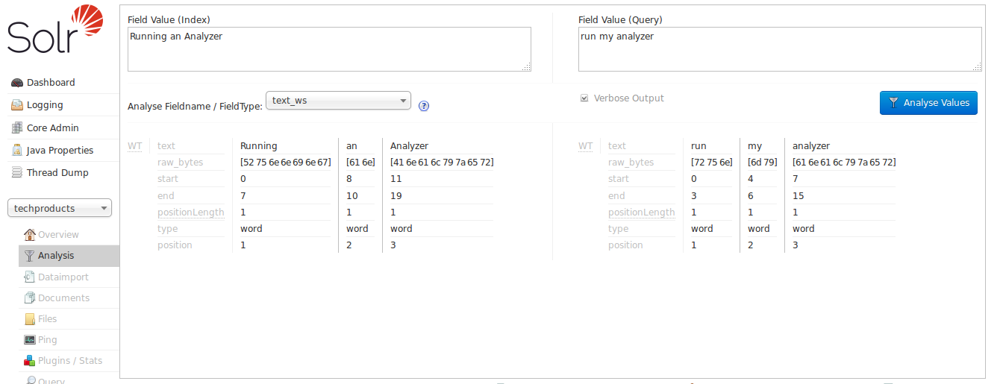
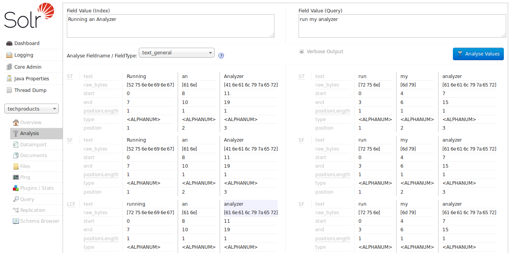
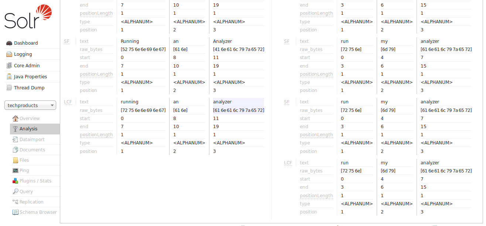
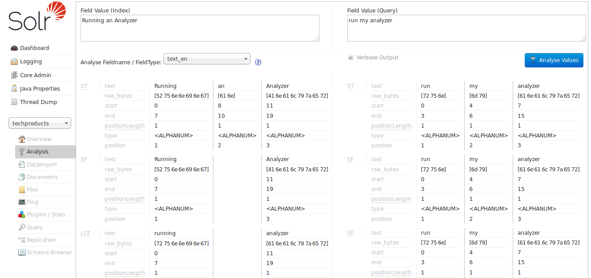

= Running Your Analyzer
// Licensed to the Apache Software Foundation (ASF) under one
// or more contributor license agreements.  See the NOTICE file
// distributed with this work for additional information
// regarding copyright ownership.  The ASF licenses this file
// to you under the Apache License, Version 2.0 (the
// "License"); you may not use this file except in compliance
// with the License.  You may obtain a copy of the License at
//
//   http://www.apache.org/licenses/LICENSE-2.0
//
// Unless required by applicable law or agreed to in writing,
// software distributed under the License is distributed on an
// "AS IS" BASIS, WITHOUT WARRANTIES OR CONDITIONS OF ANY
// KIND, either express or implied.  See the License for the
// specific language governing permissions and limitations
// under the License.

Once you've <<field-type-definitions-and-properties.adoc#,defined a field type in your Schema>>, and specified the analysis steps that you want applied to it, you should test it out to make sure that it behaves the way you expect it to.

Luckily, there is a very handy page in the Solr <<using-the-solr-administration-user-interface.adoc#,admin interface>> that lets you do just that. You can invoke the analyzer for any text field, provide sample input, and display the resulting token stream.

For example, let's look at some of the "Text" field types available in the `bin/solr -e techproducts` example configuration, and use the <<analysis-screen.adoc#,Analysis Screen>> (`\http://localhost:8983/solr/#/techproducts/analysis`) to compare how the tokens produced at index time for the sentence "Running an Analyzer" match up with a slightly different query text of "run my analyzer"

We can begin with "```text_ws```" - one of the most simplified Text field types available:



By looking at the start and end positions for each term, we can see that the only thing this field type does is tokenize text on whitespace. Notice in this image that the term "Running" has a start position of 0 and an end position of 7, while "an" has a start position of 8 and an end position of 10, and "Analyzer" starts at 11 and ends at 19. If the whitespace between the terms was also included, the count would be 21; since it is 19, we know that whitespace has been removed from this query.

Note also that the indexed terms and the query terms are still very different. "Running" doesn't match "run", "Analyzer" doesn't match "analyzer" (to a computer), and obviously "an" and "my" are totally different words. If our objective is to allow queries like "run my analyzer" to match indexed text like "Running an Analyzer" then we will evidently need to pick a different field type with index & query time text analysis that does more processing of the inputs.

In particular we will want:

* Case insensitivity, so "Analyzer" and "analyzer" match.
* Stemming, so words like "Run" and "Running" are considered equivalent terms.
* Stop Word Pruning, so small words like "an" and "my" don't affect the query.

For our next attempt, let's try the "```text_general```" field type:



With the verbose output enabled, we can see how each stage of our new analyzers modify the tokens they receive before passing them on to the next stage. As we scroll down to the final output, we can see that we do start to get a match on "analyzer" from each input string, thanks to the "LCF" stage -- which if you hover over with your mouse, you'll see is the "```LowerCaseFilter```":



The "```text_general```" field type is designed to be generally useful for any language, and it has definitely gotten us closer to our objective than "```text_ws```" from our first example by solving the problem of case sensitivity. It's still not quite what we are looking for because we don't see stemming or stopword rules being applied. So now let us try the "```text_en```" field type:



Now we can see the "SF" (`StopFilter`) stage of the analyzers solving the problem of removing Stop Words ("an"), and as we scroll down, we also see the "PSF" (`PorterStemFilter`) stage apply stemming rules suitable for our English language input, such that the terms produced by our "index analyzer" and the terms produced by our "query analyzer" match the way we expect.

image::images/running-your-analyzer/analysis_compare_4.png[image]


At this point, we can continue to experiment with additional inputs, verifying that our analyzers produce matching tokens when we expect them to match, and disparate tokens when we do not expect them to match, as we iterate and tweak our field type configuration.
