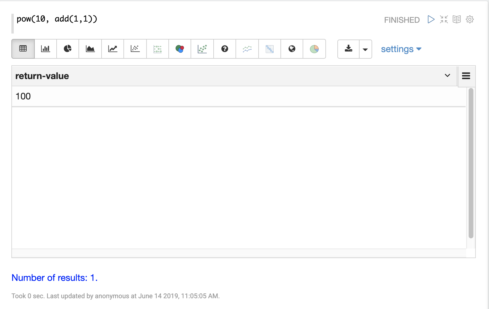
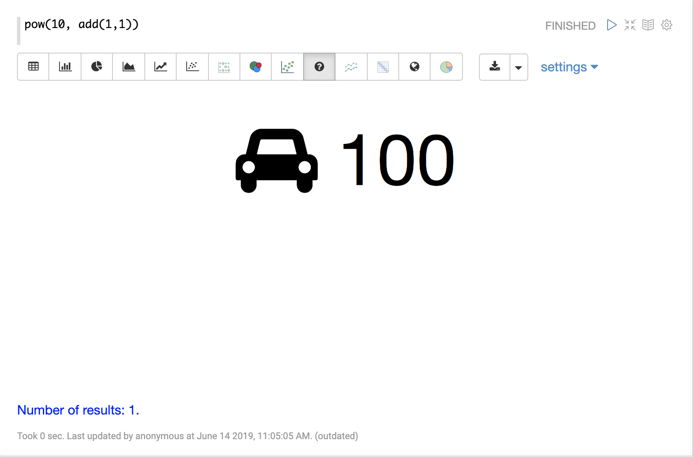
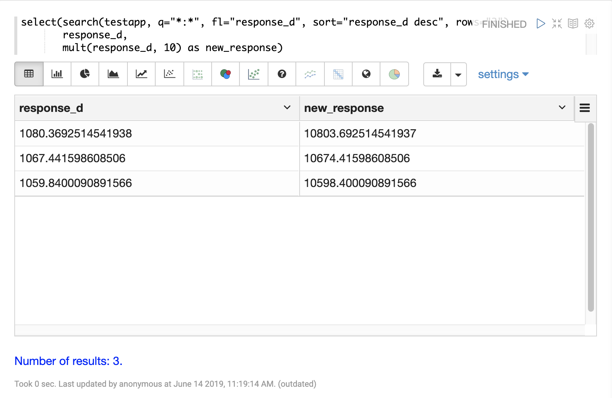
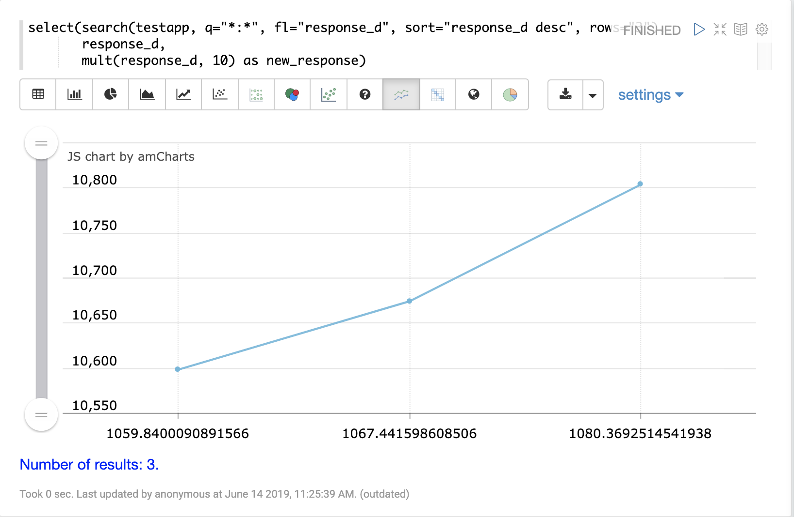

= Scalar Math
// Licensed to the Apache Software Foundation (ASF) under one
// or more contributor license agreements.  See the NOTICE file
// distributed with this work for additional information
// regarding copyright ownership.  The ASF licenses this file
// to you under the Apache License, Version 2.0 (the
// "License"); you may not use this file except in compliance
// with the License.  You may obtain a copy of the License at
//
//   http://www.apache.org/licenses/LICENSE-2.0
//
// Unless required by applicable law or agreed to in writing,
// software distributed under the License is distributed on an
// "AS IS" BASIS, WITHOUT WARRANTIES OR CONDITIONS OF ANY
// KIND, either express or implied.  See the License for the
// specific language governing permissions and limitations
// under the License.

The most basic math expressions are scalar expressions. Scalar expressions
perform mathematical operations on numbers.

For example the expression below adds two numbers together:

[source,text]
----
add(1, 1)
----

When this expression is sent to the `/stream` handler it
responds with:

[source,json]
----
{
  "result-set": {
    "docs": [
      {
        "return-value": 2
      },
      {
        "EOF": true,
        "RESPONSE_TIME": 2
      }
    ]
  }
}
----

Math expressions can be nested. For example in the expression
below the output of the `add` function is the second parameter
of the `pow` function:

[source,text]
----
pow(10, add(1,1))
----

This expression returns the following response:

[source,json]
----
{
  "result-set": {
    "docs": [
      {
        "return-value": 100
      },
      {
        "EOF": true,
        "RESPONSE_TIME": 0
      }
    ]
  }
}
----

== Visualization

In the Zeppelin-Solr interpreter you can simply type in scalar math functions and the
result will be shown in a table format.

The *Number* visualization can be used to visualize the number with text and icons.

== Streaming Scalar Math

Scalar math expressions can also be applied to each tuple in a stream
through use of the `select` stream decorator. The `select` function wraps a
stream of tuples and selects fields to include in each tuple.
The `select` function can also use math expressions to compute
new values and add them to the outgoing tuples.

In the example below the `select` expression is wrapping a search
expression. The `select` function is selecting the `response_d` field
and computing a new field called `new_response` using the `mult` math
expression.

The first parameter of the `mult` expression is the `response_d` field.
The second parameter is the scalar value 10. This multiplies the value
of the `response_d` field in each tuple by 10.

[source,text]
----
select(search(testapp, q="*:*", fl="response_d", sort="response_d desc", rows="3"),
       response_d,
       mult(response_d, 10) as new_response)
----

When this expression is sent to the `/stream` handler it responds with:

[source,json]
----
{
  "result-set": {
    "docs": [
      {
        "response_d": 1080.3692514541938,
        "new_response": 10803.692514541937
      },
      {
        "response_d": 1067.441598608506,
        "new_response": 10674.41598608506
      },
      {
        "response_d": 1059.8400090891566,
        "new_response": 10598.400090891566
      },
      {
        "EOF": true,
        "RESPONSE_TIME": 12
      }
    ]
  }
}
----

== Visualization

The expression above can be visualized as a table using Zeppelin-Solr.

By switching to one of the line chart visualizations the two variables can be plotted on the x and y-axis.

== More Scalar Math Functions

The following scalar math functions are available in the math expressions library:

`abs`, `add`, `div`, `mult`, `sub`, `log`, `log10`,
`pow`, `mod`, `ceil`, `floor`, `sin`, `asin`,
`sinh`, `cos`, `acos`, `cosh`, `tan`, `atan`,
`tanh`, `round`, `precision`, `recip`, `sqrt`, `cbrt`
