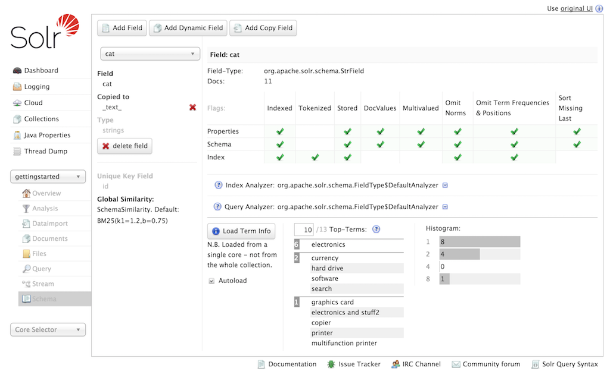

= Schema Browser Screen
// Licensed to the Apache Software Foundation (ASF) under one
// or more contributor license agreements.  See the NOTICE file
// distributed with this work for additional information
// regarding copyright ownership.  The ASF licenses this file
// to you under the Apache License, Version 2.0 (the
// "License"); you may not use this file except in compliance
// with the License.  You may obtain a copy of the License at
//
//   http://www.apache.org/licenses/LICENSE-2.0
//
// Unless required by applicable law or agreed to in writing,
// software distributed under the License is distributed on an
// "AS IS" BASIS, WITHOUT WARRANTIES OR CONDITIONS OF ANY
// KIND, either express or implied.  See the License for the
// specific language governing permissions and limitations
// under the License.

The Schema Browser screen lets you review schema data in a browser window.

If you have accessed this window from the Analysis screen, it will be opened to a specific field, dynamic field rule or field type. If there is nothing chosen, use the pull-down menu to choose the field or field type.

.Schema Browser Screen

The screen provides a great deal of useful information about each particular field and fieldtype in the Schema, and provides a quick UI for adding fields or fieldtypes using the <<schema-api.adoc#,Schema API>> (if enabled). In the example above, we have chosen the `cat` field. On the left side of the main view window, we see the field name, that it is copied to the `\_text_` (because of a copyField rule) and that it use the `strings` fieldtype. Click on one of those field or fieldtype names, and you can see the corresponding definitions.

In the right part of the main view, we see the specific properties of how the `cat` field is defined – either explicitly or implicitly via its fieldtype, as well as how many documents have populated this field. Then we see the analyzer used for indexing and query processing. Click the icon to the left of either of those, and you'll see the definitions for the tokenizers and/or filters that are used. The output of these processes is the information you see when testing how content is handled for a particular field with the <<analysis-screen.adoc#,Analysis Screen>>.

Under the analyzer information is a button to *Load Term Info*. Clicking that button will show the top _N_ terms that are in a sample shard for that field, as well as a histogram showing the number of terms with various frequencies. Click on a term, and you will be taken to the <<query-screen.adoc#,Query Screen>> to see the results of a query of that term in that field. If you want to always see the term information for a field, choose *Autoload* and it will always appear when there are terms for a field. A histogram shows the number of terms with a given frequency in the field.

[IMPORTANT]
====
Term Information is loaded from single arbitrarily selected core from the collection, to provide a representative sample for the collection. Full <<faceting.adoc#,Field Facet>> query results are needed to see precise term counts across the entire collection.
====

For programmatic access to the underlying information in this screen please reference the <<luke-request-handler.adoc#,Luke Request Handler>>
