= Schema Designer
:experimental:
// Licensed to the Apache Software Foundation (ASF) under one
// or more contributor license agreements.  See the NOTICE file
// distributed with this work for additional information
// regarding copyright ownership.  The ASF licenses this file
// to you under the Apache License, Version 2.0 (the
// "License"); you may not use this file except in compliance
// with the License.  You may obtain a copy of the License at
//
//   http://www.apache.org/licenses/LICENSE-2.0
//
// Unless required by applicable law or agreed to in writing,
// software distributed under the License is distributed on an
// "AS IS" BASIS, WITHOUT WARRANTIES OR CONDITIONS OF ANY
// KIND, either express or implied.  See the License for the
// specific language governing permissions and limitations
// under the License.

The Schema Designer screen lets you interactively design a new schema using sample data.

.Schema Designer screen
image::images/schema-designer/schema-designer.png[image]

There are a number of panels on the Schema Designer screen to provide immediate feedback when you make changes to the schema, including:

* Upload / paste sample documents to find fields and guess the correct field type and indexing strategy
* Schema Editor tree to edit Fields, Dynamic Fields, Field Types, and supporting Files
* Text Analysis panel to show the text analysis pipeline for sample text based on the selected field
* Query Tester panel to see how schema change impact query matching, sorting, faceting, and hit highlighting
* Show Changes dialog to view a report of all changes made by the designer before publishing

The Schema Designer allows you to edit an existing schema, however its main purpose is to help you safely design a new schema from sample data.
You can safely experiment with changes and see the impact on query results immediately.
Once data is indexed using a published schema, there are severe restrictions on the type of changes you can make to the schema without needing a full re-index.
When designing a new schema, the Schema Designer re-indexes your sample data automatically when you make changes. However, the designer does not re-index data in collections using a published schema.

.Security Requirements
[NOTE]
====
If the <<rule-based-authorization-plugin.adoc#,Rule-based Authorization Plugin>> is enabled for your Solr installation, then users need to have the `config-edit` and `config-read` permissions to use the Schema Designer.
====

== Getting Started

Upon entering the Schema Designer for the first time, you'll be prompted to create a New Schema.

image::images/schema-designer/new-schema.png[image,width=500]

Choose a short name that reflects the intended use case for your new schema. You'll need to choose a source schema to copy as the starting point for your new schema.
Solr includes a `_default` schema which provides a good starting place for building a custom schema for your search application.
Once a schema is published, it can be used to create new schemas and will be listed in the *Copy from* drop-down list in the dialog.

Once you create the new schema, the next step is to upload or paste a sample of the data you intend to index into Solr.
The Schema Designer supports JSON, CSV, TSV, XML, and JSON lines (jsonl).

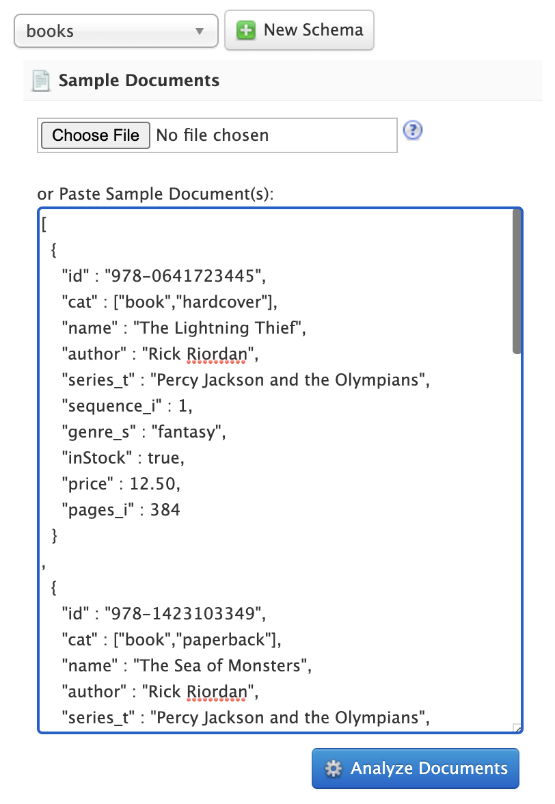

The advantage of pasting sample documents into the text area is that you can edit the sample and see the impact of your changes immediately in the analyzed schema.
The upload feature is useful if you have large or many sample documents; the Schema Designer API allows up to 1,000 sample documents or a max of 5MB upload, but in most cases you only need a handful of documents to get started.

Click on the btn:[Analyze Documents] button to submit the sample documents to the Schema Designer API to generate your new schema.

=== Temporary Configset and Collection

Behind the scenes, the Schema Designer API creates a temporary <<config-sets.adoc#,Configset>> (schema + solrconfig.xml + supporting files) in Zookeeper.
In addition, the Schema Designer API creates a temporary collection with a single shard and replica to hold sample documents.
These temporary resources are persisted to disk and exist until the schema is published or manually deleted using the Schema Designer API cleanup endpoint (`/api/schema-designer/cleanup`).

If you close your browser screen while designing a new schema, it will be available when you return.
Simply choose the name of the schema you created previously in the select box and your schema will load into the designer UI.

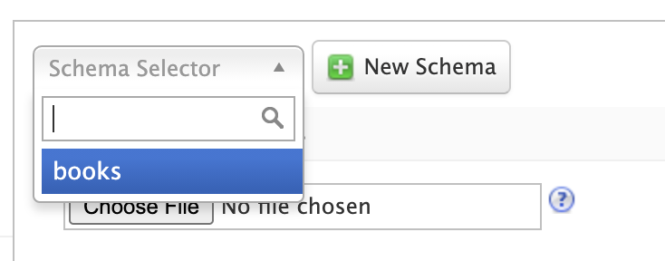

Previously uploaded sample documents are indexed in the temporary collection even though they do not display in the text area.

[TIP]
====
Click on the btn:[Edit Documents] button on the *Query Results* panel to load a JSON representation of indexed documents into the text area.
====

=== Iteratively Post Sample Documents

If you have sample documents spread across multiple files, you can POST them to the Schema Designer API and then load your schema in the Designer UI to design your schema.
Here's an example of how to use the API to "prepare" a new schema and then iteratively post Solr's techproducts example files to the Schema Designer backend:

[source,bash]
----
#!/bin/bash

SOLR_INSTALL_DIR="path/to/solr/install"

DIR_WITH_SAMPLE_FILES="$SOLR_INSTALL_DIR/example/exampledocs"

SOLR_URL=http://localhost:8983

MY_NEW_SCHEMA="myNewSchema"

echo "Preparing new schema: ${MY_NEW_SCHEMA}"
curl -s -o /dev/null -w "%{http_code}" -XPOST \
  "$SOLR_URL/api/schema-designer/prep?configSet=${MY_NEW_SCHEMA}&copyFrom=_default"
echo ""

SAMPLE_FILES=( $(ls ${DIR_WITH_SAMPLE_FILES}/*.{xml,csv,json,jsonl}) )
for f in "${SAMPLE_FILES[@]}"
do
  echo "POST'ing contents of $f to Schema Designer analyze endpoint ..."
  curl -s -o /dev/null -w "%{http_code}" -XPOST \
    "$SOLR_URL/api/schema-designer/analyze?configSet=${MY_NEW_SCHEMA}" -d @"$f"
  echo ""
done
----

After sending the sample documents to the Schema Designer backend, you can open the *prepared* schema in the Schema Designer screen in your browser.

[NOTE]
====
The Schema Designer API is primarily intended to support an interactive experience in the UI vs. being used programmatically by developers.
To create and manage Configsets and Schemas programmatically, see the <<configsets-api.adoc#,Configset>> and <<schema-api.adoc#,Schema>> APIs.
====

== Schema Editor

After analyzing your sample documents, the Schema Designer loads the schema in the *Schema Editor* in the middle panel.
The editor renders the schema as a tree component composed of Fields, Dynamic Fields, Field Types, and Files.
For more information about schema objects, see <<documents-fields-and-schema-design.adoc#,Documents, Fields, and Schema Design>>.

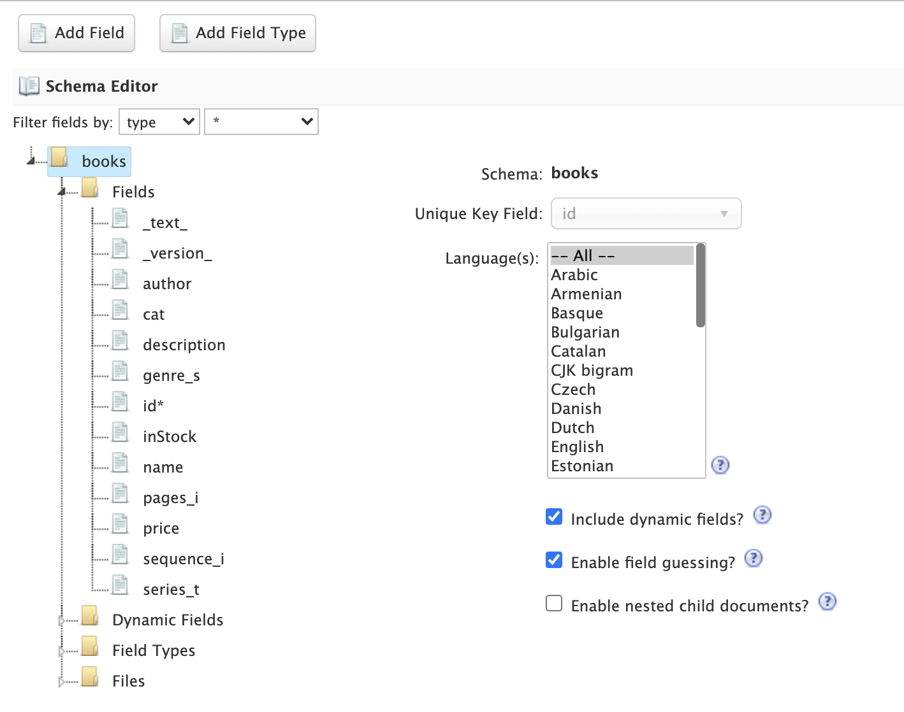

.Schema vs. Configset
[NOTE]
====
A Configset includes a schema, so technically the Schema Designer works with a Configset behind the scenes.
However, Configset is more of a technical implementation detail and your primary focus when designing a new search application should be on the fields and their types.
Consequently, the Schema Designer focuses primarily on the schema aspects of a Configset vs. exposing complexities of a Configset in the UI.
====

When you click on the root node of the Schema Editor tree, you can refine top-level schema properties, including:

* Languages: The `_default` schema includes text fields for a number of common languages. You can include all text analyzers in your schema or select a subset based on the languages your search application needs to support. The designer will remove all the unnecessary field types for languages you don't need. For more information about text analysis and languages, see: <<language-analysis.adoc#,Language Analysis>>
* Dynamic fields allow Solr to index fields that you did not explicitly define in your schema. Dynamic fields can make your application less brittle by providing some flexibility in the documents you can add to Solr. It is recommended to keep the default set of dynamic fields enabled for your schema. Unchecking this option removes all dynamic fields from your schema. For more information about dynamic fields, see: <<dynamic-fields.adoc#,Dynamic Fields>>
* Field guessing (aka "schemaless mode") allows Solr to detect the "best" field type for unknown fields encountered during indexing. Field guessing also performs some field transformations, such as removing spaces from field names. If you use the schema designer to create your schema based on sample documents, you may not need to enable this feature. However, with this feature disabled, you need to make sure the incoming data matches the schema exactly or indexing errors may occur. For more information about schemaless mode, see: <<schemaless-mode.adoc#,Schemaless Mode>>
* Enabling this feature adds the `+++_root_+++` and `+++_nest_path_+++` fields to your schema. For more information about indexing nested child documents, see: <<indexing-nested-documents.adoc#,Indexing Nested Documents>>

Only make changes to these top-level schema properties when you fully understand how they impact the behavior of your search application.
When first starting out, you can leave the default settings and focus your attention on the fields and field types in the schema.

=== Schema Fields

Click on the *Fields* node in the editor tree to see an overview of the fields in your schema,
along with the <<field-type-definitions-and-properties.adoc#,properties>> that govern how the field will be indexed by Solr.

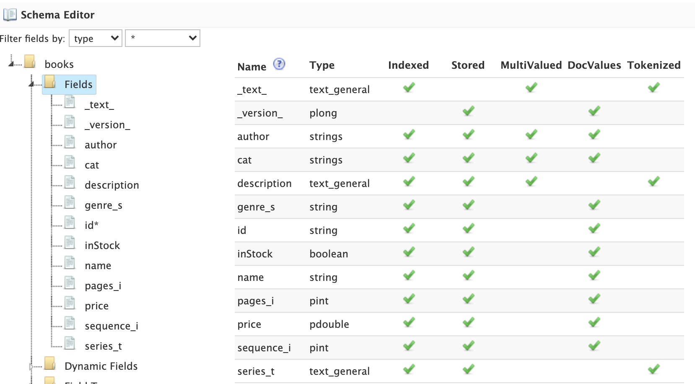

If there are many fields in your schema, you can filter the displayed fields by type or feature using the filters at the top of the tree.
For instance, to filter fields with `docValues` enabled, choose `feature` and then `docValues` with `enabled` checked.

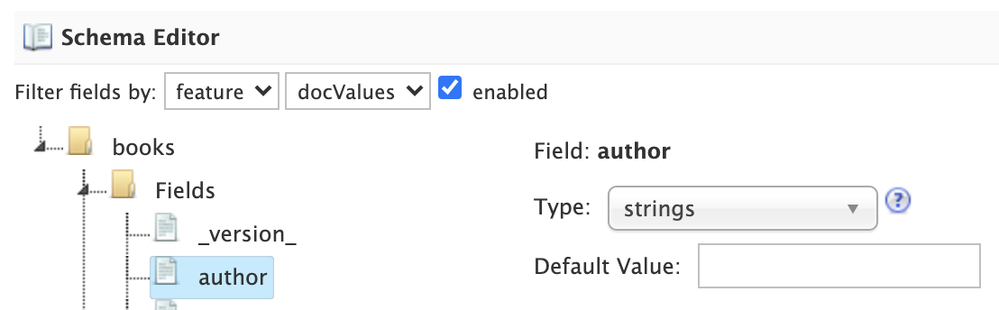

To edit a field, click on the name of the field in the tree to load the field information in the main editor panel to the right of the tree.

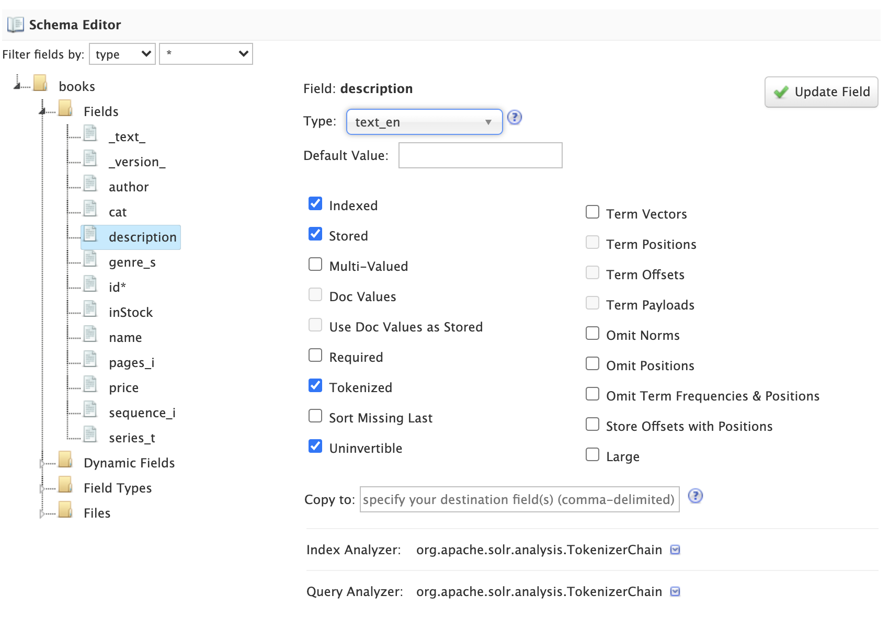

[TIP]
====
Before changing properties for a specific field, consider if you should change the property on the *field type* instead, as changes applied to a field type will apply to all fields using that type.
====

After making the desired changes, click on the btn:[Update Field] button. The Schema Designer backend API will apply the changes to the schema and then re-index the sample documents into the temporary collection if needed.
Some changes, such as changing a single-valued `docValues` field to multi-valued, may require the underlying Lucene index to be deleted and rebuilt from scratch.
The Schema Designer will warn you when your change requires a full rebuild.

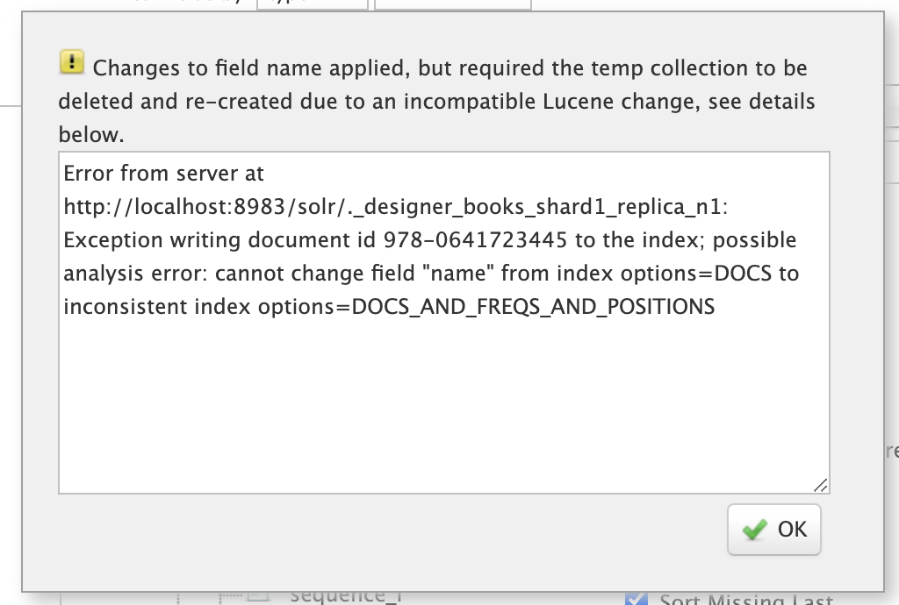

Moreover, if you change a field to an incompatible type based on the sample data, the designer will undo the changes automatically.
For instance, changing a field with text data to a numeric type will be rejected by the designer.

[IMPORTANT]
====
Be careful changing field properties for schemas that are already being used by collections with indexed data.
The designer cannot protect you from making an incompatible change for in-use schemas.
Typically adding new fields and field types is a safe operation for existing schemas. Changing field and/or field type properties can lead to index corruption.
====

The Schema Designer does not support deleting fields from the schema.

=== Text Analysis

When you select a text-based field in the tree, the *Text Analysis* panel shows how the text from a sample document gets analyzed for indexing.

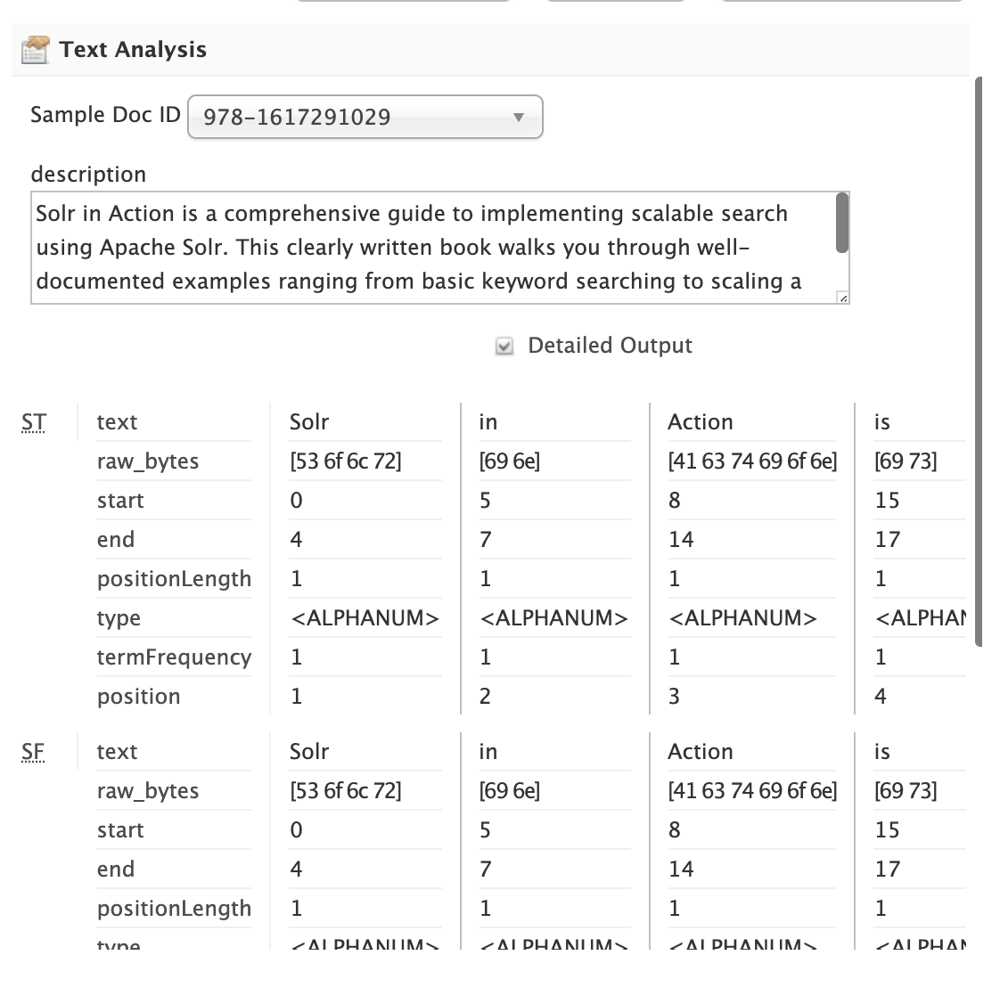

If you need to change the text analysis strategy for a field, you need to edit the Field Type. For more information about text analysis, see: <<analyzers.adoc#,Analyzers>>.

== Query Tester

The *Query Tester* panel lets you experiment with queries executed against your sample document set using the current schema.
Using the Query Tester, you can see how changes to the schema impact the behavior of queries, such as matching, sorting, faceting, and highlighting.
The Query Tester form is not intended to demonstrate all possible <<query-syntax-and-parsing.adoc#,query features>> available in Solr.

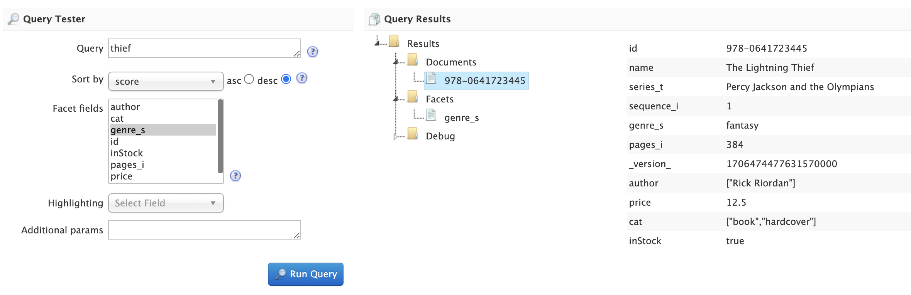

Whenever you make a change to the schema, the query tester form is re-submitted to refresh the query results.
This helps inform you about matching issues where a test query should find a sample document but doesn't return the correct results,
which indicates that a field was not indexed correctly, such as using `string` instead of a text-analyzed field type.

Matching issues may also indicate that a field was not copied into the default search field, such as the catch-all `+++_text_+++` field.

The Query Tester form lists all fields that support sorting in the *Sort by* drop-down. If a field you need to sort by is not listed, then make sure it is single-valued and is either indexed or has docValues enabled.

Similarly, the tester form lists all fields that you can compute facets for; if a field is not listed in the facet drop-down, then make sure it is indexed or has docValues enabled.

== Show Changes

Click on the btn:[Show Changes] button to view a report of the changes made to the schema during the current editing session.
The un-published changes are compared to either the original schema you copied from (such as `_default`) or the published schema.

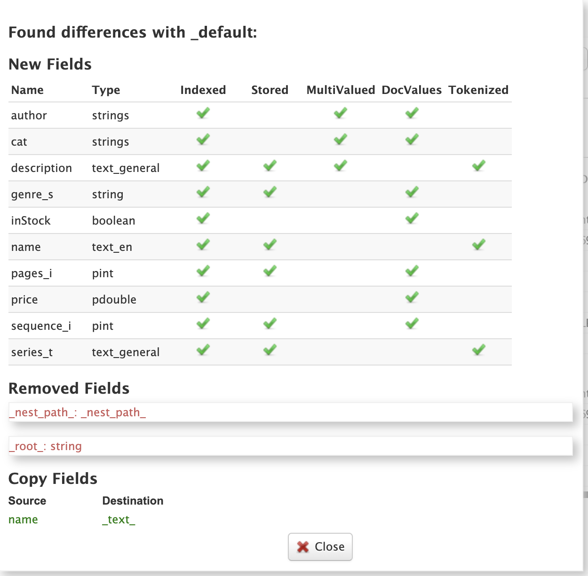

You need to take care when changing schemas that have already been published if there are collections with data indexed using the schema.

== Publish

Publishing a new schema makes it available for use when creating new collections. The Publish dialog shows if any existing collections
will be affected by the publish action; of course there will not be any impacted collections for new schemas. You may also create a new
collection during publishing that uses the new schema and choose whether to index your sample documents in the new collection.

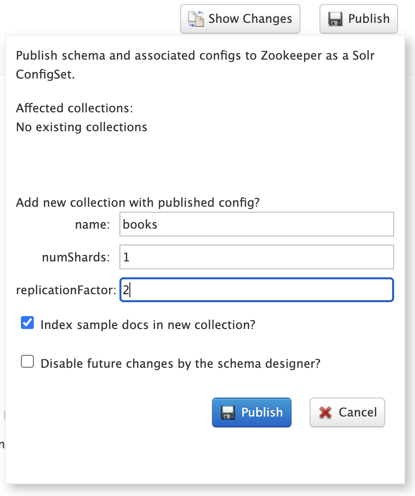

You can also choose to prevent future changes to this schema by the Schema Designer. However, this setting only applies to the Schema Designer UI
and does not prevent someone from changing the schema using the Schema API directly.

Once the publish action completes, the temporary Configset and collection are deleted and the Schema Designer UI resets back to a fresh state.

Alternatively, instead of publishing to Zookeeper, you can also download the Configset to a zip file containing the schema, solrconfig.xml, and supporting files.
The zip file can be uploaded to other Solr instances using the <<configsets-api.adoc#,Configset API>> or saved in version control.
