= Searching, Sampling and Aggregation
// Licensed to the Apache Software Foundation (ASF) under one
// or more contributor license agreements.  See the NOTICE file
// distributed with this work for additional information
// regarding copyright ownership.  The ASF licenses this file
// to you under the Apache License, Version 2.0 (the
// "License"); you may not use this file except in compliance
// with the License.  You may obtain a copy of the License at
//
//   http://www.apache.org/licenses/LICENSE-2.0
//
// Unless required by applicable law or agreed to in writing,
// software distributed under the License is distributed on an
// "AS IS" BASIS, WITHOUT WARRANTIES OR CONDITIONS OF ANY
// KIND, either express or implied.  See the License for the
// specific language governing permissions and limitations
// under the License.

Data is the indispensable factor in statistical analysis. This section
provides an overview of the key functions for retrieving data for
visualization and statistical analysis: searching, sampling
and aggregation.

== Searching

=== Exploring

The `search` function can be used to search a SolrCloud collection and return a
result set.

Below is an example of the most basic `search` function called from the Zeppelin-Solr interpreter.
Zeppelin-Solr sends the `seach(logs)` call to the `/stream` handler and displays the results
in *table* format.

In the example the `search` function is passed only the name of the collection being searched.
This returns a result set of 10 records with all fields.
This simple function is useful for exploring the fields in the data and understanding how to start refining the search criteria.

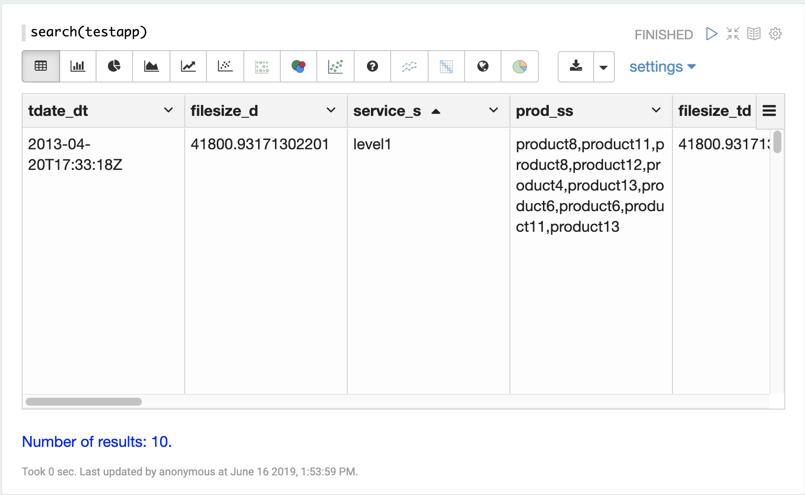

=== Searching and Sorting

Once the format of the records is known, parameters can be added to the `*search*` function to begin analyzing the data.

In the example below a search query, field list, rows and sort have been added to the `search` function.
Now the search is limited to records within a specific time range and returns
a maximum result set of 750 records sorted by `tdate_dt` ascending.
We have also limited the result set to three specific fields.

image::images/math-expressions/search-sort.png[]

Once the data is loaded into the table we can switch to a scatter plot and plot the `filesize_d` column
on the *x-axis* and the `response_d` column on the *y-axis*.

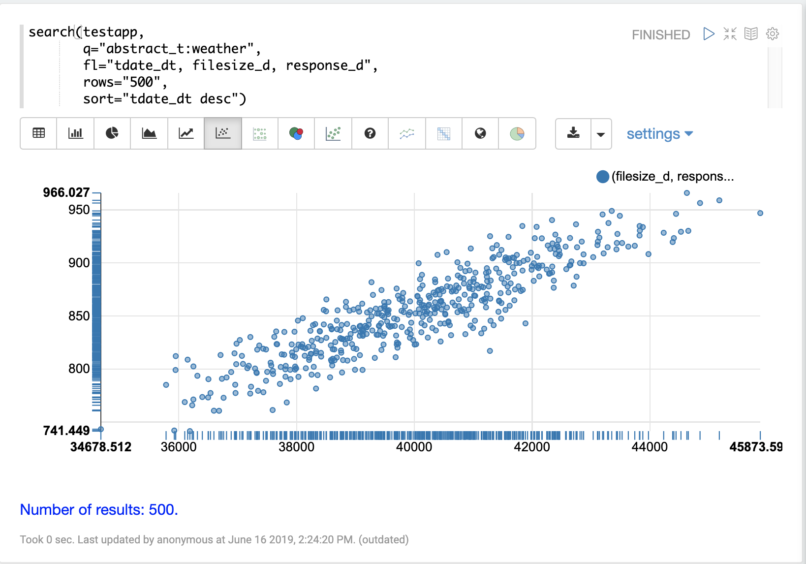

This allows us to quickly visualize the relationship between two variables
selected from a very specific slice of the index.

=== Scoring

The `search` function will score and rank documents when a query is performed on
a text field. The example below shows an example of the scoring and ranking of results.

image::images/math-expressions/scoring.png[]

== Sampling

The `random` function returns a random sample from a distributed search result set.
This allows for fast visualization, statistical analysis, and modeling of
samples that can be used to infer information about the larger result set.

The visualization examples below use small random samples, but Solr's random sampling provides sub-second response times on sample sizes of over 200,000.
These larger samples can be used to build reliable statistical models that describe large data sets (billions of documents) with sub-second performance.

The examples below demonstrate univariate and bivariate scatter
plots of random samples.
Statistical modeling with random samples
is covered in the <<statistics.adoc#,Statistics>>, <<probability-distributions.adoc#,Probability>>, <<regression.adoc#,Linear Regression>>, <<curve-fitting.adoc#,Curve Fitting>>,
and <<machine-learning.adoc#,Machine Learning>> sections.

=== Univariate Scatter Plots

In the example below the `random` function is called in its simplest form with just a collection name as the parameter.

When called with no other parameters the `random` function returns a random sample of 500 records with all fields from the collection.
When called without the field list parameter (`fl`) the `random` function also generates a sequence, 0-499 in this case, which can be used for plotting the x-axis.
This sequence is returned in a field called `x`.

The visualization below shows a scatter plot with the `filesize_d` field
plotted on the y-axis and the `x` sequence plotted on the x-axis.
The effect of this is to spread the `filesize_d` samples across the length
of the plot so they can be more easily studied.

By studying the scatter plot we can learn a number of things about the
distribution of the `filesize_d` variable:

* The sample set ranges from 34,875 to 45,902.
* The highest density appears to be at about 40,000.
* The sample seems to have a balanced number of observations above and below
40,000. Based on this the *mean* and *mode* would appear to be around 40,000.
* The number of observations tapers off to a small number of outliers on
the low and high end of the sample.

This sample can be re-run multiple times to see if the samples
produce similar plots.

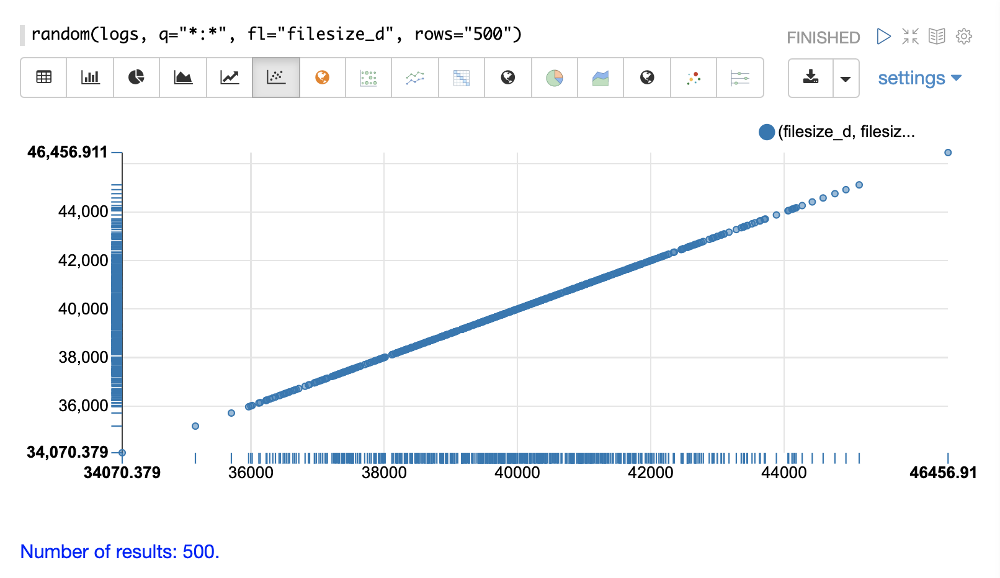

=== Bivariate Scatter Plots

In the next example parameters have been added to the `random` function.
The field list (`fl`) now specifies two fields to be
returned with each sample: `filesize_d` and `response_d`.
The `q` and `rows` parameters are the same as the defaults but are included as an example of how to set these parameters.

By plotting `filesize_d` on the x-axis and `response_d` on the y-axis we can begin to study the relationship between the two variables.

By studying the scatter plot we can learn the following:

* As `filesize_d` rises, `response_d` tends to rise.
* This relationship appears to be linear, as a straight line put through the data could be used to model the relationship.
* The points appear to cluster more densely along a straight line through the middle and become less dense as they move away from the line.
* The variance of the data at each `filesize_d` point seems fairly consistent. This means a predictive model would have consistent error across the range of predictions.

image::images/math-expressions/bivariate.png[]

== Aggregation

Aggregations are a powerful statistical tool for summarizing large data sets and
surfacing patterns, trends, and correlations within the data.
Aggregations are also a powerful tool for visualization and provide data sets for further statistical analysis.

=== stats

The simplest aggregation is the `stats` function.
The `stats` function calculates aggregations for an entire result set that matches a query.
The `stats` function supports the following aggregation functions: `count(*)`, `sum`, `min`, `max`, and `avg`.
Any number and combination of statistics can be calculated in a single function call.

The `stats` function can be visualized in Zeppelin-Solr as a table.
In the example below two statistics are calculated over a result set and are displayed in a table:

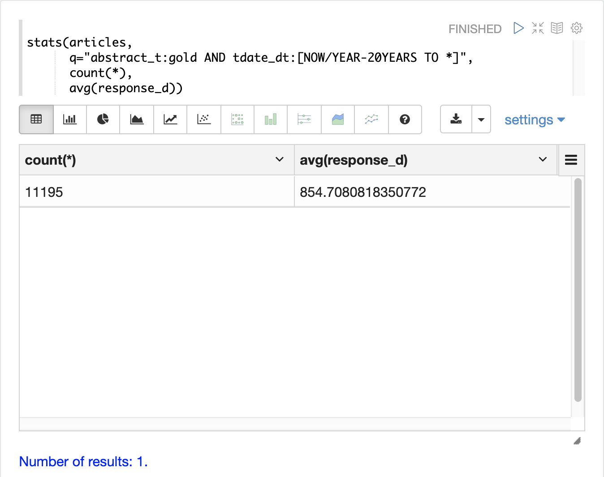

The `stats` function can also be visualized using the *number* visualization which is used to highlight important numbers.
The example below shows the `count(*)` aggregation displayed in the number visualization:

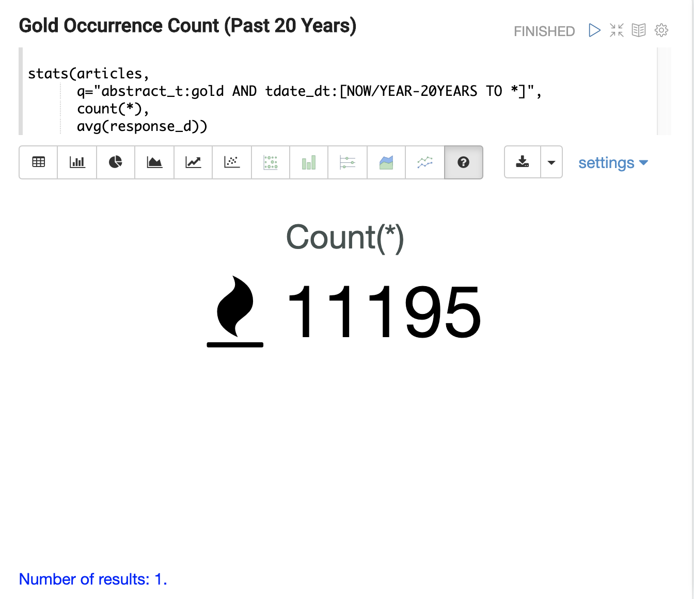

=== facet

The `facet` function performs single and multi-dimension
aggregations that behave in a similar manner to SQL group by aggregations.
Under the covers the `facet` function pushes down the aggregations to Solr's
<<json-facet-api.adoc#,JSON Facet API>> for fast distributed execution.

The example below performs a single dimension aggregation from the
nyc311 (NYC complaints) dataset.
The aggregation returns the top five *complaint types* by *count* for records with a status of *Pending*.
The results are displayed with Zeppelin-Solr in a table.

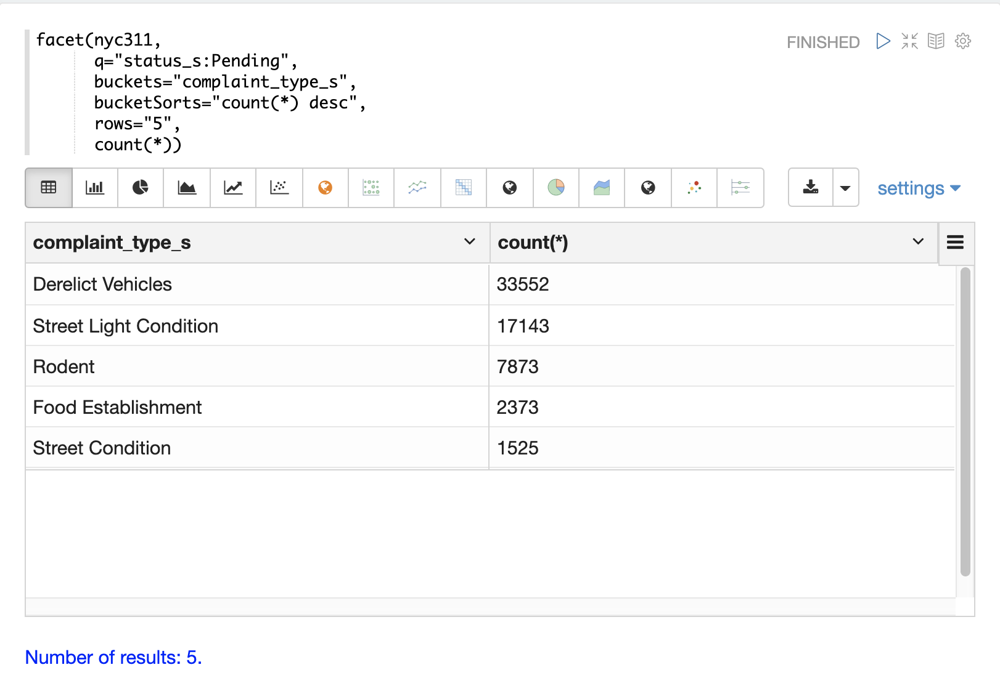

The example below shows the table visualized using a pie chart.

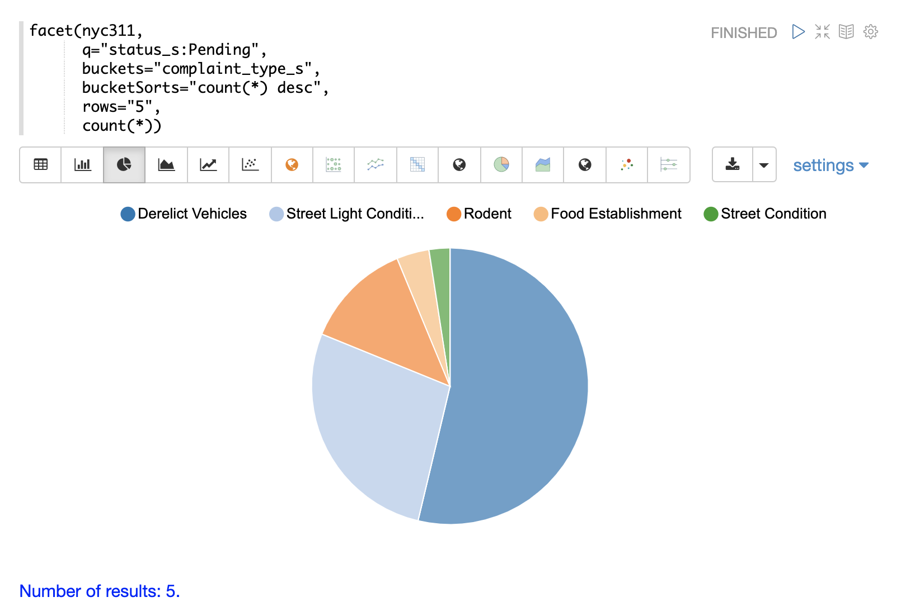

The next example demonstrates a multi-dimension aggregation.
Notice that the `buckets` parameter now contains two dimensions: `borough_s` and `complaint_type_s`.
This returns the top 20 combinations of borough and complaint type by count.

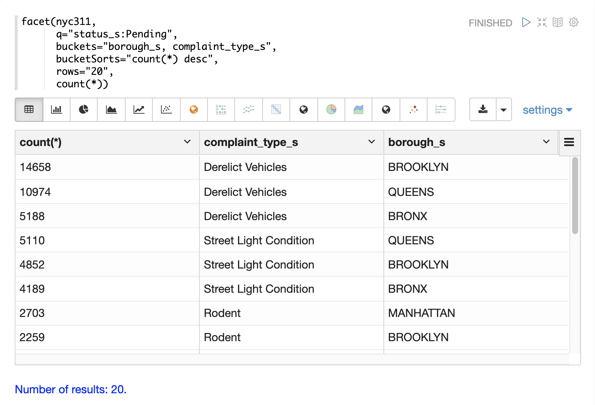

The example below shows the multi-dimension aggregation visualized as a grouped bar chart.

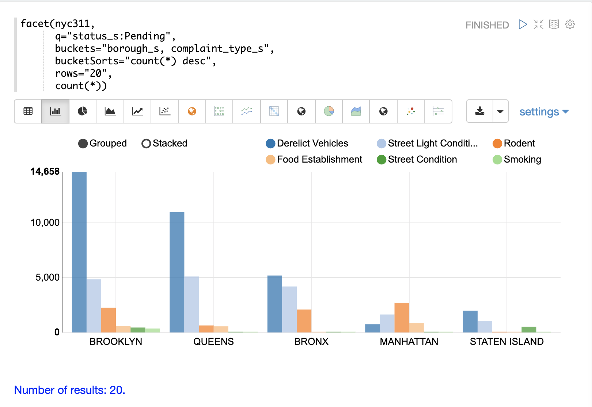

The `facet` function supports any combination of the following aggregate functions: count(*), sum, avg, min,
max.

=== facet2D

The `facet2D` function performs two dimensional aggregations that can be
visualized as heat maps or pivoted into matrices and operated on by machine learning functions.

`facet2D` has different syntax and behavior then a two dimensional `facet` function which
does not control the number of unique facets of each dimension. The `facet2D` function
has the `dimensions` parameter which controls the number of unique facets
for the *x* and *y* dimensions.

The example below visualizes the output of the `facet2D` function. In the example `facet2D`
returns the top 5 boroughs and the top 5 complaint types for each borough. The output is
then visualized as a heatmap.

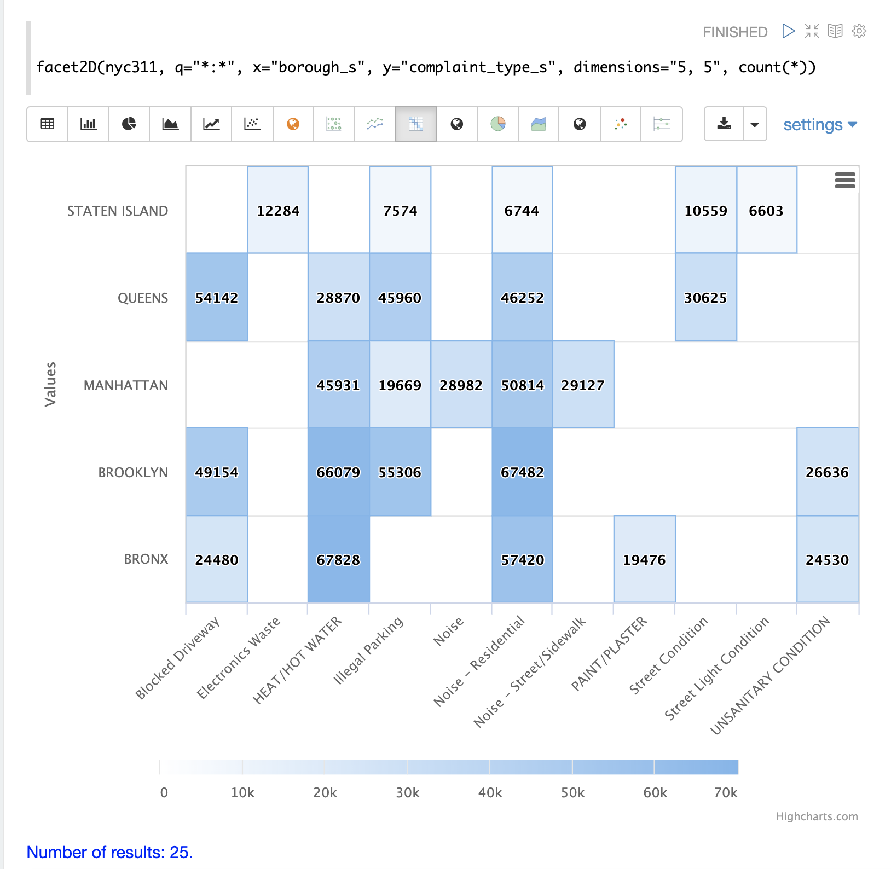

The `facet2D` function supports one of the following aggregate functions: `count(*)`, `sum`, `avg`, `min`, `max`.

=== timeseries

The `timeseries` function performs fast, distributed time
series aggregation leveraging Solr's builtin faceting and date math capabilities.

The example below performs a monthly time series aggregation over a collection of
daily stock price data.  In this example the average monthly closing price is
calculated for the stock ticker *amzn* between a specific date range.

The output of the `timeseries` function is then visualized with a line chart.

image::images/math-expressions/timeseries1.png[]

The `timeseries` function supports any combination of the following aggregate functions: `count(*)`, `sum`, `avg`, `min`, `max`.

=== significantTerms

The `significantTerms` function queries a collection, but instead of returning documents, it returns significant terms found in documents in the result set.
This function scores terms based on how frequently they appear in the result set and how rarely they appear in the entire corpus.
The `significantTerms` function emits a tuple for each term which contains the term, the score, the foreground count and the background count.
The foreground count is how many documents the term appears in the result set.
The background count is how many documents the term appears in the entire corpus.
The foreground and background counts are global for the collection.

The `significantTerms` function can often provide insights that cannot be gleaned from other types of aggregations.
The example below illustrates the difference between the `facet` function and the `significantTerms` function.

In the first example the `facet` function aggregates the top 5 complaint types
in Brooklyn.
This returns the five most common complaint types in Brooklyn, but
its not clear that these terms appear more frequently in Brooklyn then
then the other boroughs.

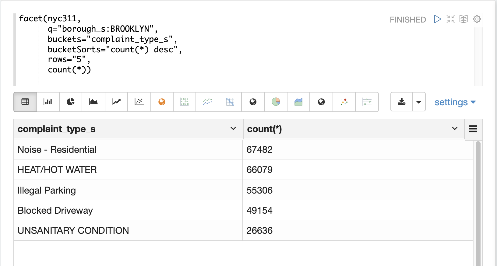

In the next example the `significantTerms` function returns the top 5 significant terms in the `complaint_type_s` field for the borough of Brooklyn.
The highest scoring term, Elder Abuse, has a foreground count of 285 and background count of 298.
This means that there were 298 Elder Abuse complaints in the entire data set, and 285 of them were in Brooklyn.
This shows that Elder Abuse complaints have a much higher occurrence rate in Brooklyn than the other boroughs.

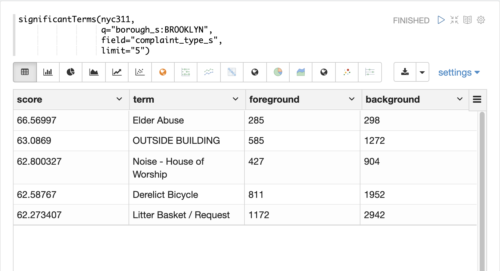

The final example shows a visualization of the `significantTerms` from a
text field containing movie reviews. The result shows the
significant terms that appear in movie reviews that have the phrase "sci-fi".

The results are visualized using a bubble chart with the *foreground* count on
plotted on the x-axis and the *background* count on the y-axis. Each term is
shown in a bubble sized by the *score*.

image::images/math-expressions/sterms.png[]

=== nodes

The `nodes` function performs aggregations of nodes during a breadth first search of a graph.
This function is covered in detail in the section <<graph-traversal.adoc#,Graph Traversal>>.
In this example the focus will be on finding correlated nodes in a time series
graph using the `nodes` expressions.

The example below finds stock tickers whose daily movements tend to be correlated with the ticker *jpm* (JP Morgan).

The inner `search` expression finds records between a specific date range
where the ticker symbol is *jpm* and the `change_d` field (daily change in stock price) is greater then .25.
This search returns all fields in the index including the `yearMonthDay_s` which is the string representation of the year, month, and day of the matching records.

The `nodes` function wraps the `search` function and operates over its results. The `walk` parameter maps a field from the search results to a field in the index.
In this case the `yearMonthDay_s` is mapped back  to the `yearMonthDay_s` field in the same index.
This will find records that have same `yearMonthDay_s` field value returned
by the initial search, and will return records for all tickers on those days.
A filter query is applied to the search to filter the search to rows that have a `change_d`
greater the .25.
This will find all records on the matching days that have a daily change greater then .25.

The `gather` parameter tells the nodes expression to gather the `ticker_s` symbols during the breadth first search.
The `count(*)` parameter counts the occurrences of the tickers.
This will count the number of times each ticker appears in the breadth first search.

Finally the `top` function selects the top 5 tickers by count and returns them.

The result below shows the ticker symbols in the `nodes` field and the counts for each node.
Notice *jpm* is first, which shows how many days *jpm* had a change greater then .25 in this time
period.
The next set of ticker symbols (*mtb*, *slvb*, *gs* and *pnc*) are the symbols with highest number of days with a change greater then .25 on the same days that *jpm* had a change greater then .25.

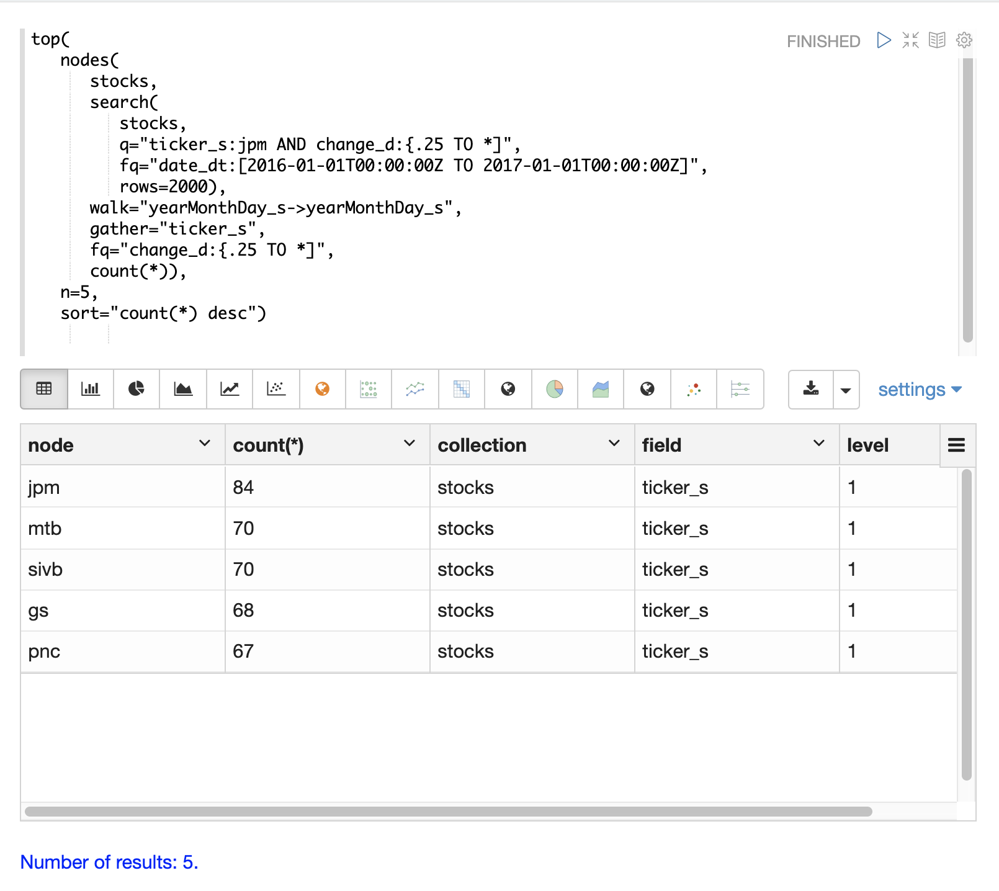

The `nodes` function supports any combination of the following aggregate functions: `count(*)`, `sum`, `avg`, `min`, `max`.
