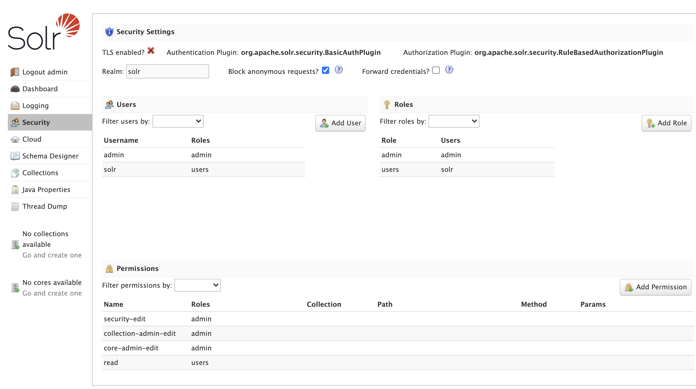
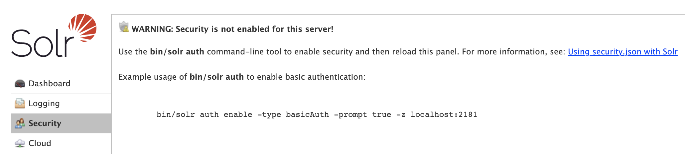
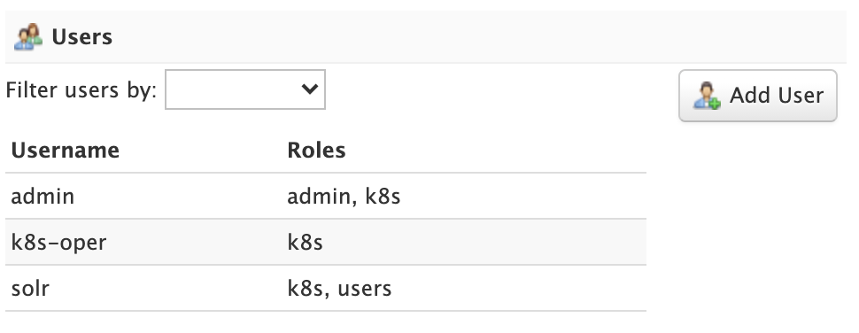
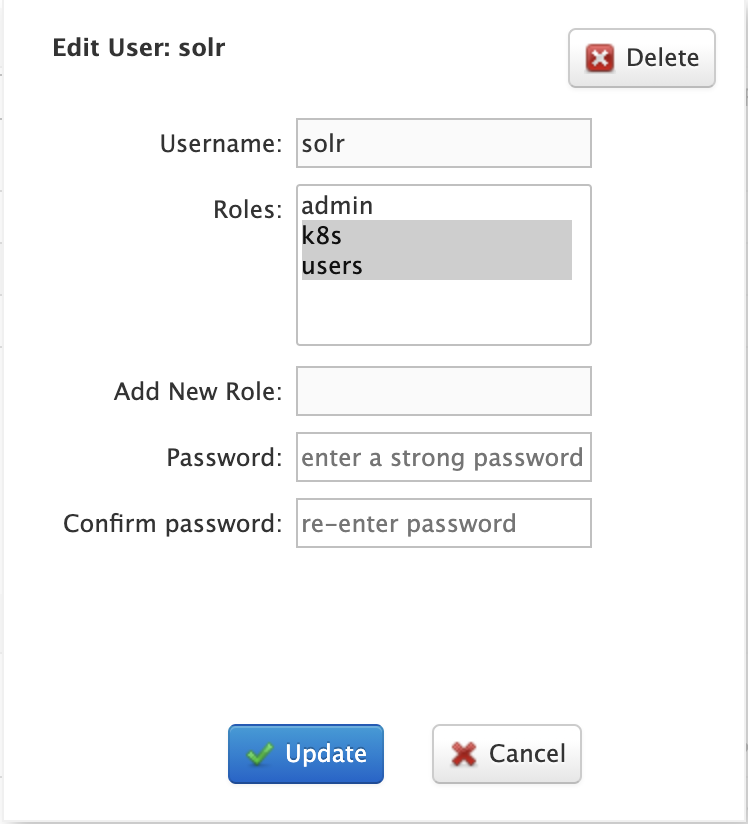
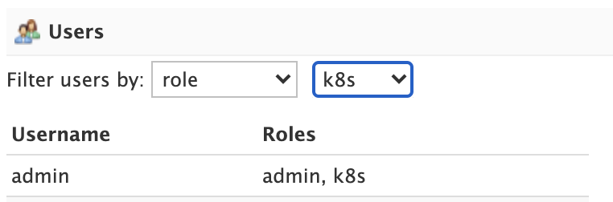
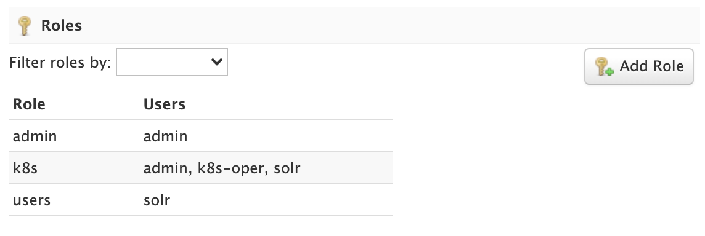
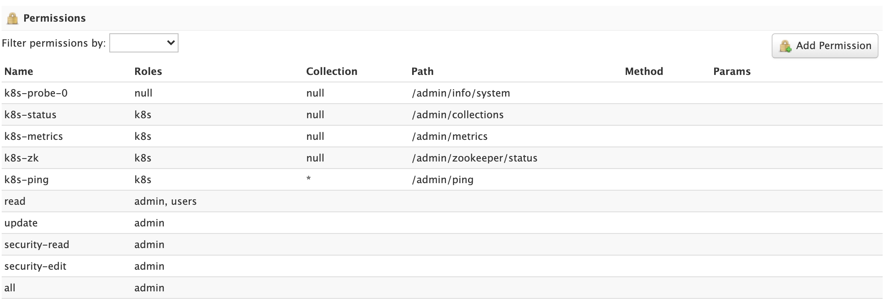
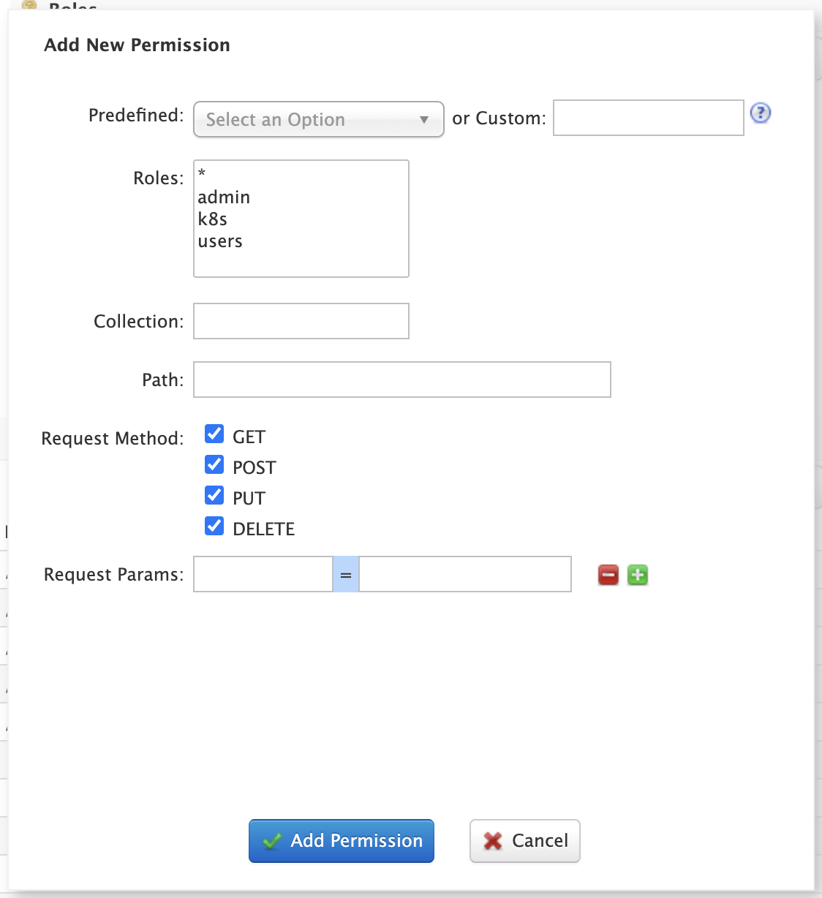

= Security UI
:experimental:
// Licensed to the Apache Software Foundation (ASF) under one
// or more contributor license agreements.  See the NOTICE file
// distributed with this work for additional information
// regarding copyright ownership.  The ASF licenses this file
// to you under the Apache License, Version 2.0 (the
// "License"); you may not use this file except in compliance
// with the License.  You may obtain a copy of the License at
//
//   http://www.apache.org/licenses/LICENSE-2.0
//
// Unless required by applicable law or agreed to in writing,
// software distributed under the License is distributed on an
// "AS IS" BASIS, WITHOUT WARRANTIES OR CONDITIONS OF ANY
// KIND, either express or implied.  See the License for the
// specific language governing permissions and limitations
// under the License.

The Security screen allows administrators with the `security-edit` permission to manage users, roles, and permissions.
The Security screen works with Solr running in cloud and standalone modes.

.Security Screen

== Getting Started

The Security screen warns you if security is not enabled for Solr. You are strongly encouraged to enable security for Solr instances exposed on any network other than localhost.

When first getting started with Solr, use the `bin/solr auth` command-line utility to enable security for your Solr installation (cloud mode only), see <<solr-control-script-reference.adoc#authentication,bin/solr auth>> for usage instructions.
For example, the following command will enable *basic authentication* and prompt you for the username and password for the initial user with administrative access:
[source,bash]
----
 bin/solr auth enable -type basicAuth -prompt true -z localhost:2181 -blockUnknown true
----
_Note: The `auth` utility only works with Solr running in cloud mode and thus requires a Zookeeper connection string passed via the `-z` option._

After enabling security, you'll need to refresh the Admin UI and login with the credentials you provided to the `auth` utility to see the updated Security panel.
You do not need to restart Solr as the security configuration will be refreshed from Zookeeper automatically.

The Security screen provides the following features:

* Security Settings: Details about the configured authentication and authorization plugins.
* Users: Read, create, update, and delete user accounts if using the <<basic-authentication-plugin.adoc#,Basic Authentication>> plugin; this panel is disabled for all other authentication plugins.
* Roles: Read, create, and update roles if using the <<rule-based-authorization-plugin.adoc#,Rule-based Authorization>> plugin; this panel is disabled for all other authorization plugins.
* Permissions: Read, create, update, and delete permissions if using the <<rule-based-authorization-plugin.adoc#,Rule-based Authorization>> plugin.

== User Management

Administrators can read, create, update, and delete user accounts when using the <<basic-authentication-plugin.adoc#,Basic Authentication>> plugin.

.Limited User Management Capabilities
[NOTE]
====
Solr's user management is intended to be used by administrators to grant access to protected APIs and lacks common user account management facilities, like password expiration and password self-service (change / reset / recovery).
Consequently, if a user account has been compromised, then an administrator needs to change the password or disable that account using the UI or API.
====

To edit a user account, click on the row in the table to open the edit user dialog. You can change a user's password and change their role membership.

For systems with many user accounts, use the filter controls at the top of the user table to find users based on common properties.

For other authentication plugins, such as the <<jwt-authentication-plugin.adoc#,JWT Authentication>> plugin, this panel will be disabled as users are managed by an external system.

== Role Management

<<rule-based-authorization-plugin.adoc#roles,Roles>> link users to permissions. If using the <<rule-based-authorization-plugin.adoc#,Rule-based Authorization>> plugin, administrators can read, create, and update roles. Deleting roles is not supported.

To edit a role, simply click on the corresponding row in the table.

If not using the Rule-based Authorization plugin, the Roles panel will be disabled as user role assignment is managed by an external system.

== Permission Management

The *Permissions* panel on the Security screen allows administrators to read, create, update, and delete permissions.

For detailed information about how permissions work in Solr, see: <<rule-based-authorization-plugin.adoc#permissions,Rule-based Authorization Permissions>>.

=== Add Permission

Click on the btn:[Add Permission] button to open the Add Permission dialog.

You can _either_ select a *Predefined* permission from the drop-down select list or provide a unique name for a custom permission.
Creating a new *Predefined* permission is simply a matter of mapping the permission to zero or more roles as the other settings, such as path, are immutable for predefined permissions.
If you need fine-grained control over the path, request method, or collection, then create a custom permission.

If you do not select any roles for a permission, then the permission is assigned the `null` role, which means grants the permission to anonymous users.
However, if *Block anonymous requests* (`blockUnknown=true`) is checked, then anonymous users will not be allowed to make requests, thus permission with the `null` role are effectively inactive.

To edit a permission, simply click on the corresponding row in the table. When editing a permission, the current index of the permission in the list of permissions is editable.
This allows you to re-order permissions if needed; see <<rule-based-authorization-plugin.adoc#permission-ordering-and-resolution,Permission Ordering>>.
In general, you want to permissions listed from most specific to least specific in `security.json`.

