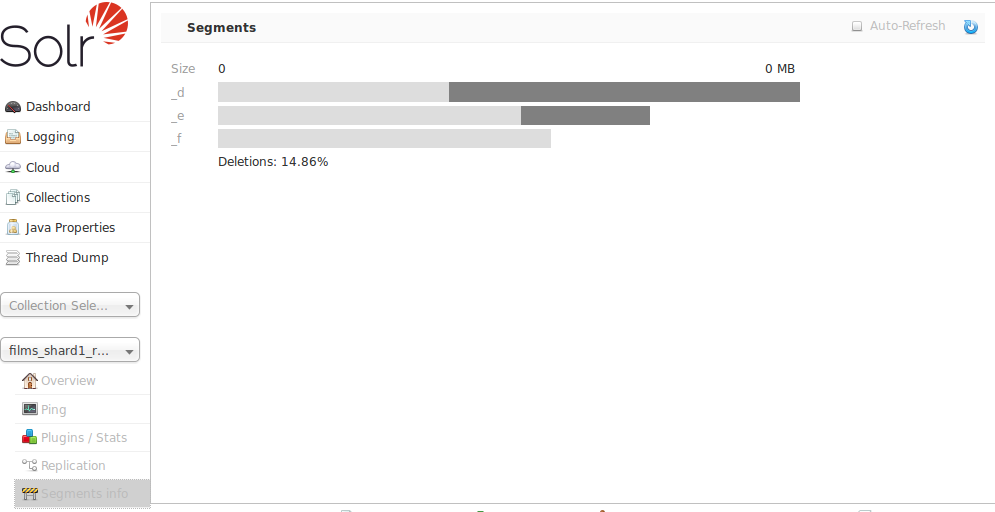

= Segments Info
// Licensed to the Apache Software Foundation (ASF) under one
// or more contributor license agreements.  See the NOTICE file
// distributed with this work for additional information
// regarding copyright ownership.  The ASF licenses this file
// to you under the Apache License, Version 2.0 (the
// "License"); you may not use this file except in compliance
// with the License.  You may obtain a copy of the License at
//
//   http://www.apache.org/licenses/LICENSE-2.0
//
// Unless required by applicable law or agreed to in writing,
// software distributed under the License is distributed on an
// "AS IS" BASIS, WITHOUT WARRANTIES OR CONDITIONS OF ANY
// KIND, either express or implied.  See the License for the
// specific language governing permissions and limitations
// under the License.

The Segments Info screen lets you see a visualization of the various segments in the underlying Lucene index for this core, with information about the size of each segment – both bytes and in number of documents – as well as other basic metadata about those segments. Most visible is the number of deleted documents, but you can hover your mouse over the segments to see additional numeric details.

This information may be useful for people to help make decisions about the optimal <<indexconfig-in-solrconfig.adoc#merging-index-segments,merge settings>> for their data.
